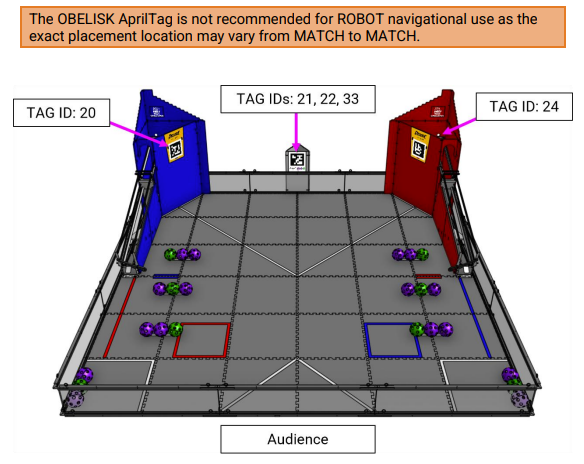

AprilTag Challenges in DECODE presented by RTX
==============================================

What are AprilTags?
-------------------

Developed at the `University of Michigan
<https://april.eecs.umich.edu/software/apriltag>`_, AprilTags are similar to a
2D barcode or a simplified QR Code. It contains a numeric **ID code** and can
be used for **location and orientation**.

In *FIRST* Tech Challenge during the DECODE presented by RTX season, AprilTags
are used in three different ways:

1. On the OBELISK, the AprilTags are used to identify one of three MOTIFS that
   are randomized each MATCH.
2. On the GOALS, AprilTags can be used to target the GOAL for teams to launch
   ARTIFACTS accurately into the correct GOAL.
3. On the GOALS, AprilTags can be used as a visual odometry system, using the
   information that AprilTags can provide to calculate the position of the 
   ROBOT on the FIELD (through a process called localization). See the 
   :doc:`AprilTag Localization <../../vision_portal/apriltag_localization/apriltag-localization>`
   page for more information.

   AprilTag IDs and Locations on the DECODE field.

AprilTags with Difficult Environmental Lighting
-----------------------------------------------

One of the challenges teams will face this season is ensuring that their cameras
are able to see the AprilTags correctly. AprilTags rely on the fact that the 
white and black portions of the AprilTags are contrasting colors - if the lighting
in the environment doesn't allow for enough contrast, the AprilTag algorithm
may not properly detect the AprilTag. Fortunately, there are things we can do 
with virtually every webcam that can help correct for environmental issues.

An excellent example situation came up in a warehouse. The DECODE field was set
up in the warehouse, and using default settings with the
``ConceptAprilTagEasy`` sample.  When viewing the camera stream preview, the
AprilTag on the OBELISK was completely washed out by sunlight striking the
OBELISK directly on a sunny day, making the AprilTag unable to be seen. A
different camera at a slightly different angle took another picture of the same
scene, and the AprilTag can be seen but there is definitely too much direct light
reflecting off the AprilTag, making it unable to be recognized. This scenario is
very similar to a gymnasium where an event could be hosted, and on a sunny day
light can interfere with a camera's ability to view an AprilTag. What can be done?

.. only:: html

   .. grid:: 1 2 2 3
      :gutter: 2

      .. grid-item-card::
         :class-header: sd-bg-dark font-weight-bold sd-text-white
         :class-body: sd-text-left body

         Image #1 - Example

         ^^^

         .. figure:: images/1-decode-washed-out-obelisk.*
            :align: center
            :width: 95%
            :alt: Image of DECODE field with obelisk AprilTag unable to be seen

         +++
         
         Washed Out AprilTag on OBELISK

      .. grid-item-card::
         :class-header: sd-bg-dark font-weight-bold sd-text-white
         :class-body: sd-text-left body

         Image #2 - Alternate View

         ^^^

         .. figure:: images/2-decode-washed-out-obelisk.*
            :align: center
            :width: 85%
            :alt: Image of DECODE field from another perspective

         +++

         Alternate View of OBELISK

      .. grid-item-card::
         :class-header: sd-bg-dark font-weight-bold sd-text-white
         :class-body: sd-text-left body

         Image #3 - Alternate View

         ^^^

         .. figure:: images/5-decode-warehouse-lighting.*
            :align: center
            :width: 85%
            :alt: Image showing light coming in from windows of warehouse

         +++

         Sunlight Entering Warehouse
         
.. only:: latex

   .. list-table:: Different Views of Challenging Scenario
      :class: borderless

      * - .. image:: images/1-decode-washed-out-obelisk.*
        - .. image:: images/2-decode-washed-out-obelisk.*
        - .. image:: images/5-decode-warehouse-lighting.*

The best way to counter this environmental lighting is to use the webcam
settings within the SDK to adjust both the Gain and the Exposure settings at
the same time. By simultaneously minimizing the exposure (lessening the amount of
time light is allowed to strike the sensor each image frame) and maximizing
the gain (amplifying the signal from the sensor) the resulting image will be 
darker than a normal image but elements of high contrast will be accentuated, 
like AprilTags, allowing them to be recognized. This can be experimented with
using the ``ConceptAprilTagOptimizeExposure`` sample.

Sure enough, by minimizing the Exposure and maximizing the Gain of the webcam,
the resulting images from the webcam were able to be used to recognize the
problematic AprilTags. For more examples, the ``RobotAutoDriveToAprilTag...``
sample OpModes also use this technique for adjusting the exposure and gain 
settings of the camera to ensure the AprilTags are readable under most 
conditions. 

.. tip:: 
   One big advantage is that this technique (minimizing exposure while
   maximizing gain) is ALSO very popular in reducing motion blur for reading
   AprilTags while moving - so this has more than one benefit!

Here are examples of the images once the exposure and gain are set appropriately,
one image has the AprilTag processing enabled to show that the AprilTag is 
being detected properly, and the other has processing disabled so that we can 
see the raw image being returned by the webcam.

.. only:: html

   .. grid:: 1 2 2 2
      :gutter: 2

      .. grid-item-card::
         :class-header: sd-bg-dark font-weight-bold sd-text-white
         :class-body: sd-text-left body

         Image #4 - Processed Image

         ^^^

         .. figure:: images/3-decode-recognized-obelisk.*
            :align: center
            :width: 95%
            :alt: Image of DECODE field with obelisk AprilTag being processed

         +++
         
         Processed Image showing Detections

      .. grid-item-card::
         :class-header: sd-bg-dark font-weight-bold sd-text-white
         :class-body: sd-text-left body

         Image #5 - Raw Processed Image

         ^^^

         .. figure:: images/4-decode-recognized-obelisk-raw.*
            :align: center
            :width: 95%
            :alt: Image of raw processed DECODE field 

         +++

         Image without AprilTag processing

.. only:: latex

   .. list-table:: Resulting Images
      :class: borderless

      * - .. image:: images/3-decode-recognized-obelisk.*
        - .. image:: images/4-decode-recognized-obelisk-raw.*

Reading Multiple AprilTags on the OBELISK
-----------------------------------------

The OBELISK is an equilateral triangular prism (we know, real obelisks have 4
sides) which is positioned with 1 of the rectangular faces centered on the
GOAL-side of the FIELD, just outside of the FIELD perimeter. When ROBOTS are
set up on the field contacting their ALLIANCE'S GOAL, it is a very real
possibility that the ROBOT's camera will see and process multiple AprilTags.

.. warning:: 
   It might seem logical to read both AprilTags and use those two tags to
   determine (and verify) which AprilTag is actually being seen. However, there
   is no defined order for AprilTags on an OBELISK, so this is not reliable. 

.. figure:: images/6-decode-obelisk-tags.*
   :align: center
   :width: 75%
   :alt: Image showing OBELISK with more than one AprilTag visible

   View of AprilTags on OBELISK from BLUE GOAL

A reliable way to determine which AprilTag is truly showing on the FIELD
is to move the ROBOT into a position where the AprilTag on the front face of
the OBELISK is the only tag that can be viewed. 

Good Luck this season!
