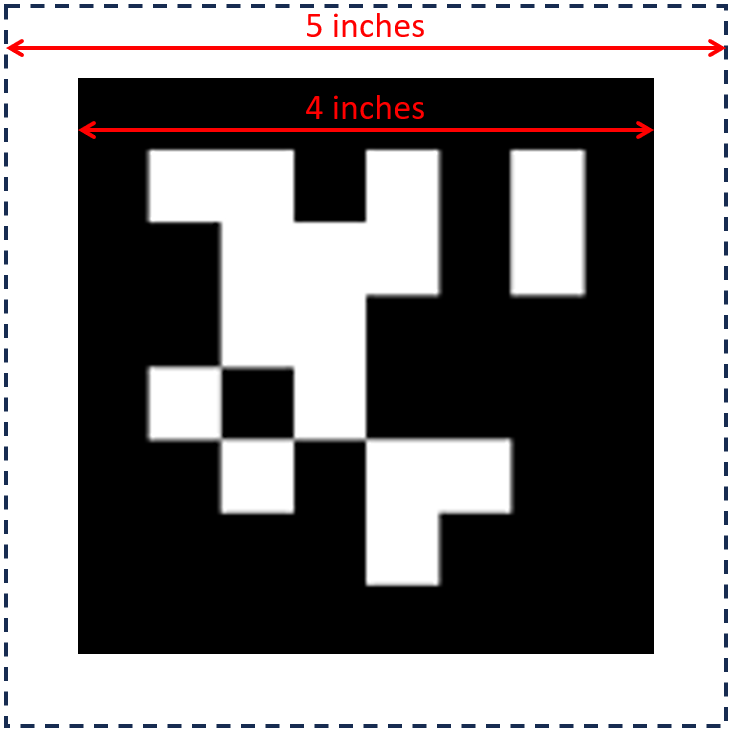
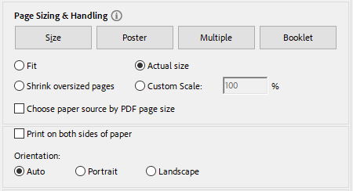
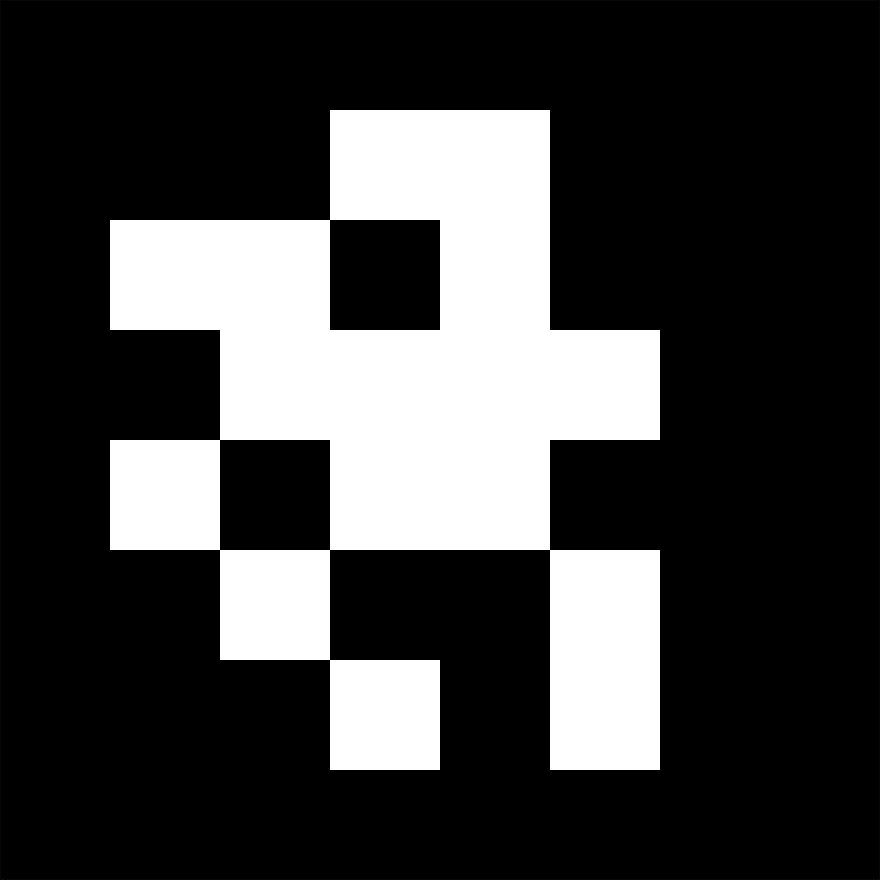
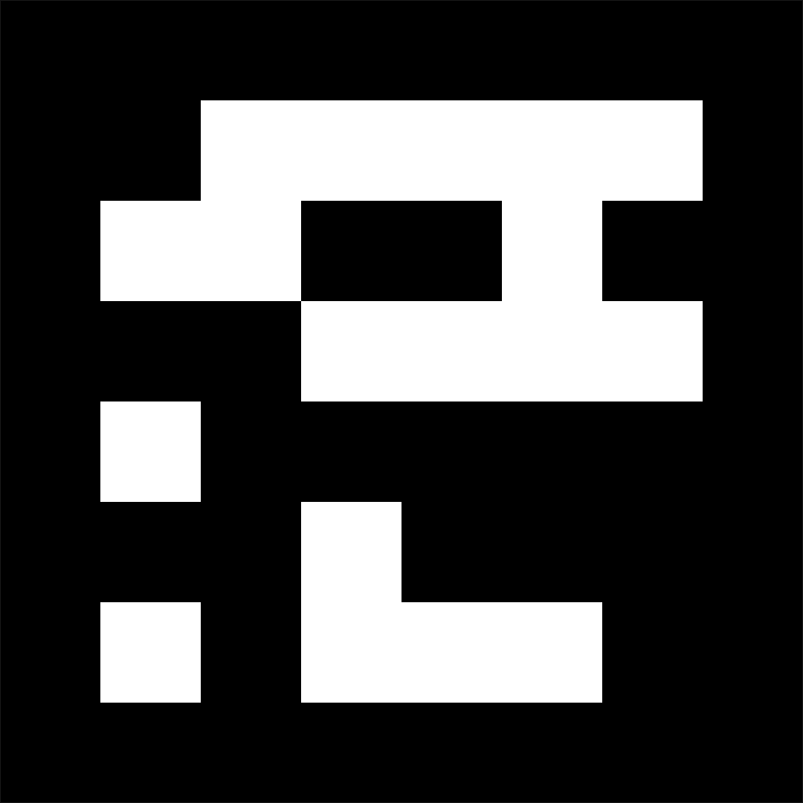
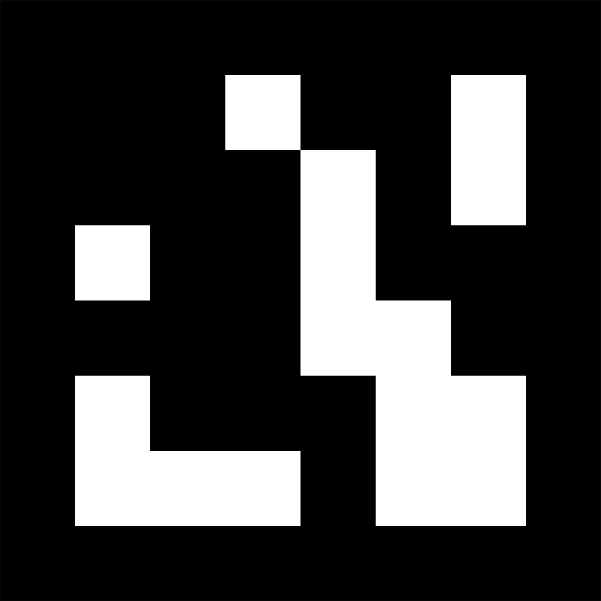
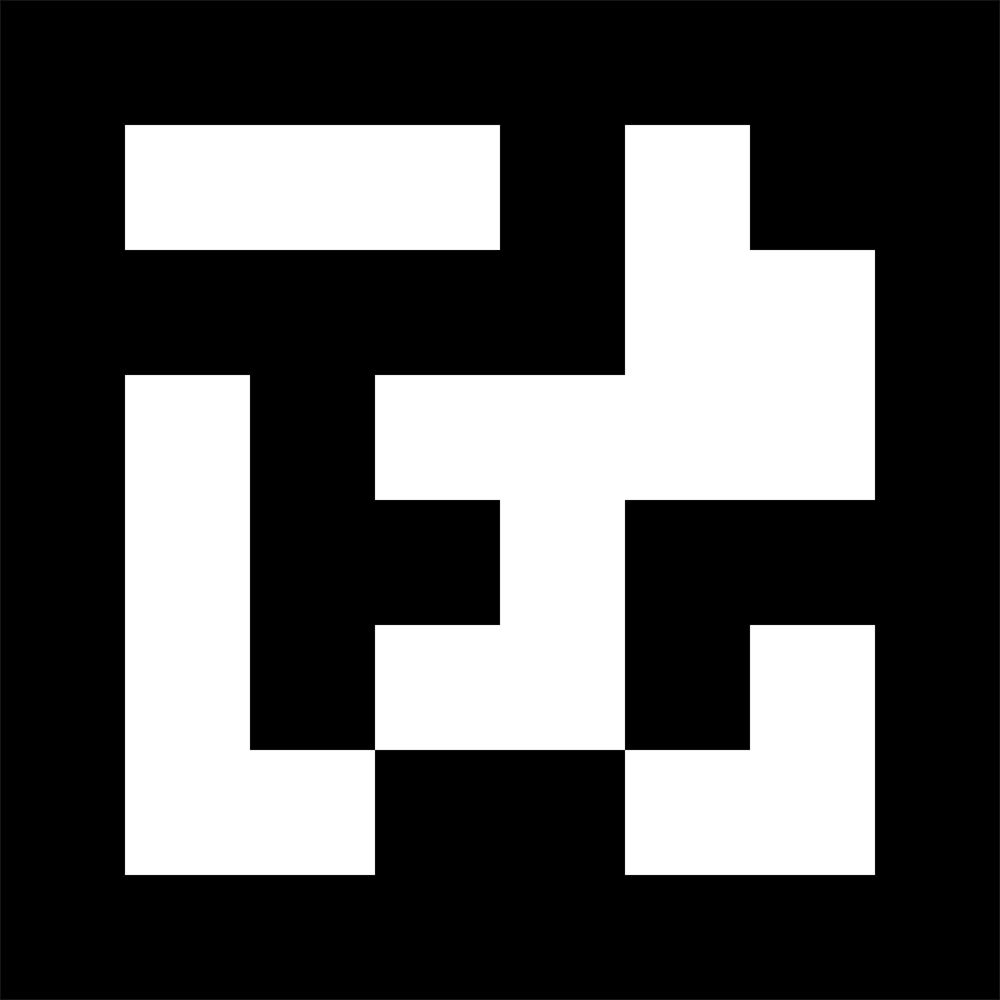

*FIRST* Tech Challenge AprilTag Testing Samples
===============================================

Introduction
------------

In the 2023-2024 season, `FIRST Tech Challenge has introduced
AprilTags <https://ftc-docs.firstinspires.org/apriltag-intro>`__ into
the season-unique competition. AprilTags were developed by the April
Robotics Laboratory at the University of Michigan and are a visual
fiducial tagging system, built on a similar concept as QR codes, useful
for a wide variety of tasks including augmented reality, robotics, and
camera calibration. A properly calibrated camera and tag library can be
used to detect AprilTags and provide information such as range and
orientation information (also known as **pose** data) about the tags
with respect to the camera. The *FIRST* Tech Challenge Software
Development Kit (SDK) has been updated to add AprilTag detection APIs to
help teams make use of this resource.

This document contains examples of AprilTags that are intended
to be used with the *FIRST* Tech Challenge AprilTag samples within the
SDK. All AprilTags used in the 2023-2024 season are from the 36h11 tag
family, which is a predetermined set of tags. The primary tag area is
comprised of an 8x8 square matrix of black and white *pixels*. The size
of the tag is measured based on the physical dimensions of the total
black square portion of the tag – a 4 inch AprilTag has a black square
portion that measures 4 inches on each side. Even though it is not used
in measuring the size of an AprilTag, each tag also requires a white
border one *pixel* thick surrounding the primary tag area (bringing the
total tag size to 10x10 *pixels*). With the added white border, for
example, a 4-inch AprilTag requires a footprint of 5 inches on each
side.

   Example sizing for 4-inch AprilTag

The AprilTag API for *FIRST* Tech Challenge can handle multiple tag
sizes; each individual tag can be sized independently, but there cannot
be multiple sizes for an individual tag. Some pose information
calculated for each tag, such as distance from camera to tag data,
requires knowing the exact size of the tags being used. The default tag
sizes used with the sample programs within the SDK are as follows:

+-----------------------------------+-----------------------------------+
| **Tag Description**               | **Size of Tag in Inches           |
|                                   | (millimeters)**                   |
+===================================+===================================+
| Tag ID: 583 (AKA “Nemo”)          | 4 in (101.6 mm)                   |
+-----------------------------------+-----------------------------------+
| Tag ID: 584 (AKA “Jonah”)         | 4 in (101.6 mm)                   |
+-----------------------------------+-----------------------------------+
| Tag ID: 585 (AKA “Cousteau”)      | 6 in (152.4 mm)                   |
+-----------------------------------+-----------------------------------+
| Tag ID: 586 (AKA “Ariel”)         | 6 in (152.4 mm)                   |
+-----------------------------------+-----------------------------------+

When printing out the :download:`PDF version of this document
<files/FTCAprilTagSDK82SamplesExtended.pdf>`, or portions thereof, please set
the Page Size settings to “Actual Size” to ensure that the tags are printed
properly. Every printer is slightly different, so it’s also a good idea to
measure the width and height of the black-square portion of the main tag area
to verify that the page printed properly.

   Example printing settings for printing PDF at Actual Size

For more in-depth information about AprilTag detection values, and
better understanding what they mean, please visit the following website:

-  https://ftc-docs.firstinspires.org/apriltag-detection-values
- :download:`Download and print the official PDF <files/FTCAprilTagSDK82SamplesExtended.pdf>`

AprilTags
---------

You can point your camera at these tags for recognition - ftc-docs does allow stretching
of the image, so the image may not clearly and correctly be represented if the width
of the display area is less than the width of the image. It is recommended to  
:download:`download and print the official PDF <files/FTCAprilTagSDK82SamplesExtended.pdf>`.

   Tag 583, "Nemo"

|

   Tag 584, "Jonah"

|

   Tag 585, "Cousteau"

|

   Tag 586, "Ariel"

|

