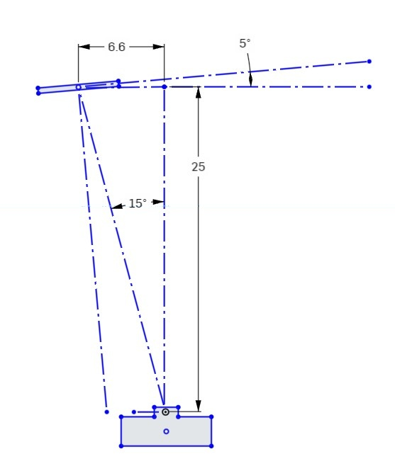
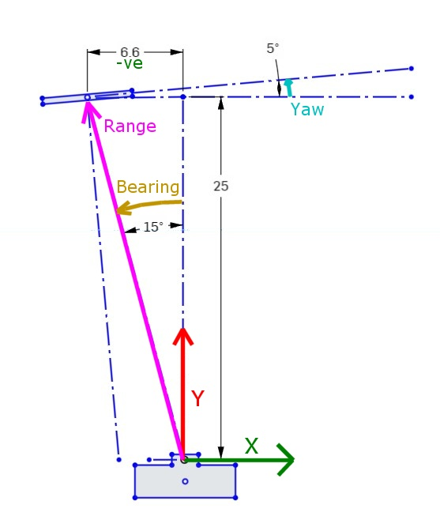
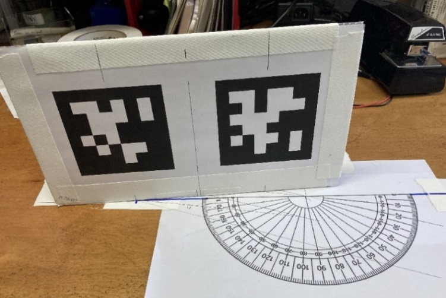
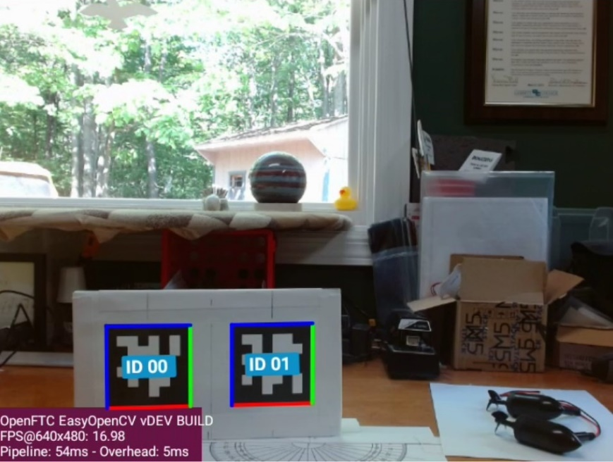
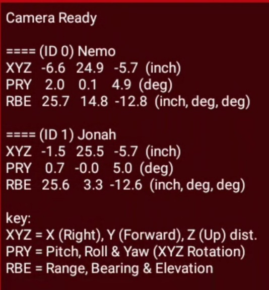

Understanding AprilTag Detection Values
=======================================

*Last Updated: 7/05/2023*

Introduction
------------

When an AprilTag is detected by the new SDK vision processing system, the core
code returns a collection of raw data that is often not easily interpreted.
However, the data can be further transformed into a familiar frame of reference
to make it more easily utilized.

In the *FIRST* Tech Challenge SDK, the AprilTag API will present the Team
OpMode with a collection of translation and rotation values, called *ftcPose*,
that represent the Tag’s position in 3D space.

To understand how to interpret these values, it’s easier to consider a simpler
2D scenario where the vertical component is ignored. This is what is described
below.

**Figure 1** below represents one possible 2D scenario.

   Figure 1: Top view of AprilTag scenario

This diagram looks down on the Camera and AprilTag from above. The camera’s
“forward” direction is identified by a dashed line drawn straight out from the
camera.

The AprilTag image is shown in the upper left of the figure. The tag is located
100 units forward of the camera and 36.4 units to the left (measured at right
angles to the forward view).

The AprilTag is also rotated 5 degrees counterclockwise from a normal “face on”
orientation.

Now that we have a clear understanding of one possible detection scenario, we
can look at the meaning of the various values returned as *ftcPose* by the SDK.

**Figure 2** shows the measured values associated with the camera/target
scenario shown in Figure 1.

   Figure 2: Measured values associated with scenario

Since this is a simple 2D diagram, the vertical “Z” (up) axis is being
ignored, so it is not shown here.

The green X axis value represents the sideways offset to the tag. Note
that this value is negative (to the left of the camera center).

The red Y axis value represents the forward distance to the Tag.

The cyan Yaw value represents the rotation of the tag around the Z axis.
A Counter-Clockwise rotation is considered positive. Note that a Yaw
value of zero means that the tag image is parallel to the face of the
camera.

.. note:: 
   Fun Fact: If the camera is pointing forward, the X, Y & Z axes are consistent
   with the Robot Coordinate system.

Three additional parameters are derived from the X and Y axis values,
these are *Range* (which is the direct distance to the center of the
target), *Bearing* (which is how many degrees the camera must turn to
point directly at the target) and *Elevation* (which is how many degrees
the camera must tilt UP to center on the tag). Note that Target Bearing
has the same positive counterclockwise orientation.

Investigating some real data
----------------------------

To illustrate this process, consider some real-world tags. The
data that follows is from a pair of tags printed on a card. The
left-most tags has an identical setup as described above. In Figure 3
the protractor origin is positioned directly in front of the camera, at
a distance of 25 inches. Both tags are to the left of the camera
centerline, and both are rotated +5 degrees. The left tag is 6.6” from
the centerline, and the right tag is 1.5” from the centerline. The
camera is located 6” inches above the center of the targets, looking out
horizontally (parallel to the ground).

   Figure 3: Sample Tag setup for testing

The AprilTag video preview image from the Camera Stream preview is shown below.
The left tag has an ID of 0 and the right tag has an ID of 1. This video is
being captured by a Logitech C920 Pro HD webcam, running at 648x480 resolution.
In this mode the camera has Field-Of-View (FOV) of 60 degrees. The physical
tags are 3.4” square.

   Figure 4: Camera Preview showing two detected AprilTags

Notice that both tags are in the bottom-left corner of the
image. The center of the image corresponds to the location the camera is
pointed at, which is centered on the protractor and directly above the
top of the tags.

Based on this setup, let’s review the data returned by the
“ConceptAprilTag.java” sample OpMode.

.. warning:: 
   Since the creation of this document, the tags used in the
   ConceptAprilTag.java sample have changed. Therefore, in order to reproduce
   this example the appropriate tags will need to be used instead of Tag0 and
   Tag1.

   Figure 5: Values displayed by AprilTag OpMode

The values for the two AprilTags are listed as “ID0 Nemo”, and “ID1
Jonah”. These are the names assigned when adding the tags to the Tag
Library.

The OpMode displays values that correspond to those parameters shown in
**Figure 2**. The XYZ line shows the three axes translation values (X, Y
& Z) in inches. The PRY line shows the corresponding rotations (Pitch,
Roll & Yaw) around those axes, in degrees. The RBE line shows the target
Range (in inches), Bearing, and Elevation (in degrees). The angle of
Elevation results from the height difference between the camera and the
Tag.

*Several items to observe:*

-  Both Y values are about 25”, but the Y value for Tag 1 is slightly
   larger because it is behind the protractor base line.

-  The X values for Tag 0 and 1 correspond to the offset distances
   described earlier (-6.6” and -1.5”)

-  Both tags show a Yaw of approximately 5 Deg, although this can vary
   1-2 degrees depending on other orientation factors.

-  The Range to both targets are almost equal but the Bearing of Tag 0
   is much greater due to its displacement to the left.

-  Both targets show the same negative Z value of -5.7, which is
   consistent with them being centered about 6” below the height of the
   camera.

-  Each tag also has an “Elevation” of about -12.6 degrees, which is a
   downward viewing angle to the center of each tag.

Ways to use this data
---------------------

There are several ways the AprilTag position data can be used, but here
are two basic ways.

1. Pointing towards a target (Tank Drive).

   If an AprilTag is being used to mark the location of a target that
   you need to shoot towards, then the two main properties of interest
   are Tag Range and Tag Bearing. The Tag Bearing is an indication of
   how many degrees you would need to turn to point directly at the tag,
   and the Tag Range is an indication of how far you would need to
   shoot. Even with a simple differential (tank) drive, these two
   parameters would enable you to turn towards the target and drive to
   the correct range (or adjust your shooting power based on the range).

   A simple proportional controller could take the Tag Bearing, multiply
   it by a suitable gain and then use it in place of the turning
   joystick to turn the robot towards the target. Likewise, you could
   subtract the desired shooting range from the current Tag Range and
   use the result to control the robot’s forward speed.

   Note that this approach does not guarantee that you are squared up to
   the front of the target, merely that you are pointing towards it. To
   get squarely aligned, you need to consider the Yaw angle as shown in
   the next approach. 

   See SDK Sample: RobotAutoDriveToAprilTagTank.java for more info.

2. Approaching a target squarely (Omni Drive).

   If an AprilTag is being used to mark the location of something that
   must be approached squarely from the front, then it’s important to
   consider the Tag Yaw value. This is a direct indication of how far
   off (in degrees) the camera is from the tag image’s centerline. This
   is related to, but not the same as the Tag Bearing. So, all three
   parameters (Range, Bearing & Yaw) must be used to approach the target
   and end up directly in front of it.

   Reaching a certain distance directly in front of the target can be
   easily performed by a robot with a holonomic (Omnidirectional) drive,
   because strafing can be used for direct sideways motion. A
   three-pronged approach can be used. 1) The Target bearing can be used
   to turn the robot towards the target (as described above). 2) The
   Target Yaw can be used to strafe sideways, thereby rotating around
   the target to get directly in front of it. 3) The target range can be
   used to drive forward or backward to obtain the correct standoff
   distance.

   Each of the three axis motions could be controlled by a simple
   proportional control loop, where turning towards the tag is given the
   highest gain (priority), followed by strafing sideways, followed by
   approaching the tag.

   See SDK Sample: RobotAutoDriveToAprilTagOmni.java for more info.

