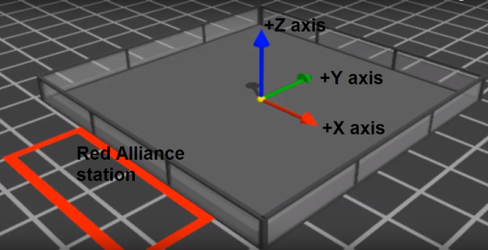
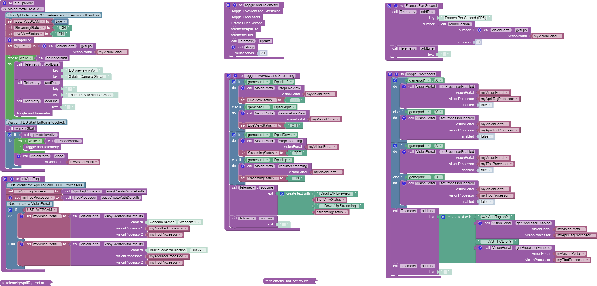

AprilTag Advanced Use
=====================

Overview
--------

This page will offer tips for *FIRST* Tech Challenge teams seeking more info
about specialized features of the new VisionPortal.

Optional Metadata
-----------------

An AprilTag Library tag can store two optional **Metadata** fields (of
these Blocks/Java types): 

- ``fieldPosition``: tag location on the game field (``VectorF``) 
- ``fieldOrientation``: tag orientation on the game field (``Quaternion``)

The reference frame is the *FIRST* Tech Challenge **Field Coordinate System**,
provided here:

- https://ftc-docs.firstinspires.org/en/latest/game_specific_resources/field_coordinate_system/field-coordinate-system.html

Here is a simple graphic showing the *FIRST* Tech Challenge global axes that
apply to **every game, every season**:

   Image Credit: Phil Malone

With a tag’s **field position** and **orientation** specified in advance
as Metadata, the tag’s pose data could be used by an advanced OpMode to
calculate the robot’s position on the field. This conversion math, an
exercise for the reader, can allow a robot to use the tag’s pose data
in real-time to navigate to the desired location on the field.

Raw Pose Values
---------------

The frame of reference described at the **AprilTag Reference Frame**
page is provided **by default** in the new 8.2 SDK.

Advanced teams may prefer to perform their own pose calculations, based
on **raw values** from the AprilTag/EasyOpenCV pipeline.

Those raw values are available to Java and Blocks programmers. The Java
version is shown here:

.. code:: java

   for (AprilTagDetection detection : aprilTag.getDetections())  {

        Orientation rot = Orientation.getOrientation(detection.rawPose.R, AxesReference.INTRINSIC, AxesOrder.XYZ, AngleUnit.DEGREES);

        // Original source data
        double poseX = detection.rawPose.x;
        double poseY = detection.rawPose.y;
        double poseZ = detection.rawPose.z;

        double poseAX = rot.firstAngle;
        double poseAY = rot.secondAngle;
        double poseAZ = rot.thirdAngle;
        }

These raw values are converted by the SDK to the default interface, as
follows:

.. code:: java

   if (detection.rawPose != null)   {
        detection.ftcPose = new AprilTagPoseFtc();

        detection.ftcPose.x =  detection.rawPose.x;
        detection.ftcPose.y =  detection.rawPose.z;
        detection.ftcPose.z = -detection.rawPose.y;

        Orientation rot = Orientation.getOrientation(detection.rawPose.R, AxesReference.INTRINSIC, AxesOrder.YXZ, outputUnitsAngle);
        detection.ftcPose.yaw = -rot.firstAngle;
        detection.ftcPose.roll = rot.thirdAngle;
        detection.ftcPose.pitch = rot.secondAngle;

        detection.ftcPose.range = Math.hypot(detection.ftcPose.x, detection.ftcPose.y);
        detection.ftcPose.bearing = outputUnitsAngle.fromUnit(AngleUnit.RADIANS, Math.atan2(-detection.ftcPose.x, detection.ftcPose.y));
        detection.ftcPose.elevation = outputUnitsAngle.fromUnit(AngleUnit.RADIANS, Math.atan2(detection.ftcPose.z, detection.ftcPose.y));
        }

Further discussion is provided here:

- https://ftc-docs.firstinspires.org/apriltag-detection-values

Advanced CPU Management
-----------------------

This section continues from the **VisionPortal CPU and Bandwidth** page, which
covered many basic tools for avoiding limits of CPU usage and USB bandwidth.

To evaluate multiple factors, changing at the same time, a customized Test
OpMode can be very useful.  This section provides an example that allows **live
gamepad control** to:

- toggle AprilTag Processor on and off
- toggle TFOD Processor on and off
- toggle LiveView on and off
- toggle Streaming on and off

Other features of this Test OpMode include:

- All controls are independent, to explore the combinations and their effect on
  frame rate (FPS).
- The previews can be observed, and detections/recognitions can be monitored
  via annotations and Telemetry.
- Frame rate is provided in LiveView and DS Telemetry.
- The Telemetry functions include an alternate for getting **all** or **only
  fresh** detections/recognitions.

This Test OpMode can be downloaded for `FTC
Blocks <https://gist.github.com/WestsideRobotics/ea7540175b11d07bf362cb9625a54042>`__
or
`Java <https://gist.github.com/WestsideRobotics/8566a1148dee6572084a6dea2b0d5627>`__.
The Blocks version is shown below; right-click to open in a new browser tab and
zoom in.

   VisionPortal Example OpMode

The OpMode uses "Webcam 1", or change ``USE_WEBCAM`` for a built-in RC phone
camera.  For Control Hub, set up an HDMI monitor or `scrcpy
<https://github.com/Genymobile/scrcpy>`__.  Follow the DS gamepad button guide.

At that **VisionPortal CPU and Bandwidth** page, four tools mentioned were not
discussed:

- set decimation (down-sampling)
- select a pose solver algorithm
- get all or only fresh detections from the AprilTag Processor
- get all or only fresh recognitions from the TFOD Processor

For now, these are left for interested Blocks and Java users to research and
investigate.  In time, more information may be posted at this page.

All of the above features are easily found in the relevant **FTC Blocks**
toolbox, or palette, under the Vision category.

**Java** users should review the VisionPortal interface at the `SDK Javadocs
<https://javadoc.io/doc/org.firstinspires.ftc/RobotCore/latest/overview-summary.html>`__
site.  Click **FRAMES** for easy navigation.

====

*Questions, comments and corrections to westsiderobotics@verizon.net*

