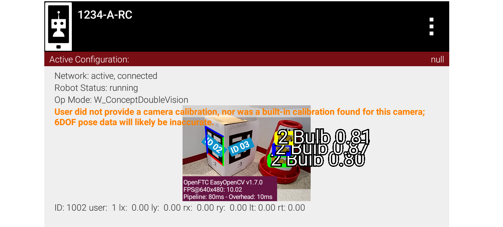
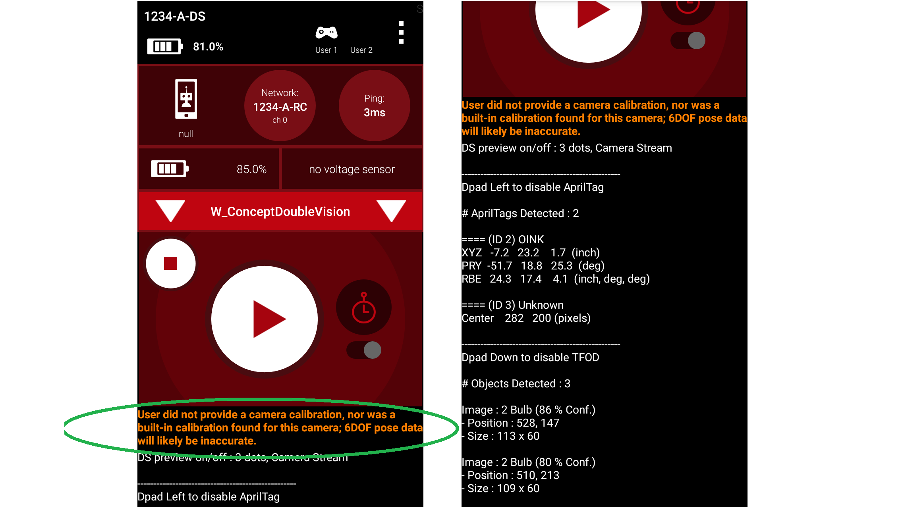
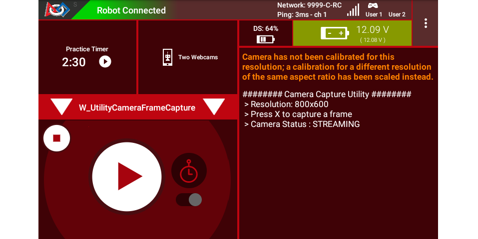

AprilTag Camera Calibration
===========================

To provide good pose estimates, **each RC phone camera or webcam model**
requires calibration data, for **each specific resolution**.

   *“Without a camera calibration, the best you could achieve is being
   able to turn towards the target. Range information would be
   incorrect.” – FIRST Tech Challenge navigation expert @gearsincorg*

The *FIRST* Tech Challenge SDK contains such data for a limited number of
webcams and resolutions. Teams can generate their own data, called **lens
intrinsics**.

Here’s one possible procedure, of several free choices available
publicly.

Utility OpMode
~~~~~~~~~~~~~~

First, create an OpMode from the Java Sample
``UtilityCameraFrameCapture.java``. Android Studio teams can find this
utility program in the External Samples folder.

FTC Blocks teams can duplicate this OpMode, requiring a custom myBlock
only for the method ``saveNextFrameRaw()``. At some future time, this
Java method may become available as a regular Block, avoiding the need
for a myBlock. Learn more about myBlocks here:

- `MyBlocks Tutorial <https://ftc-docs.firstinspires.org/en/latest/programming_resources/shared/myblocks/index.html>`__.

This Utility OpMode helps calibrate a webcam or RC phone camera, needed
for AprilTag pose estimation. It captures a camera frame (image) and
stores it on the Robot Controller (Control Hub or RC phone), with each
press of the gamepad button X (or Square).

To illustrate, the OpMode stores the first two captured images as: 

- ``VisionPortal-CameraFrameCapture-000000.png`` 
- ``VisionPortal-CameraFrameCapture-000001.png``

This is done for each run of the OpMode. Teams should move each set of
frames to its own folder (on a computer), to avoid overwriting the
previous run’s results.

Mac OSX users may need special software for Android file transfer.

Next, read and follow the calibration instructions posted at
`ftc-docs <https://ftc-docs.firstinspires.org/camera-calibration>`__.
Other calibration programs are widely available online.

Existing Warnings
~~~~~~~~~~~~~~~~~

Running ``ConceptDoubleVision`` (or any AprilTag Sample OpModes) using a
built-in RC phone camera, gives the following error message on both
devices:

   Warning of no camera calibration provided

|

   Right-hand image shows that the warning still allows detections.

The SDK gives a different warning that covers a **special case**, where
the OpMode uses: 

- a camera model for which the SDK **does have** lens intrinsics, and 
- a user-specified resolution for which 

  - (a) the SDK **does not have** lens intrinsics, and 
  - (b) the **aspect ratio** matches that of lens intrinsics that the SDK
    **does have** (for that camera model).

In such a case, the SDK **scales** the results in an attempt to estimate
AprilTag pose.

For example, changing the Logitech C270 resolution from 640x480 to
800x600 (also 4:3 aspect ratio), gives this warning on the RC preview
and the DS screen:

   Warning about no calibration at this resolution

The above warning advises the user of this situation, with the
opportunity to accept/adjust the scaled estimate or provide actual
calibration values.

This warning does not affect the function of capturing and storing
camera frames.

SDK Calibration Data
~~~~~~~~~~~~~~~~~~~~

The Logitech C270 webcam offers 18 resolutions, each wanting
calibration. The Logitech C920 offers 19 resolutions.

For the “standard” Logitech C270 (from the *FIRST* Storefront), the
SDK 8.2 currently has a set of lens intrinsics for **one
resolution**, 640x480.

Currently the SDK has calibration data for 10 resolutions spread
among 4 webcams:

-  Logitech HD Webcam C270, 640x480
-  Logitech HD Pro Webcam C920, 640x480, 800x600, 640x360, 1920x1080,
   800x448, 864x480
-  Logitech HD Webcam C310, 640x480, 640x360
-  Microsoft Lifecam HD 3000 v1/v2, 640x480

These are found in the SDK file ``builtinwebcamcalibrations.xml``. In
Android Studio, navigate to the subfolders ``RobotCore``, ``res``,
``xml``.

Android RC phone cameras also need calibration data for good pose
estimates. The SDK provides no lens intrinsics for these cameras.

====

*Questions, comments and corrections to westsiderobotics@verizon.net*

