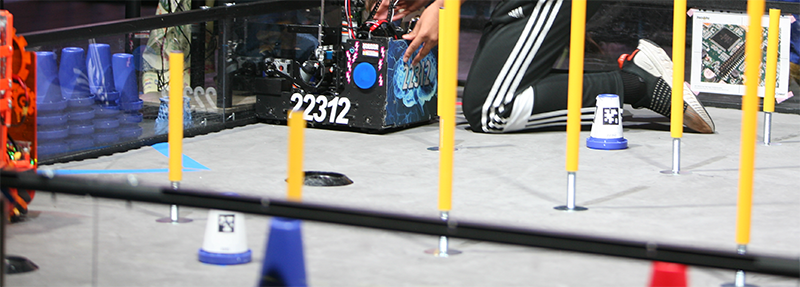
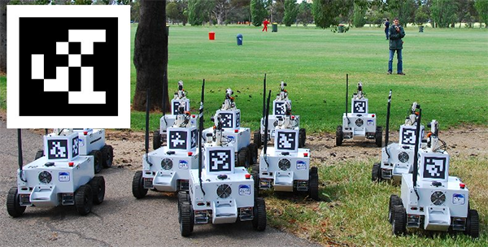
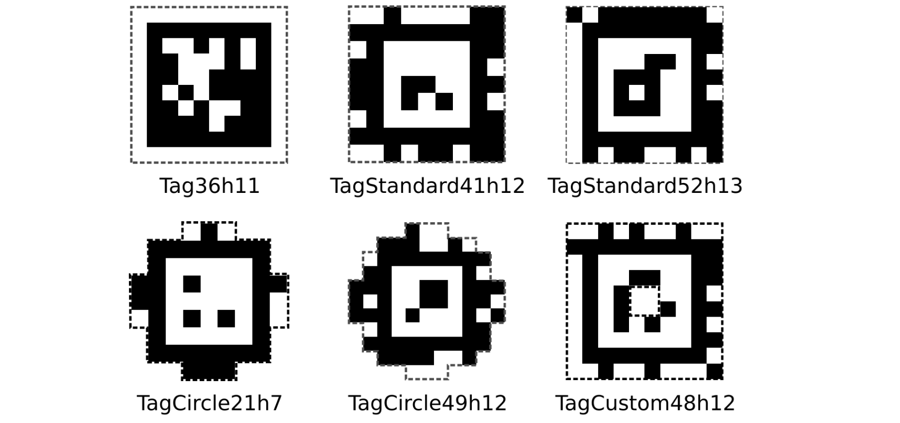
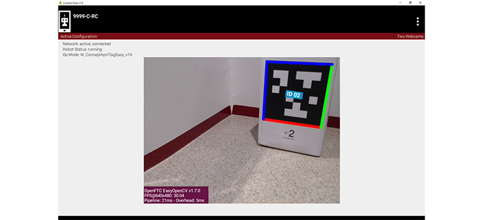
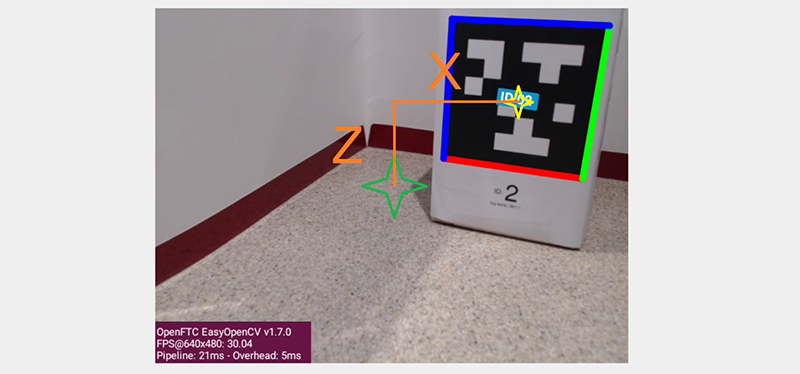
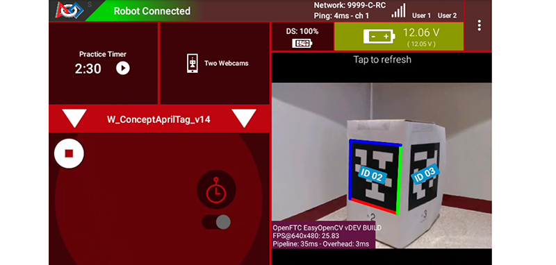
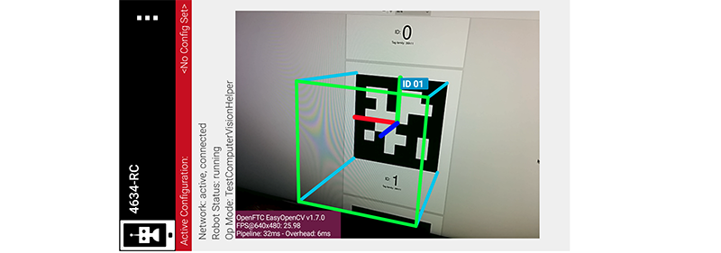

AprilTag Introduction
=====================

Introduction
------------

A popular camera-based technology is **AprilTag**, a scanned image similar to a
QR Code. Its effectiveness and quick set-up on custom Signal Sleeves led to
**wide adoption** in POWERPLAY (2022-2023) by *FIRST* Tech Challenge teams,
especially those programming in Java.

   Photo Credit: Mike Silversides

Those POWERPLAY teams, including those using FTC Blocks, learned how to use
several resources: 

-  AprilTag: an open-source technology for evaluating
   formatted images 
-  EasyOpenCV: a *FIRST* Tech Challenge-optimized interface with OpenCV, an
   image processing library 
-  myBlocks: custom Blocks created in OnBot Java (OBJ)

Now these three areas are provided, or bundled, in the new *FIRST* **Tech Challenge
Software Development Kit (SDK), version 8.2**.

Namely, key capabilities of **AprilTag** and **EasyOpenCV** are
available to the Robot Controller (RC) and Driver Station (DS) apps,
without special downloads. And AprilTag features are included in **FTC
Blocks**, without needing custom myBlocks.

The AprilTag features work on Android RC phone cameras, and on webcams.
A single OpMode can use AprilTag and TensorFlow Object Detection (TFOD).

In *FIRST* Tech Challenge, AprilTag is ready for the spotlight!

What is AprilTag?
-----------------

Developed at the `University of
Michigan <https://april.eecs.umich.edu/software/apriltag>`__, AprilTag
is like a 2D barcode or a simplified QR Code. It contains a numeric **ID
code** and can be used for **location and orientation**.

   AprilTags on Robots. Photo Credit: University of Michigan

AprilTag is a type of **visual fiducial**, or fiducial marker,
containing information and designed for easy recognition.

   A sample of different AprilTag families

The above samples represent different formats, or **families**. A
project typically uses a single AprilTag family.

This year, *FIRST* Tech Challenge nuses a common family called **36h11**. A PDF
showing the numbers 0 through 20 from the 36h11 family can be downloaded here:

- :download:`AprilTag PDF 0-20 <files/AprilTag_0-20_family36h11.pdf>`

Each number is the ID code of that tag.

Here’s an AprilTag representing **ID code 2**. The SDK software
recognizes and overlays the ID code onto the image (small blue rectangle
**ID 02**).

   Stream output showing the detected tag ID 02 

The above image shows a camera preview image, called LiveView, from a
Robot Controller device (Control Hub or RC phone).

The AprilTag family 36h11 has a capacity of 587 ID codes. To see them
all, follow this link:

- https://github.com/rgov/apriltag-pdfs/tree/main/tag36h11/us_letter/100mm

The square AprilTag pattern contains smaller black and white squares,
each called a **pixel**. A 36h11 tag contains 10 x 10 pixels, including
an outer border of **all white pixels** and an inner border of **all
black pixels**.

**Tag size** is measured across the outside edge of the **inner border**
which comprises the black pixels for 36h11.

   Figure demonstrating the tag size measurement

The above image shows a complete AprilTag with outer white border. From the
36h11 family, its ID code is 42.

AprilTag Pose
-------------

Beyond ID code, the new SDK also provides **pose** data, namely position
and orientation (rotation) from the **camera’s point of view**.  This requires
a **flat AprilTag**, which was not possible with curved POWERPLAY Signal
Sleeves.

Let’s look again at the camera preview image, called LiveView, from a Robot
Controller device (Control Hub or RC phone).

   LiveView Image with additional markings for explanation purposes

Imagine a laser beam pointing straight outward from the center of the camera
lens. Its 3-dimensional path appears (to the camera) as a single point,
indicated by the **green star**. You can see that the center of the AprilTag
(**yellow star**) is offset from that “laser beam”.

That **translation offset** can break down into three traditional components
(X, Y and Z distances), along axes at 90 degrees to each other:

-  X distance (horizontal orange line) is from the center, to the right
-  Y distance (not shown) is from the lens center, outwards
-  Z distance (vertical orange line) is from the center, upwards

The SDK provides these distances **in the real world**, not just reporting how
many pixels on the screen. Very useful!

You can also see that the AprilTag’s flat face is not parallel to the plane of
the camera. That **rotation offset** can break down into three angles about the
X, Y and Z axes. This is discussed further in the section below, called
**AprilTag Axes**.

In summary, the SDK evaluates the AprilTag image and performs **“pose
estimation”**, providing an estimated X, Y and Z **distance** between the tag
and the camera, along with an estimated **angle** of rotation around those
axes. A closer or larger AprilTag can yield a more accurate estimate of pose.

To provide good pose estimates, each RC phone camera or webcam requires
**calibration data**, for a specific resolution. The SDK contains such data
for a limited number of webcams and resolutions. Teams can generate their own
data, called **lens intrinsics**, using a provided procedure.

Navigation
----------

OpModes use AprilTag pose to achieve **navigation**: evaluating inputs and
driving to a destination.

An OpMode can use pose data to drive towards the tag, or drive to a target
position and orientation **relative to the tag**. (The new SDK provides Java
**Sample OpModes** ``RobotAutoDriveToAprilTagOmni.java`` and
``RobotAutoDriveToAprilTagTank.java``.) Another navigation possibility is
mentioned below under **Advanced Use**.

Navigation is best done with **continuous** pose estimates, if the AprilTag
remains within the camera’s field of view. Namely, an OpMode “**while() loop**”
should regularly read the updated pose data, to guide the robot’s driving
actions.

The new SDK supports **multiple cameras**, switchable or simultaneous.  This
can help if the robot changes direction, or you wish to navigate using another
AprilTag (or TensorFlow object).

Other sensors can also be used for navigation, such as drive motor encoders,
REV Hub IMU, deadwheel encoders, color/distance sensors, ultrasonic sensors,
and more.

It’s also possible to evaluate **non-AprilTag images** from the same camera
and/or a second camera. For example, the SDK can estimate the horizontal angle
(or Bearing) of an object detected with **TensorFlow**, another vision
technology employed in *FIRST* Tech Challenge. Advanced teams might consider
active camera pointing control, to keep an AprilTag or other object in view.

Annotations
-----------

In the preview (RC phone screen or DS Camera Stream), an official
recognized AprilTag will display a **colored border** and its numeric **ID
code**. These **annotations** allow easy visual confirmation of recognition:

   Two AprilTags with different metadata being detected and annotations displayed

In the above :ref:`DS Camera Stream <hardware_and_software_configuration/configuring/configuring_external_webcam/configuring-external-webcam:image preview>`
preview, the left-side AprilTag was recognized from a tag **Library** (default
or customized). A Library tag has pre-loaded information (called **Metadata**)
including its tag size, which allows **pose estimation**. These are annotated
by default with a **colored border**.

The right-side AprilTag was not in a tag Library. It has no Metadata, so the
SDK can provide only its numeric **ID code**, shown here as **ID 03**. Such
tags are **not** annotated by default with a colored border.

Note: **Camera Stream** displays a snapshot of the camera’s view, on the Driver
Station device. It’s available only during the INIT phase of an OpMode, and
also shows any AprilTag (or TFOD) annotations. Instructions are posted here:

- :ref:`Camera Stream Image Preview Documentation <hardware_and_software_configuration/configuring/configuring_external_webcam/configuring-external-webcam:image preview>`

Optional annotations include **colored axes** at the tag center, and a
**colored box** projecting from the tag image:

   LiveView with additional annotations enabled

The above image shows a preview (called LiveView) on an Android Robot
Controller (RC) phone. The REV Control Hub does generate an RC preview, which
can be seen with an HDMI external monitor, or with ``scrcpy`` which can be
found here:

- https://github.com/Genymobile/scrcpy

AprilTag Axes
-------------

The SDK now provides the underlying pose data as follows: 

-  Position is based on X, Y and Z distance **from the camera lens to the
   AprilTag**. 
-  Orientation is based on rotation about those axes, using the right-hand
   rule.

Note: the optional red-green-blue annotated axes represent the **tag’s
frame of reference**, unrelated to SDK pose data. That annotation
indicates only a successful AprilTag recognition.

Here are the axis designations in the new SDK: 

- Y axis points **straight outward** from the camera lens center 
- X axis points **to the right**, perpendicular to the Y axis 
- Z axis points **upward**, perpendicular to Y and X

If the camera is upright and pointing forward on the robot, these axes
are consistent with the Robot Coordinate System used for 
:ref:`IMU navigation <programming_resources/imu/imu:axes definition>`.

Note: these axes are different than the official AprilTag
`definitions <https://github.com/AprilRobotics/apriltag/wiki/AprilTag-User-Guide#coordinate-system>`__,
even from the camera’s frame of reference.

The SDK provides AprilTag **rotation** data as follows: 

- **Pitch** is the measure of rotation about the X axis 
- **Roll** is the measure of rotation about the Y axis 
- Heading, or **Yaw**, is the measure of rotation about the Z axis

Rotation follows the traditional right-hand rule: with the thumb
pointing along the positive axis, the fingers curl in the direction of
positive rotation.

Further discussion is provided here:

- https://ftc-docs.firstinspires.org/apriltag-detection-values

Note: This article does not discuss the *FIRST* Tech Challenge 
:ref:`Field Coordinate System <game_specific_resources/field_coordinate_system/field-coordinate-system:scope>`.

Your OpModes might relate robot orientation to the overall field or 
:download:`‘global coordinates’ <files/FTC-Global-Coordinates.png>`
for navigation, but that’s beyond this AprilTag introduction.

Advanced Use
------------

**Option 1**

If a tag’s position and orientation **on the game field** are
specified in advance, the tag’s pose data could be used by an advanced
OpMode to calculate the robot’s position on the field. This conversion
math, an exercise for the reader, can allow a robot to use the tag’s
pose data in real-time to navigate to the desired location on the field.

**Option 2**

Vision processing can consume significant **CPU resources** and USB
communications **bandwidth**. *FIRST* Tech Challenge teams may balance the
benefits of higher resolution and speed (frames-per-second) against the risk of
overloading CPU and bandwidth resources. The 8.2 SDK provides numerous tools to
manage this balance: 

- select the camera resolution 
- disable and enable the RC preview (called LiveView) 
- disable and enable the AprilTag (or TFOD) processor 
- close the camera stream 
- select a compressed video streaming format 
- measure frames-per-second 
- set decimation (down-sampling) 
- select a pose solver algorithm

**Option 3**

Clearer camera images can improve AprilTag (and TFOD) vision processing.
The SDK offers powerful **webcam controls** (Exposure, Gain, Focus,
and more), now available in FTC Blocks! These controls can be applied
under various lighting conditions.

Exposure and Gain are adjusted together. The new SDK offers Java Sample
OpMode ``ConceptAprilTagOptimizeExposure.java``.

**Option 4**

The frame of reference described above in **AprilTag Axes** is
calculated and provided by default in the new 8.2 SDK. Advanced teams
may prefer to perform their own pose calculations, based on **raw
values** from the AprilTag/EasyOpenCV pipeline.

Those raw values are available to Java and Blocks programmers. The Java
version is shown here:

.. code:: java

   for (AprilTagDetection detection : aprilTag.getDetections())  {

        Orientation rot = Orientation.getOrientation(detection.rawPose.R, AxesReference.INTRINSIC, AxesOrder.XYZ, AngleUnit.DEGREES);

        // Original source data
        double poseX = detection.rawPose.x;
        double poseY = detection.rawPose.y;
        double poseZ = detection.rawPose.z;

        double poseAX = rot.firstAngle;
        double poseAY = rot.secondAngle;
        double poseAZ = rot.thirdAngle;
        }

These raw values are converted by the SDK to the default interface, as
follows:

.. code:: java

   if (detection.rawPose != null)   {
        detection.ftcPose = new AprilTagPoseFtc();

        detection.ftcPose.x =  detection.rawPose.x;
        detection.ftcPose.y =  detection.rawPose.z;
        detection.ftcPose.z = -detection.rawPose.y;

        Orientation rot = Orientation.getOrientation(detection.rawPose.R, AxesReference.INTRINSIC, AxesOrder.YXZ, outputUnitsAngle);
        detection.ftcPose.yaw = -rot.firstAngle;
        detection.ftcPose.roll = rot.thirdAngle;
        detection.ftcPose.pitch = rot.secondAngle;

        detection.ftcPose.range = Math.hypot(detection.ftcPose.x, detection.ftcPose.y);
        detection.ftcPose.bearing = outputUnitsAngle.fromUnit(AngleUnit.RADIANS, Math.atan2(-detection.ftcPose.x, detection.ftcPose.y));
        detection.ftcPose.elevation = outputUnitsAngle.fromUnit(AngleUnit.RADIANS, Math.atan2(detection.ftcPose.z, detection.ftcPose.y));
        }

Again, further discussion is provided here:

- https://ftc-docs.firstinspires.org/apriltag-detection-values

Summary
-------

AprilTag is a popular camera-based technology, using a scanned image
similar to a QR Code.

The new SDK version 8.2 now includes key capabilities of AprilTag and
EasyOpenCV, a *FIRST* Tech Challenge-optimized interface with OpenCV for image
processing. These methods are packaged for convenient use by **Java and Blocks
programmers**.

By default, the SDK can detect the ID code for any AprilTag in the 36h11
family.

For AprilTags in a default or custom tag Library, the interface
provides calculated **pose** estimates (position and rotation) from the
**camera’s frame of reference**. The source data is also available for
advanced teams.

The AprilTag features work on Android RC phone cameras, and on webcams.
Each camera requires **calibration data**, for a specific resolution, to
provide good pose estimates.

Multiple cameras are supported, and a single OpMode can use AprilTag and
TensorFlow Object Detection (TFOD). AprilTag detection is improved with
webcam Camera Controls, now available also in FTC Blocks.

**In** *FIRST* **Tech Challenge, AprilTag is ready to take CENTERSTAGE!**

====

Much credit to:

- EasyOpenCV developer `@Windwoes <https://github.com/Windwoes>`__ 
- FTC Blocks developer `@lizlooney <https://github.com/lizlooney>`__ 
- FTC navigation expert `@gearsincorg <https://github.com/gearsincorg>`__ 
- and the smart people at `UMich/AprilTag <https://april.eecs.umich.edu/software/apriltag>`__.

Questions, comments and corrections to westsiderobotics@verizon.net

