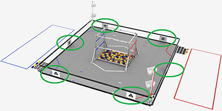
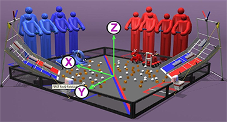
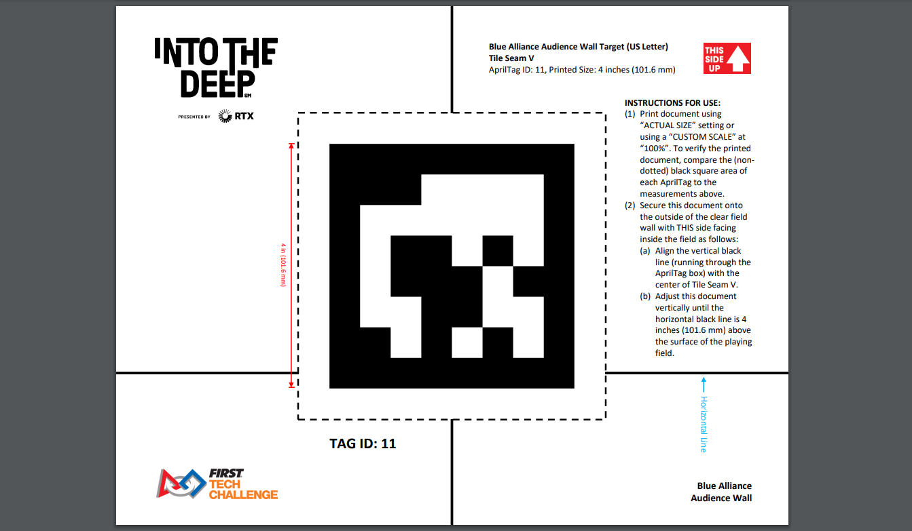
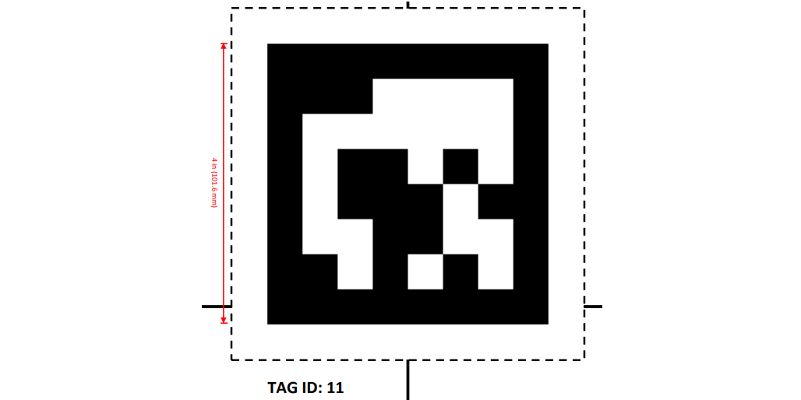
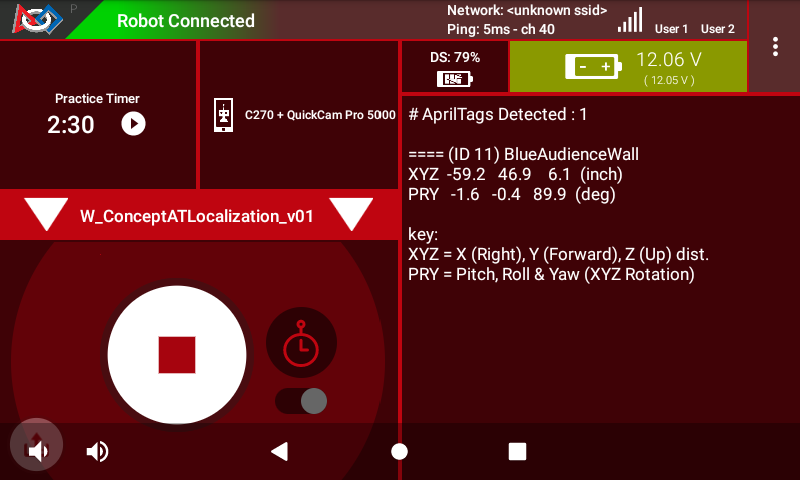
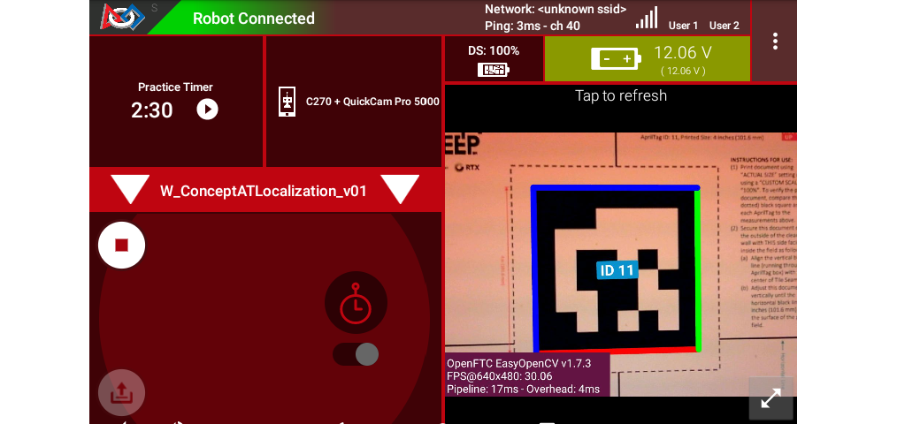
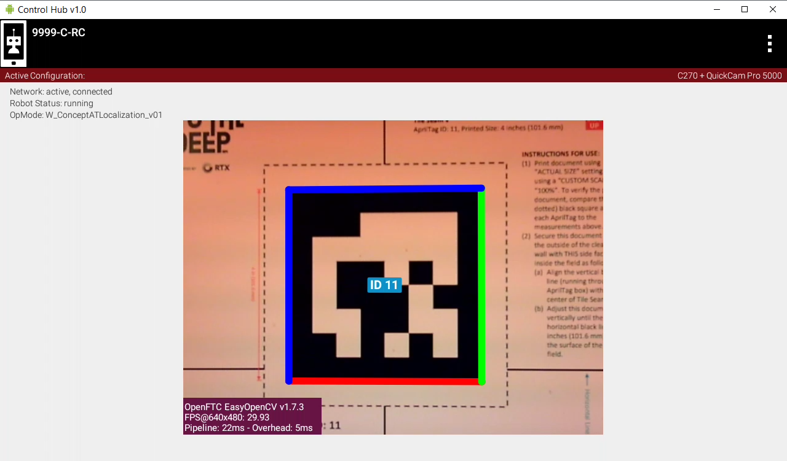
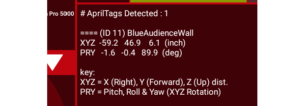
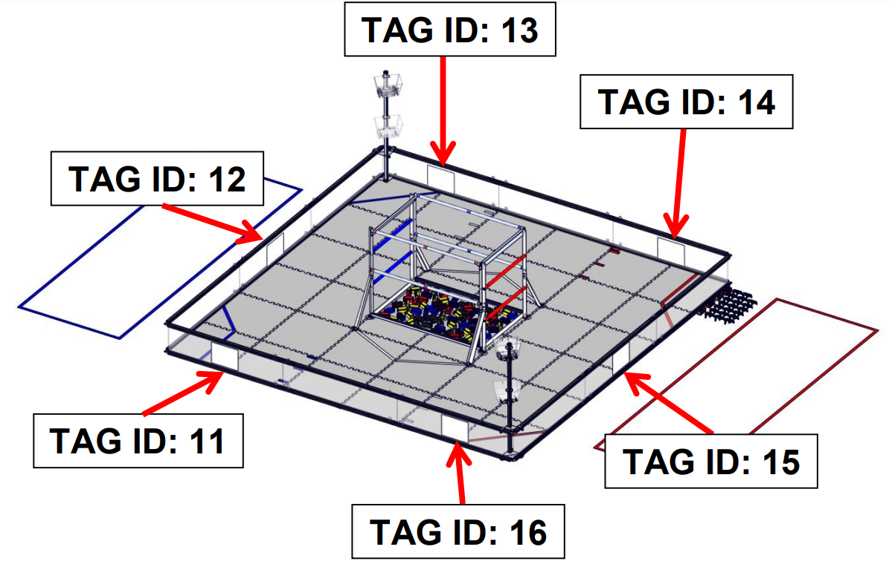
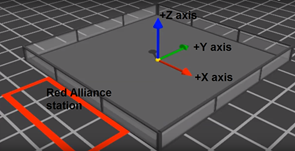

AprilTag Localization
=====================

Introduction
------------

In *FIRST Tech Challenge* (FTC), **localization** uses sensor inputs to
determine the robot's current place **on the game field**.

Since 2023, an FTC OpMode can read the **pose** (position and orientation) of
an AprilTag, **relative to the camera**.  An OpMode can also read that
AprilTag's **global** pose (on the FTC game field), stored as metadata.

   Field locations of AprilTags in INTO THE DEEP

This means it's possible to calculate the camera's **global** pose -- namely
its position and orientation on the game field.

Furthermore, if the camera's pose is specified in the robot's reference frame,
then an OpMode can determine the **global pose of the robot** (on the game
field).

   FTC Field Coordinate System

This **localization** is a calculation to determine the robot's global position
and rotation, based on sensing one or more fixed landmarks -- AprilTags in this
case.

This capability is provided in 2024 with FTC SDK version 10.0, including a
Sample OpMode, thanks to `Dryw Wade <https://github.com/sfe-SparkFro>`_.  This
tutorial describes how to use that OpMode.

Configuration
-------------

*Skip this section if ...*

* *the active robot configuration already contains "Webcam 1", or*
* *using the built-in camera of an Android phone as Robot Controller.*

Before starting the programming, REV Control Hub users should make a robot
configuration that includes the USB webcam to be used for AprilTag
localization.

For now, use the default webcam name, "Webcam 1".  If a different name is
preferred, edit the Sample OpMode to agree with the exact webcam name in the
robot configuration.

**Save and activate** that configuration; its name should appear on the paired
Driver Station screen.

Open the Sample OpMode
----------------------

To learn about opening the Sample OpMode, select and read the Blocks **or**
Java section below:

.. tab-set::
   .. tab-item:: Blocks
      :sync: blocks

      On a laptop or desktop computer connected via Wi-Fi to the Robot
      Controller, open the Chrome browser.  Go to the REV Control Hub's address
      http://192.168.43.1:8080 (or http://192.168.49.1:8080 for Android RC
      phone) and click the Blocks tab.

      Click ``Create New OpMode``\ , enter a new name such as
      "AprilTagLocalization_Darlene_v01", and select the Sample OpMode
      ``ConceptAprilTagLocalization``.

      If using the built-in camera of an RC phone, change ``true`` to ``false``
      at the OpMode's first Block called ``set USE_WEBCAM``.

      Save the OpMode, time to try it!

   .. tab-item:: Java
      :sync: java

      Open your choice of OnBot Java or Android Studio.

      In the ``teamcode`` folder, add/create a new OpMode with a name such as
      "AprilTagLocalization_Oscar_v01.java", and select the Sample OpMode
      ``ConceptAprilTagLocalization.java``.

      If using the built-in camera of an RC phone, change ``true`` to ``false``
      at about line 71 (\ ``USE_WEBCAM``\ ).

      Click "Build", time to try it!

Run the Sample OpMode
---------------------

On the Driver Station, select the TeleOp OpMode that you just saved or built.

Aim the camera at an AprilTag from the current FTC game.

   Full AprilTag Image

For real results, testing should be done on an FTC game field with one or more
legal AprilTags posted in their correct positions.

For simulated/casual testing, use a loose paper AprilTag of the correct size.
Or it may be on a computer screen, with the image zoomed to the **correct
physical size** (4 x 4 inches, in this example):

   Partial AprilTag Sheet

**Touch INIT only.**  No telemetry will appear, but at this moment the DS
**Camera Stream** preview can be accessed.  See the next section re.  previews.

After using the preview to aim at the AprilTag, touch the DS Start arrow.   The
OpMode should give Telemetry showing the **localization results**:

   Driver Station Sample Output

These details will be covered in a later section.  In this example, the camera
is 12 inches directly in front of AprilTag #11 from INTO THE DEEP. 

Slowly move the camera around, keeping the AprilTag fully in the camera's view.
The telemetry will update with the camera's location on the field.

It's working!  Your OpMode can determine the **global pose** of the camera.  A
later section describes how to get the global **robot pose**\ , based on the
camera's placement on the robot.

*Skip the next two sections, if you already know how to use FTC previews.*

DS Preview
----------

Before describing the telemetry data, this page offers two sections on seeing
the camera's view of the AprilTag with **previews**.  Previewing is essential
for working with robot vision.

On the Driver Station (DS), remain in INIT -- don't touch the Start button.

At the top right corner, touch the 3-dots menu, then ``Camera Stream``.  This
shows the camera's view; tap the image to refresh it.

   Example of DS Camera Stream

For a BIG preview, touch the arrows at the bottom right corner.

Or, select Camera Stream again, to return to the previous screen and its
Telemetry.

RC Preview
----------

The Robot Controller (RC) device also makes a preview, called ``LiveView``.
This is full video, and is shown automatically on the screen of an RC phone.

   Control Hub Preview 

The above preview is from a REV Control Hub.

It has no physical screen, so you must plug in an HDMI monitor **or** use
open-source `scrcpy <https://github.com/Genymobile/scrcpy>`_ (called
"screen copy") to see the preview on a laptop or computer that's connected via
Wi-Fi to the Control Hub.

Basic Telemetry Data
--------------------

Let's look closer at the DS telemetry:

   DS Telemetry Example

In this example, the camera is 12 inches directly in front of AprilTag #11 from
INTO THE DEEP. 

   Specific Tag Locations for INTO THE DEEP

The center of AprilTag #11 is at position X = -72 inches from the center of the
field.  This telemetry gives the camera's X position as (approximately) -60
inches, namely 12 inches in front of that tag.

The center of AprilTag #11 is at position Y = 48 inches from the center of the
field.  This telemetry gives the camera's Y position as (approximately) 48
inches, namely directly aligned (horizontally) with that tag.

The center of AprilTag #11 is at position Z = 5.9 inches (above the mat).
This telemetry gives the camera's Z position as (approximately) 5.9 inches,
namely directly aligned (vertically) with that tag.

The camera lens is parallel to the AprilTag, so the Pitch, Roll and Yaw values
should be orthogonal (0 or a multiple of 90 degrees).  This telemetry confirms
the parallel orientation, with PRY values (approximately) 0 or 90 degrees.

Reference Frames
----------------

In the above example. the yaw angle is given as (approximately) -90 degrees.
But the camera is facing in the negative X direction, thus has a heading or yaw
angle of -180 degrees in the official FTC `field coordinate system
<https://ftc-docs.firstinspires.org/en/latest/game_specific_resources/field_coordinate_system/field-coordinate-system.html>`_
:

   FTC Field Coordinate System

This sample OpMode uses a reference frame (coordinate system) that may be
different than what you expect from other FTC navigation applications,
including `IMU or robot axes
<https://ftc-docs.firstinspires.org/en/latest/programming_resources/imu/imu.html?highlight=field%20coordinates#axes-definition>`_\
, odometry device axes, and the FTC field system (shown above).  These
differences typically result in basic and obvious changes in axis direction,
axis swapping, and orthogonal angles (90-degree increments).

Learn and incorporate these differences into your OpMode, for the given
scenario of your AprilTag localization.  Manually adjust values as needed to
accomplish your specific navigation goals.

**Evaluate the accuracy and reliability of AprilTag navigation**\ , with and
without offsets, smoothing and other adjustments.  Some FTC teams use multiple
data sources for navigation.  Base your robot strategy on capabilities
**demonstrated** through extensive testing and refinement.

Camera Placement on Robot
-------------------------

The Sample OpMode provides fields to specify the location and orientation of
the camera on the robot.  The returned data will then represent the global
**robot pose** rather than the camera's pose.

Subject to the reference frame caveat noted above, do your best to follow these
commented instructions, in the Blocks and Java Sample OpModes:

..

   Setting these values requires a definition of the axes of the camera and robot:

   **Camera axes:**

   * *Origin location:* Center of the lens
   * *Axes orientation:* +x right, +y down, +z forward (from camera's perspective)

   **Robot axes:** (this is typical, but you can define this however you want)

   * *Origin location:* Center of the robot at field height
   * *Axes orientation:* +x right, +y forward, +z upward

   **Position:** 

   * If all values are zero (no translation), that implies the camera is at the
     center of the robot. Suppose your camera is positioned 5 inches to the
     left, 7 inches forward, and 12 inches above the ground - you would need to
     set the position to (-5, 7, 12).

   **Orientation:** 

   * If all values are zero (no rotation), that implies the camera is pointing
     straight up. In most cases, you'll need to set the pitch to -90 degrees
     (rotation about the x-axis), meaning the camera is horizontal. Use a yaw
     of 0 if the camera is pointing forwards, +90 degrees if it's pointing
     straight left, -90 degrees for straight right, etc. You can also set the
     roll to +/-90 degrees if it's vertical, or 180 degrees if it's
     upside-down.

To see the commands for setting **camera pose** (on the robot), select and read
the Blocks **or** Java section below:

.. tab-set::
   .. tab-item:: Blocks
      :sync: blocks

      .. figure:: images/60-camera-pose.png
         :align: center
         :width: 85%
         :alt: Camera Pose Blocks

      The third Block called ``.setCameraPose`` can be found in the toolbox
      under Vision/AprilTag/AprilTagProcessor.Builder.

   .. tab-item:: Java
      :sync: java

      These lines show that the camera placement on the robot becomes part of
      the AprilTag Processor, through the Java Builder pattern.

      .. code-block:: java

         import org.firstinspires.ftc.robotcore.external.navigation.Position;
         import org.firstinspires.ftc.robotcore.external.navigation.YawPitchRollAngles;
         .
         Position cameraPosition = new Position(DistanceUnit.INCH, 0, 0, 0, 0);
         YawPitchRollAngles cameraOrientation = new YawPitchRollAngles(AngleUnit.DEGREES, 0, -90, 0, 0);
         .
         AprilTagProcessor aprilTag = new AprilTagProcessor.Builder()
               .setCameraPose(cameraPosition, cameraOrientation)
               .build();

Reading Global Pose
-------------------

To see the commands for reading **global robot pose** data, select and read the
Blocks **or** Java section below:

.. tab-set::
   .. tab-item:: Blocks
      :sync: blocks

      These green Blocks can be assigned to position Variables, for later use.

      .. figure:: images/70-robot-position.png
         :align: center
         :width: 85%
         :alt: Robot Position Blocks

         Robot Position Blocks

      These green Blocks can be assigned to orientation Variables, for later
      use.

      .. figure:: images/75-robot-orientation.png
         :align: center
         :width: 85%
         :alt: Robot Orientation Blocks

         Robot Orientation Blocks

   .. tab-item:: Java
      :sync: java

      These lines demonstrate assigning position and orientation values to
      variables, for later use.  These are typically "instant" values inside a
      ``for`` loop, as used in the Sample OpMode.

      .. code-block:: java

         import org.firstinspires.ftc.vision.apriltag.AprilTagDetection;
         .
         AprilTagDetection detection;
         .
         double myX = detection.robotPose.getPosition().x;
         double myY = detection.robotPose.getPosition().y;
         double myZ = detection.robotPose.getPosition().z;
         .
         double myPitch = detection.robotPose.getOrientation().getPitch(AngleUnit.DEGREES);
         double myRoll = detection.robotPose.getOrientation().getRoll(AngleUnit.DEGREES);
         double myYaw = detection.robotPose.getOrientation().getYaw(AngleUnit.DEGREES);

Summary
-------

The 2024 FTC software allows **robot localization** using a camera and fixed
AprilTags on the field.  This is done by combining three elements:

* basic AprilTag pose data,
* the tag's built-in metadata, and 
* the camera's pose on the robot.

AprilTag localization uses a reference frame (coordinate system) that may
differ from others, such as IMU or robot axes, odometry device axes, and the
FTC field system.  Adjust as needed.

Evaluate this navigation tool against other choices, and plan a robot strategy
based on demonstrated capability.

Best of luck as you develop FTC robot navigation to reach your goals!

