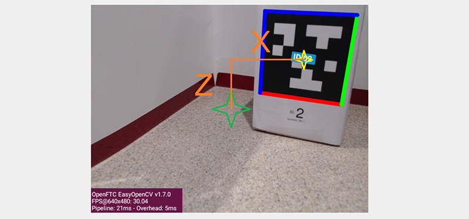

AprilTag Reference Frame
========================

Introduction
------------

Before discussing AprilTag **pose** (at the next page), the **FTC axes** or
reference frame must be described.  Pose data is based on the **camera's
point of view**, and requires a **flat AprilTag**.

Here are the axis designations in the new SDK:

- Y axis points **straight outward** from the camera lens center
- X axis points **to the right** (looking outward), perpendicular to the Y axis
- Z axis points **upward**, perpendicular to Y and X

.. note::
   Note 1: If the camera is upright and pointing "forward" on the robot, these
   axes are consistent with the Robot Coordinate System used for 
   `IMU navigation <https://ftc-docs.firstinspires.org/en/latest/programming_resources/imu/imu.html#axes-definition>`__

.. note::
   Note 2: these axes are different than the official `AprilTag definitions
   <https://github.com/AprilRobotics/apriltag/wiki/AprilTag-User-Guide#coordinate-system>`__,
   even from the camera's frame of reference.

Translation Offset
------------------

If the AprilTag is detected within the camera's field of view, the tag's center
is described in that reference frame as (X, Y, Z) position, also called
displacement or translation.

This is illustrated with a camera preview image, called LiveView, from a Robot
Controller device (Control Hub or RC phone).

   Image depicting LiveView offsets

Imagine a laser beam pointing straight outward from the center of the camera
lens.  Its 3-dimensional path appears (to the camera) as a single point,
located at the **green star**.  You can see that the center of the AprilTag
(**yellow star**) is offset from that "laser beam".

That **translation offset** can break down into three traditional components
(X, Y and Z distances), along axes at 90 degrees to each other:

- X distance (horizontal orange line) is from the center, to the right
- Y distance (not shown) is from the lens center, outwards
- Z distance (vertical orange line) is from the center, upwards

The SDK provides these distances **in the real world**, not just reporting how
many pixels on the screen.  The **distance units** are specified in each tag's
Metadata (default is **inches**).

Think of the Y distance as the length of the "laser beam", when the tip of the
horizontal orange line touches the yellow star **on the tag**.

If the tag is exactly in front of the camera, X and Z are zero, while Y
represents the positive distance to the tag.

Rotation Offset
---------------

You can also see that the AprilTag's flat face is not parallel to the plane of
the camera.  That **rotation offset** can break down into three angles about
the X, Y and Z axes.

Any off-axis pointing or tilting of the AprilTag is reported by the SDK as
rotation about axes X, Y or Z.  Here are some examples:

- If that tag is parallel to the camera but tilted, say, clockwise, this is
  expressed as positive angular rotation (Roll) about the Y axis.

- If a tag appears to the left side of the camera's view, this has an X-axis
  displacement or translation.  It's a negative translation, since X points to
  the right.

- If that left-displaced tag is also angled, say, to face the camera, this is
  expressed as angular rotation about the vertical Z axis.    It's a positive
  Yaw angle, according to the **right-hand rule**: with the thumb pointing
  along the positive axis, the fingers curl in the direction of positive
  rotation.

- If a detected tag is angled or pointing, say, slightly upward to the ceiling,
  this is expressed as rotation about X.  Use the right-hand rule to confirm
  this would be a negative Pitch angle, since X points to the right.   This
  example assumes the camera is pointing parallel to the ground/mat.

Related Info
------------

More discussion of the AprilTag reference frame is available here:

- https://ftc-docs.firstinspires.org/apriltag-detection-values

This section described the SDK's default AprilTag reference frame.  Teams are
welcome to make other calculations, such as the pose of the camera (or robot)
relative to the AprilTag, or **relative to the game field**.  Such advanced
efforts can be useful and a good learning exercise, beyond the scope of the 
SDK and this guide.

====

*Questions, comments and corrections to westsiderobotics@verizon.net*

