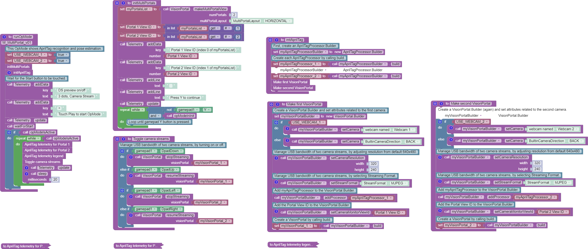
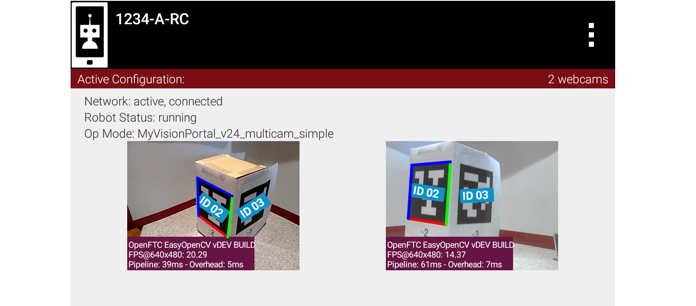

Vision MultiPortal
==================

The SDK can accommodate two portals, each with full features
including :term:`AprilTag` and Color processors, and even switchable cameras. USB
Bandwidth must be considered, especially for :term:`webcams <Webcam>` sharing an external
:term:`USB hub <USB Hub>`.

Viewport ID
~~~~~~~~~~~

Each portal is assigned a ``Viewport ID`` by the Android operating
system. At initialization, the OpMode must **capture** and use these ID
numbers for operating the portals.

Android typically assigns a different Viewport ID number with each run
of an OpMode. If desired, you could observe this by sending Telemetry to
the Driver Station.

The ``makeMultiPortalView()`` Block or method returns a list of Viewport
IDs. Each ID must be extracted from the list, then provided to each
VisionPortal Builder using the ``setCameraMonitorViewId()`` Block or
method.

“Dual cameras” was previously (and still is) available with EasyOpenCV.
Now this is possible within the SDK.

Test OpMode
~~~~~~~~~~~

A sample FTC Blocks OpMode is posted
`here <https://gist.github.com/WestsideRobotics/587b5c74375429ac4a929f690ae40940>`__
to demonstrate AprilTag detections from **two cameras at the same
time**. For a Java version, click ``Export to Java`` in the Blocks
editing window.

Here’s the image of that test OpMode. Careful study will allow a better
understanding of the Blocks and Java methods to create and operate
multiple camera streams at the same time.

Right-click to open image in new browser tab, to magnify on a large PC
screen.

   Example Blocks Multiportal OpMode

On a Control Hub, the OpMode can run two webcams:

- both plugged into a powered USB Hub on the Control Hub's USB 3.0 port
  (recommended, with more restricted USB bandwidth), or
- both plugged in directly to the Control Hub, one per USB port

On an RC phone, it can run the built-in phone camera along with a webcam.

Dual Previews
~~~~~~~~~~~~~

The dual RC previews can be displayed as ``VERTICAL``, or side-by-side
with the enum ``HORIZONTAL``:

   Dual RC Previews

The DS Camera Stream preview can display only one camera’s view (a
`known
characteristic <https://github.com/FIRST-Tech-Challenge/FtcRobotController/issues/585>`__).

USB Bandwidth
~~~~~~~~~~~~~

**USB Bandwidth** is a concern for dual **webcams**; internal phone
cameras have an independent high-speed interconnect (not USB),
unaffected by an added USB webcam.

See the USB bandwidth analysis at the **Managing CPU and Bandwidth**
page.

The two webcams do *not* need to use the same format or resolution. For
the testing mentioned above, the same format and resolution were applied
to a Logitech C920 and a Logitech C270.

External USB Hub
~~~~~~~~~~~~~~~~

Plug both webcams into a **powered external USB Hub**, on the Control
Hub's USB 3.0 port. This is the recommended arrangement. It keeps both
webcams off the USB 2.0 bus, which also carries the Control Hub's **WiFi
radio**, and the hub powers the webcams instead of the Control Hub.

The tradeoff is bandwidth. Both webcams share the 3.0 bus and together
can exceed **USB bandwidth limits** (not quantified here).

Under the legacy **YUY2 format**, one webcam or the other may stop
streaming above roughly 640x360 resolution. This is indicated by no
detections, and a blue screen in RC preview via ``scrcpy``.

Under **MJPEG format**, resolutions under roughly 432x240 may degrade
the image to prevent AprilTag detection on at least 1 webcam, while
higher resolutions may occasionally stop the RC app or crash the Control
Hub.

For both formats, higher resolution reduces frame rate. The **Managing
CPU and Bandwidth** page discusses testing, tradeoffs and optimization.

Control Hub Ports
~~~~~~~~~~~~~~~~~

For dual webcams **plugged directly into the Control Hub**, the USB 2.0
and USB 3.0 ports are on different buses. This reduces the concern about
USB bandwidth capacity, and the choice of stream format has little
impact, although higher resolution causes the auto-optimized frame rate
to reduce (see test data below).

The cost is reliability. The webcam on the USB 2.0 port shares a bus
with the Control Hub's WiFi radio, so :term:`ESD` or other interference
at that webcam can drop the :term:`Driver Station` connection. See
:ref:`USB Port Selection Best Practices <robot_building/best_practices/robot-best-practices:usb port selection best practices>`.

Teams can evaluate these tradeoffs, assisted by the new reporting
feature ``getFps()``, providing Frames Per Second (FPS). It’s available
for Blocks and Java.

====

*Questions, comments and corrections to westsiderobotics@verizon.net*

