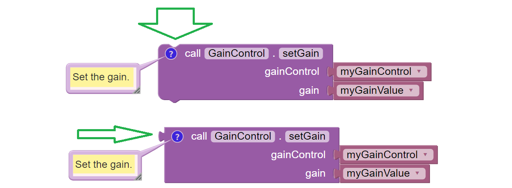
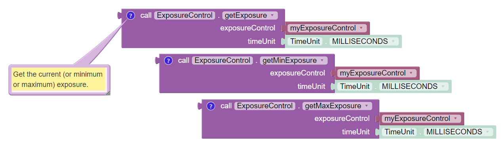
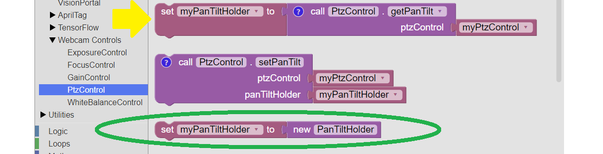

Camera Controls in Blocks
-------------------------

All of the camera controls described in this tutorial are available in :term:`Blocks`,
under **Webcam Controls**. A few Blocks-specific details are worth knowing.

Setter Blocks
~~~~~~~~~~~~~

The **setter Blocks** under Webcam Controls can change/toggle, when
choosing "use return value" or "ignore return value" from each Block's
context (right-click) menu.

   Examples of Setter Blocks with togglable return values

In either form, the setting task **is performed**.

The "non-return" version comment is:

   *Set the gain. Right-click, "use return value" for a Boolean
   indicating success or completion.*

The "plug" version comment is:

   *Set the gain, and return a Boolean indicating success or completion.
   Or right-click, "ignore return value".*

Shared Blocks
~~~~~~~~~~~~~

FTC Blocks offers an arrangement where 3 similar Blocks use a pull-down
list to share a common structure (and common comment):

   Examples of Exposure Blocks with pull-down lists

This is used six places in the Webcam Controls section.

Pan-Tilt Holder
~~~~~~~~~~~~~~~

See this Block with the NEW operator (green oval):

   Examples of Pan/Tilt Blocks

It's **not needed** if the :term:`OpMode` will call ``getPanTilt()`` and assign
it to the variable, as shown above (yellow arrow).

It **is needed** if instead the OpMode will next try to get (or set)
that variable's pan and/or tilt values, or try to pass that variable to
``setPanTiltHolder()``. The values will be zero.
