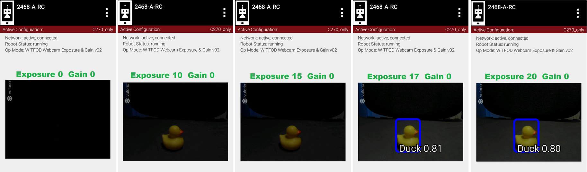
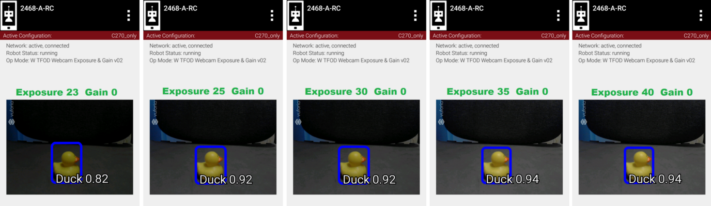
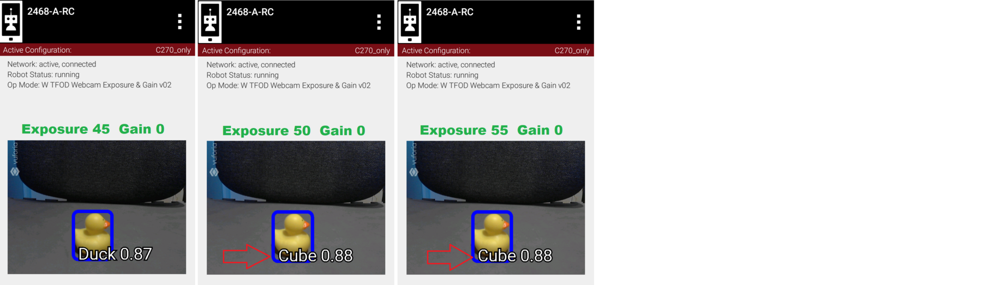
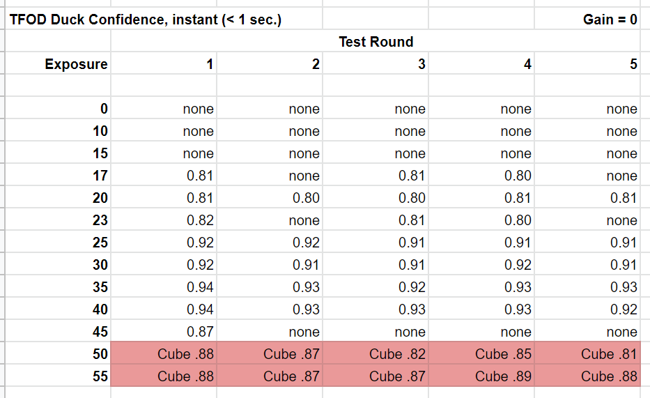

Example 1: Exposure’s effect on recognition
-------------------------------------------

We interrupt this tutorial to demonstrate the two webcam interfaces
described so far: ExposureControl and GainControl.

.. note::
   These measurements were taken with the TensorFlow Object Detection
   (:term:`TFOD`) processor and the Freight Frenzy game elements. TFOD was removed
   from the SDK in 2024, so you cannot reproduce this experiment as written.
   The **pattern** it shows is the point, and it applies just as well to
   today's VisionPortal processors: recognition quality rises with exposure
   or gain, peaks over a fairly narrow band, then falls off sharply.

The question these examples were built to answer: **can the exposure
and/or gain controls improve the chance of a fast, accurate detection?**

Another way to frame this effort is: can these controls simulate the
lighting conditions the processor performs best under? Namely, if the
competition field has different lighting that affects recognition, can
you get back to the performance you tuned for at home?

We first try exposure alone. Setting gain to zero, we recognize the
webcam images at various exposure values.

   Gain 0, Exp 0 -> 20

   Gain 0, Exp 23 - > 40

   Gain 0, Exp 45 -> 55

**Five fresh readings** were taken at each exposure setting. Namely the
test OpMode was opened (INIT) each time for a fresh initialization
and webcam image processing.

This chart shows recognition confidence levels; ‘instant’ is defined here as
recognition within 1 second.

   Five readings at each exposure level

Higher exposure does improve recognition, then performance suddenly
drops. Then at higher levels, the processor begins to “see” the wrong
object entirely. Not good!

So, there does seem to be a range of exposure values that gives better
results. Note the sharp drop-off at both ends of the range: below 25 and
above 40. In engineering, a **robust** solution can withstand variation.
Using a value in the middle of the improved range, can reduce the
effects of unforeseen variation. But this range varies with ambient
lighting conditions, which may be quite different at the tournament
venue.

This data is the result of a very particular combination of: webcam
model (Logitech C270), distance (12 inches), lookdown angle (30
degrees), recognition model, ambient lighting,
background, etc. **Your results will vary, perhaps significantly.**