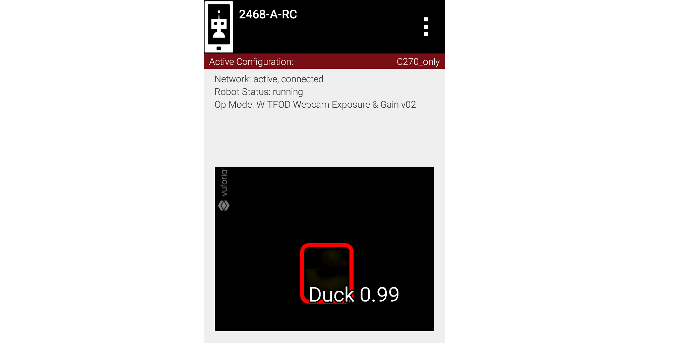

Example 3: An odd preview
-------------------------

   Was this recognition really made in the dark?

How can this be? Answer: this image was not an ‘instant’ result.
Exposure was reduced very low, **after** the object had been recognized.

Vision processors can be much better at **tracking** a currently-identified
object through translation, rotation, partial blockage, and even extreme
changes in exposure, than at making that first recognition. A preview that
looks far too dark to work with may still be good enough to hold a lock the
processor already has.