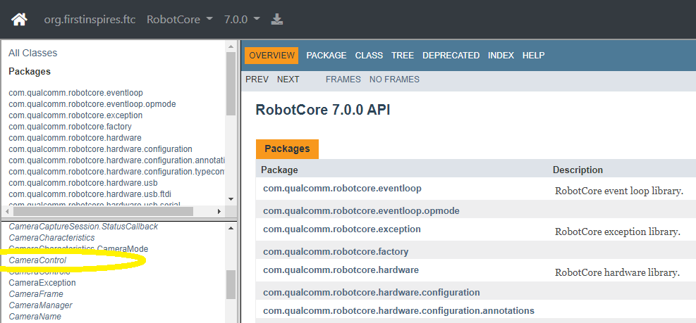

Software Overview
-----------------

The SDK contains a superinterface called CameraControl, which
contains 5 interfaces: 

- :doc:`ExposureControl </apriltag/vision_portal/visionportal_camera_controls/exposure/index>`
- :doc:`GainControl </apriltag/vision_portal/visionportal_camera_controls/gain/index>` 
- :doc:`WhiteBalanceControl </apriltag/vision_portal/visionportal_camera_controls/white_balance/index>`
- :doc:`FocusControl </apriltag/vision_portal/visionportal_camera_controls/focus/index>`
- :doc:`PtzControl </apriltag/vision_portal/visionportal_camera_controls/ptz/index>`

Similar to Java classes, Java interfaces provide methods. A webcam can
be controlled using methods of these 5 interfaces.

PtzControl allows control of 3 related features: virtual pan, tilt and
zoom. ExposureControl also contains a feature called auto-exposure
priority, or AE Priority. Together there are **8 camera controls**
discussed in this tutorial.

The official documentation is found in the `Javadocs <https://javadoc.io/doc/org.firstinspires.ftc>`__. Click the
link for **RobotCore**, then click the **CameraControl** link in the
left column.

   RobotCore Javadoc API

That page provides links to the 5 interfaces listed above.

The methods described here can be used in Android Studio, OnBot Java or
:doc:`Blocks </apriltag/vision_portal/visionportal_camera_controls/blocks/blocks>`.

You will see **VisionPortal** mentioned here, and in the :doc:`sample OpModes
</apriltag/vision_portal/visionportal_camera_controls/samples/samples>`.
**Why VisionPortal?** These controls act on a
camera that is already open and streaming, and in the SDK it's the
VisionPortal that opens the camera and manages its stream. So the Portal is
also where you ask for a control object:

.. code:: java

   myExposureControl = visionPortal.getCameraControl(ExposureControl.class);

A Portal can be built with no vision processor at all, which is enough to
open the camera and show its LiveView preview while you experiment with
these controls.

These CameraControl interfaces allow some control of the webcam, within
requirements or settings of the VisionPortal for its own performance. Such
settings include resolution and frame rate, not covered here.