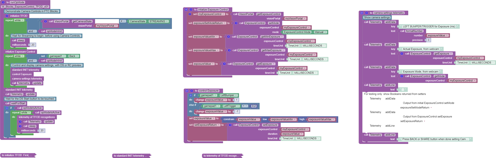

Sample OpModes
--------------

The intent of this tutorial is to describe the available camera
controls, allowing programmers to **develop their own solutions** guided
by the SDK API (Javadoc).

Rather than reproduce sample code here, this page points to the :term:`OpModes <OpMode>` in
the `FtcRobotController repository
<https://github.com/FIRST-Tech-Challenge/FtcRobotController/tree/master/FtcRobotController/src/main/java/org/firstinspires/ftc/robotcontroller/external/samples>`__,
which are maintained alongside the SDK and updated each season. The same
samples are available in Android Studio and OnBot Java, under
``FtcRobotController/external/samples``.

Exposure and Gain
~~~~~~~~~~~~~~~~~

`ConceptAprilTagOptimizeExposure.java
<https://github.com/FIRST-Tech-Challenge/FtcRobotController/blob/master/FtcRobotController/src/main/java/org/firstinspires/ftc/robotcontroller/external/samples/ConceptAprilTagOptimizeExposure.java>`__
is the SDK's camera controls sample. It builds a VisionPortal with an
AprilTag Processor, then asks the Portal for its control objects:

.. code:: java

   ExposureControl myExposureControl = visionPortal.getCameraControl(ExposureControl.class);
   GainControl myGainControl = visionPortal.getCameraControl(GainControl.class);

The gamepad bumpers and triggers raise and lower exposure and gain, while
telemetry reports the tags currently detected. Its goal is to find the
smallest (shortest) exposure that still gives reliable detection, since a
short exposure reduces motion blur while the robot is driving. Start with
the minimum exposure and maximum gain, then slowly increase the exposure
until the tag is detected reliably from the likely operational distance.

The best way to run this optimization is to watch the camera preview while
changing the exposure and gain, as described in
:doc:`Observing Controls </apriltag/vision_portal/visionportal_camera_controls/observing/observing>`.

That sample is also a reasonable starting point for the other controls
described in this tutorial. ``FocusControl``, ``WhiteBalanceControl`` and
``PtzControl`` are all requested from the Portal in exactly the same way.

Focus, White Balance and PTZ
~~~~~~~~~~~~~~~~~~~~~~~~~~~~

The SDK does not ship a sample for these three controls. These Blocks test
OpModes cover them, and can be built in Java by clicking ``Export to Java``
in the Blocks editing interface:

-  `Exposure &
   Gain <https://gist.github.com/WestsideRobotics/a8e32dc2ce31cfc408be65c92bb81826>`__
-  `Focus <https://gist.github.com/WestsideRobotics/d17d06c9e2f152f80a9563109873cb39>`__
-  `Pan, Tilt, Zoom
   (PTZ) <https://gist.github.com/WestsideRobotics/977ba5cfdedf88f7348fbcdad7c8a909>`__
-  `White
   Balance <https://gist.github.com/WestsideRobotics/0cf4f5f9913266be93cb366f54045a24>`__

Another test OpMode is posted
`here <https://gist.github.com/WestsideRobotics/41c004c097ecbf8f96c4e722b8336bd6>`__
and shown below. It uses 7 of the 11 Exposure Control Blocks, omitting 4
unlikely to be used.

The gamepad can raise and lower the webcam's **Exposure value**, while
observing the **live effect** on previews and processor results. This
allows a team to quickly find their preferred Exposure value in that
environment.

   Blocks Exposure OpMode Example
