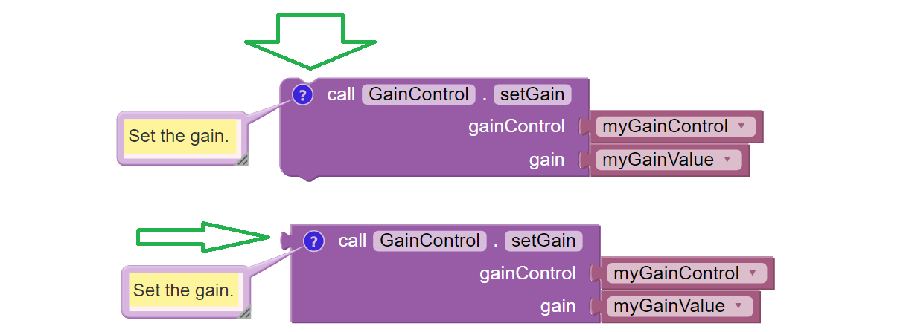

VisionPortal Camera Controls
============================

Clearer camera images can improve AprilTag (and TFOD) vision processing.  The
SDK offers powerful **webcam controls** (Exposure, Gain, Focus, and more),
now available in Blocks! These controls can be applied under various lighting
conditions.

The SDK documentation already provides a `Camera Controls
tutorial <https://ftc-docs.firstinspires.org/en/latest/programming_resources/vision/webcam_controls/webcam-controls.html>`__.
You are encouraged to learn more there.

Note that Exposure and Gain are adjusted together. The new SDK offers
Java Sample OpMode ``ConceptAprilTagOptimizeExposure.java``, which can
be constructed also in FTC Blocks.

Webcam States
~~~~~~~~~~~~~

Camera Controls cannot be used until the webcam has reached the state
``CAMERA_DEVICE_READY``.

Under the new FTC VisionPortal these camera states are now available: 

- OPENING_CAMERA_DEVICE 
- CAMERA_DEVICE_READY 
- STARTING_STREAM 
- STREAMING 
- STOPPING_STREAM 
- CLOSING_CAMERA_DEVICE 
- CAMERA_DEVICE_CLOSED 
- ERROR

These **enums** are listed in sequence, as if opening a camera (fresh
build), then starting or resuming streaming, then stopping streaming,
then closing the camera.

Notes and Guidelines for Enums
~~~~~~~~~~~~~~~~~~~~~~~~~~~~~~

- ``OPENING_CAMERA_DEVICE`` - no vision processing is happening

- ``CAMERA_DEVICE_READY`` - Camera is open. No processing is happening,
  including background processing from EOCV (i.e. pulling frames and
  performing color conversion). Ready to call ``resumeStreaming()``

- ``STARTING_STREAM`` - no processing is happening

- ``STREAMING`` - Frames are available for processing (AprilTag and/or
  TFOD recognitions) and preview (RC preview and DS Camera Stream)

- ``STOPPING_STREAM`` - processing may or may not be happening. This
  status is followed by ``CAMERA_DEVICE_READY``.

- ``CLOSING_CAMERA_DEVICE`` - no processing is happening

- ``CAMERA_DEVICE_CLOSED`` - nothing is running, USB comms are closed.
  Once closed, don’t open camera again during this OpMode.

Observing Controls
~~~~~~~~~~~~~~~~~~

Teams wanting to optimize AprilTag or TFOD recognitions with Camera Controls
should consider using ``scrcpy`` here:

- https://github.com/Genymobile/scrcpy 

or an HDMI monitor. Optimizing via DS Camera Stream will be less effective and
less efficient.

DS Camera Stream shows the same images as ``scrcpy``, namely with Exposure and
Gain affecting recognitions. But the image is a snapshot only, and adjustments
cannot be made in real time, with gamepads disabled during Camera Stream.

Control Ranges
~~~~~~~~~~~~~~

Each webcam model has its own level of support for Camera Controls.

The Logitech C920 supports all the control features offered by the 
SDK; many webcams don’t. More info is at
`ftc-docs <https://ftc-docs.firstinspires.org/en/latest/programming_resources/vision/webcam_controls/webcam-controls.html>`__.

For example, here are control ranges reported by the Logitech C920: 

- Exposure 0 to 204 ms 
- Gain 0 to 255 
- White Balance 2000 to 6500 (often defaults to 2000) 
- Focus 0 to 250, usual default 0 (infinite) 
- Pan and Tilt +/- 36,000, default (0,0) 
- Zoom 100 to 500, but no effect after about 250

Note that Camera Control Zoom affects both AprilTag and TFOD, while TFOD Zoom
affects only TFOD recognitions.

Camera Control zoom (PTZ) will affect the camera calibration, thus
significantly affecting the **pose estimation**. TFOD zoom will not affect
pose.

Also: 

- AprilTag detections are not affected by camera or object orientation 
- TFOD recognitions are affected by camera or object orientation

Setter Blocks
~~~~~~~~~~~~~

The **setter Blocks** under Webcam Controls can now change/toggle, when
choosing “use return value” or “ignore return value” from each Block’s
context (right-click) menu.

   Examples of Setter Blocks with togglable return values

In either form, the setting task **is performed**.

The “non-return” version comment is:

   *Set the gain. Right-click, “use return value” for a Boolean
   indicating success or completion.*

The “plug” version comment is:

   *Set the gain, and return a Boolean indicating success or completion.
   Or right-click, “ignore return value”.*

Gain and Exposure
~~~~~~~~~~~~~~~~~

Autoexposure mode manages both gain and exposure.

Gain can be adjusted only if ExposureControl Mode is set to MANUAL (not
the default).

The old `Camera Controls
tutorial <https://ftc-docs.firstinspires.org/en/latest/programming_resources/vision/webcam_controls/webcam-controls.html>`__
says:

   *Gain can be managed in coordination with exposure.*

Actually, in the SDK, Gain **must** be managed with Exposure.

Shared Blocks
~~~~~~~~~~~~~

FTC Blocks offers an arrangement where 3 similar Blocks use a pull-down
list to share a common structure (and common comment):

.. figure:: images/020-Blocks-dropdown.png
   :width: 75%
   :align: center
   :alt: Blocks Dropdown

.. figure:: images/030-Blocks-getExposure.png
   :width: 75%
   :align: center
   :alt: Blocks Exposure
   
   Examples of Exposure Blocks with pull-down lists

This is used six places in the Webcam Controls section.

Pan-Tilt Holder
~~~~~~~~~~~~~~~

See this Block with the NEW operator (green oval):

   
   Examples of Pan/Tilt Blocks

It’s **not needed** if the OpMode will call ``getPanTilt()`` and assign
it to the variable, as shown above (yellow arrow).

It **is needed** if instead the OpMode will next try to get (or set)
that variable’s pan and/or tilt values, or try to pass that variable to
``setPanTiltHolder()``. The values will be zero.

Gain and Exposure Test OpMode
~~~~~~~~~~~~~~~~~~~~~~~~~~~~~

The SDK offers a built-in test OpMode to optimize Gain and Exposure.
See the Sample Java Sample called
``ConceptAprilTagOptimizeExposure.java``.

From its introduction notes:

   *This OpMode determines the best Exposure for minimizing image
   motion-blur on a webcam. Note that it is not possible to control the
   exposure for a Phone Camera, so if you are using a Phone for the
   Robot Controller this OpMode/Feature only applies to an externally
   connected Webcam.*

   *The goal is to determine the smallest (shortest) Exposure value that
   still provides reliable Tag Detection. Starting with the minimum
   Exposure and maximum Gain, the exposure is slowly increased until the
   Tag is detected reliably from the likely operational distance.*

   *The best way to run this optimization is to view the camera preview
   screen while changing the exposure and gain.*

   *To do this, you need to view the RobotController screen directly (not
   from Driver Station) This can be done directly from a RC phone screen
   (if you are using an external Webcam), but for a Control Hub you must
   either plug an HDMI monitor into the Control Hub HDMI port, or use an
   external viewer program like scrcpy (https://scrcpy.org/)*

Other Test OpModes
~~~~~~~~~~~~~~~~~~

As an alternate, Camera Controls can be tested using these Blocks
OpModes:

-  `Exposure &
   Gain <https://gist.github.com/WestsideRobotics/a8e32dc2ce31cfc408be65c92bb81826>`__
-  `Focus <https://gist.github.com/WestsideRobotics/d17d06c9e2f152f80a9563109873cb39>`__
-  `Pan, Tilt, Zoom
   (PTZ) <https://gist.github.com/WestsideRobotics/977ba5cfdedf88f7348fbcdad7c8a909>`__
-  `White
   Balance <https://gist.github.com/WestsideRobotics/0cf4f5f9913266be93cb366f54045a24>`__

For Java versions, click ``Export to Java`` at the Blocks editing
interface.

Another test OpMode is posted
`here <https://gist.github.com/WestsideRobotics/41c004c097ecbf8f96c4e722b8336bd6>`__
and shown below. It uses 7 of the 11 Exposure Control Blocks, omitting 4
unlikely to be used.

The gamepad can raise and lower the webcam’s **Exposure value**, while
observing the **live effect** on previews and TFOD recognitions. This
allows a team to quickly find their preferred Exposure value in that
environment.

.. figure:: images/050-Blocks-Exposure-OpMode.png
   :width: 75%
   :align: center
   :alt: Blocks Exposure OpMode Example
   
   Blocks Exposure OpMode Example

====

*Questions, comments and corrections to westsiderobotics@verizon.net*

