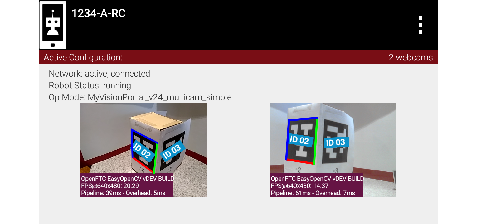
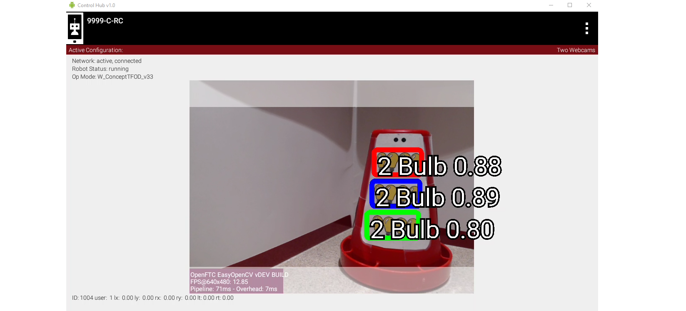
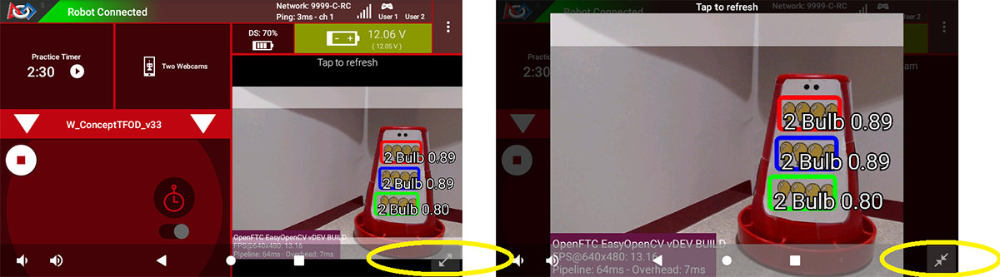

VisionPortal Previews
=====================

Introduction
------------

Managing AprilTag and TFOD performance is greatly enhanced with visual
feedback of the camera’s view.

   LiveView demonstrating multiple camera support

The Driver Station and Robot Controller apps offer a camera preview on both devices:

-  **LiveView** on Robot Controller (RC) device – RC phone or Control
   Hub (see below)

-  **Camera Stream** on Driver Station (DS) device – DS phone or Driver
   Hub

LiveView refers only to the **Robot Controller** preview (example shown above).
It’s completely separate from **DS Camera Stream**, which still operates
normally even if LiveView is stopped (manually or automatically).

Instructions for viewing DS Camera Stream are shown at
`ftc-docs <https://ftc-docs.firstinspires.org/en/latest/hardware_and_software_configuration/configuring/configuring_external_webcam/configuring-external-webcam.html#image-preview>`__.

Camera Stream uses its own frame collection process, which naturally still
requires the camera/pipeline status to be ``STREAMING``. Disabling the stream
will prevent the DS preview. Camera status is covered at the **Managing CPU and
Bandwidth** page, and the **VisionPort Camera Controls** page.

Side Note: For SDK 8.2, “LiveView” became the new universal name for the
RC preview. There remain two instances of old names: 

- ``myVisionPortalBuilder.enableCameraMonitoring(true);`` 
- ``VIEWPORT`` appears in the preview status window, when stopped

LiveView on Control Hub
-----------------------

The Control Hub does generate an RC preview, despite not having a
built-in screen. LiveView can be seen in two ways:

-  Plug an HDMI monitor into the Control Hub’s (full-size) HDMI port

-  Use ``scrcpy`` (pronounced “screen copy”), available here:

   - https://github.com/Genymobile/scrcpy

Camera Controls
---------------

Images in LiveView and Camera Stream are both affected by Camera
Controls, for webcam. Changing values of Exposure and Gain, for example,
do affect the displayed image and the actual recognitions.

During Camera Stream, manual adjustments to Camera Controls cannot be
made in real time (with visible feedback) since gamepads are disabled.

Thus teams wanting to optimize AprilTag or TFOD recognitions with Camera
Controls should use ``scrcpy`` or an HDMI monitor. Doing this via Camera
Stream (“back and forth”) will be less effective and less efficient.

More information is available at the **VisionPortal Camera Controls** page, and
at the `Webcam Control tutorial
<https://ftc-docs.firstinspires.org/en/latest/programming_resources/vision/webcam_controls/webcam-controls.html>`__.

Aspect Ratios in Previews
-------------------------

Here’s a Control Hub’s LiveView (via ``scrcpy``) of TFOD recognitions:

   LiveView demonstrating Grey Bands from Aspect Ratio mismatch

The **greyed bands** at top and bottom are from the **mismatch of aspect
ratios**:

-  4:3 for camera (640x480)

-  16:9 for TFOD (per model training)

Both of these ratios are set as defaults, hidden from the user in some
Sample OpModes. Only the non-greyed region is eligible for TFOD
recognitions.

Note that the TFOD annotations (text) extend beyond the image.

BIG Previews
------------

A new feature of SDK 8.2, the Driver Station’s **Camera Stream** preview
can appear regular-size or **BIG**.

   Camera Stream preview enlargement buttons

**Circled in yellow** are the user buttons to **go BIG** or return to
the **default** screen.

Note the annotations have shifted to fit in the image.

Orientation Notes
-----------------

With SDK 8.2, the default image orientation is **SENSOR_NATIVE**.

This Java **enum** SENSOR_NATIVE means that the processing pipeline is
getting the image in the native orientation of the camera sensor.
Namely, no rotation is performed. Note that (former) enum UPRIGHT for a
webcam is the same as SENSOR_NATIVE, while for a phone camera, (former)
enum SIDEWAYS_LEFT is the same as SENSOR_NATIVE.

SENSOR_NATIVE is ideal because the overhead of rotating the image stream
is rather high.

Note that viewing the video stream from the same orientation as the
statistics text box will show you the orientation of the stream passed
to the AprilTag and/or TFOD processors.

Also note that for RC phone cameras, the LiveView preview is rotated
(independent of rotation enum) such that the preview is the way you
“expect” as if you were to open the camera app on the phone. That
rotation happens during the GPU-accelerated rendering of the bitmap and
is significantly easier on resources.

====

*Questions, comments and corrections to westsiderobotics@verizon.net*

