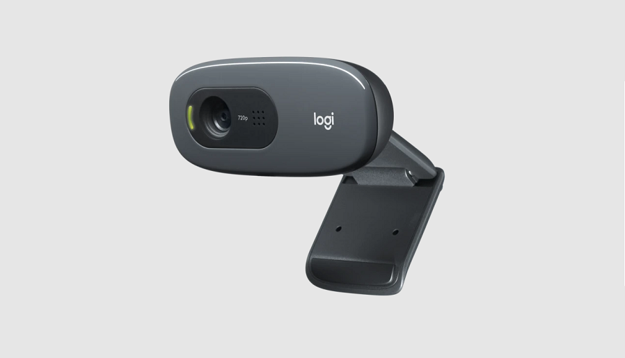
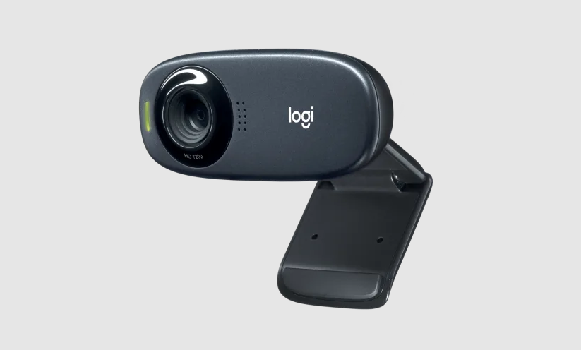
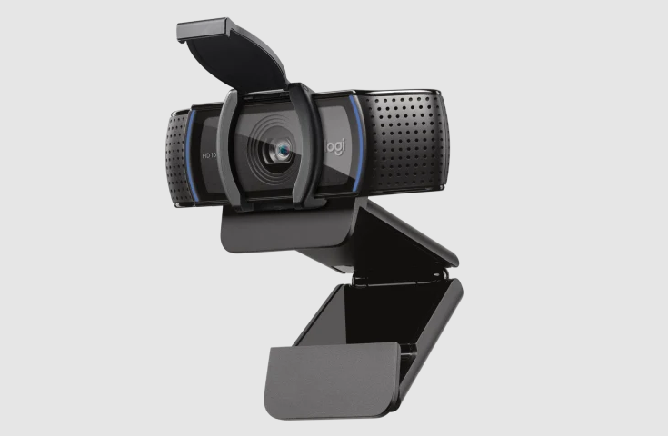
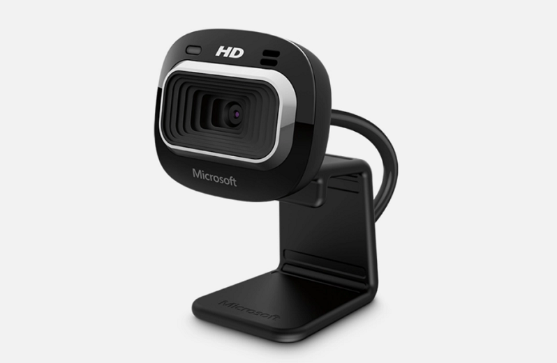
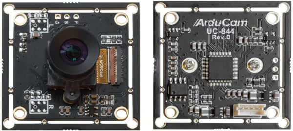

Webcams for Vision Portal
=========================

This is a short list of common webcams that are known to work with the
:ref:`FTC VisionPortal <apriltag/vision_portal/visionportal_overview/visionportal-overview:visionportal overview>`
and the 
:ref:`FTC Camera Controls <apriltag/vision_portal/visionportal_camera_controls/visionportal-camera-controls:visionportal camera controls>`.

VisionPortal is a comprehensive new interface for FTC vision processing,
including AprilTag and TensorFlow Object Detection (TFOD).

Many more webcams can work with the FTC VisionPortal; this is a short
list of models with built-in calibrations suitable for AprilTag 
:ref:`pose estimation <apriltag/vision_portal/apriltag_pose/apriltag-pose:aprilTag pose>`.

Logitech C270
-------------

   Logitech C270 Camera

The `Logitech C270 <https://www.logitech.com/en-us/products/webcams/c270-hd-webcam.960-000694.html>`__
is available at the FIRST Storefront for new FTC teams, and at many
online retailers.

**FTC Hot Take:**

* The Logitech C270 is Logitech's budget line of webcams. It is incredibly
  inexpensive, and fairly reliable. The C270 is the workhorse webcam for 
  *FIRST* Tech Challenge.
* The Logitech C270 has a 60-degree field of view, and a maximum frame rate of
  30fps at 720p which makes it a reasonable choice for vision processing.
* The audio quality of the C270 is lackluster, but audio is not generally a
  factor in *FIRST* Tech Challenge.

**Supported Resolutions:** 160x120, 176x144, 320x176, 320x240, 352x288,
432x240, 544x288, 640x360, 640x480, 752x416, 800x448, 800x600, 864x480,
960x544, 960x720, 1024x576, 1184x656, 1280x720

The FTC SDK provides **built-in calibration values** for the FTC
VisionPortal default resolution of 640x480, and no others. Learn more at
:ref:`AprilTag Camera Calibration <apriltag/vision_portal/apriltag_camera_calibration/apriltag-camera-calibration:apriltag camera calibration>`.

Logitech C310
-------------

   Logitech C310 Camera

The `Logitech C310 <https://www.logitech.com/en-us/products/webcams/c310-hd-webcam.960-000585.html>`__
is available at some online retailers.

**FTC Hot Take:**

* The Logitech C310 is also in Logitech's budget line of webcams. It is
  slightly more expensive than the C270, and is a marginal step up. 
* Like the C270, the Logitech C310 has a 60-degree field of view, and a maximum
  frame rate of 30fps at 720p which makes it a reasonable choice for vision
  processing.
* The C310 has slightly better color correction and dynamic color range than 
  the C270, but these likely won't be realized without using the webcam control
  interface provided by the FTC SDK.
* The audio quality of the C310 is slightly better than the C270, but again
  audio is not generally a factor in *FIRST* Tech Challenge.

**Supported Resolutions:** not published; probably similar to Logitech C270.

The FTC SDK provides **built-in calibration values** for the FTC
VisionPortal default resolution of 640x480, and for 640x360. Learn more at
:ref:`AprilTag Camera Calibration <apriltag/vision_portal/apriltag_camera_calibration/apriltag-camera-calibration:apriltag camera calibration>`.

Logitech C920
-------------

   Logitech C920 Camera

The `Logitech C920 <https://www.logitech.com/en-us/products/webcams/c920s-pro-hd-webcam.960-001257.html>`__
is available at many online retailers.

**FTC Hot Take:**

* The Logitech C920 is in Logitech's mid-range line of webcams. It is
  slightly more expensive than the C310, but is a dramatic step-up in quality.
  If you find a C310 for almost the same price as a C920, just buy the C920.
* The Logitech C920 has a 78-degree field of view, and a maximum
  frame rate of 60fps at 1080p which makes it a fabulous choice for vision
  processing. The C920 also includes an auto-focus option, whereas the 
  C270 and C310 are fixed-focus, though the auto-focus tends to be slow.
* The C920 has additional options for mounting the camera, with a 1/4 inch
  threaded mount. The C920 also has a much better mounting clip.
* The audio quality of the the C920 is phenomenally better than the C270, or 
  C310, but again audio is not generally a factor in *FIRST* Tech Challenge.

**Supported Resolutions:** 160x90, 160x120, 176x144, 320x180, 320x240,
352x288, 432x240, 640x360, 640x480, 800x448, 800x600, 864x480, 960x720,
1024x576, 1280x720, 1600x896, 1920x1080, 2304x1296, 2304x1536.

The FTC SDK provides **built-in calibration values** for the FTC
VisionPortal default resolution of 640x480, and five others: 640x360,
800x448, 800x600, 864x480, and 1920x1080. Learn more at
:ref:`AprilTag Camera Calibration <apriltag/vision_portal/apriltag_camera_calibration/apriltag-camera-calibration:apriltag camera calibration>`.

Microsoft LifeCam HD-3000 v1/v2
-------------------------------

   Microsoft LifeCam HD-3000 v1/v2

The `Microsoft LifeCam HD-3000 <https://www.microsoft.com/en/accessories/products/webcams/lifecam-hd-3000>`__
is available at some online retailers.

**FTC Hot Take:**

* The Microsoft LifeCam HD-3000 has been a mainstay in *FIRST* Robotics
  Competition for a number of years, so it's likely a local team might have
  one they will just give you. The HD-3000 has been around for over 10 years,
  with a "don't fix what isn't broken" mentality. It defines the "budget" 
  part of Microsoft's "budget" line of webcams.
* The HD-3000 sports a 68.5 degree field of view, slightly wider than the
  Logitech C270 and C310 webcams, at 30fps at 720p (same as the others).
* The HD-3000 is as "no-frills" as it gets otherwise, but at its price
  point that shouldn't be much of a surprise.

**Supported Resolutions:** not published; up to 1280x720.

For v1 and v2 of this webcam, the FTC SDK provides **built-in
calibration values** for the FTC VisionPortal default resolution of
640x480, and no others. Learn more at
:ref:`AprilTag Camera Calibration <apriltag/vision_portal/apriltag_camera_calibration/apriltag-camera-calibration:apriltag camera calibration>`.

Other Webcams
-------------

Many other webcams are available online, with and without published `UVC
compatibility <https://en.wikipedia.org/wiki/List_of_USB_video_class_devices>`__.
The FTC SDK supports **only** UVC compatible webcams. Many modern
webcams are UVC compatible without specifically advertising it; often
indicated by “no drivers needed”.

In general, other webcams (not listed above) will require user-provided
:ref:`Camera Calibration Values <apriltag/vision_portal/apriltag_camera_calibration/apriltag-camera-calibration:apriltag camera calibration>`.
for AprilTag 
:ref:`pose estimation <apriltag/vision_portal/apriltag_pose/apriltag-pose:apriltag pose>`.

A digital camera opens its shutter to allow light (“the image”) to reach
the detector’s array of small sensors (pixels). (Webcam shutters are
typically electronic, not mechanical.) Most webcams use a **“rolling
shutter”**, where the the image data is read **one pixel row at a
time**.

Another type of webcam, called **“global shutter”**, reads all pixels at
the same time. This can help when the webcam (robot) is moving fast.
Teams are encouraged to research the characteristics of rolling shutter
vs. global shutter.

One difference is that many global shutter cameras use a compressed
video format called **MJPEG**. This saves bandwidth, to offset a higher
frame rate (frames per second or FPS). The FTC VisionPortal uses a
default (uncompressed) video format called **YUY2**, but does allow
specifying MJPEG.

Below is one example of a global shutter webcam, tested to work with the
FTC VisionPortal.

Arducam Global Shutter 120 FPS
^^^^^^^^^^^^^^^^^^^^^^^^^^^^^^

   Arducam GS 120 Camera

The `Arducam Global Shutter 120
FPS <https://www.arducam.com/product/arducam-120fps-global-shutter-usb-camera-board-1mp-720p-ov9281-uvc-webcam-module-with-low-distortion-m12-lens-without-microphones-for-computer-laptop-android-device-and-raspberry-pi/>`__
is available at some online retailers, including
`Amazon <https://www.amazon.com/Arducam-Distortion-Microphones-Computer-Raspberry/dp/B096M5DKY6>`__.

**FTC Hot Take:**

* The Arducam OV9281 Global Shutter camera can pump out 100+fps in MJPG mode at
  full resolution, with phenomenal resistance to motion blur effects (due to
  the Global Shutter design). 
* The Arducam OV9281 is a monochrome (black&white) camera, so applications
  needing color should look elsewhere.
* The Arducam OV9281 is fantastic in low-light scenarios, and has a very 
  low-distortion lens making it perfect for object tracking and motion detection.
* The Arducam required a patch to EasyOpenCV to work properly, so it is not
  guaranteed to work properly with the FTC SDK prior to SDK 9.0.

**Supported Resolutions** in YUY2 format: 1280x720, 1280x800. Note frame
rate limitations.

**Supported Resolutions** in MJPEG format: 320x240, 640x480, 800x600,
1280x720, 1280x800.

The FTC SDK provides **no** built-in calibration values for this webcam.
Learn more at
:ref:`AprilTag Camera Calibration <apriltag/vision_portal/apriltag_camera_calibration/apriltag-camera-calibration:apriltag camera calibration>`.

Other Global Shutter Cameras
^^^^^^^^^^^^^^^^^^^^^^^^^^^^

Two other tested global shutter webcams (offering different resolutions
than the Arducam) are from

* `Kayeton <https://www.aliexpress.us/item/3256804287066234.html>`__ 
* `ELP <https://www.aliexpress.us/item/2251832829079715.html>`__ 

both of these are available from AliExpress and other online retailers.

Quick Summary
-------------

This below table summarizes the most common and known-supported cameras with
the *FIRST* Tech Challenge SDK, including resolutions with built-in
calibrations and those without calibrations.

.. list-table:: Cameras and Supported Resolutions
   :widths: 25 25 25 25
   :header-rows: 1

   * - Camera
     - Features
     - Resolutions with Built-In Calibrations
     - Resolutions without Calibrations
   * - `Logitech C270`_
     - 60 DegFOV, 30fps\@720p
     - 640x480
     - 160x120, 176x144, 320x176, 320x240, 352x288, 432x240, 544x288, 640x360, 752x416, 800x448, 800x600, 864x480, 960x544, 960x720, 1024x576, 1184x656, 1280x720
   * - `Logitech C310`_
     - 60 DegFOV, 30fps\@720p
     - 640x480, 640x360
     - All other resolutions
   * - `Logitech C920`_
     - 78 DegFOV, 60fps\@1080p
     - 640x480, 640x360, 800x448, 800x600, 864x480, 1920x1080
     - 160x90, 160x120, 176x144, 320x180, 320x240, 352x288, 432x240, 960x720, 1024x576, 1280x720, 1600x896, 2304x1296, 2304x1536
   * - `Microsoft LifeCam HD-3000 v1/v2`_
     - 68.5 DegFOV, 30fps\@720p
     - 640x480
     - All other resolutions
   * - `Arducam Global Shutter 120 FPS`_
     - 70 DegFOV, 120fps\@1280x800 MJPG, Monochrome
     - No Built-In Calibrations
     - MJPEG: 320x240, 640x480, 800x600, 1280x720, 1280x800; YUY2: 1280x720, 1280x800
   * - Kayeton Global Shutter (`Other Global Shutter Cameras`_)
     - 70 DegFOV, 120fps\@720p MJPG, Monochrome
     - No Built-In Calibrations
     - All resolutions
   * - ELP Global Shutter (`Other Global Shutter Cameras`_)
     - 70 DegFOV, 90fps\@1920x1200 MJPG, Monochrome
     - No Built-In Calibrations
     - All resolutions

============

Questions, comments and corrections to westsiderobotics@verizon.net
