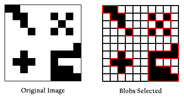
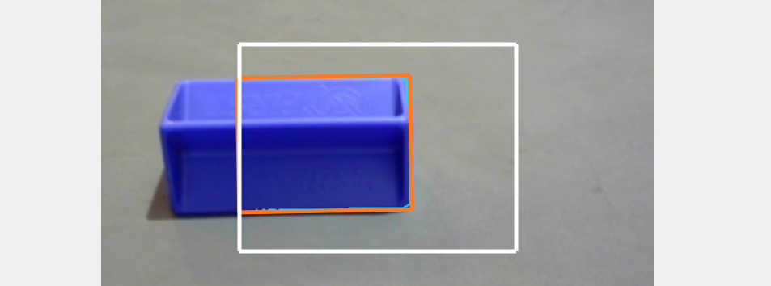
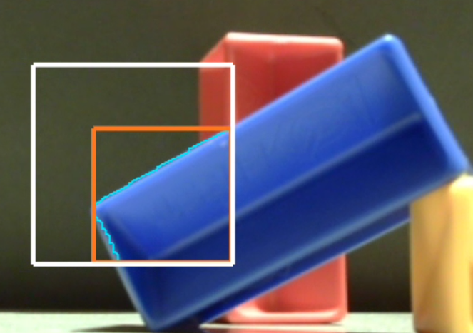
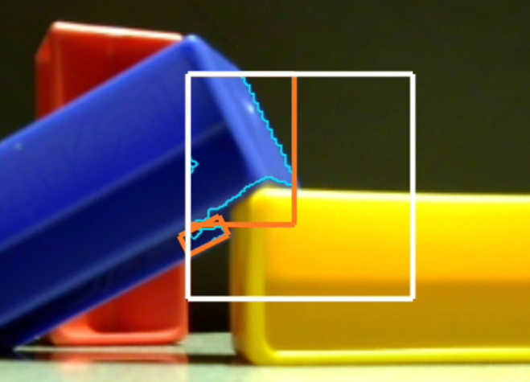
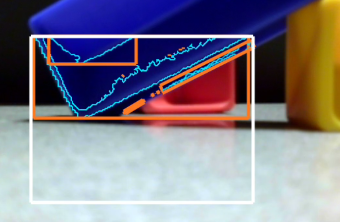

Color Blob Concepts
===================

Color Blobs
-----------

An image can be evaluated by its **groupings of similar colors**.

The smallest unit of any digital image is a **pixel**: a tiny square of one
particular color.

Each grouping or cluster of similar-colored pixels is called a **Blob**, which
can be irregular in size and shape.

Forming a Blob is done automatically by the software.  It seeks pixels of
similar color that are **contiguous** -- touching each other along an edge, not
just at a corner.  

   Blob Formation Visualization

There are 9 Blobs here, not 4.  Some are very small, just one pixel each.

The 5 pixels at top right, for example, are not contiguous (edges joined), so
they are not joined to form a larger Blob.

The above simple example has only 2 colors: black and white.  For FTC, the
definition of "similar" colors is a range specified by you.

.. figure:: images/20-Blobs-red-chair.png
   :width: 75%
   :align: center
   :alt: Defining Blobs from an image of a red chair

   Blobs from a Red Chair image

In the above example, the chair surfaces are not **exactly** the same shade of
red.  But with a **target** definition "close to red" or "mostly red", the
software can form reasonable Blobs for further processing.

Color Processing
----------------

Now let's point the camera at an INTO THE DEEP game element called a
**Sample**.

   Blobs from a Blue SAMPLE

Here the software was told to seek shades of blue.  The orange rectangle
encloses a Blob of blue color.

But why doesn't the rectangle enclose the entire game piece?  The software is
processing only a certain **Region of Interest** or ROI.  That's the white
rectangle; its size and location are specified by you.

Anything outside the ROI will not be considered part of any Blob that is
detected.  This can help you avoid detecting (unwanted) background objects.

In the example above, the Blob was actually outlined in teal (blue-green
color), very hard to see.  Let's try another image:

   Teal Outline of Blue Blob

Now the teal outline of the blue Blob can be seen.  Its shape is irregular,
which can be difficult for your OpMode to evaluate.

boxFit Rectangles
-----------------

The orange rectangle is drawn automatically by OpenCV, to give your OpMode a
simpler geometric shape that represents the Blob.  It's not **exactly** like
the actual Blob, but hopefully still useful.

The orange rectangle, called the **boxFit**, fits tightly around the extreme
edges of the Blob.  The boxFit is **not** required to stay inside the Region of
Interest.  In the above case, the best-fitting rectangle happens to stay inside
the ROI.

But here's another case:

.. figure:: images/50-Blobs-tilted.png
   :width: 75%
   :align: center
   :alt: Showing Boxfit and Outline

   New ROI position

Look very closely for the teal outline of the Blob, with its very rough lower
edge.

Here, the best-fitting rectangle (boxFit) is **tilted**, and is not contained
inside the ROI.

OpenCV provides all data for the boxFit, including its corner points, size, and
tilt angle.  It can even provide a fitted horizontal version of the boxFit
rectangle, if you prefer not to handle a tilted boxFit.

Now things get a bit more complicated:

   Detecting two blobs

OpenCV detected **two Blobs**, each with a teal outline and each with a boxFit.

Your OpMode will need to "decide" which boxFit is important and which to
ignore.  Fortunately, OpenCV provides tools to **filter out** certain unwanted
results.  After filtering, your OpMode can **sort** the remaining results, to
focus on the highest priority.

With these tools, your OpMode could handle even a "busy" result like this one:

   Many Blob Detections

Your programming tasks will include:

* determine which boxFit is most relevant,
* evaluate its data, and
* take robot action accordingly.

Now try the Sample OpMode for the :doc:`Color Locator <../color-locator-discover/color-locator-discover>` processor.

============

*Questions, comments and corrections to westsiderobotics@verizon.net*
