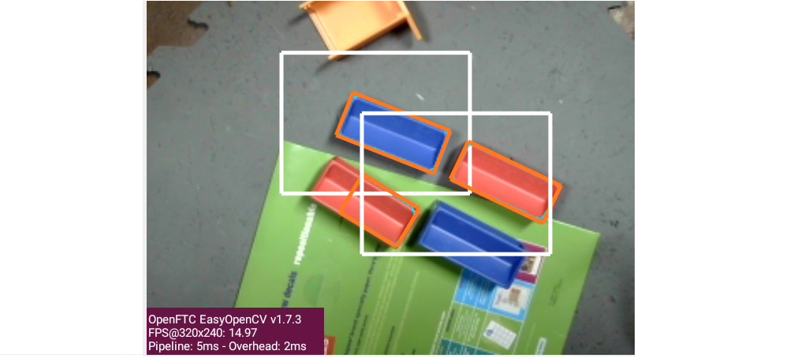

Color Locator (Challenge)
=========================

Overview
--------

This **Challenge** page introduces Color Locator settings that were **not mentioned in the Sample OpMode**.  It assumes you have already followed this tutorial's previous pages:

* :doc:`Discover <../color-locator-discover/color-locator-discover>` page, to open and test the Sample OpMode
* :doc:`Explore <../color-locator-explore/color-locator-explore>` page, to edit settings mentioned in the Sample OpMode

Here are the additional ColorLocator settings covered in this page:

* pre-filtering, affecting Blob results and previews
* pre-sorting
* custom outline colors in the previews: ROI, contour, boxFit
* access a boxFit's corner points
* access all vertices of a contour
* access a boxFit's size and tilt angle
* create a horizonal rectangle around a tilted boxFit
* access the horizontal rectangle's size and location

Pre-Filter Intro
----------------

Here the term "pre-" means the filter criteria are implemented **before** the
Blob formation results are passed further.  Thus the DS and RC previews will
**not display** any filtered-out contour or its boxFit.  This can save CPU
resources used to draw the outlines.

Likewise the resulting list of results will not include any filtered-out Blobs.
A shorter list can help OpMode cycle time.

This contrasts with the post-filtering present in the Sample OpMode and
discussed at this tutorial's Explore page.  Pre-filtering is a setting that
persists, while post-filtering is a one-time action performed on a single set
of processing results.

Teams may wish to use both.  Use a pre-filter to "clean up" the preview, which
can appear chaotic with potentially dozens of Blobs.   Then use a post-filter
to focus on the particular boxFit results of interest.

Caution: changing the ROI size and/or changing the camera resolution may
require an adjustment to filtering by Area.

Pre-Filter Programming
----------------------

To apply a filter setting, use two steps:

* **set** the filter name and criteria
* **add** that filter to the existing Processor

The "Color Blob Locator" Processor must already be created; adding a filter is
**not** part of the Builder pattern here.  A pre-filter can be added before or
after the VisionPortal is built.

In general, a pre-filter setting remains in place and cannot be edited.  To
"change" a pre-filter, it must be **removed** from the Processor, then
**added** again.

Recall from this tutorial's :doc:`Explore
<../color-locator-explore/color-locator-explore>` page, to edit settings
mentioned in the Sample OpMode that filtering can be done by Contour Area, Blob
Density and boxFit Aspect Ratio.

Multiple pre-filters can operate at the same time.  A single common filter name
**could** be used, if its criteria are defined, then added -- then redefined,
and added again, etc.

You might find it more versatile and convenient to create unique filter names,
each separately managed (i.e. set criteria, add, remove, add again).

Select and read the Blocks **or** Java section below:

.. tab-set::
   .. tab-item:: Blocks
      :sync: blocks

      These pre-filter Blocks are in the Vision/ColorBlobLocator/Pre-processing toolbox:

      .. figure:: images/10-set-pre-filter.png
         :width: 75%
         :align: center
         :alt: Setting a pre-filter

         Setting a pre-filter

      The Blocks in the toolbox use the same variable name ``myFilter`` (green
      arrow) for the three available criteria (orange ovals).  As noted above,
      be careful about using a single name for different pre-filters.

      For multiple pre-filters, you might prefer unique names; see the orange arrows:

      .. figure:: images/12-set-3-filters.png
         :width: 75%
         :align: center
         :alt: Setting 3 filters

         Setting 3 filters

      These Blocks for adding and removing filters are in the
      Vision/ColorBlobLocator/Processor toolbox:

      .. figure:: images/15-add-filter.png
         :width: 75%
         :align: center
         :alt: Adding and Removing a filter

         Adding and Removing a filter

      Be careful to designate the correct filter to be added or removed; see
      the green arrows.

   .. tab-item:: Java
      :sync: java

      For multiple pre-filters, you might prefer unique names:

      .. code-block:: java

         myAreaFilter = new BlobFilter(BlobCriteria.BY_CONTOUR_AREA, 100, 20000);
         myDensityFilter = new BlobFilter(BlobCriteria.BY_DENSITY, 0.5, 1.0);
         myRatioFilter = new BlobFilter(BlobCriteria.BY_ASPECT_RATIO, 1.0, 10.0);

      After defining a filter's criteria, add the filter to an already-existing
      Processor:

      .. code-block:: java

         colorLocator.addFilter(myAreaFilter);
         colorLocator.addFilter(myDensityFilter);
         colorLocator.addFilter(myRatioFilter);

      These methods can remove one or all filters from a Processor:

      .. code-block:: java

         colorLocator.removeFilter(myAreaFilter);
         colorLocator.removeFilter(myDensityFilter);
         colorLocator.removeFilter(myRatioFilter);
         colorLocator.removeAllFilters();

      After removal, a filter can be re-added to the Processor.

Pre-sort
--------

Here the term "pre-" also means the sort criteria are already established, and
applied to the results of the Blob formation process.

This works the same as the post-sorting mentioned in the Sample OpMode and
discussed at this tutorial's Explore page.  Pre-sorting is a setting that
persists, while post-sorting is a one-time action performed on a single set of
processing results.

Only one sort (the last one applied) affects the final list of results provided
for the OpMode to evaluate.  Thus there is no benefit to using both pre-sort
and post-sort.

To apply a sort, use two steps:

* define the sort name and criteria
* apply that sort to the existing Processor

The "Color Blob Locator" Processor must already be created; adding a sort is
**not** part of the Builder pattern here.  A pre-sort can be added before or
after the VisionPortal is built.

In general, a pre-sort setting remains in place and cannot be removed or
edited.  To "change" a sort, simply define and apply another one, with the same
or a unique name.  The later ``setSort()`` will be in effect.

Reminder from this tutorial's :doc:`Explore
<../color-locator-explore/color-locator-explore>` page: by default, the Sample
OpMode sorts by **Contour Area** in descending order (largest is first).  This
is an internally programmed sort, not appearing in the Sample OpMode.  This
default is overridden or replaced by any pre-sort or post-sort specified in the
OpMode.

Select and read the Blocks **or** Java section below:

.. tab-set::
   .. tab-item:: Blocks
      :sync: blocks

      These pre-sort Blocks are in the Vision/ColorBlobLocator/Pre-processing
      toolbox:

      .. figure:: images/20-sort-criteria.png
         :width: 75%
         :align: center
         :alt: Selecting the Sort Criteria

         Selecting the Sort Criteria

      This Block for applying the named pre-sort is in the
      Vision/ColorBlobLocator/Processor toolbox:

      .. figure:: images/23-set-sort.png
         :width: 75%
         :align: center
         :alt: Setting the Sort Criteria

         Setting the Sort Criteria

   .. tab-item:: Java
      :sync: java

      A generic pre-sort name works well, since only one sort can be in effect
      at a time:

      .. code-block:: java

         mySort = new BlobSort(BlobCriteria.BY_CONTOUR_AREA, SortOrder.ASCENDING);

      If you are experimenting with different pre-sort criteria, you might
      consider unique names:

      .. code-block:: java

         myAreaSort = new BlobSort(BlobCriteria.BY_CONTOUR_AREA, SortOrder.ASCENDING);
         myDensitySort = new BlobSort(BlobCriteria.BY_DENSITY, SortOrder.ASCENDING);
         myRatioSort = new BlobSort(BlobCriteria.BY_ASPECT_RATIO, SortOrder.ASCENDING);

      After defining a sort's criteria, apply the pre-sort to an
      already-existing Processor:

      .. code-block:: java

         colorLocator.setSort(mySort);

Preview Colors
--------------

You can specify custom colors for the preview outlines of:

* Region of Interest (ROI)
* Blob contour
* boxFit rectangle

Select and read the Blocks **or** Java section below:

.. tab-set::
   .. tab-item:: Blocks
      :sync: blocks

      .. figure:: images/30-outline-colors.png
         :width: 75%
         :align: center
         :alt: Setting Custom outline colors

         Setting custom outline colors

   .. tab-item:: Java
      :sync: java

      Import the ``Color`` class if needed, then add any of the ``.set...``
      methods to the Processor Builder pattern:

      .. code-block:: java

         import android.graphics.Color;
         .
         .
         .setBoxFitColor(Color.rgb(255, 120, 31))
         .setRoiColor(Color.rgb(255, 255, 255))
         .setContourColor(Color.rgb(3, 227, 252))

      Use your own custom values, only from the RGB Color Space.  See the
      separate tutorial page called **Color Spaces**.

boxFit Corners
--------------

An OpMode can access the four corner points of a boxFit rectangle.

Select and read the Blocks **or** Java section below:

.. tab-set::
   .. tab-item:: Blocks
      :sync: blocks

      This Blocks Function retrieves, stores and displays the 4 corner points
      of the instant boxFit being processed by the OpMode:

      .. figure:: images/40-corners.png
         :width: 75%
         :align: center
         :alt: Displaying Corner Points via Telemetry

         Displaying Corner Points via Telemetry

      The ``.points`` and ``Point.x`` and ``Point.y`` Blocks are in the
      "Vision/ColorBlobLocator/Blob data" toolbox.

      The Function uses its own **For Loop** to cycle through the ``myPoints``
      List of 4 points, clockwise from top left corner.

      This Function operates inside the Sample OpMode's **For Loop** of all
      Blob results.  The instant ``myBoxFit`` is the one being processed,
      returned from the preceding ``.BoxFit`` Block.

   .. tab-item:: Java
      :sync: java

      This Java code retrieves, stores and displays the 4 corner points of the
      instant boxFit being processed by the OpMode:

      .. code-block:: java

         // Display boxFit.points(), an array of the box's four (X, Y) corner points,
         // clockwise from top left corner.
         Point[] myBoxCorners = new Point[4];
         boxFit.points(myBoxCorners);
         // this points() method does not return values, it populates the argument
         for (int i = 0; i < 4; i++) 
         {
             telemetry.addLine(String.format("boxFit corner %d (%d,%d)",
             i, (int) myBoxCorners[i].x, (int) myBoxCorners[i].y));
         }

      This code operates inside the Sample OpMode's **For Loop** of all Blob
      results.  The instant ``boxFit`` is the one being processed, returned
      from the preceding ``getBoxFit()`` method.

Contour Vertices
----------------

Blob contours are irregular and hard to process in code; it's easier to work
with boxFit rectangles.

But the contour's outer points can be accessed by an OpMode.  The result is a
list of (X, Y) coordinates, with origin at the top left corner of the camera's
image. X increases to the right, Y increases downward.

Select and read the Blocks **or** Java section below:

.. tab-set::
   .. tab-item:: Blocks
      :sync: blocks

      The following Blocks Function retrieves, stores and displays a List of
      all the vertex Points of the contour of the instant Blob being processed
      by the OpMode.

      The List can be as short as 4 values, or dozens of values for jagged
      contours.

      Note that the ``.points`` Block (used above for boxFit corners) retrieves
      and stores the List within the same Block. This ``.ContourPoints`` Block
      only retrieves the List, to be assigned to a separate variable Block.

      .. figure:: images/50-contour.png
         :width: 75%
         :align: center
         :alt: Getting list of contour points

         Getting the list of contour points

      The ``.ContourPoints`` and ``Point.x`` and ``Point.y`` Blocks are in the
      "Vision/ColorBlobLocator/Blob data" toolbox.

      The Function uses its own **For Loop** to cycle through the
      ``myContourPoints`` List, of undetermined length (could be very long).

      This Function operates inside the Sample OpMode's **For Loop** of all
      Blob results.  The instant ``myBlob`` is the one being processed by that
      outer For Loop.

   .. tab-item:: Java
      :sync: java

      This Java code retrieves, stores and displays a List of all the vertex
      Points of the contour of the instant Blob being processed by the OpMode.

      .. code-block:: java

         import org.opencv.core.Point;
         .
         .
         // Display getContourPoints(), an array of the contour's many (X, Y) vertices 
         Point[] myContourPoints;
         myContourPoints = b.getContourPoints();
         int j = 0;
         for(Point thisContourPoint : myContourPoints)
         {
             telemetry.addLine(String.format("contour vertex %d (%d,%d)",
                   j, (int) thisContourPoint.x, (int) thisContourPoint.y));
                   j += 1;
         }

      This Function operates inside the Sample OpMode's **For Loop** of all
      Blob results.  The instant Blob ``b`` is the one being processed by that
      outer For Loop.

      Not covered here is one feature available in Java only:

      .. code-block:: java

         MatOfPoint myContour = getContour()

      This method returns a matrix unique to the OpenCV library.  The matrix
      object can convert itself to an array, as follows:

      .. code-block:: java

         MatOfPoint myContour;
         Point[] myContourPoints;
         myContour = b.getContour();
         myContourPoints = myContour.toArray();

      This code seems to give the same set of points as ``getContourPoints()``
      shown above.

boxFit Size and Angle
---------------------

These simple fields were not demonstrated in the Sample OpMode.

The boxFit size variable contains two fields which must be accessed
individually, as shown below.

If the boxFit is horizontal (parallel to the ROI), its angle might be 0 or 90
degrees, often jumping between the two values.  At 90 degrees, height and width
become switched.  Your OpMode code needs to account for this scenario.

Likewise, the boxFit angle is sometimes reported as clockwise from vertical,
rather than counterclockwise from horizontal.  More discussion is `here
<https://namkeenman.wordpress.com/2015/12/18/open-cv-determine-angle-of-rotatedrect-minarearect/>`_.

Select and read the Blocks **or** Java section below:

.. tab-set::
   .. tab-item:: Blocks
      :sync: blocks

      These Blocks are in the "Vision/ColorBlobLocator/Blob data" toolbox.

      .. figure:: images/60-box-size.png
         :width: 75%
         :align: center
         :alt: boxFit properties

         boxFit properties

   .. tab-item:: Java
      :sync: java
 
      Here's a modified version of the Sample OpMode's telemetry code, to
      display only the size and angle of the instant boxFit being processed.

      .. code-block:: java

         org.opencv.core.Size myBoxFitSize;
         for(ColorBlobLocatorProcessor.Blob b : blobs)
         {
                      RotatedRect boxFit = b.getBoxFit();
                      myBoxFitSize = boxFit.size;
                      telemetry.addData("width", myBoxFitSize.width);
                      telemetry.addData("height", myBoxFitSize.height);
                      telemetry.addData("angle", boxfit.angle);
         }

      The Java class ``Size`` here is different than another class of the same
      simple name.  OnBot Java and Android Studio do not allow imports of
      identical simple classnames.

      In fact OnBot Java will not allow the import of this version, even if the
      other version (`android.util.Size`) is not used in the OpMode.
      Instead, declare the variable with the full classname, as shown in the
      first line above.

Horizontal Rectangle
--------------------

You might prefer to process only **horizontal** best-fit rectangles, parallel
to the ROI, not tilted.

OpenCV can generate a best-fit rectangle for a boxFit, whether tilted or not.
This is **not** a "forced horizonal" boxFit, rotated in place.  The new
horizontal rectangle simply touches and encloses the outer corners of the
boxFit.

If the boxFit is tilted, the new horizontal rectangle will be larger.  If the
boxFit already had an angle of 0 (or 90) degrees, the new rectangle will be
identical.

In Blocks and Java, the command ``boundingRect()`` accepts a boxFit of type
``RotatedRect`` and returns a horizontal rectangle of type ``Rect``.  The new
rectangle is not drawn or depicted in the preview.

Select and read the Blocks **or** Java section below:

.. tab-set::
   .. tab-item:: Blocks
      :sync: blocks

      These Blocks are in the "Vision/ColorBlobLocator/Blob data" toolbox.

      .. figure:: images/70-horizontal-box.png
         :width: 75%
         :align: center
         :alt: Defining the horizontal box

         Defining the horizontal box

      The (X, Y) values are the top left corner of the new horizontal
      rectangle, in the full image reference frame.

   .. tab-item:: Java
      :sync: java

      Here's a modified version of the Sample OpMode's telemetry code, to
      display only the **top left corner** and **size** of the horizontal
      rectangle around the boxFit being processed.

      .. code-block:: java

         import org.opencv.core.Rect;
         .
         .
         for(ColorBlobLocatorProcessor.Blob b : blobs)
         {
                         RotatedRect boxFit = b.getBoxFit();
                         Rect myHorizontalBoxFit = boxFit.boundingRect();
                         telemetry.addData("top left X", myHorizontalBoxFit.x);
                         telemetry.addData("top left Y", myHorizontalBoxFit.y);
                         telemetry.addData("width", myHorizontalBoxFit.width);
                         telemetry.addData("height", myHorizontalBoxFit.height);
         }

      In this case, OnBot Java and Android Studio found no conflicts with the
      import of class ``Rect``.

      Pay attention to classes and fields:

      * boxFit is of Java type ``RotatedRect``, even though it's not usually rotated
      * the new method ``boundingRect()`` returns an object of type ``Rect``
      * the ``Size`` and ``Rect`` classes both have fields named ``height`` and ``width``

Advanced Development
--------------------

Searching for multiple colors is possible by building **multiple processors**
and adding them to the same VisionPortal. This allows different ROIs, for
example, that can overlap if desired.

   Using two processors

The next ColorLocator page called :doc:`Round Color Blobs <../color-locator-round-blobs/color-locator-round-blobs>` 
covers detection of round objects.

============

*Questions, comments and corrections to westsiderobotics@verizon.net*

