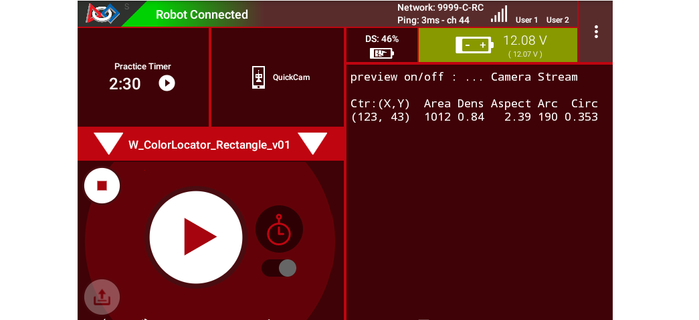
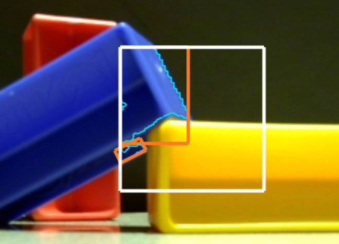
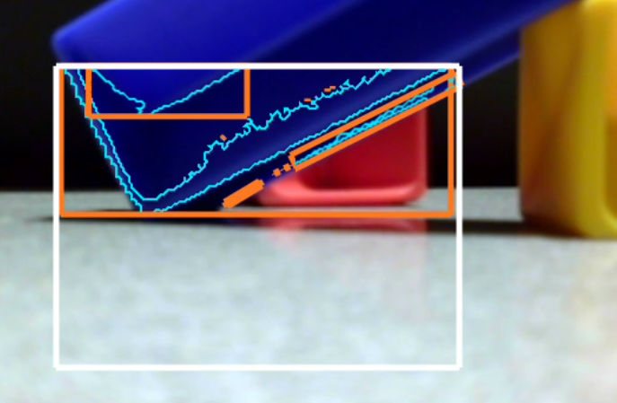
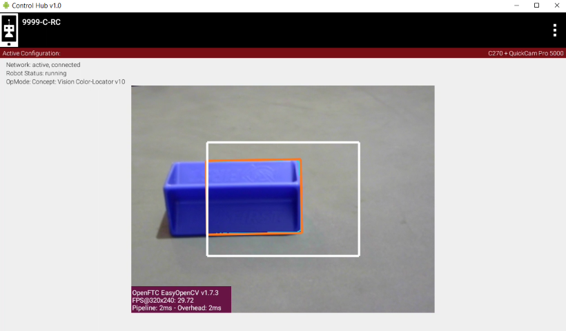

Color Locator (Discover)
========================

Overview
--------

Another way to use FTC's new OpenCV vision tools is to operate a "Color
Locator".  Namely, it can **find a target color that you specify**.

As with the Color Sensor tool, you can specify a **Region of Interest** (ROI).
Only that zone of the camera's view will be searched for the target color.

The "target color" is actually a **range** of numerical color values, for a
better chance of finding the desired color.

OpenCV will form **"Blobs"** of that color.  As described in the Concepts page
here, a Blob is a contiguous cluster of similar-colored pixels.

Blobs often have a complex, irregular shape or **contour**, so they are
represented here by a best-fit rectangle called **"boxFit"**.

   Zoomed Color Blob detection

The target color here is BLUE.  The white rectangle is the Region of Interest
(ROI), the teal jagged line is the Blob's contour (fully inside the ROI), and
the purple rectangle is the boxFit.

The software reports the size, position and orientation of each "boxFit".  That
data can be evaluated by your OpMode for **robot navigation** and other
actions.

The following sections describe how to do this, with a Sample OpMode.

Configuration
-------------

*Skip this section if ...*

* *the active robot configuration already contains "Webcam 1",* or
* *using the built-in camera of an Android phone as Robot Controller.*

Before starting the programming, REV Control Hub users should make a robot
configuration that includes the USB webcam to be used as a color locator.

For now, use the default webcam name, "Webcam 1".  If a different name is
preferred, edit the Sample OpMode to agree with the exact webcam name in the
robot configuration.

**Save and activate** that configuration; its name should appear on the paired
Driver Station screen.

Sample OpMode
-------------

Opening the Sample OpMode
+++++++++++++++++++++++++

To learn about opening the Sample OpMode, select and read the Blocks **or**
Java section below:

.. tab-set::
   .. tab-item:: Blocks
      :sync: blocks

      1. On a laptop or desktop computer connected via Wi-Fi to the Robot
         Controller, open the Chrome browser.  Go to the REV Control
         Hub's address http://192.168.43.1:8080 (or
         http://192.168.49.1:8080 for Android RC phone) and click the
         Blocks tab.

      2. Click ``Create New OpMode``\ , enter a new name such as
         "ColorLocator_Monica_v01", and select the Sample OpMode
         ``ConceptVisionColorLocator``.

      3. At the top of the Blocks screen, you can change the type from "TeleOp"
         to "Autonomous", since this Sample OpMode does not use gamepads.

      4. If using the built-in camera of an RC phone, drag out the relevant
         Block from the left-side ``VisionPortal.Builder`` toolbox.

      5. Save the OpMode, time to try it!

   .. tab-item:: Java
      :sync: java

      1. Open your choice of OnBot Java or Android Studio.

      2. In the ``teamcode`` folder, add/create a new OpMode with a name such
         as "ColorLocator_Javier_v01.java", and select the Sample OpMode
         ``ConceptVisionColorLocator.java``.

      3. At about Line 63, you can change ``@TeleOp`` to ``@Autonomous``\ ,
         since this Sample OpMode does not use gamepads.

      4. If using the built-in camera of an RC phone, follow the OpMode
         comments to specify that camera.

      5. Click "Build", time to try it!

Running the Sample OpMode
+++++++++++++++++++++++++

1. On the Driver Station, select the Autonomous OpMode that you just saved or
   built.

2. Turn off the automatic 30-second match timer (green slider).  Aim the camera
   at a **blue object**.

3. Touch INIT only.  The OpMode should give Telemetry showing the results of
   one or more Blobs:

   Basic Telemetry

In this example, the Region of Interest (ROI) contains only one Blob of the
default target color BLUE.

Move the camera around, especially at BLUE objects, and watch the Telemetry
area on the Driver Station screen.  It may sometimes show more lines of Blob
data, and sometimes show no Blob data at all.

It's working!  Your camera is working as a **color locator**.  Think about how
to use this in the FTC Robot Game.

*Skip the next two sections, if you already know how to use FTC previews.*

DS Preview
----------

Before describing the telemetry data, this page offers two sections showing how
to view the OpenCV results with **previews**.  Previewing is essential for
working with vision code.

On the Driver Station (DS), remain in INIT -- don't touch the Start button.

At the top right corner, touch the 3-dots menu, then ``Camera Stream``.  This
shows the camera's view; tap the image to refresh it.

.. figure:: images/30-CameraStream.png
   :align: center
   :width: 75%
   :alt: DS Camera Stream Preview

   DS Camera Stream Preview

The default target color here is BLUE.  The white rectangle is the Region of
Interest (ROI), the teal (light blue) jagged line is the Blob's contour (fully
inside the ROI), and the orange rectangle is the boxFit.

For a BIG preview, touch the arrows at the bottom right corner.

Or, select Camera Stream again, to return to the previous screen and its
Telemetry.

RC Preview
----------

The Robot Controller (RC) device also makes a preview, called ``LiveView``.
This is full video, and is shown automatically on the screen of an RC phone.

.. figure:: images/32-LiveView.png
   :align: center
   :width: 75%
   :alt: Image of a LiveView stream

   LiveView stream

The above preview is from a REV Control Hub.

It has no physical screen, so you must plug in an HDMI monitor **or** use
open-source `scrcpy <https://github.com/Genymobile/scrcpy>`_ (called
"screen copy") to see the preview on a laptop or computer that's connected via
Wi-Fi to the Control Hub.

Basic Telemetry Data
--------------------

Let's look closer at the DS telemetry:

.. figure:: images/35-basic-telemetry-circled.png
   :align: center
   :width: 75%
   :alt: Image of telemetry output

   Locator Telemetry

In this example, the Region of Interest (ROI) contains only one Blob of the
default target color BLUE.  You could probably move your camera to achieve the
same result - with the help of previews.

The **first column** shows the **Area**, in pixels, of the Blob (contour, not
boxFit).  By default, the Sample OpMode uses a **filter** to show Blobs between
50 and 20,000 pixels.  Also by default, the Sample uses a **sort** tool to
display multiple Blobs in descending order of Area (largest is first).

The **second column** shows the **Density** of the Blob contour.  From the
Sample comments:

..

    *A blob's density is an indication of how "full" the contour is.  If you put
    a rubber band around the contour you would get the "Convex Hull" of the
    contour.  The density is the ratio of Contour-area to Convex Hull-area.*

The **third column** shows the **Aspect Ratio of the boxFit**, the best-fit
rectangle around the contour:

..

    *A blob's Aspect Ratio is the ratio of boxFit long side to short side.  A
    perfect Square has an Aspect Ratio of 1.  All others are > 1.*

.. tip::
   The boxFit is not required to stay inside the ROI.  Also the boxFit may be
   **tilted** at some angle, namely not horizontal.  This will be discussed
   more in a later page.

The **fourth column** shows the (X, Y) position of the **Center** of the boxFit
rectangle.  With the origin at the full image's top left corner, X increases to
the right and Y increases downward.

Blob Formation
--------------

So far these examples have shown a **single Blob** formed by OpenCV:

   Single blob discovery

But OpenCV can form and return **multiple Blobs** in a single set of results:

   Two blob discovery

Without controls, OpenCV can easily form a **high number of Blobs** (at least
12 here):

   Multiple blob discovery

And as mentioned above, some of those Blobs might have a **boxFit tilted** at
some angle:

.. figure:: images/49-tilted-box.png
   :align: center
   :width: 50%
   :alt: Tilted Boxfit

   Tilted Boxfit

This tutorial's **next two pages** show how to manage these scenarios by
**editing the OpMode's default settings**, and **accessing more OpenCV
features** not covered in the Sample OpMode.

Using boxFit Data for Position
------------------------------

A team's Autonomous code can evaluate boxFit data to navigate or guide the
robot on the field.

Imagine your camera is on the robot, looking forward.  **Underneath the
camera** is your **intake mechanism**, perhaps a top grabber, sideways claw
or spinner.

   Game piece targeting

OpenCV will report the data for this orange boxFit.  Could your code use this
data to **position the robot** directly in front of the game piece, for a
better chance to collect it?

How would you do it?

Using boxFit Data for Manipulation
----------------------------------

For advanced teams: imagine your webcam is on a grabber arm, looking down into
the Submersible (from INTO THE DEEP).

   Targeting in clutter

Could the data from this boxFit (orange rectangle) help you **grab only the
Blue Sample**\ ?

Could this help in Autonomous **and** TeleOp?

More Documentation
------------------

This tutorial's next page called :doc:`Explore <../color-locator-explore/color-locator-explore>` covers
**editing the OpMode's existing default settings**.

After that, the following page called :doc:`Challenge
<../color-locator-challenge/color-locator-challenge>` shows how to **access
more OpenCV features** not covered in the Sample OpMode.

============

*Questions, comments and corrections to westsiderobotics@verizon.net*
