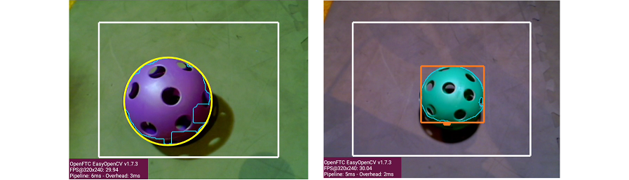
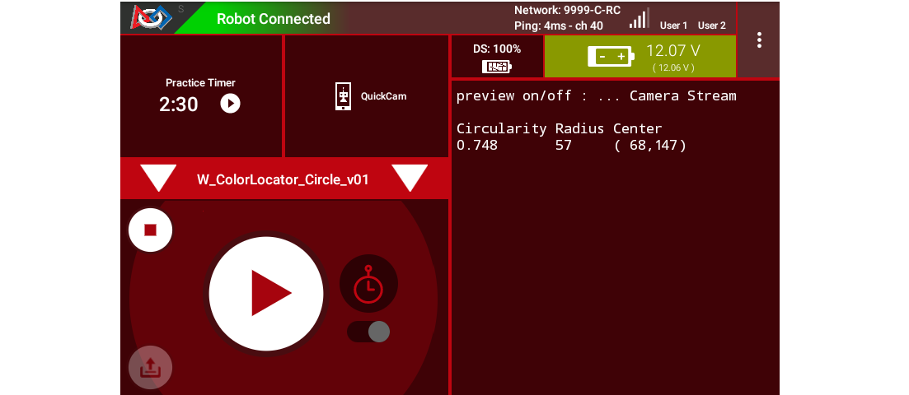
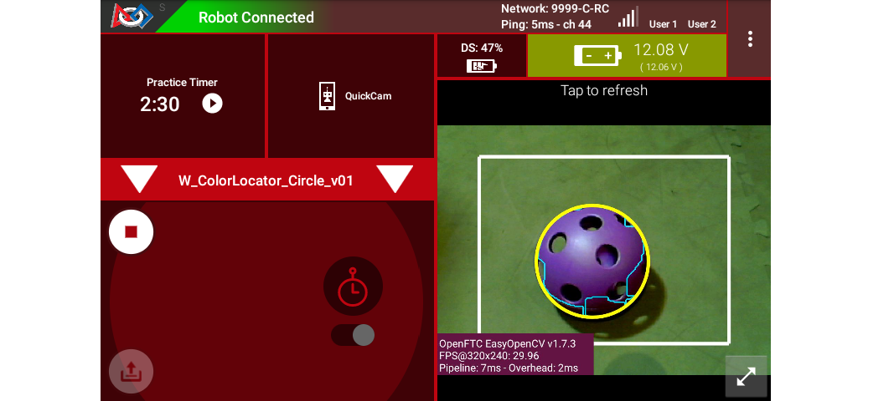
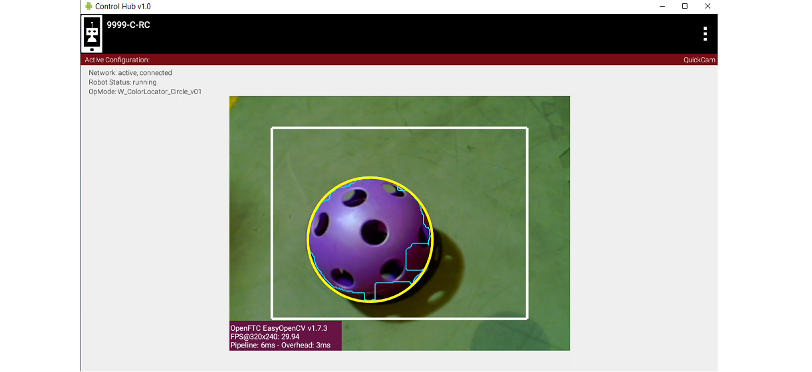
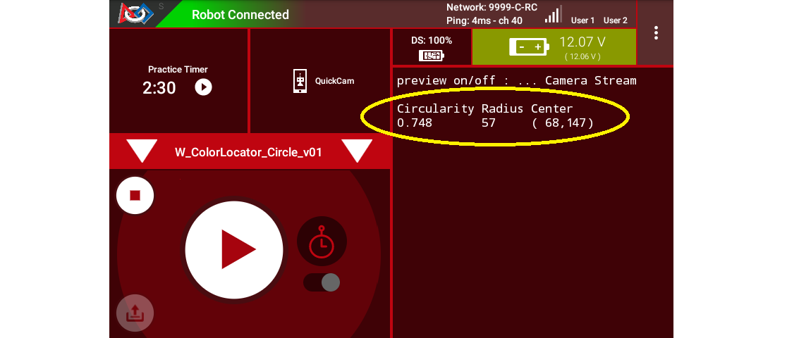
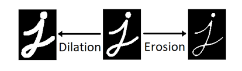
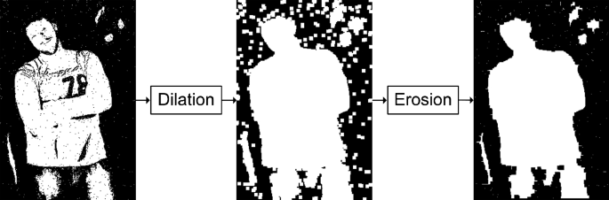
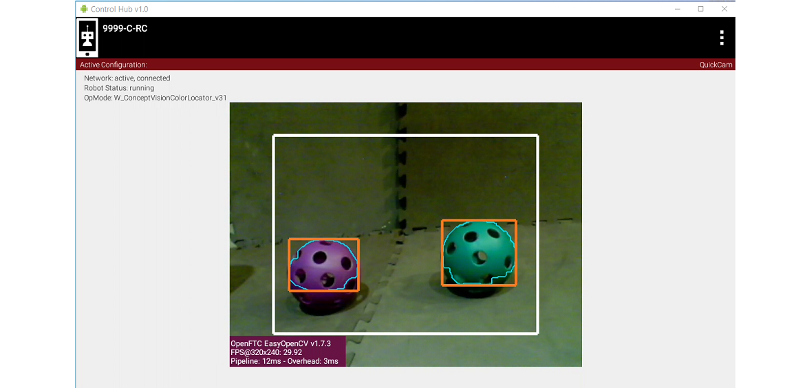

Color Locator (Round Blobs)
===========================

Overview
--------

FTC's "Color Locator" now offers a best-fit circle called ``circleFit``, an alternate to the best-fit rectangle ("boxFit") described in previous sections of this tutorial.

   circleFit versus boxFit detection

This page describes the new Sample OpMode called ``ConceptVisionColorLocator_Circle``, in FTC Blocks and Java.  These notes assume familiarity with the original Sample OpMode, now called ``ConceptVisionColorLocator_Rectangle``.

The new ``_Circle`` Sample uses these settings for convenient processing of DECODE Artifacts:

* increase Erode and Dilate areas from 5 to 15 pixels
* change order of Erode and Dilate
* draw ``circleFit`` preview
* Telemetry shows only Circularity, Radius and Center

As an alternate, the ``_Rectangle`` Sample OpMode can still be used and modified to process objects of any shape, including round balls, with access to the same attributes.

Quick Start
-----------

.. note:: 
   This and other steps here were previously described in detail, starting with the page called :doc:`Color Locator - Discover <../color-locator-discover/color-locator-discover>`.

#. In FTC Blocks or Java, create a new Autonomous OpMode from the Sample ``ConceptVisionColorLocator_Circle``.
#. On the Driver Station, select the OpMode that you just saved or built.
#. Turn off the automatic 30-second match timer (green slider).  Aim the camera at a DECODE **Purple Artifact**\ , or a picture of one.
#. Touch INIT only. The OpMode should give Telemetry showing the results of one or more Blobs:

   Circle Fit Telemetry from ``ConceptVisionColorLocator_Circle`` sample

In this example, Telemetry reports only one Blob in the Region of Interest (ROI), of the default target color ARTIFACT_PURPLE.

.. note:: 
   The Sample OpModes `_Circle` and `_Rectangle` also offer the custom color ARTIFACT_GREEN.

Move the camera around, and watch the Telemetry area on the Driver Station screen.  It may sometimes show more lines of Blob data, and sometimes show no Blob data at all.

It's working!  Your camera is working as a **color locator**.  Think about how to use this in the DECODE game.

DS and RC Previews
------------------

Before studying the telemetry data more closely (below), make sure you can see the **previews** of the OpenCV results.  Previewing is essential for working with vision code.

The Driver Station (DS) "snapshot" preview is available at the ``Camera Stream`` menu choice, with the OpMode in INIT.

   Driver Station Camera Stream Image showing a successful Circle Fit 

The Robot Controller (RC) device makes a video preview called ``LiveView``. For a REV Control Hub, this video can be seen on an HDMI monitor **or** with open-source `scrcpy <https://github.com/Genymobile/scrcpy>`_ (called "screen copy"):

   Robot Controller `LiveView` showing a successful Circle Fit 

For both previews, the **white rectangle** is the Region of Interest (ROI), and the thin **green jagged line** is the Blob's contour (fully inside the ROI).

The **yellow circle** is the new ``circleFit`` : the smallest circle that encloses the contour.  The ``circleFit`` is not required to stay inside the ROI.

Basic Telemetry Data
--------------------

Here again is some DS telemetry from the new ``_Circle`` Sample:

   Driver Station Telemetry Data from ``_Circle`` sample

The **first column** shows the **Circularity** of the Blob contour (not its circleFit).  This is calculated from the Blob's area and perimeter.  A higher value, closer to 1, indicates a more circular contour.

The **second column** shows the circleFit's **Radius** , an indicator of size.  Again, the circleFit is not required to stay inside the ROI.

The **third column** shows the (X, Y) position of the circleFit's **Center**.  With the origin at the full image's top left corner, X increases to the right and Y increases downward.

The Blob's **Area** is available but not displayed here.  The Sample OpMode uses a **filter** to show Blobs with area between 50 and 20,000 pixels.  Another filter shows Blobs with circularity greater than 0.6.  Filters can be customized, as described in the Sample's comments.

For multiple Blobs, the Sample lists Telemetry using only the built-in default **sort by area** (largest is first).  Other sorting choices are available, described in the Sample's comments.

The Blob's **Density** is also available but not displayed here.  From the Sample's comments:

.. tip::
    A blob's density is an indication of how "full" the contour is.  If you put a rubber band around the contour you would get the "Convex Hull" of the contour.  The density is the ratio of Contour-area to Convex Hull-area.

Using CircleFit Data
--------------------

A team's Autonomous code can evaluate circleFit data to navigate or guide the robot on the field.

The **circleFit Radius** (indicating size) can help estimate the **distance** from the camera lens to the Artifact.  Calibrate this at your home field, based on the known physical size of an Artifact.

.. tip::
   Fortunately, a round ball gives no complications of **perspective**, like the tapered image of a rectangular object.  An unobstructed, well-lit Artifact can reliably appear as a circle.

The **circleFit Center (X, Y)** can help estimate the Artifact's **position** relative to the camera on the robot.  Calibrate this at your home field, based on known test locations and distances.

With these estimates of distance and position, the robot can be programmed to approach and collect the Artifact, or perhaps navigate elsewhere on the field.

Manage the Previews
-------------------

The FTC SDK handles the two preview shapes differently:

* ``boxFit`` is enabled by default
* ``circleFit`` is disabled by default

The ``_Circle`` sample **turns off** the ``boxFit`` with this Builder command:

.. code-block:: java

   .setBoxFitColor(0)                            // Disable the drawing of rectangles

The "zero" is not a color, but an indicator to disable a preview drawing.

Conversely, the ``_Circle`` sample **turns on** the ``circleFit`` with this Builder command:

.. code-block:: java

   .setCircleFitColor(Color.rgb(255, 255, 0))    // Enable the drawing of a circle around blobs

This default color is yellow, but any color space and values may be specified.

Both previews can be disabled or enabled at the same time.  The default ``boxFit`` color can be modified from its default shade of red: ``Color.rgb(255, 120, 31)``.

Manage Erode and Dilate
-----------------------

Erosion and Dilation are **morphological** operations: pre-processing steps to improve vision recognition.

   Dilation and Erosion morphological operations

The Sample's comments describe this Builder command:

..

    ``.setMorphOperationType(MorphOperationType morphOperationType)``    This defines the order in which the Erode/Dilate actions are performed.

   * OPENING: Will Erode and then Dilate which will make small noise blobs go away
   * CLOSING: Will Dilate and then Erode which will tend to fill in any small holes in blob edges.

   Dilation and Erosion examples using an image

The original ``_Rectangle`` Sample used "Erode then Dilate", effective for most applications.  This new ``_Circle`` Sample uses "Dilate then Erode", which improves detection of a DECODE Artifact (smoothes edges of its large holes).  It also uses Erode and Dilate sizes of 15 pixels, larger than typical 5 pixels.

Improving Results
-----------------

FTC teams can adjust settings to improve results based on:

* webcam model
* webcam position on robot (lookdown angle)
* Artifact clustering or blocked views
* planned method of approach and collection
* game strategy (which Artifacts, from which positions)
* possible presence of other robots
* static vs. moving targets
* venue lighting and potential shadowing
* OpMode loop rate

In the case of adjacent or overlapping Artifacts, ``boxFit`` might offer more useful data than ``circleFit``.

The new ``_Circle`` Sample offers all of the settings from the ``_Rectangle`` Sample.  These can be adjusted for different results:

* camera resolution, default 320x240
* Region of Interest, default central 3/4
* target color range, predefined or custom
* type of contour, default External Only
* preview drawings, including circleFit and/or boxFit
* Blur size, default 5 pixels
* Erode size, default 15 pixels
* Dilate size, default 15 pixels
* order of operation, default Dilate then Erode

Results can be **filtered** in multiple ways:

* Contour Area
* Density
* Aspect Ratio (for boxFit)
* Arc Length
* Circularity

Telemetry Results can be **sorted** by any of the above attributes.  See the Sample's comments for guidance.

Lighting Challenges
-------------------

Robotics vision is highly sensitive to field lighting.  The FTC VisionPortal offers software tools called Camera Controls to help address varying or "difficult" lighting conditions.

If needed, see the separate tutorial called :ref:`FTC VisionPortal Camera Controls <apriltag/vision_portal/visionportal_camera_controls/visionportal-camera-controls:visionportal camera controls>`.

More detail on these controls is provided in an :ref:`older tutorial - ftc-docs Webcam Controls <programming_resources/vision/webcam_controls/index:webcam controls>`; disregard the TensorFlow references.

These tools can help with Color Processing **and** AprilTag Detection.

Lastly, some webcams perform **automatic color correction**, under changing lighting conditions.  If you observe this in Previews, make adjustments as needed.

OpMode Development
------------------

You should eventually use or adapt program elements from the Color Locator ``_Circle`` or ``_Rectangle`` Sample, to become part of your team's Autonomous (or TeleOp) OpMode.

An early choice is: **how long** should the processing (looping) continue, before using the extracted data for robot action?  What should be the criteria to **exit a loop**, and which data should be used for subsequent calculations and movement?

You may find it useful to learn about **Datalogging**.  Output this OpMode's Color Processor data to a file, then perhaps to a spreadsheet.  Careful review may reveal which data are useful, rather than trying to observe the "jumpy" preview and Telemetry results.

Also, you may want to **track multiple colors**, like this:

   Tracking multiple colors within a single ROI

This is quite possible, by setting up multiple processors, all incorporated into the Vision Portal.  You may find it helpful to first organize the Sample OpMode into methods (or Functions for FTC Blocks): one for the processor and one for Telemetry.  Then it should be straightforward to create parallel methods or Functions.

Summary
-------

FTC's "Color Locator" now offers a best-fit circle called ``circleFit``, an alternate to the best-fit rectangle ("boxFit") described in previous sections of this tutorial.

This new feature is shown in the Sample OpMode called ``ConceptVisionColorLocator_Circle``, in FTC Blocks and Java.  This sample exists alongside the existing ``_Rectangle`` Sample OpMode.

The new ``_Circle`` Sample uses certain settings for convenient processing of DECODE Artifacts, as a starting point for teams.  Many choices are provided to optimize results for a team's robot and strategy.

This ends the tutorial’s 4 pages on ColorLocator:

* :doc:`Discover <../color-locator-discover/color-locator-discover>`,
* :doc:`Explore <../color-locator-explore/color-locator-explore>`,
* :doc:`Challenge <../color-locator-challenge/color-locator-challenge>`,
* **Round Blobs** (this document)

The final page of this tutorial provides optional info on :doc:`Color Spaces <../color-spaces/color-spaces>`.

Best of luck as you apply these tools to your Autonomous and TeleOp OpModes!

============

Questions, comments and corrections to westsiderobotics@verizon.net
