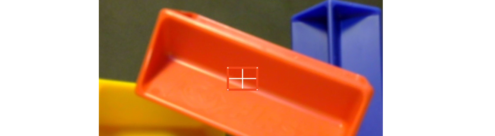
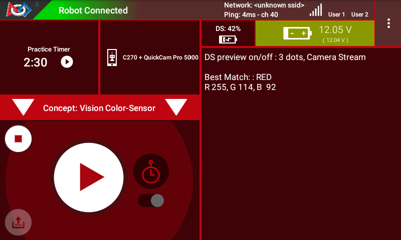
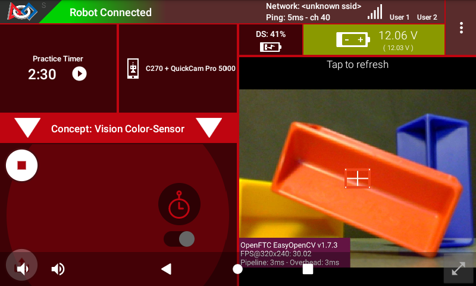
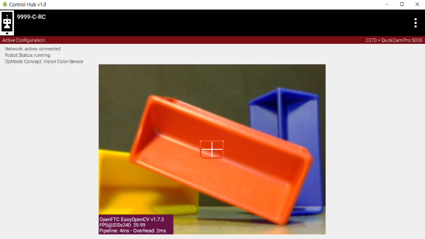

Color Processing Color Sensor
=============================

Overview
--------

A simple way to use FTC's new OpenCV vision tools is to operate a "Color
Sensor".  Namely, it can determine **the color seen by the robot's camera**\ ,
in a specified zone.

Below, the small central rectangle is the region being evaluated:

   Color sensor detection zone 

A key benefit is that the camera can be much further away from the object than,
for example, a REV Color Sensor or others like it.

It's still important to accurately point the camera and carefully select the
image zone to inspect.

For the above example, OpenCV can provide results like this:

   RED Detection using Color Sensor

The following sections describe how to do this, with a Sample OpMode.

Configuration
-------------

*Skip this section if ...*

* *the active robot configuration already contains "Webcam 1"*, or
* *using the built-in camera of an Android phone as Robot Controller.*

Before starting the programming, REV Control Hub users should make a robot
configuration that includes the USB webcam to be used as a color sensor.

For now, use the default webcam name, "Webcam 1".  If a different name is
preferred, edit the Sample OpMode to agree with the exact webcam name in the
robot configuration.

Save and activate that configuration; its name should appear on the paired
Driver Station screen.

Sample OpMode
-------------

Opening the Sample OpMode
+++++++++++++++++++++++++

To learn about opening the Sample OpMode, click the tab for Blocks or Java:

.. tab-set::
   .. tab-item:: Blocks
      :sync: blocks

      1. On a laptop or desktop computer connected via Wi-Fi to the Robot
         Controller, open the Chrome browser.  Go to the REV Control
         Hub's address ``http://192.168.43.1:8080`` (or
         ``http://192.168.49.1:8080`` for Android RC phone) and click the
         *Blocks* tab.

      2. Click ``Create New OpMode``\ , enter a new name such as
         "ColorSensor_Maria_v01", and select the Sample OpMode
         ``ConceptVisionColorSensor``.

      3. At the top of the Blocks screen, you can change the type from "TeleOp" to
         "Autonomous", since this Sample OpMode does not use gamepads.

      4. If using the built-in camera of an RC phone, drag out the relevant Block
         from the left-side ``VisionPortal.Builder`` toolbox.

      5. Save the OpMode, time to try it!

   .. tab-item:: Java
      :sync: java

      1. Open your choice of OnBot Java or Android Studio.

      2. In the ``teamcode`` folder, add/create a new OpMode with a name such as
         "ColorSensor_Bobby_v01.java", and select the Sample OpMode
         ``ConceptVisionColorSensor.java``.

      3. At about Line 58, you can change ``@TeleOp`` to ``@Autonomous``\ , since
         this Sample OpMode does not use gamepads.

      4. If using the built-in camera of an RC phone, follow the OpMode comments
         to specify that camera.

      5. Click "Build", time to try it!

Running the Sample OpMode
+++++++++++++++++++++++++

On the Driver Station:

1. Select the Autonomous OpMode that you just saved or built.
2. Turn off the automatic 30-second match timer (green slider).
3. Touch INIT only.  

The OpMode should give Telemetry, stating the main "matched" color inside the Region of Interest.

   Driver Station Telemetry

Move the camera around, and watch the Telemetry area on the Driver Station
screen.  It should state "BLUE" when pointing at a blue object, and likewise
should identify other common colors.

**It's working!**  You have a color sensor in your robot camera.  Think about
how to use this in the FTC Robot Game.

*Skip the next two sections if you already know how to use FTC previews.*

DS Preview
----------

Before describing how to modify the OpMode, this page offers two sections
showing how to view the OpenCV results with **previews**.  Previewing is
essential for working with vision code.

**Opening the DS Preview**
1. On the Driver Station (DS), remain in INIT -- don't touch the Start button.
2. At the top right corner, touch the 3-dots menu, then ``Camera Stream``.
   This shows the camera's view; tap the image to refresh it.

   Camera Stream Preview

Drawn on the image is the rectangle being evaluated, called the **Region of
Interest** (ROI).  The ROI border color is the rectangle's predominant color,
reported to DS Telemetry.

If that border "disappears" against a solid-color background, the thin white
cross-hairs and 4 small white dots can still identify the ROI.

For a BIG preview, touch the arrows at the bottom right corner.

Or, select Camera Stream again, to return to the previous screen and its
Telemetry.

RC Preview
----------

The Robot Controller (RC) device also makes a preview, called ``LiveView``.
This is full video, and is shown automatically on the screen of an RC phone.

   Control Hub LiveView

The above preview is from a REV Control Hub.

It has no physical screen, so you must plug in an HDMI monitor **or** use
open-source `scrcpy <https://github.com/Genymobile/scrcpy>`_ (called "screen
copy") to see the preview on a laptop or computer that's connected via Wi-Fi to
the Control Hub.

Modify the Sample
-----------------

This Sample OpMode is designed for the user to select/edit **two inputs**\ :

* define the Region of Interest (ROI)
* list the colors that might be found

For the **first input**, there are 3 ways to define the ROI:

* entire frame
* sub-region, defined with standard image coordinates
* sub-region, defined with a normalized +/- 1.0 coordinate system

For the **second input**, you must list the candidate colors from which a
result will be selected as a "Match".

Simply choose from the 10 "Swatches": RED, ORANGE, YELLOW, GREEN, CYAN, BLUE,
PURPLE, MAGENTA, BLACK, WHITE.  For efficiency, add only those Swatches for
which you reasonably expect to get a match.

**The Blocks and Java OpModes contain detailed comments to guide you through
these edits.**  They are not repeated in this tutorial.

Building the VisionPortal
-------------------------

The Sample OpMode first creates a "Predominant Color" **Processor** using the
**Builder** pattern.  This is the same Builder pattern used to create an
AprilTag Processor, and previously a TensorFlow Processor.

The Sample OpMode then creates a **VisionPortal**, again using a Builder
pattern.  This includes adding the "Predominant Color" Processor to the
VisionPortal.

How does OpenCV determine the "predominant color" of the ROI?  An algorithm
called `"k-means" <https://en.wikipedia.org/wiki/K-means_clustering>`_
determines clusters of similar colors.  The color of the cluster with the most
pixels is called "predominant" here. *(This will NOT be on the final.)*

Testing the Result
------------------

After trying and learning how the commands work, you can incorporate this Color
Sensor into your Autonomous and/or TeleOp OpModes.

As seen in the OpMode's Telemetry section, the result is called
``closestSwatch`` and appears as a word (RED, BLUE, etc.).  But this is not
plain text!

**Testing**, or comparing, for a particular color-match must be done as
follows.  Select and read the Blocks **or** Java section below:

.. tab-set::
   .. tab-item:: Blocks
      :sync: blocks

      At the left side, pull out the following multi-Block from ``Vision/PredominantColor/Processor``:

      .. figure:: images/50-closestSwatchCompare.png
         :align: center
         :width: 75%
         :alt: Closest Swatch Comparison
   
         Closest Swatch Comparison
         
      You must use this special Block to determine if the result is (for example) RED.

      Why?  The result, called ``closestSwatch`` is not **text** (yes it seems
      like text!).  It's a type called ``Swatch`` and can be compared only to
      another ``Swatch``.

   .. tab-item:: Java
      :sync: java

      In the sample OpMode, here's the Telemetry that gives the result:

      .. code-block:: java

         telemetry.addData("Best Match:", result.closestSwatch);

      This displays as text, but this is **not** Java type ``String``!

      Here's how to determine if the result is (for example) RED:

      .. code-block:: java

         if (result.closestSwatch == Swatch.RED)   {  }

      Why?  The result, called ``closestSwatch`` is of type ``Swatch`` and can
      be compared only to another ``Swatch``.

OpMode Programming
------------------

The Color Sensor part of your team's Autonomous OpMode might include these
goals:

#. Seek a color, using the code from this Sample OpMode
#. Take a robot action, based on finding that color

If so, select and read the Blocks **or** Java section below:

.. tab-set::
   .. tab-item:: Blocks
      :sync: blocks

      Beginners often try this first:

      .. figure:: images/55-IFclosestSwatchWrongWay.png
         :alt: Wrong way to act upon match result
         :width: 75%
         :align: center

         Wrong way to act upon match result

      The problem is, after the robot does the action for RED, the OpMode is
      still inside the vision loop.  Very messy and unpredictable.

      A better approach is to save the result (as text!), exit the loop, then
      retrieve the stored result to take the desired RED action.

      .. figure:: images/58-IFclosestSwatchRightWay.png
         :alt: Right way to act upon match result
         :width: 75%
         :align: center

         Right way to act upon match result

      How to exit the vision loop?  It could be based on `time
      <https://github.com/FIRST-Tech-Challenge/FtcRobotController/wiki/Timers-in-FTC-Blocks>`_
      , or finding a particular color, or finding a particular color 10 times
      in a row, or finding only a particular color for 1 full second, or any
      other desired criteria.

   .. tab-item:: Java
      :sync: java

      The color result is generated inside a vision loop.  Save the result (as
      text!), exit the loop, then retrieve the stored result to take the
      desired RED action.

      .. code-block:: java

         String savedColorMatch = "NULL";
         .
         .
         if (result.closestSwatch == Swatch.RED)     {
              savedColorMatch = "RED";
              // your code here: optional to exit the vision loop based on your criteria
              }
         .
         .
         // After exiting the vision loop...
         if (savedColorMatch == "RED")     {
              // your code here: robot actions if the ROI was RED
              }

      How to exit the vision loop?  It could be based on time, or finding a
      particular color, or finding a particular color 10 times in a row, or
      finding only a particular color for 1 full second, or any other desired
      criteria.

Advanced Use
------------

Some teams may prefer to read and evaluate the **actual RGB color values**,
rather than rely on a generic Swatch result.

RGB is a **Color Space** that uses three numerical components of Red, Green and
Blue.  Values range from 0 to 255.  For more info, see this tutorial's :doc:`Color
Spaces <../color-spaces/color-spaces>` page.

Extracting the RGB components can be seen in the Telemetry portion of the
Sample OpMode.  Click the Blocks or Java tab:

.. tab-set::
   .. tab-item:: Blocks
      :sync: blocks

      Here are the RGB components of the ROI's predominant color:

      .. figure:: images/70-Blocks-RGB.png
         :alt: Finding color by RGB
         :width: 75%
         :align: center

      Note: the ``Color`` Block has a drop-down list that includes Hue,
      Saturation and Value.  Those settings will **not work** here, to produce
      components in the HSV Color Space, because the source Block provides only
      RGB color (its method name is ``.rgb``\ ).

   .. tab-item:: Java
      :sync: java

      Here are the RGB components of the ROI's predominant color:

      * ``Color.red(result.rgb)``
      * ``Color.green(result.rgb)``
      * ``Color.blue(result.rgb)``    

For Blocks or Java, those component values can be assigned to numeric
variables, with names like ``ROIRedValue``, ``ROIGreenValue``, and
``ROIBlueValue``.

Now your code can process those RGB variables as desired.

Next Sections
-------------

Soon you can move ahead to try the **Color Locator** processor.

But first, learn a few basic concepts at this tutorial's :doc:`Color Blob Concepts
<../color-blob-concepts/color-blob-concepts>` page.

============

*Questions, comments and corrections to westsiderobotics@verizon.net*

