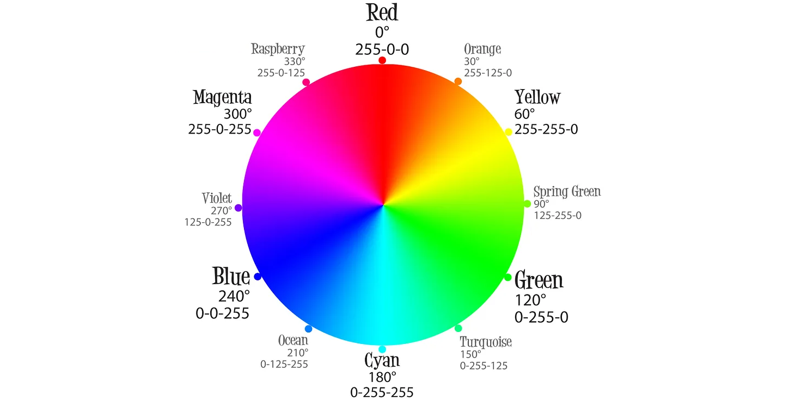
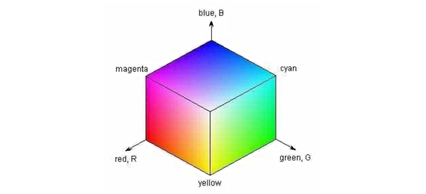
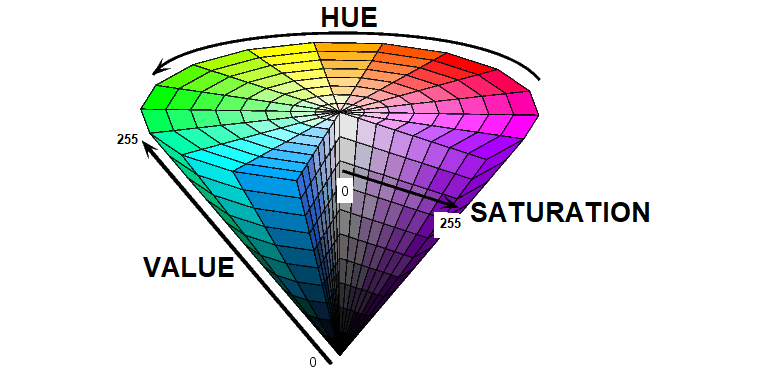
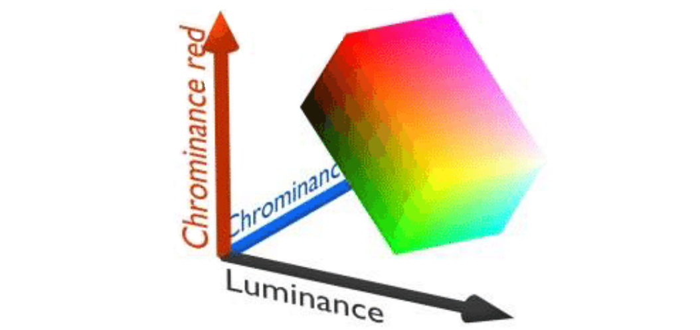

Color Spaces
============

Overview
--------

This page of the FTC Color Processing tutorial introduces **Color Spaces**.

OpenCV can process color information using any one of several Color Spaces,
which are methods to describe an exact shade and brightness.

This page describes 3 choices available in the FTC SDK:

* RGB (Red, Green, Blue)
* HSV (Hue, Saturation, Value)
* YCrCb (Luminance, Chrominance red, Chrominance blue)

Each Color Space uses 3 numbers, 0 to 255, to describe a particular color.

RGB Color Space
---------------

**RGB** is a common Color Space, easy to understand.  Its 3 components are:

* **Red** (0 - 255)
* **Green** (0 - 255)
* **Blue** (0 -  255)

   RGB Color Wheel

Pure Red has values 255 red, 0 green, 0 blue.  Pure Green has 0 red, 255 green,
0 blue.

Magenta is a blend of Red and Blue, so its values are 255 red, 0 green, and 255
blue.

Here's a useful way to visualize the RGB Color Space, with one axis for each
component:

   RGB Cube Visualization

Each near-side external face of this box has the maximum value for one
component.  Every shade of color on the top face, for example, has a Blue
component of 255.

The nearest corner is **White**, with RGB values of (255, 255, 255).  Namely,
full values of Red, Green and Blue light will combine to appear as white light.

Where is **Black**?  It's the opposite corner, at the origin, hidden in this
view.  Its values are (0, 0, 0) -- no color at all.

This RGB system is used only for light-based colors, including video.  It does
not apply for painted colors, or printed colors, which use other color systems.

.. tip::
   Mixing red paint, green paint and blue paint will **not** create white paint!

Technical information is available at `Wikipedia Color Spaces <https://en.wikipedia.org/wiki/RGB_color_spaces>`_.

HSV Color Space
---------------

Another Color Space used by OpenCV is **HSV**\ : Hue, Saturation and Value.

   HSV Cone Visualization

**Hue** is the actual shade of color; see the familiar color wheel on top.

**Saturation** measures the amount of white: a lower value is whiter, or more
grey.  On the HSV cone, see the outward arrow for Saturation.  The highest
value of 255 is the fully saturated color (no white).

**Value** measures brightness; see the upward arrow on the HSV cone.  The top
face of the cone (Value = 255), is the fully bright color.  Black is found at
the lower tip, Value = 0.

Technical information is available at `Wikipedia HSL/HSV <https://en.wikipedia.org/wiki/HSL_and_HSV>`_.

YCrCb Color Space
-----------------

A third Color Space used by OpenCV is **YCrCb**.

   YCrCb Visualization

The Y is **Luminance** or brightness, while Cr and Cb are red and blue
components of **Chrominance**.  Technical information is available at
`Wikipedia YCbCr <https://en.wikipedia.org/wiki/YCbCr>`_.

The YCrCb Color Space offers efficient computation of color processing, and is
widely used in video applications.

Some online documentation refers to a Color Space called **YCbCr**.  This is
the same system, with the last 2 values reversed.

How to choose?
--------------

Use the Color Space that's convenient for you.  RGB is easy to understand,
while YCrCb may offer better computational performance (if needed).

It's easy to find free public websites to convert the 3 values from one Color
Space into the corresponding 3 values from another Color Space.

When converting to HSV, some online sites give Hue in degrees (0 to 360), and
Saturation and Value as percentages (0 to 100).  Apply these (as a proportion
of the maximum) to 255, for values to use in the FTC **Color Locator**
processor.

The **Color Locator** processor can use any of these three Color Spaces.  The
simple **Color Sensor** processor uses YCrCb internally, but reports results in
RGB only.

============

*Questions, comments and corrections to westsiderobotics@verizon.net*

