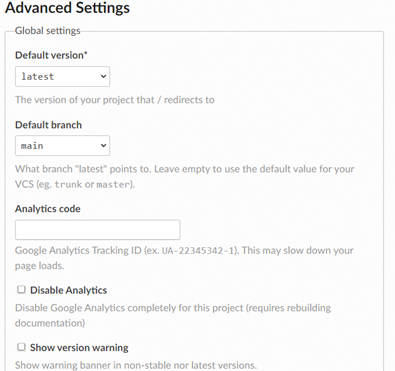

Creating a Development Environment
===================================

The first step is to create a development environment.  This is
where you will be doing all of your work.  This tutorial will outline 
two methods, a cloud method, or local method.

Local Method
------------

1.  Create fork of FtcDocs Project as shown
    `here <https://docs.github.com/en/get-started/quickstart/fork-a-repo>`__

2.  Clone fork of project replacing ``<NAME>`` with your username

    ``git clone https://github.com/<NAME>/ftcdocs.git``

3.  Install Python from `here <https://www.python.org/downloads/>`__

4.  Install Pip following
    `these <https://pip.pypa.io/en/stable/installation/>`__ instructions

5.  Change directory to root project and install dependencies

    -  ``cd ftcdocs``
    -  ``pip install -r docs/requirements.txt``

6.  Make desired changes to project.

7.  Install dependencies for PDF

    -  Ubuntu/Debian: ``xargs -a dependencies sudo apt install -y``
    -  Windows: Install MiKTeX from
       `here <https://miktex.org/download>`__

8.  Build project by executing following commands in ``docs\`` folder of
    project

    -  HTML: ``make html``
    -  Autobuild HTML: ``make autobuild``
    -  PDF: ``make latexpdf``

9.  View Result (html)

    -  Open ``docs\build\html\index.html`` in a browser of your choice
    -  To create local http server execute
       ``python3 -m http.server 7350`` in ``docs\build\html\index.html``
       and view result `here <https://localhost:7350>`__. If you are
       using the Autobuild option this server will be automatically
       created and updated with most changes to rst files. Some changes
       will not be transferred like images and will require a
       ``make clean``.
    - Keep in mind that the official site will look slightly different 
      from the locally built site.

10. Commit changes and push after desired result has been achieved

    -  ``git commit -a -m <MESSAGE>`` replace with your commit message
    -  ``git push``

11. `Create <https://docs.github.com/en/pull-requests/collaborating-with-pull-requests/proposing-changes-to-your-work-with-pull-requests/creating-a-pull-request>`__
    a Pull Request to upstream repository. Make sure to be concise in
    your PR title and description.

Cloud Method
------------

1. Create fork of FtcDocs Project as shown
   `here <https://docs.github.com/en/get-started/quickstart/fork-a-repo>`__
2. Ideally you should follow a feature based branch system. This means
   that you should create a new branch every time you are thinking of
   adding a new feature. This will insure that the main branch stays
   identical to upstream.

   1. Click the drop down menu that says the branch you are currently
      working on (default is main) towards the top but slightly to the
      left
   2. Type in what you wish to name your branch. It should be short and
      concise while also being able to convey to others what feature
      this branch has
   3. Next click ``Create branch: [name of branch] from ‘main’``

3. Although you can view changes made in the Github preview this can be
   incorrect and is often incomplete. To give an accurate view of what
   your changes look like you will want to make your own Read The Docs
   site to preview your changes. To do this follow the instructions
   given
   `here <https://docs.readthedocs.io/en/stable/tutorial/index.html>`__
   forgoing the “Preparing your project on GitHub” and not going beyond
   “Checking the first build”. Name your site ``<USERNAME>-ftcdocs``
4. To change the branch that RTD builds on do the following

   1. Go to
      ``https://readthedocs.org/dashboard/<USERNAME>-ftcdocs/advanced/``
      after replacing ``<USERNAME>`` with your username
   2. Click your user in the top right corner
   3. Change Default branch to the branch you want to build off of

    |demo|

5. Make desired changes to forked project via Github Web Editor. This is
   as simple as clicking edit icon after viewing any given file.
   Remember to follow style guide shown
   `here <https://docs.wpilib.org/en/stable/docs/contributing/frc-docs/style-guide.html>`__
6. View Changes on created RTD site by visiting
   ``https://<USERNAME>-ftcdocs.readthedocs.io/en/latest/`` after
   replacing ``<USERNAME>`` with your username

