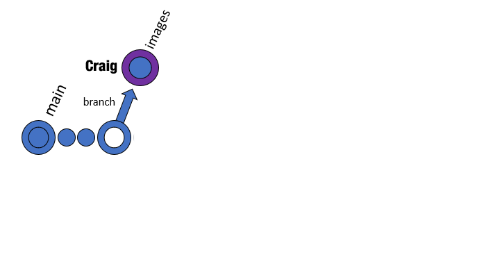
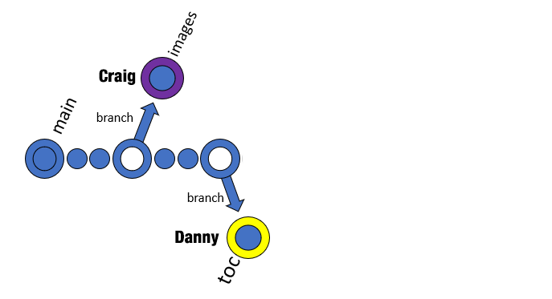
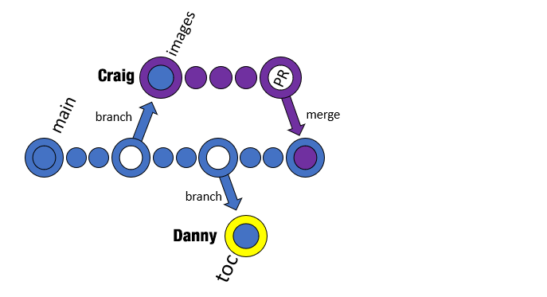
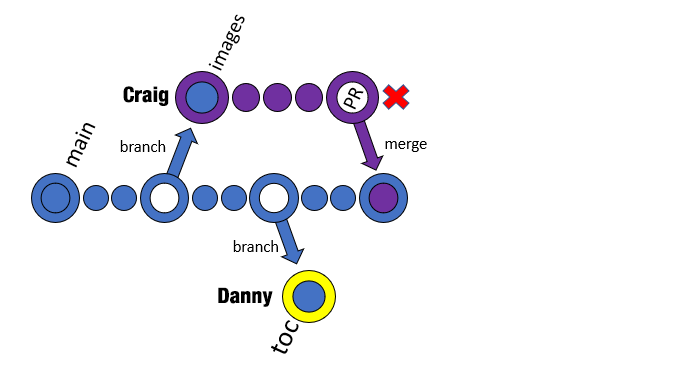
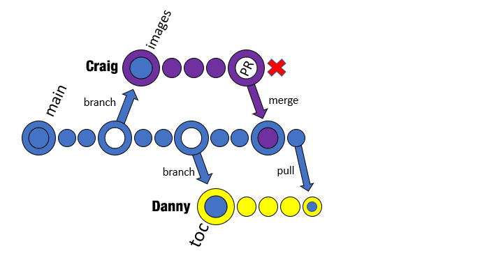
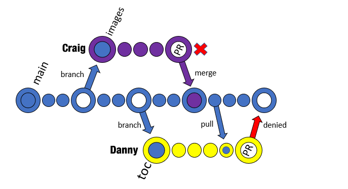
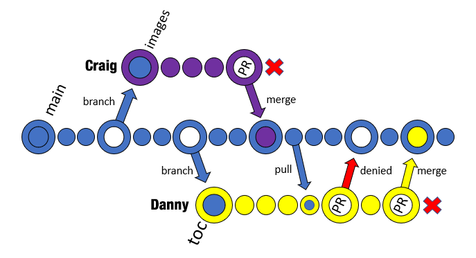

About Branches (Multi User)
===========================

A *Repository* is a place where content is stored. The ``rst-primer`` repository
in GitHub is the repository that we are using right now. Multiple versions of
the same content can be worked on and stored at the same time within the repository,
and each version that is worked on is stored in a special workspace known as a
*Branch*. A repository can have an unlimited number of *Branches.* 

By default a repository has one primary branch, and that branch is named
``main``; the ``main`` branch is the *official* branch for the repository. Anyone
looking for the latest stable version of the content should always be able to find
it in the ``main`` branch. The ``main`` branch serves as the official location
for content that is ready for use by anyone on the project.

As a rule of thumb, developers agree that it is bad form to make changes to content 
directly in the ``main`` branch. If multiple developers are doing so at the same
time, that can lead to lots of confusion and mayhem! Therefore, any content changes
must be done somewhere else, and once approved those changes can be *merged*
back into the ``main`` branch. This *somewhere else* is another branch.

In general branches all start off the same way - each new branch is an exact
duplicate of the originating branch at the time the new branch was created, in
this case it's the ``main`` branch (it's possible to branch non-``main``
branches, but let's leave that for another discussion). New branches can be
named anything you want, but usually it is one or two words that identifies
what's different about the branch. The developer then makes the desired changes
to their new branch, and they can test those changes and ensure they do exactly
what they intend. They can also invite others to view their branch, and make
comments on the content changes they are making. GitHub tracks changes to the contents
of each branch, in what's known as a *changelist*. Once all of the changes have
been made to a branch, an administrator can accept those content changes in the branch
(thus allowing GitHub to *apply* all of the changes from the branch's *changelist* 
back to the root branch) via a *pull request*.

Branching Example
^^^^^^^^^^^^^^^^^

Let's take a real example of how we use branches. We'll introduce the concept of
*Pull Requests* (PR's), a simple *pull*, and *merging* which we will discuss in 
more detail later. 

The basic premise of this example is this:

    Craig and Danny are both updating documents. Craig wants to change the
    images in all of the the documents in the repo to better highlight what the
    images are trying to show, and Danny wants to change the tables of contents
    in all of the documents to a new format. Both want to make different changes
    to the ``main`` branch, but in different ways.

The text on the left corresponds to the updated image flowchart on the right. The
Visual on the right helps to graphically depict what's happening to the branches 
from the text at each step along the way.

.. list-table:: Simple Branching Example Use-Case
   :widths: 50 50

   * -  Step 1: 
        We start off with the ``main`` branch. Craig creates his branch first;
        Craig calls his branch ``images``. This ``images`` branch is branched
        off from the ``main`` branch, so it is a duplicate of the ``main``
        branch. Craig's branch is represented in the color Purple from now on,
        to represent any changes Craig makes to his branch. GitHub tracks
        *differences*, or *changes*, made between the ``main`` branch and
        Craig's new ``images`` branch. GitHub knows how the branch *started*,
        and tracks anything that is updated/changed.  
     - |flowchart-1|
   * - Step 2:
       Danny then creates his branch; Danny calls his branch ``toc``. Danny,
       like Craig, branched off from the ``main`` branch, so Danny's branch is
       a duplicate of ``main``. Anything that Danny does in his branch is
       isolated to his branch, and anyting Craig does to his branch is isolated
       to that branch.  No changes will be reflected in other branches until
       *Pull Requests* (PR's) are issued. Changes to the ``toc`` branch will be
       represented in the color Yellow.  
     - |flowchart-2|
   * - Step 3:
       Craig and Danny begin doing "work" in parallel within their branches.
       Craig updates all of the images in all of the documents first in his
       ``images`` branch, and creates a *Pull Request* (PR) to merge his
       changes into the ``main`` branch. Rosy reviews the changes in Craig's
       branch, and authorizes Craig to merge. Craig merges, which causes GitHub
       to take all of the *changes* that Craig made along the way and those
       *changes* are applied to the ``main`` branch. Now the ``main`` branch
       has all of Craig's changes in it. At this point, the ``images`` branch
       and the ``main`` branch are identical.
     - |flowchart-3|
   * - Step 3a:
       Now that Craig's ``images`` branch has been merged into ``main``,
       there's no more need for his branch; GitHub has already applied all of
       the changes from Craig's branch into ``main``. Therefore, Craig now
       deletes his branch.
     - |flowchart-3a|
   * - Step 4:
       Danny continues making changes to his branch, updating content.  Danny's
       branch started off as a duplicate of ``main`` before Craig's changes
       were merged into ``main``, but Danny decides he wants to *pull* all
       changes from the current ``main`` branch into his ``toc`` branch. So,
       Danny issues a *pull* to allow GitHub to apply changes between the
       ``main`` branch into his ``toc`` branch. The difference between a *pull*
       and a *Pull Request* (PR) is that a *pull* doesn't have to be authorized
       by anyone, since you're copying changes from a public branch into your
       own branch. After the *pull*, Danny's ``toc`` branch includes all of the
       changes that Craig merged, PLUS it retains all of Danny's changes to the
       ``toc`` branch up to this point.
     - |flowchart-4|
   * - Step 5:
       Danny submits a *Pull Request* (PR) to merge his changes into ``main``. Rosy
       notices an error, and submits a comment - effectively denying the PR.  Danny 
       corrects the error and re-requests a review. 
     - |flowchart-5|
   * - Step 6: 
       Rosy re-reviews Danny's changes, and finally approves. Having approval,
       Danny merges his changes into the ``main`` branch. Now the ``main``
       branch includes all of the changes from the ``toc`` branch, so Danny
       deletes his branch as it's no longer needed.
     - |flowchart-7|

