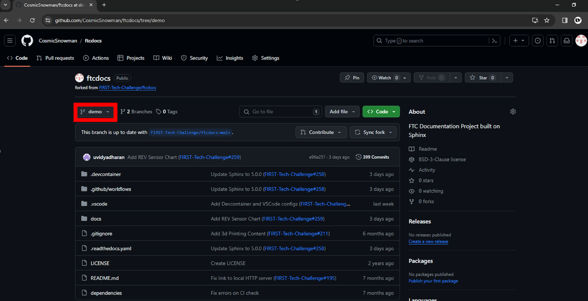
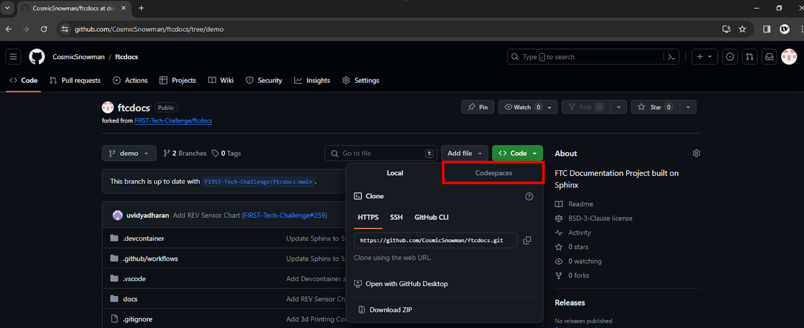
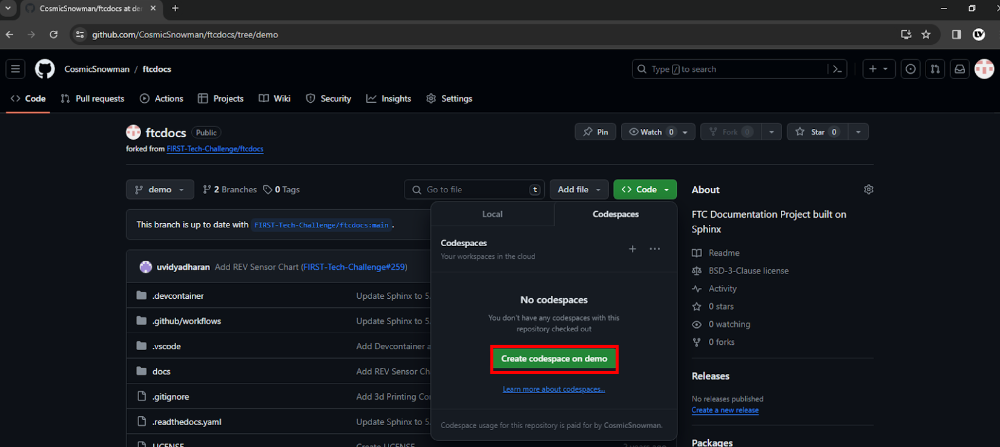

Creating a Codespace
=====================
:bdg-success:`Repeat` :bdg-info:`Codespaces`

For every new branch you make in your repository, you must create a new codespace. 
This is a virtual environment that will allow you to run your code and test it before merging it into the main branch. 
It may take a few minutes to create the codespace, but once it is created, you can access it from the browser and subsequent access will be much faster.

Steps
-----

1. Open your **forked** repository in GitHub.
2. On the left side of the page select the branch you want to work on.

1. Click on the green "Code" button and select "Create codespace on ``<BRANCH>``".

2. Wait for the codespace to be created. This may take a few minutes.
3. Once the codespace is created, you will be taken to the codespace in your browser.
4. Enter ``CTRL + SHIFT + B`` to build the project.