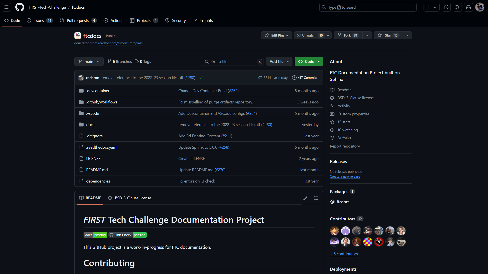

Getting to know the GitHub Repo
===============================
:bdg-secondary:`Information`

.. note::
   It is assumed that you have already created a GitHub account.

GitHub is a website where people and organizations can store projects in what's
known as a "repository". Some repositories can be public, meaning anyone can
see the content within it, and some are private. The ftcdocs repository you're working on
is a public repository, which means that anyone can access it.

Understanding the ftcdocs Repo
---------------------------------

The GitHub ``ftcdocs`` repository can be found on GitHub at the following address:

-  https://github.com/FIRST-Tech-Challenge/ftcdocs/

The GitHub repository is where all of the source files for this website are kept. Figure 1 shows what the main code page for the
``ftcdocs`` repository looks like. 

   Figure 1: ftcdocs GitHub Repository

This main **code page** is where you'll do most of your work. It's called a **code
page** because by default the ``< > Code`` tab of the repository is selected,
and this is the page that we're currently viewing. For software projects, the
**code page** is where code is stored; for us, this is where our *content* is
stored. There are several different tabs, but we only really care about the
first four:

1. ``< > Code`` - The **Code page** shows us the file structure of our repository and
   also allows us to view and edit files.

2. ``Issues`` - The **Issues page** shows us "issues" that any user can submit. These 
   issues are generally feature request (like "Please add emojis to the document workflow")
   or bug reports (like "When I use dropdowns, my document errors out."). Issues are 
   not meant to be discussions, but very specific tasks that need to be addressed.

3. ``Pull Requests`` - The **Pull Requests page** shows us "Pull Requests"; for this 
   project, these will be requests to merge changes into the main branch. Don't worry
   about this page just now, we'll cover **Pull Requests** in more detail later.

4. ``Discussions`` - The **Discussions page** is where users can visit and ask 
   questions or get help on topics. This is meant to be an open discussion area for the
   repository. This area is similar to a forum, but specifically for ``ftcdocs``.

The ``< > Code`` tab will be the tab that we will spend most our time in, as this 
is where we manage *branches*, view and edit files, and perform most of our basic
functions.

