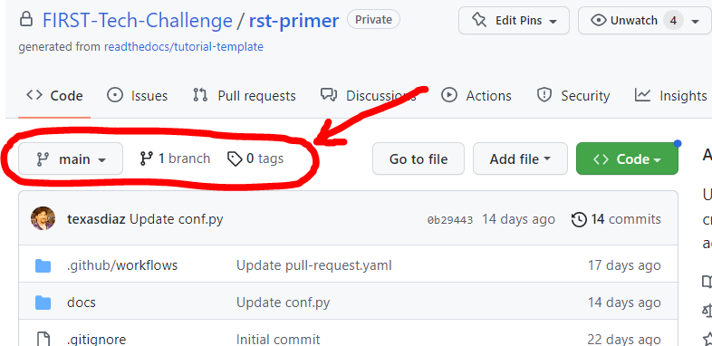
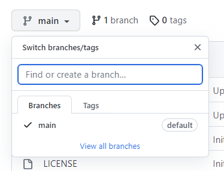
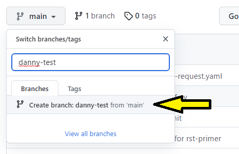
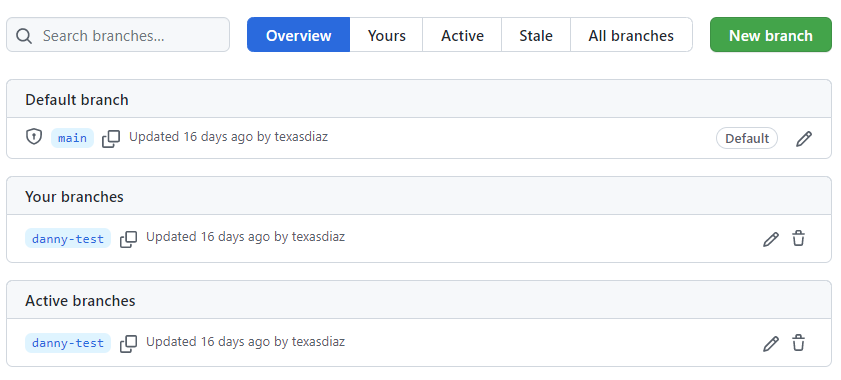

Creating a New Branch
---------------------

On the ``< > Code`` tab, we can see the Branch information below:

   Figure 3: rst-primer branch information

Here we can see, circled in red, the Branch information for the repo. We can see that
the branch we're currently viewing is the ``main`` branch, and there is only one 
branch in the repo (there *always* has to be a ``main`` branch, so if there's only 
one branch then it's the ``main`` branch). 

If we click on the branch drop-down (that currently says, "main") we will see a
list of all the branches, and a search/create box. You can click on a branch
name to switch the current view to a different branch, but if there are too
many in the list you can just type in the name of the branch to filter the
list.  If you want to create a new branch, you can just type in the new name
for the new branch and click the "Create branch <NAME> from 'main'" item that 
will appear. This is the "quick branch" way of creating branches.

   Figure 4: rst-primer branch selection

In order to make any changes to the content, we need to create ourselves a new
branch so that we have our own workspace in which to make changes. To create a
new branch duplicated from ``main``, we need to ensure ``main`` is the
currently selected branch (if there's only one branch then it's got to be
``main``) and then we can type a new name in the box and click the "create"
selection that will appear. Let's call this new branch ``test`` but let's also
put your name in front of it, like ``danny-test``. When you create it, make
sure to use **YOUR** name instead of mine (all branches need to be uniquely
named, so if someone is doing this tutorial at the same time as you let's make
sure this branch is uniquely yours). It's okay if you want to use a space in
the name of your branch, all spaces will ultimately be replaced with a dash
``-``.

   Figure 5: rst-primer create new branch

After clicking the "Create branch" button from Figure 5, your new branch should
be created and the branch is automatically selected in the branch selection
drop-down. You will also see the number of total branches increase by one. If
you want to see all branches, you can click the "View all branches" link within
the branch drop-down, or you can also click the "X Branches" link next to the
branch selector. This will show you all of the current branches along with
which one(s) are owned by you.

Figure 6 shows the "All Branches" view. This is yet another way of managing
your branches, and may or may not turn into your favorite way of viewing and
managing branches - everyone has their own personal opinion.  From within this
view you can create new branches by clicking the green "New Branch" button,
rename *YOUR* branches by clicking on the pencil icon to the right of each
branch, or delete *YOUR* branches by clicking the "*Trash Can*" icon to the
right of each branch.  You can only perform actions on *YOUR* own branches
unless you're an administrator (like me).  You can also switch to another
branch by clicking on the name of the branch.

   Figure 6: rst-primer view all branches

Congratulations, you've created a new branch!