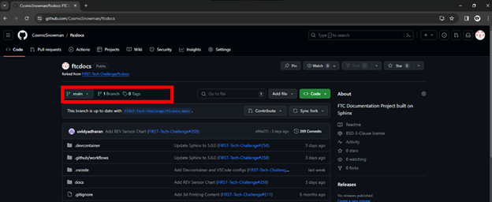
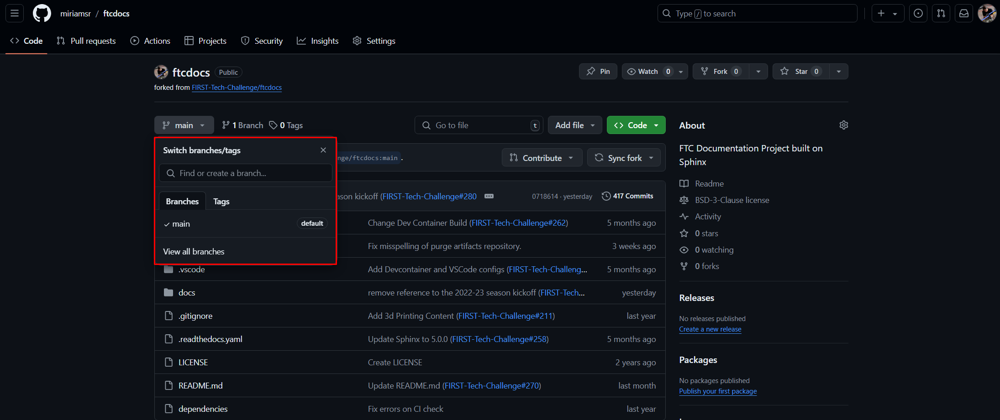
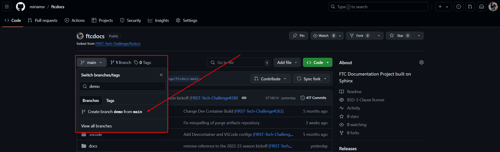
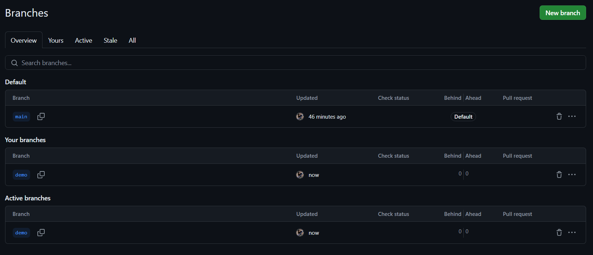

Creating a New Branch
=====================
:bdg-success:`Repeat` :bdg-info:`Codespaces` :bdg-warning:`Local`

What are branches and why do we need them?
------------------------------------------

Branches can be thought of as parallel versions of a project. This is useful for 
deveopment because it allows you to work on a feature or bug fix in an isolated 
environment without affecting the main project. Once you've made the changes you 
want to make, you can merge your branch back into the main branch to publish your 
changes.
In the case of the FTC Docs, the main branch of your fork should always be a copy 
of the main branch of the main repository which serves as a reference point to create 
new branches from. After we are satisfied with the changes we've made in our branch, we 
will create a Pull Request to merge our changes back into the main branch of the 
:term:`Main Repository <Main Repository>`. After the Pull Request is approved, the changes 
will be merged into the main branch of the Main Repository and will be published to the 
FTC Docs website. After the changes are merged, we will use the process described 
in the :doc:`/contrib/tutorials/update_fork/update-fork`

On the ``< > Code`` tab, we can see the Branch information below:

   Figure 3: Example Fork branch information

Here we can see, circled in red, the Branch information for the repo. We can see that
the branch we're currently viewing is the ``main`` branch, and there is only one 
branch in the repo (there *always* has to be a ``main`` branch, so if there's only 
one branch then it's the ``main`` branch). 

If we click on the branch drop-down (that currently says, "main") we will see a
list of all the branches, and a search/create box. You can click on a branch
name to switch the current view to a different branch, but if there are too
many in the list you can just type in the name of the branch to filter the
list.  If you want to create a new branch, you can just type in the new name
for the new branch and click the "Create branch <NAME> from 'main'" item that 
will appear. This is the "quick branch" way of creating branches.

   Figure 4: Example Fork branch selection

In order to make any changes to the content, we need to create ourselves a new
branch so that we have our own workspace in which to make changes. To create a
new branch duplicated from ``main``, we need to ensure ``main`` is the
currently selected branch (if there's only one branch then it's got to be
``main``) and then we can type a new name in the box and click the "create"
selection that will appear. Let's call this new branch ``demo``. For real 
work you should use a more descriptive name, like ``feature-<FEATURE_NAME>``, 
``bugfix-<BUG_NUMBER>``, or ``<YOUR_NAME>-<FEATURE_NAME>``.

   Figure 5: Example Fork create new branch

After clicking the "Create branch" button from Figure 5, your new branch should
be created and the branch is automatically selected in the branch selection
drop-down. You will also see the number of total branches increase by one. If
you want to see all branches, you can click the "View all branches" link within
the branch drop-down, or you can also click the "X Branches" link next to the
branch selector. This will show you all of the current branches along with
which one(s) are owned by you.

Figure 6 shows the "All Branches" view. This is yet another way of managing
your branches, and may or may not turn into your favorite way of viewing and
managing branches - everyone has their own personal opinion.  From within this
view you can create new branches by clicking the green "New Branch" button,
rename *YOUR* branches by clicking on the pencil icon to the right of each
branch, or delete *YOUR* branches by clicking the "*Trash Can*" icon to the
right of each branch.  You can only perform actions on *YOUR* own branches
unless you're an administrator (like me).  You can also switch to another
branch by clicking on the name of the branch.

   Figure 6: Example Fork view all branches

Congratulations, you've created a new branch!