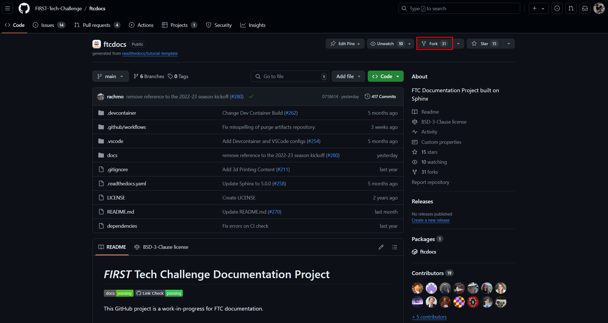
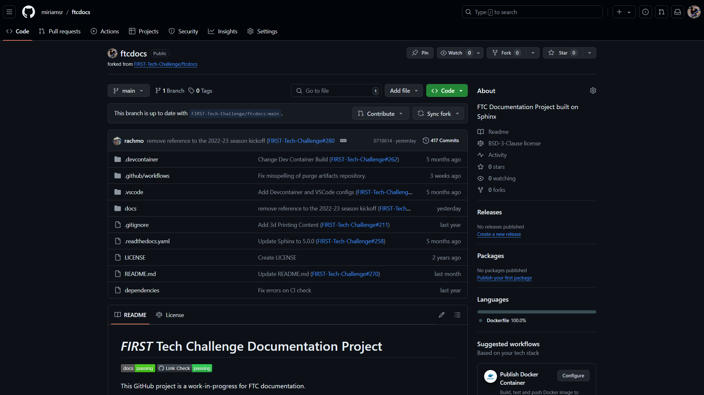

Forking FTC Docs
================
:bdg-danger:`One Time Only` :bdg-info:`Codespaces` :bdg-warning:`Local`

.. note::
    This following assumes you have already created a GitHub account. If you have not, please `create one <https://github.com/join>`_

Forking a repository is a simple process. It creates a copy of the repository in your account, and you can make changes to it without affecting the original repository. 
You can also submit a pull request to the original repository to propose changes to the original repository. It also allows you to easily keep your forked repository up to date with the original repository.

Steps
-----

1. Go to the repository you want to fork. In this case, it is the FTC Docs `repository <https://github.com/FIRST-Tech-Challenge/ftcdocs>`_.

   The Official FTC Docs GitHub Repository

2. Follow the steps shown below to fork the repository.

   
   Click the "Create Fork" button to create a fork of the repository.

   Forked Repository

For more information on forking a repository, visit the `GitHub Documentation <https://docs.github.com/en/get-started/quickstart/fork-a-repo>`_.