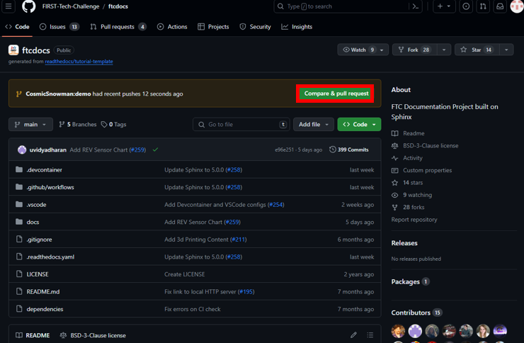
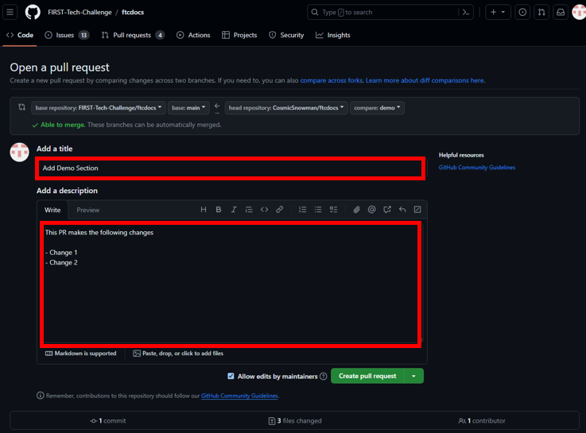
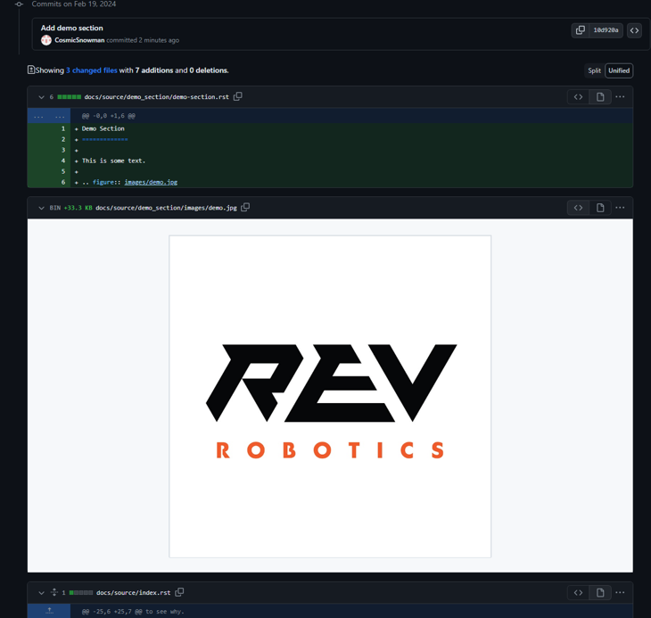
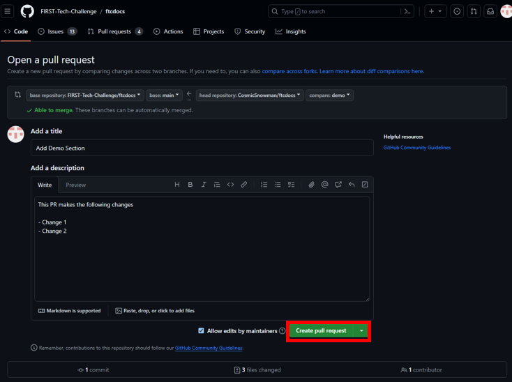
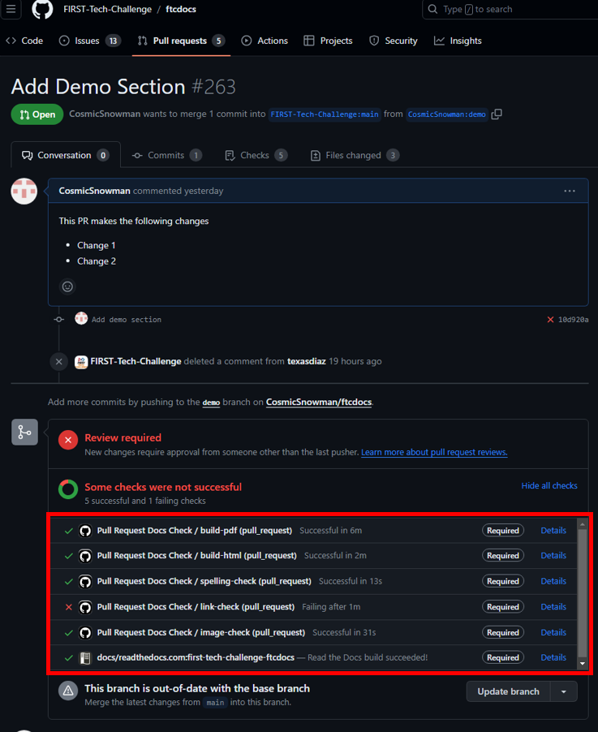
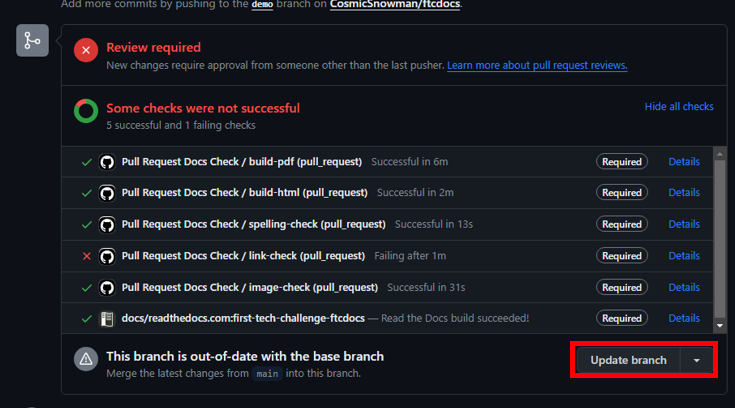
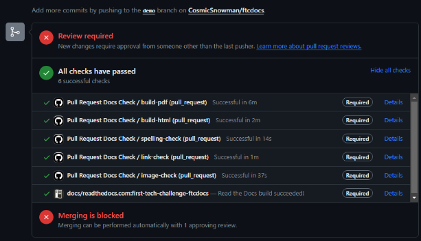

Submitting Your Changes for Review
==================================
:bdg-success:`Repeat` :bdg-info:`Codespaces` :bdg-warning:`Local`

Workflows
---------

Traditional Local Development
~~~~~~~~~~~~~~~~~~~~~~~~~~~~~

.. mermaid::

    flowchart TD

        working[Working Directory]
        staging[Staging Area]
        localrep[Local Repository]
        user[Contributor]
        

        subgraph FTCDocs_GitHub
        direction RL
        main[Main Branch]
        ex-branch[Example Branch]
        ex-branch<-->|Pull Request|main
        end

        subgraph Personal_FTCDocs_GitHub
        main2[Main Branch]
        dm-branch[Example Branch 2]
        ex-branch2[Example Branch]
        ex-branch2<-->|Pull Request|main2
        dm-branch<-->|Pull Request|main2
        end

        subgraph Local
        direction RL
        working-->|git add|staging
        staging-->|git commit|localrep
        localrep-->|git checkout|working
        localrep-->|git merge|working
        user-->|Changes|working
        end

        Personal_FTCDocs_GitHub-->|git pull|localrep
        localrep-->|git push|Personal_FTCDocs_GitHub
        ex-branch2<-->|Pull Request|main
        main2<-->|Pull Request|main
        

        FTCDocs_GitHub-->|Fork|Personal_FTCDocs_GitHub

Steps
------


Staging Your Changes
~~~~~~~~~~~~~~~~~~~~

Just because you have saved your files does not mean that they are ready to be committed. You must first stage your changes. This is done by using the command ``git add`` followed by the file name. 
If you want to stage all of your changes, you can use the command ``git add .``. 
This will stage all of the changes in the current directory and its subdirectories. If you want to stage all of the changes in the repository, you can use the command ``git add -A``. 
If you want to unstage a file, you can use the command ``git reset HEAD <file>``. Once a file is staged, it is ready to be committed. You can think of the staging area as a place to store changes that you want to commit. For 
more information on the staging area, see `Git SCM <https://git-scm.com/book/en/v2/Git-Basics-Recording-Changes-to-the-Repository>`_.

Committing Your Changes
~~~~~~~~~~~~~~~~~~~~~~~

Once you have staged your changes, you can commit them. This is done by using the command ``git commit -m "Your commit message"``. You can think of a commit as a snapshot of your changes. Each repository is 
a collection of commits each describing incremental changes relative to the previous commit. 

Pushing Your Changes
~~~~~~~~~~~~~~~~~~~~

Once you have committed your changes, you can push them to your fork of the repository. This is done by using the command ``git push origin <branch>``. This will push your local changes to the remote repository. 
This means it will be accessible to others. After this change is pushed, you can create a pull request.

Creating a Pull Request
~~~~~~~~~~~~~~~~~~~~~~~

Once you have pushed your changes, you can create a pull request. A pull request is a collection of commits that are being requested to be merged back to the main repository. 
This is done by going to the repository on GitHub and clicking the "New pull request" button. You will then be able to select the branch that you want to merge into the main branch. 
Follow the instructions `here <https://docs.github.com/en/pull-requests/collaborating-with-pull-requests/proposing-changes-to-your-work-with-pull-requests/creating-a-pull-request>`_ for 
more information on creating a pull request. 

Example
-------


1. Navigate to the directory of the repository on your local machine.

.. code-block:: bash

    cd docs/source

2. Ensure that you are on the correct branch. In this case we are on the branch "demo". If you are not on the correct branch, follow the :doc:`previous step <../switch_branch/switch-branch>`.

.. code-block:: bash

    git branch

3. Stage your changes. In this case we need to stage the new file, the images we use in it, as well as the changes to the table of contents.

.. code-block:: bash

    git add demo_section/demo-section.rst
    git add demo_section/images/demo.png
    git add index.rst

4. For the **first time** you commit changes, you will need to set your name and email.

.. code-block:: bash

    git config --global user.email "<INSERT YOUR EMAIL HERE>"
    git config --global user.name "<INSERT YOUR NAME HERE>"

5. Commit your changes. In this case we are adding a new section called "Demo" so we will use the commit message "Add demo section".


.. code-block:: bash

    git commit -m "Add demo section"

6. Push your changes to your fork of the repository.

.. code-block:: bash

    git push

7. Navigate to the `official FTC Docs repository <https://github.com/FIRST-Tech-Challenge/ftcdocs>`_ on GitHub

8.  Click ``Compare & Pull Request``. 

.. note:: This option is also available by clicking the "Pull Request" tab and then clicking the "New pull request" button. 
    Then click ``compare across forks``. Select ```<USERNAME>/ftcdocs``` for the head repository and the branch you want to merge. 
    Select `FIRST-Tech-Challenge/ftcdocs` for the base repository and the branch you want to merge into. Then click ``Create Pull Request``.



|

9. Fill out the pull request title and description. For more information on creating a pull request, see our :doc:`Contribution Guide </contrib/guidelines/guidelines>`.



|

10. Scroll down to see a preview of the changes you are proposing. 
    Make sure that everything looks correct and that no files or changes have been omitted. 
    Also make sure no erroneous changes are included.



|

11. If everything looks good, click ``Create Pull Request``.



|

12. After this you will be able to see your pull request and the status of the checks. 
    First time contributors will have to wait for a maintainer approval before the checks are run.

.. figure:: images/checks_standby.png
    :alt: Pull Request Page
    :align: center

|

13. After approval the checks will run. In this case the Link Checker failed. When checks fail 
    the FTC Docs maintainers will be notified and will help you fix the issue. In this case the 
    problem was because our branch is no longer up to date with the main branch. This can easily 
    be fixed by clicking the "Update branch" button. Generally the FTC Docs team will help you 
    with the process of passing the checks and updating your branch. 



|



.. note:: It can take several minutes for the checks to fully run. 

14. Once the checks have passed, the FTC Docs maintainers will review your pull request. 
    They will provide feedback and help you make any necessary changes. Once the pull request is approved, 
    it will be merged into the main branch.




