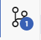
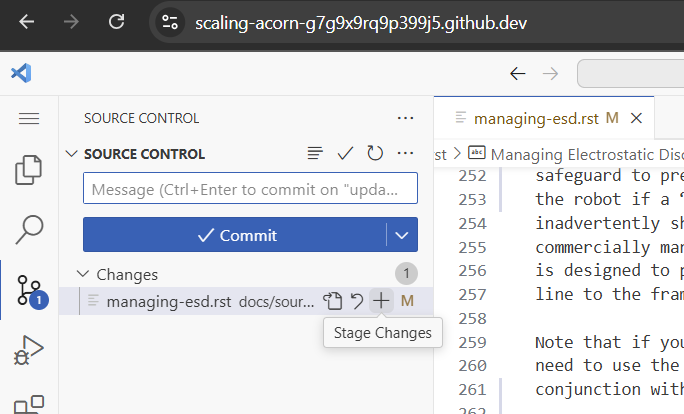
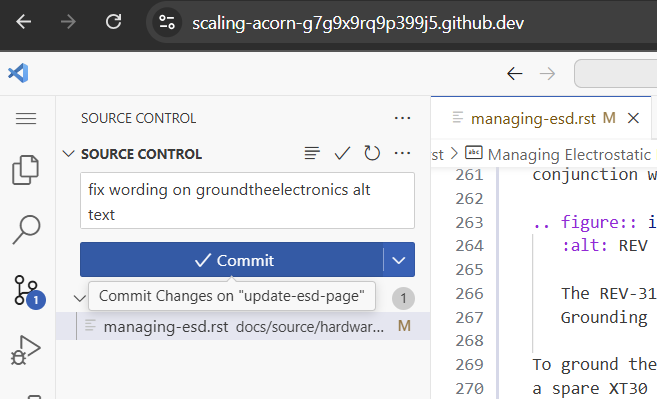
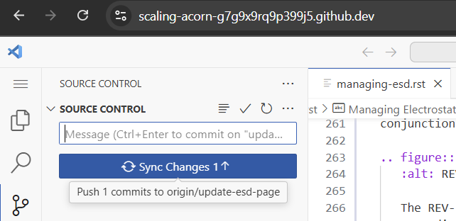

Submitting Your Changes for Review
==================================
:bdg-success:`Repeat` :bdg-info:`Codespaces` :bdg-warning:`Local`

Workflows
---------

The following diagram shows the workflow for submitting changes to the FTC Docs repository.
For first time users of Git/GitHub, do not worry if this seems confusing. First focus 
on understanding the steps and then the workflow will make more sense.

:bdg-warning:`Local` changes start in your local copy of the project. 
They move from the working directory to local Git staging and are then committed to the local repository.
From there they are pushed to your personal FTC Docs repository.

:bdg-info:`Codespaces` are part of your personal FTC Docs GitHub project. 
In a similar manner to local changes, Codespace changes are staged and committed to your personal FTC Docs repository.
Once any changes are in your personal FTC Docs repository they can be submitted as a Pull Request to the FTC Docs repository.

In the FTC Docs repository changes arrive as Pull Requests that are reviewed and approved.
They are then merged with the Main branch and the changes are published.

In a web browser this diagram can be zoomed and panned by using a mouse. Use the scroll wheel to zoom in and out. 
Right click and hold then drag to pan. The diagram is not keyboard accessible. 
A screen reader will read the various nodes and actions in the diagram and starts in the Local section of the diagram.

.. mermaid::
   :zoom:

    flowchart TD

        working[Working Directory]
        staging[Staging Area]
        localrep[Local Repository]
        user[Contributor]
        

        subgraph FTCDocs_GitHub
        direction RL
        main[Main Branch]
        ex-branch[Example Branch]
        ex-branch<-->|Pull Request|main
        end

        subgraph Personal_FTCDocs_GitHub
        main2[Main Branch]
        dm-branch[Example Branch 2]
        ex-branch2[Example Branch]
        ex-branch2<-->|Pull Request|main2
        dm-branch<-->|Pull Request|main2
        end

        subgraph Local
        direction RL
        working-->|git add|staging
        staging-->|git commit|localrep
        localrep-->|git checkout|working
        localrep-->|git merge|working
        user-->|Changes|working
        end

        Personal_FTCDocs_GitHub-->|git pull|localrep
        localrep-->|git push|Personal_FTCDocs_GitHub
        ex-branch2<-->|Pull Request|main
        main2<-->|Pull Request|main
        

        FTCDocs_GitHub-->|Fork|Personal_FTCDocs_GitHub

Overview
--------

Before getting started, it is important to understand what Git tries to accomplish. 
As Git is an incredibly powerful(and complex) tool, this can be difficult and overwhelming. 
This tutorial will attempt to simplify this by focusing on the most common use cases.

What is Git?
~~~~~~~~~~~~


.. mermaid::

    graph LR
        working[Working Directory]
        staging[Staging Area]
        localrep[Local Repository]
        user[Contributor]

        working-->|git add|staging
        staging-->|git commit|localrep
        user-->|Changes|working

**Simplified Local Git Repository Workflow**

Git is a version control system (VCS) that allows you to track changes to your files within a repository.
A repository is a collection of files that are being tracked by Git. You can think of a repository as a folder 
that contains all of the files that you are working on. 

However, Git does not track every change you make to a file.
This is because it would be inefficient to track every change and often distracting. Instead Git tracks changes in 
snapshots called commits. Each commit is a snapshot of the changes made to the files in the repository. A commit does 
not contain the entire file but only the changes made to the file. This allows Git to be efficient and fast. You can 
then think of each commit as a "Git save".

Before you can commit your changes, we must indicate which files we want to be updated in the commit. 
This is done by a process known as staging. Why don't we just commit all of the changes? Sometimes you may have 
changes that you do not want to commit. For example, maybe you deleted a file that you did not mean to delete. 
In addition, you may not want to commit build files or other temporary files that are not necessary for the repository.
Note that we have configured Git to ignore build files so you do not have to worry about them.

After you have staged and committed your changes, you can push them to the remote repository. This is the repository that you 
see on GitHub. This allows others to see your changes and collaborate with you. You have full control over what changes you 
want to push to the your :term:`fork <Fork>` of the :term:`main repository <Main Repository>`. In order for your changes to be reflected in the main FTC Docs 
website you will need to add your changes to the main repository. This is done by creating a :term:`pull request <Pull Request>`.

Steps
------

.. note:: 
    All of the following commands are typed and executed in the terminal. This can be found on the bottom 
    of the screen in VS Code.

Staging Your Changes
~~~~~~~~~~~~~~~~~~~~

As a reminder, staging is the process of indicating which files you want to be included in the next commit ("Git Save"). This 
is done by using the :bdg-warning:`Local` command ``git add <file>``. You can add multiple files by separating them with a space.

In :bdg-info:`Codespaces` click on the source control icon which will display the source control panel.



Click on the + symbol next to each changed or new file in the source control panel to stage that file.


   
Committing Your Changes
~~~~~~~~~~~~~~~~~~~~~~~

Once you have staged your changes, you can commit them. This is done by using the :bdg-warning:`Local` command ``git commit -m "Your commit message"``. 
You can think of a commit as a snapshot of your changes. Each repository is 
a collection of commits each describing incremental changes relative to the previous commit. 

In :bdg-info:`Codespaces` enter a commit message in the source control panel and click the Commit button.



Pushing Your Changes
~~~~~~~~~~~~~~~~~~~~

Once you have committed your changes, you can push them to your fork of the repository. This is done by using the :bdg-warning:`Local` command ``git push origin <branch>``. 
This will push your local changes to the remote repository. 
This means it will be accessible to others. After this change is pushed, you can create a pull request.

In :bdg-info:`Codespaces` click the Sync Changes button.



Creating a Pull Request
~~~~~~~~~~~~~~~~~~~~~~~

Now that you have pushed your changes to your :term:`fork <Fork>` of the repository the next step is propose these changes to the :term:`main repository <Main Repository>`.
Why don't we just push our changes to the main repository? This is because the pull request allows the maintainers of the main repository to review your changes before they are merged. 
This is important as it allows comments and feedback to be given on your changes. For details on how to create a pull request, see the next section.

Example
-------

The following is a :bdg-warning:`Local` example of all the Git commands. The pull request commands are done in GitHub starting at step 7.

If you are using :bdg-info:`Codespaces` just skip to step 7.

1. Navigate to the directory of the repository on your local machine.

.. code-block:: bash

    cd docs/source

2. Ensure that you are on the correct branch. In this case we are on the branch "demo". If you are not on the correct branch, follow the :doc:`previous step <../switch_branch/switch-branch>`.

.. code-block:: bash

    git branch

3. Stage your changes. In this case we need to stage the new file, the images we use in it, as well as the changes to the table of contents.

.. code-block:: bash

    git add demo_section/demo-section.rst
    git add demo_section/images/demo.png
    git add index.rst

4. For the **first time** you commit changes, you will need to set your name and email.

.. code-block:: bash

    git config --global user.email "<INSERT YOUR EMAIL HERE>"
    git config --global user.name "<INSERT YOUR NAME HERE>"

5. Commit your changes. In this case we are adding a new section called "Demo" so we will use the commit message "Add demo section".


.. code-block:: bash

    git commit -m "Add demo section"

6. Push your changes to your fork of the repository.

.. code-block:: bash

    git push

7. Navigate to the `official FTC Docs repository <https://github.com/FIRST-Tech-Challenge/ftcdocs>`_ on GitHub.
8. Click ``Compare & Pull Request``. 

   .. note:: This option is also available by clicking the "Pull Request" tab and then clicking the "New pull request" button. 
       Then click ``compare across forks``. Select ```<USERNAME>/ftcdocs``` for the head repository and the branch you want to merge. 
       Select `FIRST-Tech-Challenge/ftcdocs` for the base repository and the branch you want to merge into. Then click ``Create Pull Request``.

   .. image:: images/compare_and_pr.png
       :alt: Screenshot showing the Compare & Pull Request button highlighted.

9. Fill out the pull request title and description. For more information on creating a pull request, see our :doc:`Contribution Guide </contrib/guidelines/guidelines>`.

   .. image:: images/pr_desc.png
       :alt: Screenshot showing the pull request title and description.

10. Scroll down to see a preview of the changes you are proposing. 
    Make sure that everything looks correct and that no files or changes have been omitted. 
    Also make sure no erroneous changes are included.

    .. image:: images/preview_changes.png
       :alt: Screenshot showing the changes in this pull request.

11. If everything looks good, click the ``Create Pull Request`` button.

    .. image:: images/create_pr.png
       :alt: Screenshot showing the Create Pull Request button highlighted.

12. After this you will be able to see your pull request and the status of the automated checks. 
    First time contributors will have to wait for a maintainer approval before the checks are run.

    .. image:: images/checks_standby.png
       :alt: Screenshot of the Pull Request Page showing review required and check status.

13. After approval the checks will run. In this case the Link Checker failed. When checks fail 
    the FTC Docs maintainers will be notified and will help you fix the issue. 
    Generally the FTC Docs team will help you 
    with the process of passing the checks and updating your branch. 

    .. figure:: images/check_result.png
       :alt: Screenshot of the Pull Request Page showing all checks passed except link check.
    
    Another problem was because our branch is no longer up to date with the main branch. This can easily 
    be fixed by clicking the "Update branch" button.
    
    .. figure:: images/update_branch.png
       :alt: Update Branch

    .. note:: It can take several minutes for the checks to fully run. 

14. Once the checks have passed, the FTC Docs maintainers will review your pull request. 
    They will provide feedback and help you make any necessary changes. Once the pull request is approved, 
    it will be merged into the main branch.

    .. figure:: images/all_checks.png
       :alt: Screenshot showing all checks passed.
       
       This pull request still has a Review Required and Merging is Blocked until there is an approving review.

