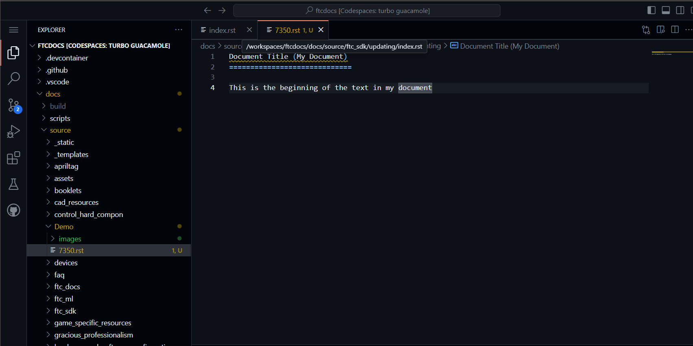
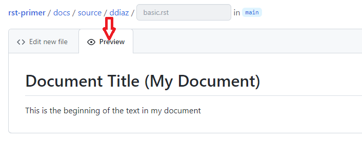
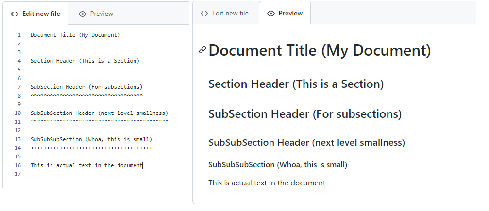
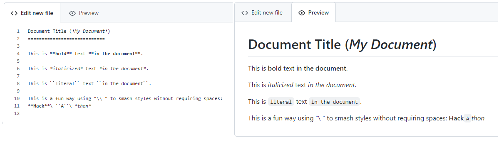

Basic rST Content
=================

This section should be used as a reference for building basic documents
using ReStructured Text. When building a document, you generally have the
actual content that the text is meant to include; if you ONLY included this
content then your document is just one long text document - boooring! In
order to add formatting and pizzazz to your document, authors usually add
formatting such as titles, links, text formatting, bulleted and numbered 
lists, and so on. This section introduces the basics of creating text
and many of the simple add-ons that are common for web documents.

It's also important to note that all of these basic formatting commands
are all supported by the basic preview within GitHub. More complex formatting
commands (admonitions, drop-downs, advanced formatting, and so on) are not 
supported by the basic preview and requires full rendering in order to preview.
Those commands will be covered by intermediate and advanced content tutorials.

This tutorial covers these basic building blocks of simple documents (these are quick links within the document):

* `Simple Paragraph Content`_
* `Transitions`_
* `Document Title`_
* `Section Headers`_
* `Text Formatting`_
* `Internal Links`_

  * `Links with Anchors`_
  * `Referencing Sections`_

* `External Links`_

  * `Simple External Link`_
  * `Embedded URI`_

* `Embedding External Images`_

  * `Embedding Images using the image directive`_
  * `Embedding Images using the figure directive`_

* `Lists`_

  * `Bulleted Lists`_
  * `Enumerated Lists`_
  * `Definition Lists`_

Okay, so now let's cover these topics one by one. 

----

Simple Paragraph Content
------------------------

ReStructured Text is based on the Python programming language (yes, the name
was inspired after reading scripts from "Monty Python's Flying Circus", a
comedy series from the 1970's). In Python, text indentation is incredibly
important - normal text should start in the first column of the line, and
anything that is indented (meaning whitespace precedes the text on a line) has
a specific meaning based on what was written on the preceding lines. Blank
lines and whitespace is also very important, and rules for these must be
followed explicitly. It will initially seem like there are a TON of rules to
creating documents - and there are - but once you start making documents
yourself hopefully most of the rules will "just make sense" and they will fly
out your fingertips without thinking about them.

When writing basic text, there are things to keep in mind:

1. Where text starts is important. Main text should start on the first column
   of the line, SO DO NOT INDENT the beginnings of paragraphs like your 
   teacher in grade school taught you to do. Anything indented "has special
   meaning" and introduces special formatting to the text - the indentation 
   rules will be explained later when introducing those formatting elements.
2. Lines and paragraphs do not necessarily end with newlines. All text within
   a paragraph continues until a completely blank line is reached. What this
   means is that your paragraph content is allowed to be on as many consecutive
   lines as you want. For example, the following content:

   .. code::

      This is a sentence, it is a normal sentence of normal length.
      This is the next sentence, it is shorter.
      This is a third sentence, you can see how the text wraps.
      
      This is a sentence after a blank line. 

   **would be ultimately rendered on a webpage as:**

      This is a sentence, it is a normal sentence of normal length.
      This is the next sentence, it is shorter.
      This is a third sentence, you can see how the text wraps.

      This is a sentence after a blank line, it starts a new paragraph.

   Notice how the lines are combined into a single paragraph ignoring any
   newlines at the end of each sentence. In order to start a new paragraph, 
   you must separate paragraph content with blank lines (no text).
3. Because of (2), we generally tend to create documents with a "text width" of
   80 - meaning lines in the source document are kept to about 80 characters,
   give or take. It is less important to keep to 80 characters as it is to be
   consistent within your document. If this doesn't make sense, just ask 
   anyone who has made a few documents and they can explain it - once you 
   understand, you understand.
4. Remember we talked about indentation? Indenting paragraphs requires 3 or 
   more whitespaces of indentation from the last beginning column of the
   previous paragraph. Let's look at a practical example.

   .. code::

      This is the first paragraph. It might
      be one or more lines.

         Here's an indented paragraph. It must start 3 or more
         whitespace characters from the last paragraph. Lines can
         continue as long as they are at the same indentation as
         the new paragraph, like these 4 lines.

            Here's a second indentation.
            Note that everything is indented nicely.
            Also note a blank line between each paragraph level.

         This is aligned with the first indented paragraph. It is 
         at the same indentation. Note blank lines between levels.

      This is a second main paragraph. This is at the
      same level as the first main paragraph.

   **This will be rendered as:**

      This is the first paragraph. It might
      be one or more lines.

         Here's an indented paragraph. It must start 3 or more
         whitespace characters from the last paragraph. Lines can
         continue as long as they are at the same indentation as
         the new paragraph, like these 4 lines.

            Here's a second indentation.
            Note that everything is indented nicely.
            Also note a blank line between each paragraph level.

         This is aligned with the first indented paragraph. It is 
         at the same indentation. Note blank lines between levels.

      This is a second main paragraph. This is at the
      same level as the first main paragraph.

----

Transitions
-----------

You might notice the "separator lines" between sections in this document - those
are not done automatically, those are special elements knows as "transitions." 
Transitions are simply four or more punctuation characters between blank lines
(meaning there's a blank line before and after the transition). Any punctuation
characters can be used, but it's recommended to keep to a consistent style in 
your documentation. Hence, it's recommended to use dashes (-). 

For example::

   ----

Creates a line transition separator in a document.

----

Document Title
--------------

When you're editing a file, your document title header should be on
the first line of your document. GitHub is really nice in that it provides
line numbers for all your document lines. Documents are NOT required to have
title headers, however, so when we do use a title header we put special
characters underneath the titles to indicate that the text should be formatted
as a Title. As a general rule of thumb, we use Equal Signs (`=`) as our document
title indicator. A document title has the following rules:

1. Title Text should be on the first line, and must start in column 1 (no
   indentation).
2. Special Characters - in this case equal signs (`=`) - must be used on the
   next line, and must be as long or longer than the Title Text.
3. There should be a blank line after the special character line.

So below we can see an example of creating a document title. Note that the
title text is on the first line, the special characters are below the title and
start and extend the full width of the title, and there is a blank line after
the special characters. Then we can start a new line to start the actual text
of the document (remember, you can click on any image to see the full
resolution image):

   Example of Editing a Document with a Title

Great! So what will this document ACTUALLY look like on the web or in print?
For all these "basic" ReStructured Text features we can actually Preview what
the document looks like within the Preview area. You can click on the Preview
tab to see a real-time preview of what the document will actually render to.

   Example of Previewing a Document with a Title

.. note::
   Realize that the special character you use could be almost any special
   character, but we generally tend to standardize on using an Equal Sign
   (=) for titles. Once you use a special character in a document to define
   a heading (like a Title, a Section, a SubSection, and so on) that character
   will be used to define the heading throughout the document. It's important
   to be consistent, which is why we have recommended special character
   progressions.

----

Section Headers
---------------

Section Headers are just like titles; they're actually both related, and are
treated the exact same way. Section Headers do follow a progression - titles
use the largest heading font size, sections use the next smallest heading font
size, subsections use the next smallest heading font size, and so on. This
progression is not changeable - as in you cannot "skip" a font size - each
new heading type you use will just use the next smallest size font.

In order to create a new Section, SubSection, SubSubSection, and so on, we just
use a special character that we will define for each level. The standard special
characters used in Python are::

   Titles
   ====== (Equals)

   Sections
   -------- (Dash)

   SubSection
   ^^^^^^^^^^ (Carrot)

   SubSubSection
   """"""""""""" (Double Quotes)

   SubSubSubSection
   ++++++++++++++++ (Plus Sign)

This is what should be used for different levels of sections. Additional
special characters that can be used beyond these levels (in case they are
needed) are Pound Signs (#) and Asterisks (*). Here's what using Sections
looks like:

   Example of using Sections in a Document

The great thing about sections is that each section gets an automatic
anchor that can be used to reference that section within the document. Just
hover over a section and you'll see a "link" icon show up, and if you click on the "link" icon the URL in the browser will reflect the anchor you can use to
direct someone specifically to this section of the document.

.. warning::
   Titles/Sections/SubSections/etc. must all be uniquely named within the same
   document. In the advanced quickstarts you'll be shown how to reference
   sections within documents, even within documents between projects, and these
   require unique headers per document (you can have the same title/header in
   different documents, just not within the same document).

----

Text Formatting
---------------

You can add simple text formatting - like **Bold**, *italics*, and
``literals`` really simply in ReStructured Text using simple inline markup.
The caveat is that these Text Formatting *do not stack*, meaning you cannot
have "Bold Italics" or "Italiczed Literal". You'll find that virtually none
of the inline markup styles (Including Text Formatting, External Links, and so
on) can stack, so having things like the italicized word *FIRST* in link text
requires really inventive and complex procedures in order to make happen
(sometimes it's not possible at all). Another caveat is that underlining
is not natively supported by ReStructured Text, in order to have underlining
you must mess with style sheets and pdf layout definitions in order to do
(YUCK!).

The standard Text Formatting Markup is quite simple - use:

* One Asterisk: \*text\* for emphasis (italics) - like *text*
* Two Asterisks: \*\*text\*\* for strong emphasis (boldface) - like **text**
* Two Backquotes: \`\`text\`\` for literals - like ``text``

There are a few important restrictions to be aware of:

* You cannot nest/stack inline markup
* Content may not start or end with whitepace: For example, \* text* is wrong
* You must separate inline markup from surrounding text by non-word characters,
  like spaces. For example, \*This text is italicized\* will look like *This
  text is italicized*. However, \* This text is not\* will not render as
  expected because of the space between the first asterisk and the word or
  phrase that is expected to follow.

   * One way to avoid this is using a "forced whitespace character", or "\ "
     without the quotes (you can tell rST to "force" a character by preceding
     the character with a backslash (\\). For example, we can have Bold and
     Italics right next to each other without requiring spaces by "injecting"
     the forced whitespace character that will remain unseen - \*\*Alien\*\*\\
     \*Nation\* will be seen as **Alien**\ *Nation*.

It's REALLY nice that the standard GitHub editing window provides some
in-line features to show that you're using text formatting - for instance
if you bold something, the text will appear bold and the same goes for
italicize. This gives you context of what is happening as you do it.

Here are a few examples:

   Example of using Text Formatting in a Document

----

Internal Links
--------------

It is important to note that this is for internal links within the 
same document. For creating document links between documents, see the
\:doc: and \:ref: commands.

Links with Anchors
^^^^^^^^^^^^^^^^^^

Internal Links using Anchors are ways to "jump to" various places within a
single document.  If you're familiar with HTTP anchors, this follows the exact
same concept.  You can create an anchor anywhere in text that WILL NOT be
displayed to users in the following way:

\.\. _anchor\: 

  * A blank line must come before the Anchor and after the Anchor.
  * This requires two periods at the beginning of the line.
  * Followed by a space
  * Followed by an underscore
  * Followed by a descriptor for the anchor
  * Followed by a colon

.. note::
   This is the first time we've introduced what's known as a *directive*, which
   is a *block* that begins with two periods and a space. Often directives help
   format special blocks of text in very specific ways - in this case, the
   underscore prior to the label identifies this as an *anchor directive*.
   Most often directives have TWO colons following the directive name, but in
   this case a single colon identifies this as a *simple directive* versus an
   *external directive*, and helps rST determine how to process the directive. 

The name ``anchor`` can be replaced by any descriptor, like for example: 
``.. first-example:``

Then, you can create an internal link anywhere in your text that directs to
that anchor, in the following way:

anchor\_

  * This is simply the anchor descriptor
  * Followed by an underscore

Therefore, in order to reference the ``.. first-example:`` anchor, you would 
use ``first-example_`` as the link text in your content.

Links with Anchors Example
""""""""""""""""""""""""""

In plain text, this could look like::

   This is a link to an anchor_.
   This reference can be anywhere before or after the anchor. 
   
   .. _anchor:
   
   This is text following the anchor.
   The anchor helps to reference this text.

**And this would be rendered as:**

   This is a link to an anchor_.
   This reference can be anywhere before or after the anchor.

   .. _anchor:

   This is text following the anchor.
   The anchor helps to reference this text.

Referencing Sections
^^^^^^^^^^^^^^^^^^^^

This one is really simple - every title, section, subsection, subsubsection,
and so on already has an anchor built-in. The name of the anchor is the 
name of the section. In order to use a section reference, just wrap the 
section name in ` (back tick) characters and then follow with an underscore.

Referencing Sections Example
""""""""""""""""""""""""""""

In plain text, a section can be created and referenced like::

    Section Name
    ------------
   
    This is a link to `Section Name`_

As another real-life example within this document, I can jump to the top
of this document really easily by using the name of the document title.

In plain text, this is what it would look like::

   `Basic rST Content`_

**And here's how it would be rendered (click the link to jump to the top):**

   `Basic rST Content`_

Pretty easy!

----

External Links
--------------

External Links provide a way to link to external websites.  These are just
another form of inline markup, with a few caveats.

Simple External Link
^^^^^^^^^^^^^^^^^^^^

A simple External Link is simply the http address.

* Just put the name of the URL and rST will detect it and provide an 
  auto-link for you. 

For example, simply writing::

   *FIRST* Website: https://www.firstinspires.org

**creates the rendered text with the link embedded:**

   *FIRST* Website: https://www.firstinspires.org

Embedded URI
^^^^^^^^^^^^

An embedded URI can provide user-readable text with a link while hiding the
actual URL. An embedded URI looks a lot like a Section Reference link, with 
an added URL component.

An embedded URI follows this example: 

* \`Description\<URL>\`\_

  * It starts with a ` (back tick) symbol
  * Followed by a description of the URL. 
  * Then it defines the URL within angle brackets (\< \>) 
  * Followed by another ` (back tick) symbol 
  * Followed by an _ (underscore) character

For example::

   `Microsoft <https://microsoft.com/en-us>`_ 

**would be rendered as:**

   `Microsoft <https://microsoft.com/en-us>`_

As another example::

   `REV Robotics Website <https://www.revrobotics.com>`_ 

**would be rendered as:**

   `REV Robotics Website <https://www.revrobotics.com>`_
   
----

Embedding External Images
-------------------------

Embedding Images using the image directive
^^^^^^^^^^^^^^^^^^^^^^^^^^^^^^^^^^^^^^^^^^

There are multiple ways to embed external images. The most common way is to 
use the ``.. image::`` directive. This directive can use a local path within
your document project, or it can use an external URI.

Two examples of using the image directive:

.. code::

   Including an inline image using a URI
   .. image:: https://m.media-amazon.com/images/I/51-2PZby7KL.jpg

   Including an inline image using a file path
   .. image:: images/myimage.png

Directives can include options, which change parameters used with the
directive. Options for directives are defined IMMEDIATELY AFTER the
directive (on the next line), indented AT LEAST three spaces, with one
option on each line. Options on these lines are defined by having a 
colon before and after the option, followed by the value of the option.

The options supported by the ``image`` directive are:

alt : *text*
   Alternate text: a short description of the image, displayed by applications
   that cannot display images, or spoken by applications for visually impaired
   users
height : *length*
   The desired height of the image. Used to reserve space or scale the image
   vertically. When the "scale" option is also specified, they are combined.
   For example, a height of 200px and a scale of 50 is equivalent to a height
   of 100px with no scale.
scale : *integer percentage (the "%" symbol is optional)*
   The uniform scaling factor of the image. The default is "100 %", i.e. no
   scaling.
width : *length or percentage of the current line width*
   The width of the image. Used to reserve space or scale the image
   horizontally. As with "height" above, when the "scale" option is also
   specified, they are combined. It is often preferable to use *width*
   over *height* or *scale*.
align : "top", "middle", "bottom", "left", "center", or "right"
   The alignment of the image, equivalent to the HTML  tag's deprecated
   "align" attribute or the corresponding "vertical-align" and "text-align" CSS
   properties. The values "top", "middle", and "bottom" control an image's
   vertical alignment (relative to the text baseline); they are only useful for
   inline images (substitutions). The values "left", "center", and "right"
   control an image's horizontal alignment, allowing the image to float and
   have the text flow around it. The specific behavior depends upon the browser
   or rendering software used.
target : *text (URI or reference name)*
   Makes the image into a hyperlink reference ("clickable"). The option
   argument may be a URI (relative or absolute), or a reference name with
   underscore suffix (e.g. \`a name`_).

Examples of using these options:

.. code::

   .. image:: https://m.media-amazon.com/images/I/51-2PZby7KL.jpg
      :width: 80%
      :alt: This is alternate text for the image
      
   .. image:: images/picture.jpeg
      :height: 100px
      :width: 200 px
      :scale: 50 %
      :alt: alternate text
      :align: right

It is important to remember that directives must have a blank line before the 
directive and must have a blank line after the directive (and all its options).

.. warning::
   Images with the extension ``.gif`` and ``.svg`` are not supported in 
   PDF format. For documentation that will be used in PDFs, do not externally
   link to files with these extensions. It is possible to use these files
   when using a file path, as long as supported versions of the files exist.
   For example, if you have both ``picture.svg`` and ``picture.png``, you can
   command the HTML to use one version and the PDF to use *any supported 
   version* through using a * (asterisk) in the file extension, like so:
   
   .. code::

      .. image:: images/picture.*

Embedding Images using the figure directive
^^^^^^^^^^^^^^^^^^^^^^^^^^^^^^^^^^^^^^^^^^^

The ``.. figure::`` directive is very similar to the ``.. image::`` directive, 
as a matter of fact the ``figure`` directive *contains* an ``image`` directive
but also allows for an optional caption (a single paragraph) and an optional
legend (with arbitrary body elements).

The ``figure`` directive supports all of the options of the ``image``. These
options, except ``:align:``, are passed on to the contained image. The following
options are important for the ``figure``:

align : *"left", "center", or "right"*
   The horizontal alignment of the figure, allowing the image to float and have
   the text flow around it. The specific behavior depends upon the browser or
   rendering software used.
   
Figures are probably the best way of showing images as they allow captions to
help describe and label images. Some examples of using figures are:

.. code::

   .. figure:: images/picture.png
      :width: 80%
      :alt: Map to buried Treasure

      This is the caption of the figure (a simple paragraph). Note that the
      intentation for everything below the ``.. figure::`` line is the same
      and 3 or more spaces, which indicates that everything belongs to the
      figure.

   .. figure:: https://m.media-amazon.com/images/I/51-2PZby7KL.jpg
      :width: 80%
      :alt: Alternate Text

      Simple Caption for Figure

You can see more about the ``figure`` directive at the `Figure Directives Link <https://docutils.sourceforge.io/docs/ref/rst/directives.html#figure>`_.

----

Lists
-----

There are five kinds of lists:

* `Bulleted Lists`_
* `Enumerated Lists`_
* `Definition Lists`_
* `Field Lists <https://docutils.sourceforge.io/docs/ref/rst/restructuredtext.html#field-lists>`_
* `Option Lists <https://docutils.sourceforge.io/docs/ref/rst/restructuredtext.html#option-lists>`_

We'll discuss the first three only - for Field and Option lists, click the
links to go to the specifications for those types of lists.

Bulleted Lists
^^^^^^^^^^^^^^

Bulleted lists, also known as "unordered lists", are simple text blocks between
blank lines. A text block that begins with an asterisk (*), plus (+), dash (-),
or bullet (•), followed by whitespace, is a bullet list item. However, stick to
a consistent character to use for list items. List item bodies must be
left-aligned and indented relative to each other like paragraphs; the text
immediately after the bullet determines the indentation.

For example, consider the following simple bulleted list example::

   - This is the first bullet list item. It is required that
     there be a blank line above the first list item; blank 
     lines between list items is optional. Note that each 
     subsequent line is indented to group them together.

   - This is the first paragraph in the second item in the list.

     This is a second paragraph in the second item in the list. The
     blank line above this paragraph is required. The left edge
     of this paragraph lines up with the paragraph above, both 
     indented relative to the bullet.

     - This is a sub-list. The bullet lines up with the left edge
       of the text blocks above. A sublist is a new list, so it requires
       a blank line above and below.

     - This is the second item in the sub-list.

   - This is the third item in themain list.

   This is a new paragraph, not part of the list.

Here are examples of **incorrectly** formatted bullet lists::

   - This first line is fine.
   A blank line is required between list items and paragraphs, so this is bad.

   - The following line appears to be a new sublist, but it is not:
     - This is a paragraph continuation, not a sublist (since there's
       no blank line). 
      This line is also incorrectly indented.

Enumerated Lists
^^^^^^^^^^^^^^^^

Enumerated lists are similar to bulleted lists, except they can use
enumerators. An enumerator consists of an enumeration sequence member
and formatting, followed by a whitespace.

The following enumeration sequences are recognized:

* Arabic numerals: 1, 2, 3, ... (and so on, no upper limit).
* Uppercase alphabet characters: A, B, C, ..., Z.
* Lowercase alphabet characters: a, b, c, ..., z.
* Uppercase Roman numerals: I, II, III, IV, ..., MMMMCMXCIX (4999).
* Lowercase Roman numerals: i, ii, iii, iv, ..., mmmmcmxcix (4999).
* Hashtag (#) - this is known as an auto-enumerator, and uses arabic numerals
  beginning with 1.

The following formatting is recognized:

* Suffixed with a period: "1.", "A.", "a.", "I.", "i.", etc...
* Surrounded by parenthesis: "(1)", "(A)", "(a)", and so on.
* Suffixed with a right-parenthesis: "1)", "A)", "a)", and so on.

The following situations creates new lists:

* An enumerator with a different format produces a new list (e.g. "1.", "(a)"
  produces two separate lists).
* Enumerators not in sequence produces a new list (e.g. "1.", "3." produces two
  separate lists)

Here is an example of an enumerated list::

   1. This is item #1
   2. This is item #2

      (a) This is item 1 in the sub-list
      (b) This is item 2 in the sub-list

   3. This is item #3.

Here is the same list using an auto-enumerator::

   #. This is item #1
   #. This is item #2
   #. Auto-enumerators are useful when adding things
      into lists without having to manually re-number
      or re-order lists.

      (a) This is item 1 in the sub-list

   #. This is the fourth item in the main list.

Here is an example of a nested enumerated list::

   1. This is Item 1

      a) Item 1a
      b) Item 1b

   2. a) Item 2a
      b) Item 2b

   3. This item won't be correct, because
   this line after is not indented properly

Definition Lists
^^^^^^^^^^^^^^^^

Definition lists are really useful in several ways:

* As a dictionary or glossary.
* To describe program variables, or other items

Each definition list item contains a term, optional classifiers, and a
definition.

* A *term* is a simple one-line word or phrase. If this *term* leads with 
  a hyphen, use an escape (\) character before the leading hyphen to 
  prevent recognition as an option list item.

  * Optional classifiers may follow the term on the same line, each after an
    inline " : " (space, colon, space). Inline markup is parsed in the term
    line before the classifier delimiters are recognized. A delimiter will only
    be recognized if it appears outside of any inline markup.

* A *definition* is a block indented relative to the term, and may contain
  multiple paragraphs and other body elements. There may be no blank line
  between a term line and a *definition* block (this distinguishes *definition*
  lists from block quotes). Blank lines are required before the first and
  after the last *definition* list item, but are optional in-between.

Example::

   term 1
       Definition for Term 1
   term 2
       Definition for Term 2, first paragraph.
       This is a continued line for the first paragraph.

       Second paragraph for definition of term 2.
   Term 3 : classifier
       Definition for term 3.
   Term 4 : classifier one : classifier 2
       Definition for Term 4
   \-term 5
       Without escaping, this would be an option list item.

**Once rendered, this looks like:**

   term 1
       Definition for Term 1
   term 2
       Definition for Term 2, first paragraph.
       This is a continued line for the first paragraph.

       Second paragraph for definition of term 2.
   Term 3 : classifier
       Definition for term 3.
   Term 4 : classifier one : classifier 2
       Definition for Term 4
   \-term 5
       Without escaping, this would be an option list item.

