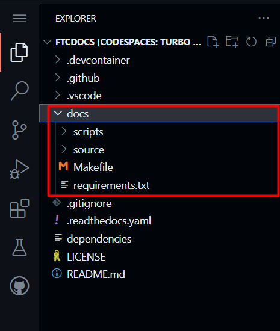

Creating rST Documents
======================

.. note::
   It is assumed that you have created a GitHub account and been given the proper 
   permissions to work within this repository for training. If you can read this,
   you probably have, but double-check with your friendly FTC Support person.

Now that we have created our branch, now we can begin making our own special 
changes to our branch - i.e. adding or modifying content. Remember, our branch
is our place to make any kinds of changes we want, we just have to understand 
*where* and *how* to make those changes.

Understanding the rst-primer Structure
--------------------------------------

The rst-primer repository is a "map" of the files and how they'll be presented
to users on the website. Filenames and where they're located in the folder 
structure of the repository define the ultimate web experience users will have
interacting with your final documentation.

Quick GitHub Folder Listing Intro
^^^^^^^^^^^^^^^^^^^^^^^^^^^^^^^^^^^^

For those unfamiliar with the GitHub folder (also known as "directories")
structure listing, here's a quick introduction:

.. figure:: images/github-dir-final.png
   :width: 80%
   :alt: GitHub Folder Listing Info
   :align: center

   GitHub Folder Listing Info

1. Branch Indicator and Selection - Here you can see which branch you're viewing,
   and select another branch if you want to view a different one.
2. Repository Path Location of the currently viewed folder - This helps you 
   understand where you are within the Repository. On the main page of the 
   repository there is no path shown, but on all other locations within the 
   repository the path indicates where you are.
3. File Search Tool - If you can't find a file by browsing through the folder,
   or you want to "quick-find" a particular file (useful for listing all of the
   "index.rst" files especially) this tool can help you out.
4. New File Creation Tool (can also create folders) - this can help you 
   create new files (or files within new folders) via the web client.
5. Last user to commit a change, and description of the change - this is helpful
   to understand what the last changes were to the repository you're looking at. 
   This is mostly useful when trying to remember what change was last made to a
   particular branch.
6. Folder/File Name - Within the row, this shows you a given folder or file for 
   fast navigation.
7. Last Commit Description for changes within the Folder/File - new users often 
   mistake this for a description of the folder or file that this row is referring
   to, but this is actually the description of the last commit made to the folder 
   or file and generally has absolutely nothing to do with what content is within 
   the folder or file. This can be really confusing for new users, FYI.
8. How long ago the last commit was made - this way you can see how long ago changes
   were made to folders or files. This information shows you how potentially 
   outdated content may be.

Repository Main Folder
^^^^^^^^^^^^^^^^^^^^^^

We're going to call the first folder in the repository the "**repository
main folder**". This is the main folder where viewers of the repository
can get important information regarding what the repo is for, what license the
repository is managed by, and so on. As a contributor of this repository, most
of the content here will not be important to you.

   Repository Main folder for rst-primer

Docs Folder
^^^^^^^^^^^

Within the **repository main folder** will almost always be a folder that
contains the actual project files for the project - for the *rST-Primer*
repository, that folder is the ``docs/`` folder. The ``docs/`` folder 
is where the top-level build definitions are for building the documentation. 

   rST-Primer Docs Folder

Again, as a documentation contributor the contents of this folder will
likely not be of interest to you right now, but for project builders and 
maintainers this is where the "magic happens." The important element here is
that this is where the ``source/`` folder is located. The ``source/`` 
folder is the actual starting point for the documentation and the rST-primer
website.

Source Folder
^^^^^^^^^^^^^

Within the ``docs/`` folder you will find the ``source/`` folder. Please
take careful notice that above the folder listing we can see the full
repository *path* of where these files and folders are within the repository;
we are currently viewing the current contents of ``rst-primer/docs/source``. 

.. figure:: images/source-directory.png
   :width: 80%
   :alt: source Folder
   :align: center

   rST-Primer Source Folder 

When we work on documentation, it's important to understand that there are TWO 
related paths that we must keep track of: 

*Repository Location*
  This is the location of the file within the repository. This is conveniently
  shown in the path within GitHub. This location is only used as a reference
  within GitHub, where the full *repository location* is sometimes needed.

*Document Location*
  This is the location within the final website where the document will exist. 
  The document location for files is the same as the *repository location* 
  minus the ``rst-primer/docs/source``. For example, a file with 
  a *repository location* of ``rst-primer/docs/source/tutorial/overview/overview.rst``
  would have a *document location* of ``/tutorial/overview/overview.rst``. We 
  will use this *document location* within our documents.

We will refer to these different document locations within this and future 
documents. 

As previously stated, this ``rst-primer/docs/source`` repository location is
the main starting point for the documentation in all forms that it can take -
e.g. this is the "root" location for the site's PDF document, is the "root"
location for the html website, and so on. This "root" location has some very
special files and folders:

:octicon:`file-directory;1em;sd-text-info` *_assets*
  The *_assets* folder contains asset files that are used site-wide, such as
  the *FIRST* Tech Challenge logos and icon. Assets that could be included on
  all pages of the site, regardless of the content on the page, can be placed 
  here for easy inclusion within templates and static content. However, any
  assets that are specific to content on the site should be placed with the
  content documentation instead. This folder starts with an \`_\` underscore
  symbol, meaning it's designated as a special folder whose contents should 
  only be modified with the help of site administrators.

:octicon:`file-directory;1em;sd-text-info` *_static*
  The *_static* folder, a *special folder* signified by the underscore
  prefix in its name, contains HTML-specific code that is necessary to format
  the documentation in HTML. This code should never need to be edited or
  updated by a document contributor, but if you feel you do then please
  coordinate any changes with an administrator.

:octicon:`file-directory;1em;sd-text-info` *_templates*
  The *_templates* folder, a *special folder* signified by the underscore
  prefix in its name, is used by Sphinx's templating engine, Jinja, to override
  the way Sphinx manages its basic theme to allow customizations of the page
  layout, the header content, and the footer content (among others).  Again,
  this isn't likely something a document contributor should need to edit (other
  than possibly adding content if you feel the need) but please work with an
  administrator to coordinate any updates to the HTML site templates.

:octicon:`file-directory;1em;sd-text-info` *tutorial*
  The *tutorial* folder is *NOT* a special folder, this is simply a 
  content folder for the rST-Primer tutorial. All content must be within a
  content folder of some kind, and the content folde are the primary 
  way to organize content. The folder structure is also used by the HTML 
  formatter to list files on the HTML site. More about this later.

:octicon:`file;1em;sd-text-info` *conf.py*
  The **conf.py** file is a special file for sphinx that defines all of the
  modules, parameters, and tools used to build the documentation in all forms
  (HTML, PDF, etc...). This file does not have an underscore prefix, however
  this file should never be modified without first consulting an administrator. 

:octicon:`file;1em;sd-text-info` *index.rst*
  The **index.rst** file here in the "root" documentation location is the 
  primary organization and layout file for the HTML version of the
  documentation. This **index.rst** defines the *Table of Contents* (typically
  seen on the left-hand pane of the HTML website) as well as
  the content on the main page of the website. There may be multiple `index.rst` 
  files within the website, but **this** particular file is the master index 
  file for the website.

:octicon:`file;1em;sd-text-info` *todo.rst*
  The **todo.rst** file is an auto-filled file by the "To-Do" module. This will
  be discussed in a much later tutorial, but for now we're just going to pretend
  that this file doesn't exist.

Understanding Content Structure
-------------------------------

Once you understand the rst-Primer repository structure, now we're ready to 
understand how to add *content* to this structure. A basic example of the
content structure can be found in the :octicon:`file-directory;1em;sd-text-info` 
``/tutorial`` folder structure. The general rules are defined as:

-  Each content page is defined by a reStructuredText file with an **.rst**
   extension.  
-  Each **.rst** file is defined within its own folder.  
-  Each **.rst** file generally has supporting files (images, included files,
   etc...) and so it will have subfolders that include those files
   (``/images``, ``/includes``, etc...)
-  Content categories can have category-specific landing pages, and those landing
   pages are ``index.rst`` files. These category pages don't generally contain
   content themselves, except as an introduction to the content linked from those
   pages (similar to the master index ``index.rst`` file).

   -  Content Categories is used heavily within ftcdocs, but we will likely cover
      this topic in a much later tutorial.

-  **.rst** files must be referenced from at least **one** ``index.rst`` page.

The best way to describe these rules are to show an example of these
rules in practice.

Simple Content Example
^^^^^^^^^^^^^^^^^^^^^^

For a simple example, let's take a look at the folder hierarchy of the
*Gracious Professionalism* content on the `ftcdocs website
<https://ftc-docs.firstinspires.org/en/latest/gracious_professionalism/gp.html>`_.
The *Gracious Professionalism* content is a single page on the site devoted
to describing *GP* to site visitors and honoring Dr. Flowers. 

Here is a view of all of the folders and files that are involved within
the structure of the *Gracious Professionalism* content:

.. figure:: images/gp.png
   :width: 70%
   :alt: ftcdocs Gracious Professionalism structure
   :align: center

   ftcdocs structure for Gracious Professionalism content

Let's pick this apart a little to understand the structure of the content better.
We will learn later *why* this structure is important once we start creating
our own content.

#. The site's ``/source`` root for ``ftcdocs``, similar to ``rST-Primer``, is
   in the ``ftcdocs/docs/source`` repository folder. 
#. The main content file is named ``gp.rst`` and lives within the
   ``/gracious_professionalism`` folder within the ``/source`` folder.
   Files and folder names cannot include spaces, so the general site-wide style
   is to use underscores ``_`` for folders and dashes ``-`` for filenames 
   where spaces would otherwise be used. You can see this is more of a "guideline"
   rather than a rule, especially when dealing with externally-sourced files.
#. The ``gp.rst`` file references/uses two locally-stored images, and so those 
   two images are stored within a ``/images`` folder located immediately 
   within the same folder that the **.rst** file is stored.
#. Because the content is a single page with high-level content, it is included
   within the main site ``index.rst`` file (we'll see *how* it's included a
   little later). 

Feel free to `browse the content folder <https://github.com/FIRST-Tech-Challenge/ftcdocs/tree/main/docs/source/gracious_professionalism>`_ 
on the ftcdocs github repo.

Creating a New Content Document
-------------------------------

We're now going to create our first document. Let's have our document follow a
similar structure as the *Gracious Professionalism* document above. Let's follow
this structure:

   Folder Structure for Danny Content

Of course it's best to create your own folder and document names, so that you 
don't overlap other people's work. This is being done within your own branch
so even if others use the same folder structure you won't collide, but we do
eventually want to merge your branch back to the ``main`` branch, and we don't
want thing colliding there. So just like your branch name, use your name as the
unique key for the folder name at least.

Step 1: Create the initial content file
^^^^^^^^^^^^^^^^^^^^^^^^^^^^^^^^^^^^^^^

Our first step in creating content is to create the core document. We're just 
going to create a "stub" file initially that we'll edit later. It's important
to understand that GitHub only manages *files*, it doesn't really care much 
about *folders*, so when we create files we create them *within* folders.

#. To create our core document file, we first must browse to the **source**
   folder within the rst-primer repository (MAKE SURE that your branch is 
   selected within the branch drop-down). You can do this by clicking on the
   "docs" and then the "source" folders from the root repository folder. Be
   sure to click on the *name* of the folder instead of the *last commit
   description* or else you'll accidentally browse to a commit window. 

#. Use the **Add file** tool within GitHub and select *Create new file* (as
   shown below):

   .. figure:: images/create-new-file.png
      :width: 80%
      :alt: Create new File option
      :align: center

      Create New File Option

#. Now we create our file, but we add that we want the file to be created
   within a new folder. We do this by typing the name of our folder in the 
   "Name your file..." area, and then press the ``/`` (forward slash) key - 
   this will cause GitHub to create a folder, and then continue asking
   what filename you want. You then want to provide a filename.

   In the example below, I typed in a folder name of "danny_docs", pressed
   the ``/`` (forward slash) key, and then typed in the name "danny1.rst" for
   my file name.

   .. figure:: images/danny1.png
      :width: 80%
      :alt: Creating new danny1.rst file
      :align: center

      Creating new danny1.rst file

#. We're not done yet though! We still need to commit this change to our 
   branch. Remember, each "action" we take to our branch requires a "commit".

   Let's scroll to the bottom of the page below the edit window, and we'll 
   see the commit information. If we don't want to provide any additional 
   information about the file we're creating, we can leave "Commit directly
   to the <branch> branch" and simply click "Commit new file". This will save
   the new file to your branch.

   Congratulations, we created a new file (even though it's empty).

Step 2: Upload image file to use
^^^^^^^^^^^^^^^^^^^^^^^^^^^^^^^^

Next let's upload an image file that we're going to use in our document. 
reStructured Text allows you to use images in your documents, and those 
images can be local images (saved/stored in the repository) or remote
images (using HTTP links). We're going to use both in our document, but 
we need an image to use. I downloaded this file locally:

`https://www.firstinspires.org/sites/all/themes/first/assets/images/2020/ftc/event-experience.jpg <https://www.firstinspires.org/sites/all/themes/first/assets/images/2020/ftc/event-experience.jpg>`_

You can right-click on the link and select "Save link as..." to save the
image locally for us to upload to your branch. To upload the file to the
branch, we need to upload it within an ``images/`` folder in the same
folder (we use the name "images" to correctly identify what's in the folder,
and "images" is our standard name for that - we use a folder to store the
images in order to keep things neat and tidy). 

So let's upload the image. GitHub unfortunately doesn't let you create
folders while uploading files, so when we're using the web client we have
to trick GitHub into creating a new folder with an empty file, upload
our images to the new folder, and then delete the unnecessary file. 

#. First make sure you've navigated to the same repository location as
   your **.rst** file. This will make more sense *why* later once we 
   start adding content to the **.rst** file. (When we created the previous
   file, the GitHub repo automatically navigated to the folder, so you 
   should be in the correct location already)

#. Use **Add file** and select **Create new file**. Just like in the
   previous step, we will create a new folder called "images" by typing 
   "images" and then the ``/`` (forward slash) character, and then 
   we'll name the file "delete_me.rst" (as a reminder that we will 
   eventually delete this file).

   .. figure:: images/danny2.png
      :width: 80%
      :alt: Creating new dummy file for folder
      :align: center

      Creating new dummy file to create folder 

   Scroll to the bottom of the page, then click the green "Commit new file"
   button to create the folder and file.

#. Now use **Add file** and select **Upload files** to upload files.

   .. figure:: images/upload-files.png
      :width: 80%
      :alt: Use Upload Files
      :align: center

      Upload Files action

#. Either drag-and-drop files to the upload window, or use the "choose your
   files" link to browse your local computer for a file to upload. I've 
   uploaded the file I downloaded, "event-experience.jpg", below:

   .. figure:: images/upload-image.png
      :width: 80%
      :alt: Upload image
      :align: center

      Upload image

   Click the green "Commit changes" button once you've included all of the 
   files that need to be uploaded. Once you do this, GitHub changes the 
   navigated location after an upload back to the repository main folder.

#. Navigate back to the images folder in ``/rst-primer/docs/source/<folder name>/images``. 

#. Click on the ``deleteme.rst`` file. This should open the file for editing, 
   and the trash can icon is shown - click on the trash can icon to delete the
   file as shown below:

   .. figure:: images/delete-stub.png
      :width: 80%
      :alt: delete file
      :align: center

      Delete stub file

   Once you click the trash can icon, the next screen provides a green 
   commit changes button, press "Commit changes." The dummy file is now
   deleted, and the image is in the ``/images`` folder as expected as 
   shown below:

   .. figure:: images/final-image.png
      :width: 80%
      :alt: correct final images folder
      :align: center

      Final /images folder with image

Congrats! Now we're ready to add content to our reStructured Text document!
   
