Setting Up Your Development Environment (One Time Only)
=======================================================

FTC Docs has a few dependencies that you'll need to install before you can start developing. 
Full build features are only available on Linux. 
Windows users can still build the site, but will not be able to use the full feature set. For most 
Windows users this will not be a problem. This will only affect those adding features to PDF generation.

.. note:: If you are using Codespaces, you can skip this step. Codespaces comes with all the dependencies you need.

Steps
-----

.. warning:: Make sure you have forked the repository before starting this process. If you have not, please do so now.
.. warning:: In some cases, you may need to restart your computer or terminal instance between or after installing these dependencies for the changes to take effect.

.. tab-set::
   .. tab-item:: Windows

      1. Install `Chocolatey <https://docs.chocolatey.org/en-us/choco/setup>`_.
      2. Install Python 3.9 or later from the `Python website <https://www.python.org/downloads/>`_.
      3. Install Pip. ``python -m ensurepip``
      4. Install Git. ``choco install git``
      5. Install Make. ``choco install make``
      6. Install the lastest version of VS Code. ``choco install vscode``
   
   .. tab-item:: Linux/Mac

      1. Install Python 3.9 or later. You can download it from the `Python website <https://www.python.org/downloads/>`_.
      2. Install the latest version of `Pip <https://pip.pypa.io/en/stable/installation/>`_.
      3. Install Git from the `Git website <https://git-scm.com/downloads>`_.
      4. Install `Make <https://www.gnu.org/software/make/>`_ .
      5. Install the lastest version of `VS Code  <https://code.visualstudio.com/download>`_.

1. Open VS Code

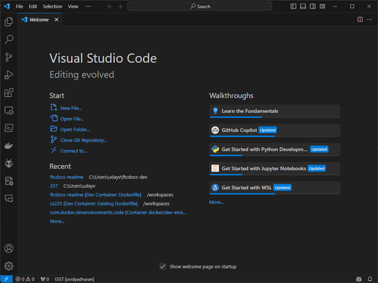

2. Under Start in the welcome screen, click on "Clone Repository"

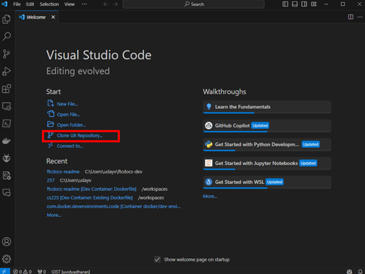

3. Enter the URL of your forked repository and click "Clone Repository". This will take the format of 
   `https://github.com/<NAME>/ftcdocs.git` replacing ``<NAME>`` with your GitHub username. If you changed 
   the name of your fork to something other than ``ftcdocs``, replace ``ftcdocs`` with the name of your fork.

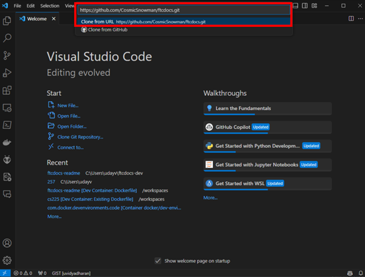

4. Chose a location on your computer to save the repository and click "Select Repository Destination".

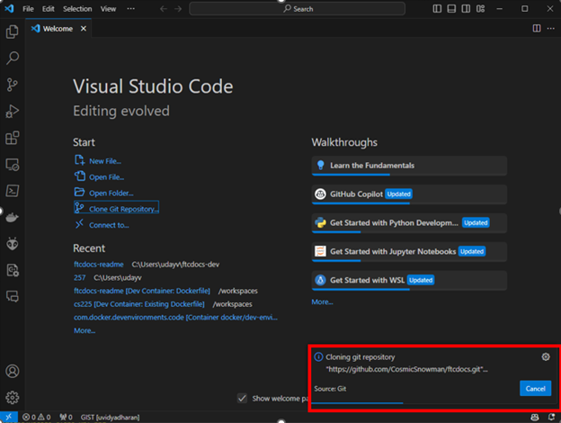

   You will then see a loading bar while the repository is cloned to your computer.

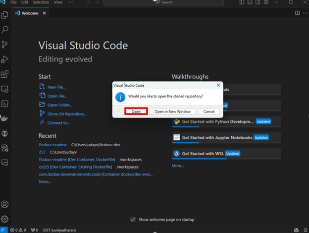

   Select "Open" to open the repository in VS Code.

5. Select "Yes, I trust the authors"

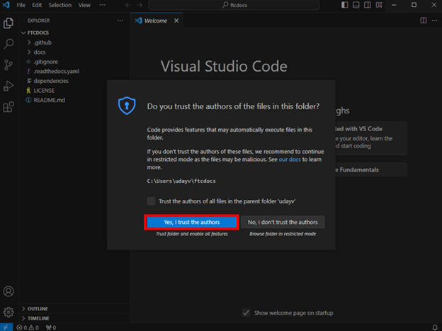

6. On the top ribbon of VS Code, click on "Terminal" and then "Run Task..."

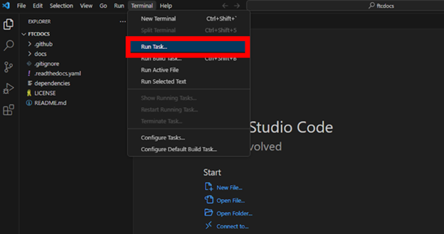

7. On the new menu click on "make-setup". This task will only need to be run once per environment.

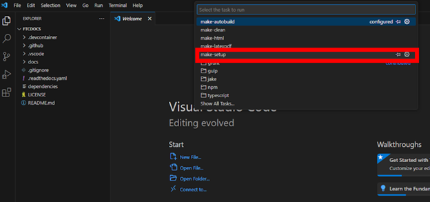

8. You will see a terminal window open and run a series of commands. This will take a few minutes to complete.

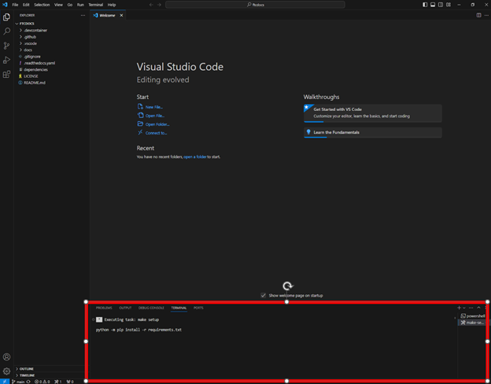

9. Once you see the message "Terminal will be reused by tasks, press any key to close it." you can move to the next step.

10. To test that everything is working, press `Ctrl + Shift + B` to build the site. 
    You should see a terminal window open and run a series of commands. This will take a few minutes to complete.

11. Once the build is complete, you will see "build succeeded" in the terminal window. 
     You can now click on the url ``http://127.0.0.1:7350`` to view the site.

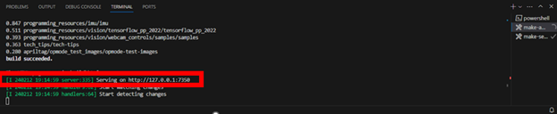

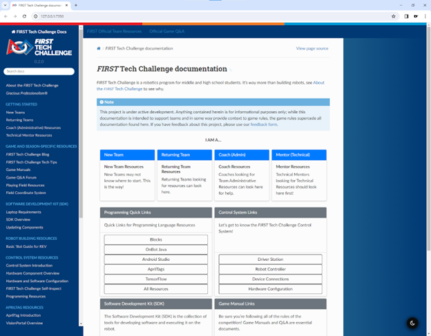

You are now ready to start developing! This version of the site will automagically update as you make changes to the source files.
To stop the server, press `Ctrl + C` in the terminal window. To restart the server, press `Ctrl + Shift + B`.
