Setting Up Your Development Environment 
=======================================

:bdg-danger:`One Time Only` :bdg-warning:`Local`

.. warning::
   Only complete these steps if you have chosen to develop the site locally. 
   If you are using **GitHub Codespaces** you should skip this section.

FTC Docs uses a `Nix <https://nixos.org>`_ flake (``flake.nix`` at the root of the repository) to provide every
dependency needed to build the site -- Python, Sphinx, and the LaTeX toolchain used for PDF booklets -- in one
reproducible environment. You no longer need to install Python, Pip, or a LaTeX distribution yourself.

Remember, this step should **only be done for Local Development**. If you are using **GitHub Codespaces**
you should skip this step. Also note that these steps should only be done **once**.

Steps
-----

.. warning:: Make sure you have forked the repository before starting this process. If you have not, please do so now.
.. warning:: In some cases, you may need to restart your computer or terminal instance between or after installing these dependencies for the changes to take effect.

.. tab-set::
   .. tab-item:: Windows

      Nix (and the LaTeX/PDF build) requires Linux or macOS, so on Windows you'll need `WSL2 <https://learn.microsoft.com/en-us/windows/wsl/install>`_.

      1. Install WSL2 and a Linux distribution (e.g. Ubuntu) by running ``wsl --install`` in an administrator PowerShell prompt.
      2. Open a WSL terminal and install `Nix <https://nixos.org/download>`_: ``sh <(curl -L https://nixos.org/nix/install) --daemon``
      3. Install Git (usually already available in WSL, otherwise ``sudo apt install git``).
      4. Install the latest version of `VS Code <https://code.visualstudio.com/download>`_, along with the `WSL extension <https://marketplace.visualstudio.com/items?itemName=ms-vscode-remote.remote-wsl>`_, and open your cloned repository from within WSL.

   .. tab-item:: Linux/Mac

      1. Install `Nix <https://nixos.org/download>`_: ``sh <(curl -L https://nixos.org/nix/install) --daemon``
      2. Install Git from the `Git website <https://git-scm.com/downloads>`_.
      3. Install the lastest version of `VS Code  <https://code.visualstudio.com/download>`_.

1. Open VS Code

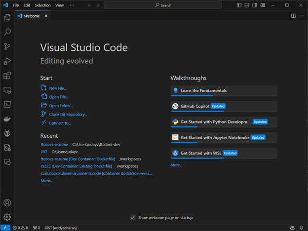

2. Under Start in the welcome screen, click on "Clone Repository"

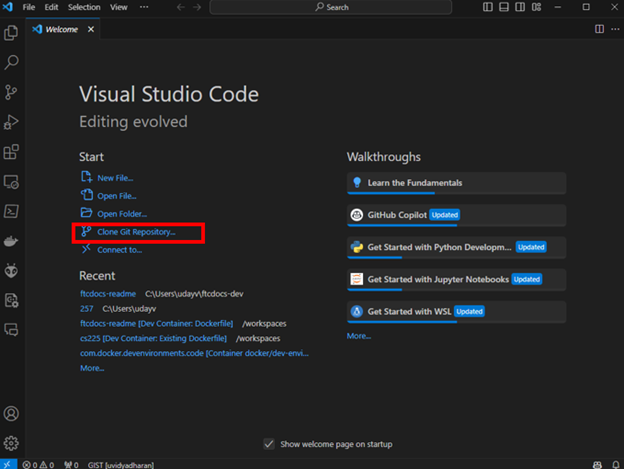

3. Enter the URL of your forked repository and click "Clone Repository". This will take the format of 
   `https://github.com/<NAME>/ftcdocs.git` replacing ``<NAME>`` with your GitHub username. If you changed 
   the name of your fork to something other than ``ftcdocs``, replace ``ftcdocs`` with the name of your fork.

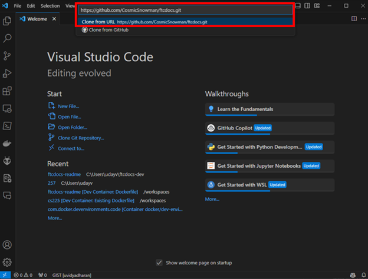

4. Chose a location on your computer to save the repository and click "Select Repository Destination".

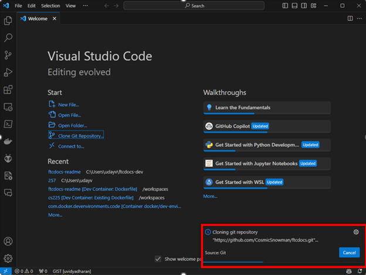

   You will then see a loading bar while the repository is cloned to your computer.

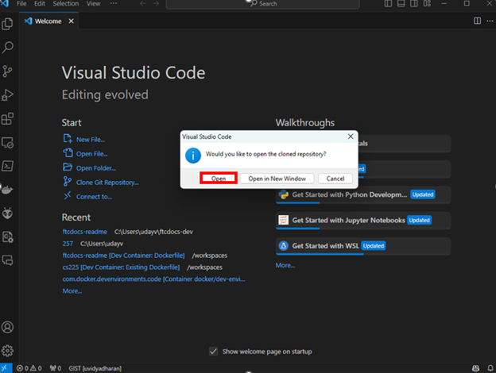

   Select "Open" to open the repository in VS Code.

5. Select "Yes, I trust the authors"

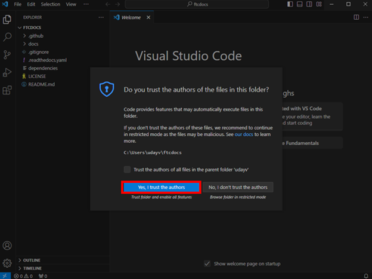

6. On the top ribbon of VS Code, click on "Terminal" and then "Run Task..."

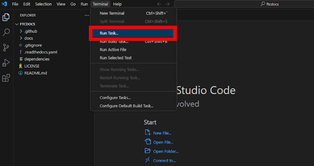

7. On the new menu click on "make-setup". This task will only need to be run once per environment.

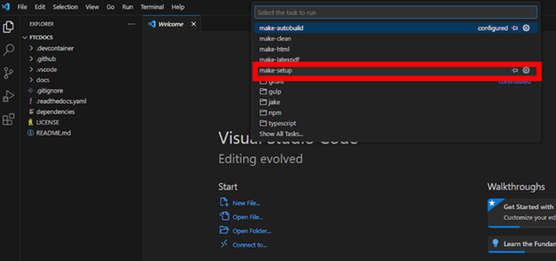

8. You will see a terminal window open and run a series of commands. This will take a few minutes to complete.

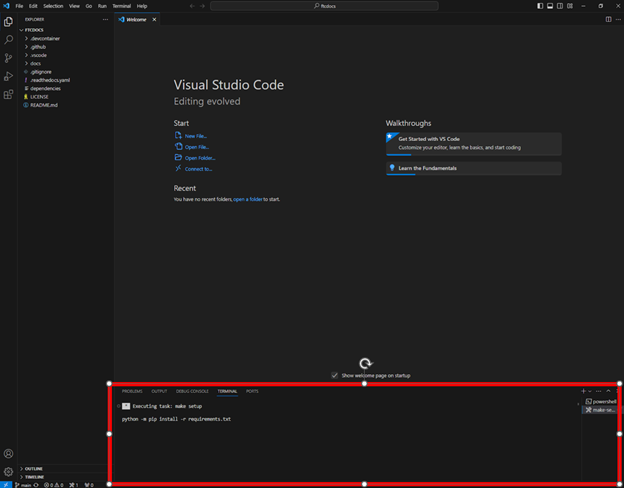

9. Once you see the message "Terminal will be reused by tasks, press any key to close it." you can move to the next step.

10. To test that everything is working, press `Ctrl + Shift + B` to build the site. 
    You should see a terminal window open and run a series of commands. This will take a few minutes to complete.

11. Once the build is complete, you will see "build succeeded" in the terminal window. 
     You can now click on the url ``http://127.0.0.1:7350`` to view the site.

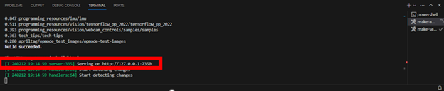

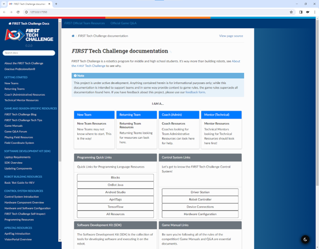

You are now ready to start developing! This version of the site will automagically update as you make changes to the source files.
To stop the server, press `Ctrl + C` in the terminal window. To restart the server, press `Ctrl + Shift + B`.
