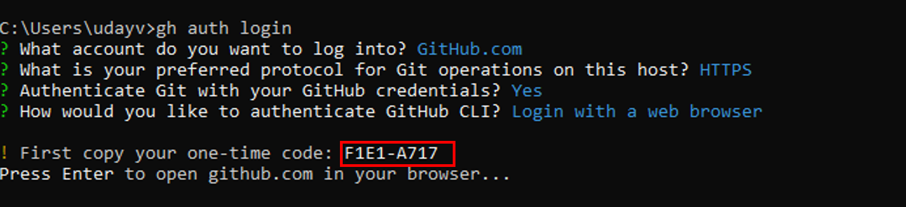

Setup Git Credentials
======================
:bdg-danger:`One Time Only` :bdg-warning:`Local`

.. note:: This is a one-time setup that is only necessary for local development. Codespace users may skip this step.

This step enables you to push changes to your forked repository. It is necessary 
inorder for GitHub to authenticate you as an authorized user.

1. Install `GitHub CLI <https://cli.github.com/>`_
2. Enter the following command in your terminal to authenticate with GitHub:

   .. code-block:: bash

      gh auth login

3. Follow the prompts to authenticate with GitHub.

