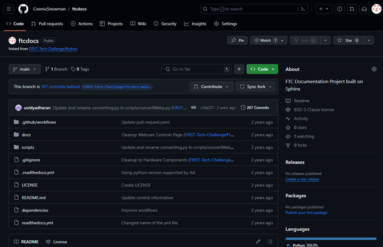
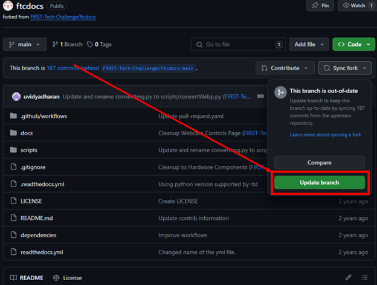
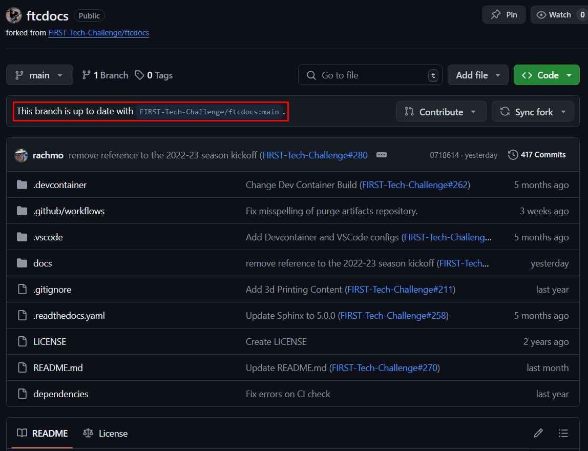

Updating Fork
==============
:bdg-success:`Repeat` :bdg-info:`Codespaces` :bdg-warning:`Local`

Your fork, while linked to the original repository, does not serve as a mirror. 
When changes are made "upstream" (in the original repository), you will need to update your 
fork to reflect these changes. You will want to do this **before** you start working on a new feature or bug fix.

Steps
-----

1. Navigate to your fork on GitHub

2. Follow the steps outlined below
   

|

    
    Note the new message indicating that your fork is up to date with the original repository.

More information on the process can be found on `GitHub Documentation <https://docs.github.com/en/github/collaborating-with-issues-and-pull-requests/syncing-a-fork>`_.