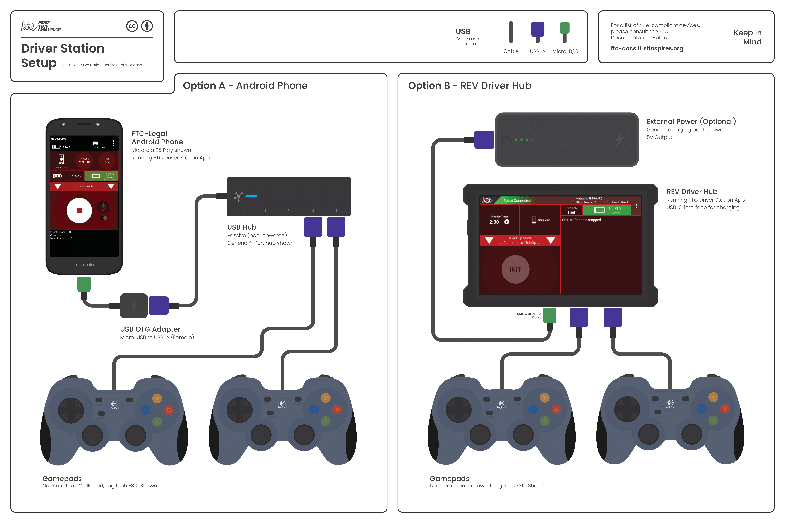

Hardware Component Overview
============================

This section will give you a brief introduction to the hardware components that are used in the system its various confitguations and connections.

Robot Controller
~~~~~~~~~~~~~~~~~~

.. toctree::
   :maxdepth: 2
   
   rc_components/index

Basic Configurations

.. tab-set::

    .. tab-item:: Control Hub

        .. figure:: images/B1.png

    .. tab-item:: Phone

        .. figure:: images/A1.png

    
Driver Station
~~~~~~~~~~~~~~~

.. toctree::
   :maxdepth: 1
   
   ds_components/index