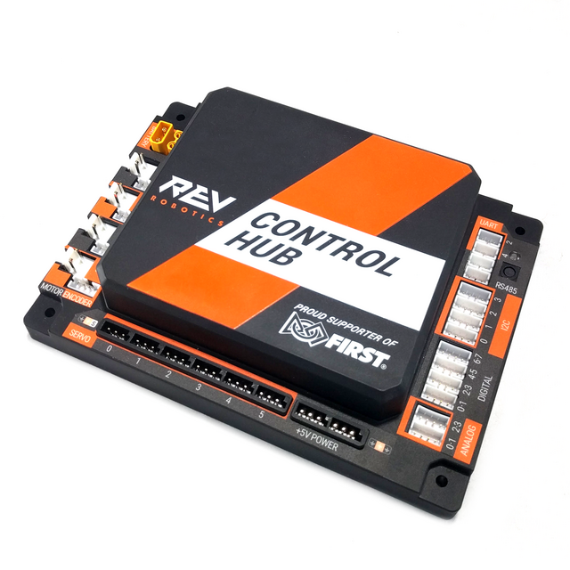

REV Hubs
==========

The REV Hubs are the core control units of a *FIRST* Tech Challenge robot.

Control Hub
------------

.. toctree::
    :maxdepth: 1

    ports/ch-ports

    REV Control Hub (REV-31-1595)

A REV Control Hub combines a REV Expansion Hub with an embedded Android
daughterboard connected to it.  This means it is able to control all of the
hardware components of your robot and also run your actual robot software.  This
is in contrast to the REV Expansion Hub which was only able to control hardware
devices but is not able to to interpret and run the SDK.

Expansion Hub
--------------

.. toctree::
    :maxdepth: 1

    ports/exh-ports

.. figure:: images/REV-31-1153.png
    :align: center
    :alt: REV-31-1153
    :width: 50%

    REV Expansion Hub (REV-31-1153)

A REV Expansion Hub is a hub that is used to control all of the hardware components of your robot. 
It takes the commands your Android Device sends and actually makes it happen. If you want to move a motor, 
an Expansion Hub is what takes the instruction of moving the motor and actually sends power to the motor in the 
correct manner. It however does not know when to do this which is where the Android Device comes into play. This device 
can either be a traditional Android Phone connected via USB or just the embedded device in a Control Hub. When using 
more than one hub, these hubs can be connected via ``RS485`` or USB. More information can be found 
:ref:`here <hardware_and_software_configuration/configuring/configuring_dual_hubs/configuring-dual-hubs:using two expansion hubs>`.
