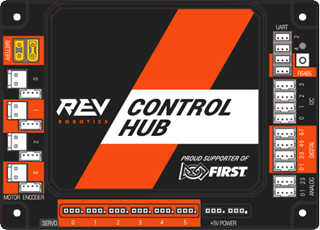
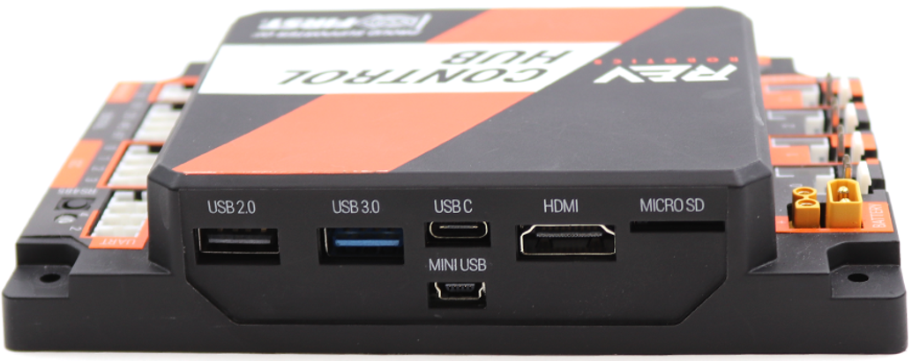

Control Hub Ports
=================

    REV Control Hub (REV-31-1595)

.. include:: std-ports.rst

    Control Hub Front Ports

USB-A Ports
-----------

A Control Hub has both a USB 2.0 and 3.0 Type-A female port. This is primarily
used for connecting UVC Cameras in acccordance with ``<RE14>``.

USB-B Port
----------

On a Control Hub, the USB-mini-B port is used only to communicate directly to
the I/O system. In this case, it is only for the purpose of uploading firmware
to the device.

USB-C Ports
-----------

A Control Hub has a USB-C port. This is primarily used for connecting to a
laptop for loading the SDK but can also be used with a UVC Camera in
acccordance with ``<RE14>``.

HDMI
-----

The Control Hub lacks a display of its own even though it is a fully-fledged
Android device. The Control Hub has an HDMI port that provides video output for
the device; this HDMI port can be used to connect to an external display.

