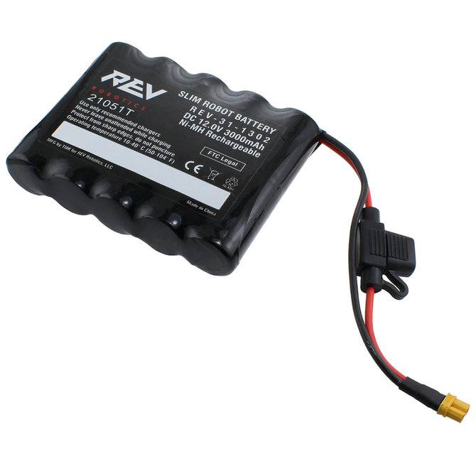
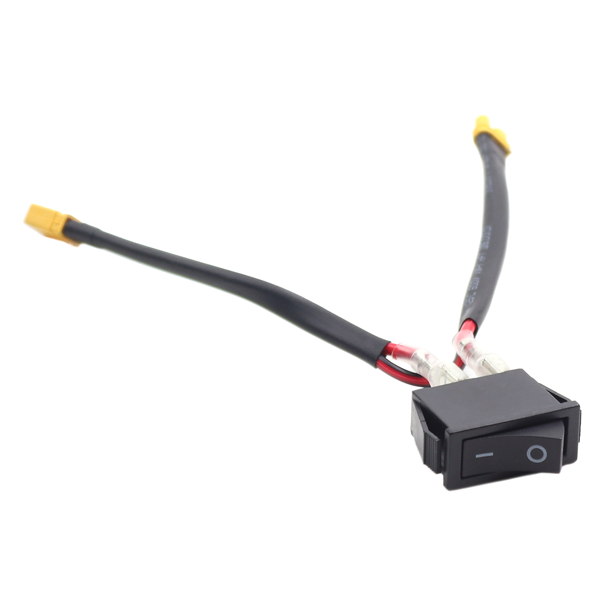

Power Distribution System
=========================

Robot Battery
~~~~~~~~~~~~~~~~

You want to do something, turns out you need energy. Well you are in luck, you have a robot battery.

Power Switch
~~~~~~~~~~~~~~

You best be controlling that power. This is a vital saftey system that allows for the regulation of power to the robot. 
It is a required component of any FTC Legal Robot.

XT30 Power Distribution Block
~~~~~~~~~~~~~~~~~~~~~~~~~~~~~~~~

``rev-31-1293``

