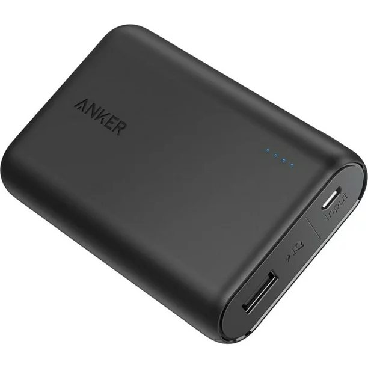

Power Distribution
===================

Robot Main Battery
----------------------

.. list-table:: 

    * - .. figure:: images/W39057.jpg
            :align: center
            :alt: W39057
            :width: 50 %

            TETRIX (W39057, formally 739023)

      - .. figure:: images/14-0014-FTCLegal__75264.jpg
            :align: center
            :alt: 14-0014
            :width: 50 %

            Modern Robotics/MATRIX (14-0014)

      - .. figure:: images/am-4649.jpg
            :align: center
            :alt: REV-31-1302
            :width: 50 %

            REV Robotics (REV-31-1302)

      

The main power of a robot comes from one 12v battery. The battery may be one of batteries shown above. ``<RE03>``

Main Power Switch
----------------------

.. list-table:: 
    
    * - .. figure:: images/REV-31-1387.png
            :align: center
            :alt: REV-31-1387
            :width: 50 %

            REV (REV-31-1387)
    
      - .. figure:: images/W39129.jpg
            :align: center
            :alt: REV-31-1387
            :width: 50 %

            TETRIX (part # W39129)

      - .. figure:: images/50-0030.jpeg
            :align: center
            :alt: REV-31-1387
            :width: 50 %

            MATRIX (part #50-0030)

One Main Power Switch must control all power provided by the Main Battery. It along with its label should be placed in accordance to :ref:`Game Manual Part 1<manuals/game_manuals/game_manuals:game manuals>`. The legal power switches are shown above. ``<RE01>``

:download:`Power Switch Label <https://www.firstinspires.org/sites/default/files/uploads/resource_library/ftc/power-button-labels.pdf>`

Power Distribution Block
-------------------------

    REV (REV-31-1293)

A Power Distribution Block helps to distribute the power to devices such as Control Hubs, Spark Minis, and more. 
See :ref:`Game Manual Part 2<manuals/game_manuals/game_manuals:game manuals>` for a description of legal Power Distribution Blocks

REV Servo Power Module
----------------------

.. figure:: images/REV-11-1144.png
    :align: center
    :alt: REV-31-1387
    :width: 25 %

    REV (REV-11-1144)

An electronic device that boosts the power supplied to 3-wire servos. A REV
Servo Power Module has 6 input servo ports and 6 matching output ports. It draws power from a 12V source
and provides 6V power to each output servo port. A REV Servo Power Module can provide up to 15A of
current across all output servo ports for a total of 90 Watts of power per module.

Comercial USB Battery Pack
---------------------------

A commercial USB battery pack is an auxiliary power source that can be used in specific situations in accordance with 
the :ref:`Game Manuals<manuals/game_manuals/game_manuals:game manuals>`

