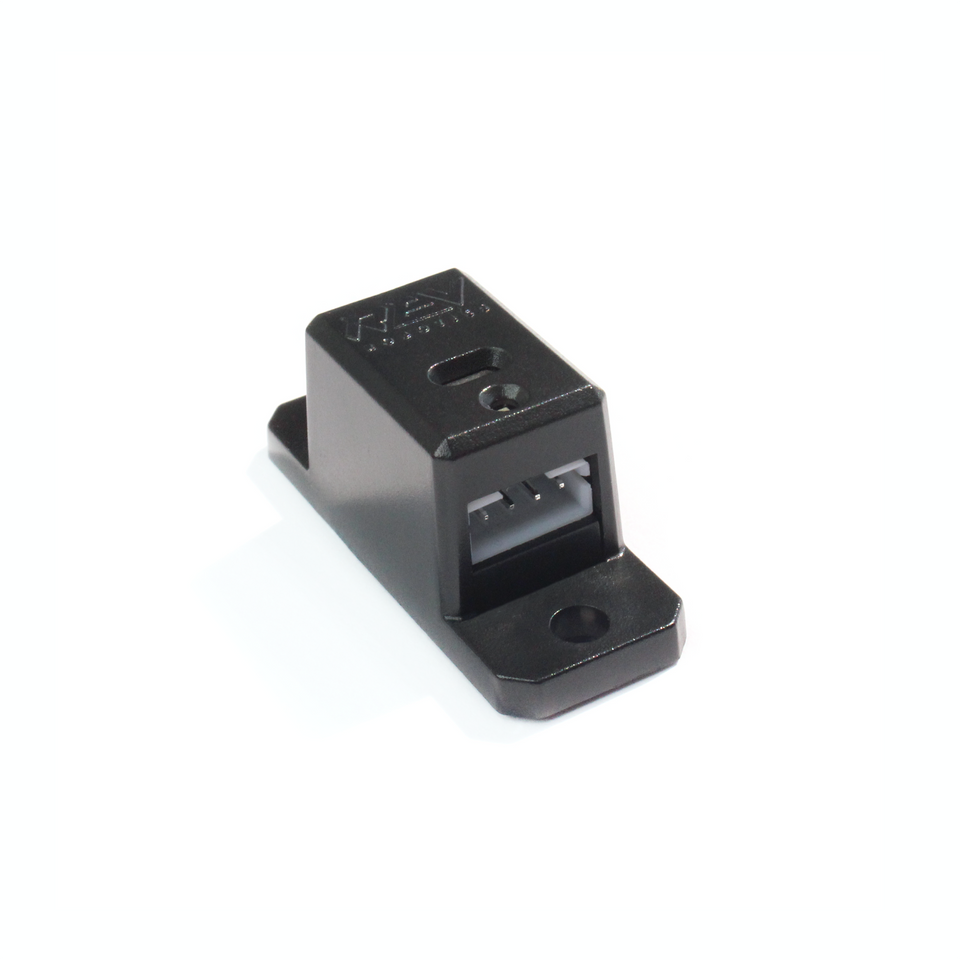
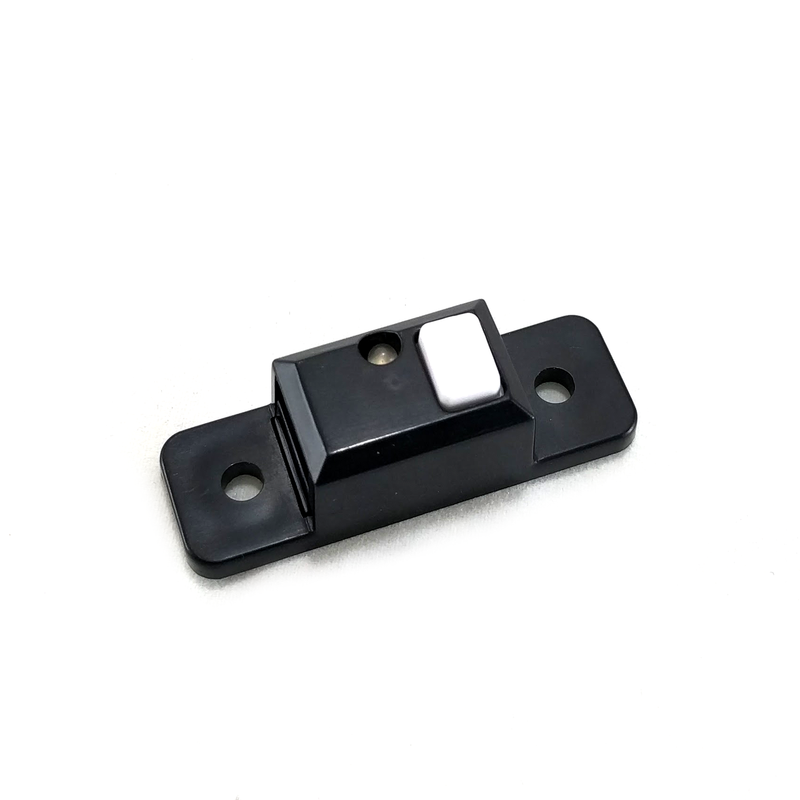

Sensors
=========

.. note:: 
        As per :ref:`Game Manual Part 1<manuals/game_manuals/game_manuals:game manuals>` a UVC Webcam is not considered a sensor.

Listed below are a couple examples of common sensors in FTC. This is not intended to limit or extend in anyway the scope of 
sensors as established in ``<RE12>``. While the FTC SDK supports many sensors not all are natively supported.

Distance Sensor (Ultrasonic)
-----------------------------

.. list-table:: 

    * - .. figure:: images/MB1242.jpg
                :align: center
                :alt: MB1242
                :width: 50%

                MB1242

      - .. figure:: images/RCWL-1601.jpg
                :align: center
                :alt: RCWL-1601
                :width: 50%

                RCWL-1601

An Ultrasonic Distance Sensor is a device that is able to measure the distance between an object and the sensor. 
It does this by sending out a sound wave and measuring the time it takes for the wave to travel to the object and back. 
Using this and the speed of sound the distance can be calculated.

Distance Sensor (Optical)
-----------------------------

        REV-31-1505

An Optical Distance Sensor is a device that is able to measure the distance between an object and the sensor. It does this 
by sending out a light beam and measuring the time it takes for the beam to travel to the object and back. Using this time and the 
known speed of light the distance can be calculated. Be mindful the way the object in question interacts with light can change the accuracy 
of the distance measurement. A transparent object like field panels will often provide innacurate measurements.

Color Sensor
-------------

.. list-table:: 

    * - .. figure:: images/REV-31-1557.png
                :align: center
                :alt: REV-31-1557
                :width: 50%

                REV-31-1557

      - .. figure:: images/45-2018.png
                :align: center
                :alt: MR 45-2018
                :width: 50%

                MR 45-2018

A color sensor is a digital output device that is able to measure the color of an object. Most color sensors require the object in 
question to be relatively close to the sensor. 

Touch Sensor
-------------

        REV-31-1425

A touch sensor is a digital output device that detects the activation of a button. This can be used as a limit switch, a way to limit 
the range of motion of a mechanism.