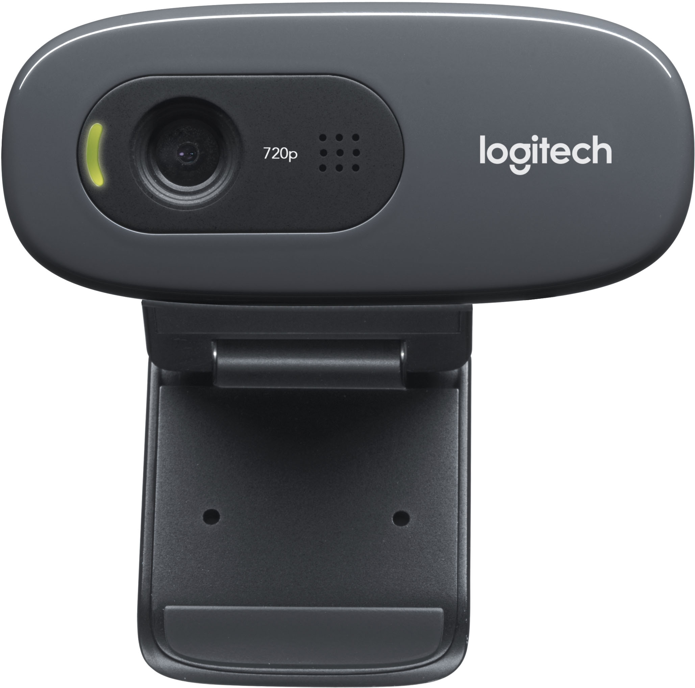

UVC Webcam
===========

A webcam is a device that provides visual images of the surrounding
environment. For use as part of *FIRST* Tech Challenge teams must use a commercially available off-the-shelf (COTS)
USB Video Class `(UVC) <https://www.usb.org/document-library/video-class-v15-document-set>`_ 
compatible camera. This device can be connected directly to
the REV Control Hub or to the Robot Control system via a USB hub.

   
   Logitech C270 Webcam

Webcams are intended to be used in computer vision related tasks.
Example use cases for a webcam are:

- :doc:`detecting <../../../apriltag/understanding_apriltag_detection_values/understanding-apriltag-detection-values>` an AprilTag,
- determining where the robot is :doc:`located <../../../apriltag/vision_portal/apriltag_localization/apriltag-localization>` on the field,
- using OpenCV to :doc:`detect colors or shapes <../../../color_processing/index>` of game elements.

Additional Resources
--------------------

- A :doc:`list of webcams <../../../apriltag/vision_portal/visionportal_webcams/visionportal-webcams>` known to be compatible with VisionPortal.
- :ref:`Connecting UVC Camera via Powered USB Hub <hardware_and_software_configuration/configuring/configuring_uvc_camera/configuring-uvc-camera:configuring an external uvc camera and a powered usb hub>`
- :ref:`Connecting UVC Camera directly to REV Control Hub <hardware_and_software_configuration/configuring/configuring_external_webcam/configuring-external-webcam:configuring an external webcam with a control hub>`
- :ref:`USB Port Overview <control_hard_compon/rc_components/hub/ports/ch-ports:USB Ports>`
- :ref:`Vision in FIRST Tech Challenge <programming_resources/index:vision programming>`

