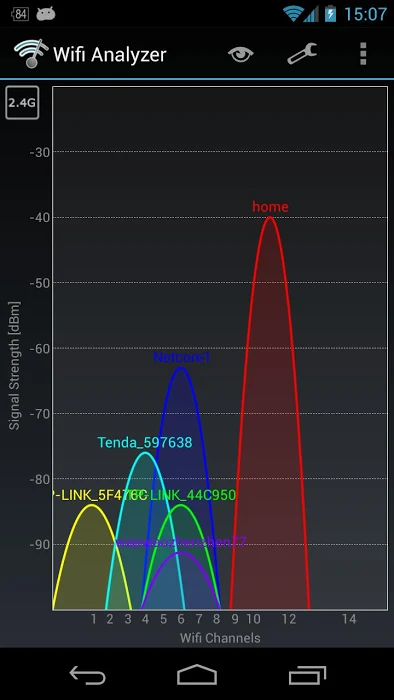
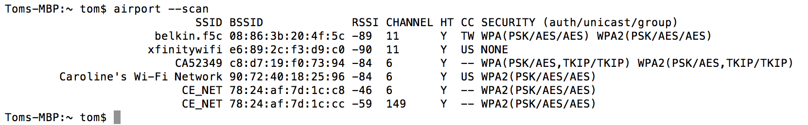
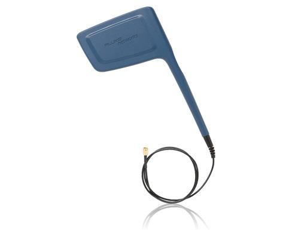
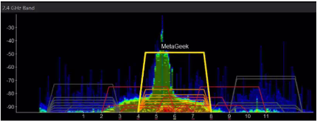

Monitoring the Wireless Environment
=====================================

The *FIRST* Tech Challenge :term:`Control System` uses :term:`Wi-Fi Direct` and/or wireless
access point technology to connect the :term:`Driver Station` device to the Robot
Controller. Wi-Fi Direct networks can be managed like normal Wi-Fi networks,
so the techniques and tools used to monitor and troubleshoot a corporate
Wi-Fi network can also be applied to the Wi-Fi Direct networks used by the
FTC Control System. This page provides some basic information to help an
FTA, CSA, or WTA keep the wireless environment clean and operational at an
event.

The Wireless Spectrum
-----------------------

Wi-Fi enabled devices use wireless radios to send digital information back
and forth to each other. These devices operate at specific frequencies
within legally allocated portions of the wireless spectrum. All FTC-approved
Android devices can operate at the 2.4GHz and 5GHz frequencies.

2.4GHz Portion of the Spectrum
^^^^^^^^^^^^^^^^^^^^^^^^^^^^^^^

In the U.S., there is a band of 11 channels in the 2.4GHz region that a
Wi-Fi enabled device can use to communicate (other regions outside of the
U.S. often allow Wi-Fi devices to operate on a few additional channels). As
the figure below shows, adjacent channels overlap each other, so two devices
operating on channels that are not separated by at least 5 channel widths
will interfere with each other. For example, channels 1 and 6 are spaced far
enough apart to avoid interference, while channels 1 and 5 overlap slightly.

   In the U.S., there are 11 Wi-Fi channels in the 2.4GHz band; other
   countries allow a few additional channels.

In practice, a little bit of channel overlap is usually acceptable. If one
or more channels are very noisy at an event, you might need to move devices
to alternate, possibly overlapping, channels. Each wireless channel can only
support a limited number of devices, and noise and interference on a channel
increase as more devices join it. The FTC Driver Station and Robot
Controller apps can tolerate a fair amount of noise and interference, so a
single 2.4GHz channel can usually support a relatively large number (25 to
35, or even more) Driver Station-Robot Controller pairs. However, other
traffic on a channel, including non-Wi-Fi devices, can still degrade
connectivity for those pairs.

5GHz Portion of the Spectrum
^^^^^^^^^^^^^^^^^^^^^^^^^^^^^^

FTC-approved smartphones and the REV Robotics :term:`Control Hub` and :term:`Driver Hub`
support both the 2.4GHz and 5GHz bands. 5GHz channels do not overlap each
other, and they offer greater bandwidth than 2.4GHz channels. They also have
more limited range, which can be useful in a crowded competition venue with
lots of robots.

.. note:: *FIRST* Robotics Competition (FRC) robots now exclusively compete
   on the 6GHz portion of the spectrum. This makes it easier to manage and
   troubleshoot the spectrum at FRC/FTC hybrid events.

For a deeper look at how to choose between the 2.4GHz and 5GHz bands based
on your robot's design, see the
`Wi-Fi Bands series <https://ftc-docs.firstinspires.org/en/latest/tech_tips/tech-tips.html>`__
of Tech Tips.

Monitoring the Wireless Spectrum
-----------------------------------

There are some tools available to an FTA, CSA, or WTA that can be helpful
in monitoring activity on the wireless spectrum.

Wi-Fi Analyzer
-----------------

`Wi-Fi Analyzer <https://play.google.com/store/apps/details?id=com.farproc.wifi.analyzer&hl=en>`__
is a free app, available on the Google Play store, that you can install
onto an Android device. It lets you see what wireless networks are
operating in your venue, with a graphical display that overlays the
available networks onto a graph of operating channels and shows the
relative signal strength of each network.

An FTA, CSA, WTA, or Tech Director can use Wi-Fi Analyzer to see which
networks are present at a venue, identify unauthorized wireless networks on
a channel, and determine which wireless channel a team's Driver
Station-Robot Controller pair is using. The app can also help plan which
channels teams should use for robot communication: in general, robots
should operate on the Wi-Fi channel with the fewest other wireless networks
(assuming there are no other sources of interference on that channel).

.. note:: If you run Wi-Fi Analyzer on an Android device with a dual-band
   (2.4GHz and 5GHz) radio, you can monitor channels on both bands.

While Wi-Fi Analyzer is a helpful tool, it has some limitations:

- It will not display activity from non-Wi-Fi signals operating on the same
  frequency. For example, a wireless microphone system transmitting on
  2.4GHz would not appear, even though it could interfere with FTC devices.
- It only lists wireless networks and their relative signal strength. It
  does not show how much activity is occurring on a network, so it cannot
  tell you whether a network is very busy and using up a lot of a channel's
  available capacity.
- It will not display hidden Wi-Fi networks. When someone sets up a
  wireless network, they have the option of hiding it, and Wi-Fi Analyzer
  will not list a hidden network.

Mac OS Airport Utility
--------------------------

If you have access to a Mac OS computer, you can use its airport utility to
scan for locally available wireless networks. To use the airport utility,
you need the ``airport`` executable in your Mac OS shell's search path. You
can place a symbolic link to the utility in the ``/usr/local/bin`` folder of
your Mac's file system. From a Mac OS command terminal, the following
command creates the symbolic link (you will need super user status and your
account's password):

.. code-block:: bash

   sudo ln -s /System/Library/PrivateFrameworks/Apple80211.framework/Versions/Current/Resources/airport /usr/local/bin/airport

Once the link is created, running the following command from a Mac OS
command terminal scans the wireless environment and lists the available
local networks that were detected:

.. code-block:: bash

   airport --scan

   The ``airport --scan`` command lists available, visible Wi-Fi networks.

The ``airport --scan`` utility has similar limitations to the Wi-Fi
Analyzer app described above. It also does not run continuously — a user
must repeatedly issue the command (or write a script to do so) to get a
continuous listing of available Wi-Fi networks.

NetScout/Fluke AirCheck Wi-Fi Tester
----------------------------------------

A company called netAlly (formerly NetScout and Fluke) makes an expensive,
but powerful, wireless network monitoring tool. The netAlly AirCheck Wi-Fi
Tester is a handheld device that can be used to monitor the wireless
spectrum at an event. Details can be found on the
`netAlly website <https://www.netally.com/products/aircheck/>`__.

The current netAlly AirCheck (left) and the older Fluke Networks AirCheck
Wi-Fi Tester (right) look different but offer similar functionality:

.. list-table::

   * - .. image:: images/netscout-aircheck-g2.jpg
          :alt: NetScout AirCheck G2 handheld tester displaying 2.4 GHz and 5 GHz channel utilization bar charts on its touchscreen.
     - .. image:: images/fluke-aircheck-tester.jpg
          :alt: Older yellow and blue Fluke Networks AirCheck Wi-Fi Tester with a color screen and directional keypad.

Both devices can display information about any wireless network in the
vicinity and, unlike the Wi-Fi Analyzer app and the Mac airport utility,
they also report on hidden wireless networks. The AirCheck can tell the
user how much wireless activity (both Wi-Fi and non-Wi-Fi) is occurring on
a specific channel and estimate how much of that channel's capacity is
being consumed, which can help an FTA/CSA/WTA determine if a channel is
clean or noisy. Because it measures non-Wi-Fi activity as well, it can also
help determine whether devices such as a wireless audio-visual system or a
Bluetooth device are affecting Wi-Fi connections on a channel.

The AirCheck can be equipped with an external directional antenna, which is
helpful for locating the source of a wireless signal: an FTA/CSA/WTA can
point the antenna around a venue, and the measured signal strength will
increase as the antenna is pointed at the source.

   The AirCheck can be equipped with an external directional antenna.

MetaGeek inSSIDer
--------------------

A company called MetaGeek makes software and hardware devices for Windows
computers and smartphones that provide capabilities similar to the AirCheck
at a slightly lower price. MetaGeek's inSSIDer software, combined with
their Wi-Spy Mini or DBx hardware and a Windows computer, can be used to
monitor wireless channels and see both Wi-Fi and non-Wi-Fi traffic on the
spectrum. The MetaGeek Wi-Spy Air hardware connected to a smartphone
provides similar Wi-Fi scanning capability in a more portable
configuration.

   MetaGeek's inSSIDer software, paired with Wi-Spy Mini or DBx hardware,
   shows both Wi-Fi and non-Wi-Fi activity.

Details regarding Wi-Spy Air, inSSIDer, and the Wi-Spy Mini and DBx
hardware can be found on the
`MetaGeek website <https://www.metageek.com/>`__. The MetaGeek software and
Wi-Spy Mini or DBx hardware require a laptop running Windows 10 to operate.

Wireshark
------------

`Wireshark <https://www.wireshark.org/>`__ is a free software application
that can also be used to help monitor and diagnose wireless issues. It is a
powerful tool that requires specialized knowledge to operate, along with a
computer whose wireless adapter supports monitor mode.

For step-by-step instructions on using Wireshark to capture and filter
wireless traffic, see
:doc:`/control_system_troubleshooting/wireshark_packet_capture/wireshark-packet-capture`.
