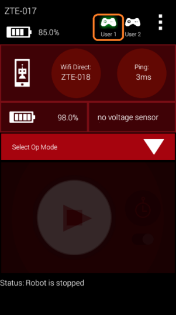
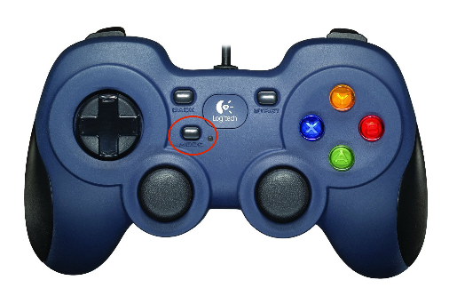
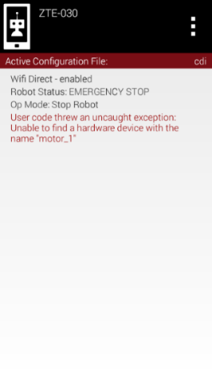
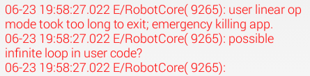
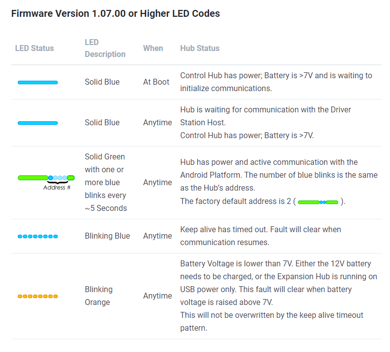
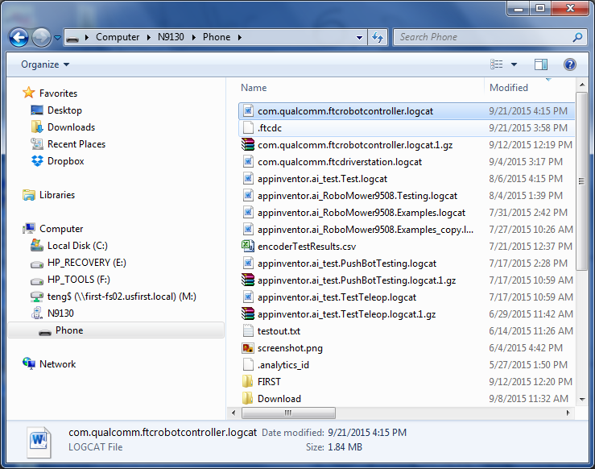

Troubleshooting Common Control System Issues
=============================================

This page collects common :term:`Control System` problems reported by teams at
events, along with the checks and fixes an FTA, CSA, or WTA can walk a team
through.

FIRST Tech Challenge Driver Station
------------------------------------

Gamepad is Not Recognized
^^^^^^^^^^^^^^^^^^^^^^^^^^

If a :term:`gamepad <Gamepad>` is recognized by the *FIRST* Tech Challenge :term:`Driver Station` app,
then whenever there is activity with that gamepad, the appropriate gamepad
icon in the upper right-hand corner of the Driver Station main screen will
be highlighted in green.

   The gamepad icon is highlighted in green when the gamepad is recognized
   and active.

If you encounter a team who is having problems with input from the gamepad,
check the following items:

- If a team is using Logitech F310 gamepads, make sure the switch on the
  bottom of the gamepad is set to the "X" position (Xbox emulation mode).

  .. note:: In SDK 9.1 and newer, this is not necessary — both "X" and "D"
     mode are supported.

- Make sure the gamepad has been designated as either driver (user) #1 or
  driver (user) #2. To designate a gamepad as driver #1, press the START
  button and the A (green) button on the F310 gamepad. To designate a
  gamepad as driver #2, press the START button and the B (red) button.

  .. note:: Driver Station software version 5.5 and later automatically
     recognizes the type of FTC-approved gamepad a team is using. Teams no
     longer need to configure the gamepad type manually.

- Check the wired connection. If the gamepad was temporarily disconnected
  from the Driver Station, the driver will have to re-designate which
  driver they would like to be by pressing START and A (driver #1) or START
  and B (driver #2). The Driver Station can sometimes automatically recover
  a lost joystick, but if both gamepads are the same type and both get
  disconnected at the same time, the user will have to re-designate the
  driver position for each gamepad.
- Disable Advanced Gamepad Settings. If the app is crashing when the gamepad
  is plugged in, or the gamepad is not being detected properly, disabling
  Advanced Gamepad Settings is one step to triage the issue. This has only
  been shown effective when troubleshooting first-generation DualShock 4
  controllers, and Advanced Gamepad Settings are not required to use a
  gamepad.

Gamepad Joysticks Were Not in Neutral Position When Connected to Driver Station
^^^^^^^^^^^^^^^^^^^^^^^^^^^^^^^^^^^^^^^^^^^^^^^^^^^^^^^^^^^^^^^^^^^^^^^^^^^^^^^^

Teams can connect up to two gamepads to the Driver Station Android device.
Each gamepad has a pair of joysticks that the team's drivers use to control
their robot. The gamepads are usually connected directly to a REV :term:`Driver Hub`
or through a non-powered :term:`USB hub <USB Hub>` to the USB Micro OTG port on an Android
smartphone Driver Station. When the gamepads are first connected, the
Android device calibrates the zero, or neutral, position of the two analog
joysticks on each gamepad.

If a user has deflected or moved the joysticks while they are being plugged
in, the Driver Station might use that non-zero position as the calibrated
reference point. This can cause unexpected behavior when an :term:`OpMode` runs —
for example, if the user starts the OpMode and the robot starts driving
without the user touching the joysticks, an improperly calibrated joystick
could be the cause.

To clear this problem, stop the OpMode, disconnect the gamepads from the
Driver Station, and then reconnect the gamepads, making sure the joysticks
are in their neutral position.

Mode Button on F310 Gamepad is Pressed
^^^^^^^^^^^^^^^^^^^^^^^^^^^^^^^^^^^^^^^

The Logitech F310 gamepad has a button labeled "MODE". When this button is
pressed, the small green LED next to it turns on. Teams usually do **not**
want this button enabled — with MODE enabled, the outputs of the left
joystick and the D-pad are swapped, which often confuses teams if the
button gets pressed during a :term:`match <Match>`.

   There is a button marked "MODE" on the F310 gamepad controller.

If a team is experiencing unexpected gamepad behavior, verify that the MODE
button is not enabled. If it is enabled (green LED lit), push the MODE
button again to disable it.

Gamepad Disconnects While Joysticks are in a Non-Neutral Position During an OpMode Run
^^^^^^^^^^^^^^^^^^^^^^^^^^^^^^^^^^^^^^^^^^^^^^^^^^^^^^^^^^^^^^^^^^^^^^^^^^^^^^^^^^^^^^^^

If a team is running a driver-controlled OpMode and a gamepad gets
disconnected from the Driver Station while its joystick was in a
non-neutral position, the control system might remember the last driver
command. If the team then stops the OpMode with the STOP button,
reconnects the gamepad, and runs the OpMode again, it might receive the
remembered, non-neutral input and cause the robot to move. To correct this,
have the user move the joysticks on the gamepad around briefly and then let
them return to their neutral positions.

Driver Station Goes to Sleep While OpMode is Running
^^^^^^^^^^^^^^^^^^^^^^^^^^^^^^^^^^^^^^^^^^^^^^^^^^^^^

This problem typically occurs when the sleep timer is set too low and the
Driver Station goes to sleep while an OpMode is running. To fix it, go to
the phone's Settings -> Display -> Sleep, and set it to sleep after 10 or
30 minutes of inactivity.

.. note:: This is not necessary on the Driver Hub.

Driver Station Powers Off Unexpectedly
^^^^^^^^^^^^^^^^^^^^^^^^^^^^^^^^^^^^^^^

This problem occurs when an Android device has a low battery. If a device
is unexpectedly shutting off, check that it has an adequate charge.

Unable to Find a Specific OpMode in the Driver Station's List of Available OpModes
^^^^^^^^^^^^^^^^^^^^^^^^^^^^^^^^^^^^^^^^^^^^^^^^^^^^^^^^^^^^^^^^^^^^^^^^^^^^^^^^^^^

If a team used :term:`Android Studio` and the *FIRST* Tech Challenge SDK to create
an OpMode but cannot find it in the Driver Station's list of available
OpModes, ask the team if they remembered to register their OpMode in the
``FtcOpModeRegister`` class. If they created the OpMode but did not register
it, it will not be visible on the Driver Station.

Gamepad Left Joystick is Not Working
^^^^^^^^^^^^^^^^^^^^^^^^^^^^^^^^^^^^^

If a gamepad's left joystick is not working but the right joystick is, the
probable cause is that the MODE button adjacent to the left joystick was
activated. When the green light next to the MODE button is lit, the gamepad
swaps the functionality of the D-pad with the left joystick. Press and
release the MODE button to turn the light off and restore the left
joystick's functionality.

Robot Controller
------------------

User Code Threw an Uncaught Exception: null
^^^^^^^^^^^^^^^^^^^^^^^^^^^^^^^^^^^^^^^^^^^^

This error occurs when a method is called on an object that is null at the
time of the call. To address it, first look at the robot log file to find
where to search for the problem. To access the log files, open the settings
in the :term:`Robot Controller` app and select **View Logs**, then scroll up until a
block of red text appears and look for a line resembling:

.. code-block:: text

   com.qualcomm.ftcRobotcontroller.opmodes.YourOpmodeName.loop(YourOpmodeName.java:XX)

The ``XX`` is the line number where the null error occurred, and is a good
starting point for addressing the issue. For example, if this line is
accessing a method of an ``ElapsedTimer`` object, make sure the object was
instantiated with ``objectname = new ElapsedTimer();`` somewhere in the code
before that line.

User Code Threw an Uncaught Exception: number XXX is invalid
^^^^^^^^^^^^^^^^^^^^^^^^^^^^^^^^^^^^^^^^^^^^^^^^^^^^^^^^^^^^^

This exception is typically thrown when a motor or :term:`servo <Servo>` is set to a value
less than -1 or greater than 1. To find which line of code threw the
exception, check the robot logs the same way as above — open the settings in
the Robot Controller app, select **View Logs**, scroll up to the first block
of red text, and find a line resembling:

.. code-block:: text

   com.qualcomm.ftcRobotcontroller.opmodes.YourOpModeName.loop(YourOpModeName.java:XX)

The ``XX`` is the line number where the exception was thrown. Remember: the
``setPower()`` method for ``DcMotor`` can only be passed a value from -1 to
1, and the ``setPosition()`` method for ``Servo`` can only be passed a value
from 0 to 1. If a value is likely to fall outside of the allowed range, the
``Range.clip()`` method can be used to constrain it.

Unable to Find a Hardware Device with the Name "..."
^^^^^^^^^^^^^^^^^^^^^^^^^^^^^^^^^^^^^^^^^^^^^^^^^^^^^

A very commonly encountered error occurs when a user tries to run a
specific OpMode and the Robot Controller app reports "User code threw an
uncaught exception: Unable to find a hardware device with the name '...'",
where "..." is the name of the hardware device the OpMode is trying to
access. This happens when the OpMode specifies a device name that does not
match the corresponding name in the *FIRST* Tech Challenge SDK's hardware
map, and it applies to apps created using Android Studio.

   The name used by the OpMode must match the name used in the
   configuration file for the device exactly.

If you are at an event and encounter this error, ask the team to verify that
the name they use in their OpMode to reference a hardware device matches
the name specified for that device in their Robot Controller's
:term:`configuration file <Configuration File>`. The spelling is case sensitive, so the names must match
exactly.

Common Programming Errors
^^^^^^^^^^^^^^^^^^^^^^^^^^

It can be difficult and frustrating to debug problems with a team's OpMode.
However, there are some commonly encountered programming errors that can
cause problems, described in the sections below.

Neglecting to Insert waitForStart() Statement
------------------------------------------------

For a ``LinearOpMode``, it is important that the programmer included a
``waitForStart()`` statement in the OpMode. Any statement that occurs after
``waitForStart()`` is executed only after the user touches the START arrow
on the Driver Station. If the programmer forgot to include a
``waitForStart()`` statement, the robot might behave unpredictably — for
example, it might start moving instantly as soon as the OpMode is selected.

Uninterruptible Threads
--------------------------

Teams often incorporate loops in their robots' OpModes. Advanced
programmers might also spawn threads within their OpModes to execute
commands in parallel with the main OpMode process. If an OpMode contains a
loop or spawns a separate thread, it is important that the loop or thread
is written so that it can be interrupted by the Java application when
necessary.

This can be illustrated with an example. Suppose a team writes the
following OpMode:

.. code-block:: java

   // turn on motors.
   motorL.setPower(0.2);
   motorR.setPower(0.2);

   // use while loop to run the cycle indefinitely.
   while (true) {
       // stop if touch sensor is pressed.
       if (sensorTouch.isPressed()) {
           // stop OpMode.
           motorL.setPower(0);
           motorR.setPower(0);
           break;
       }
   }

In this example, the motors turn on and the OpMode loops indefinitely until
the :term:`touch sensor <Touch Sensor>` is pressed. This OpMode is uninterruptible: if the user
presses the STOP button on the Driver Station before the touch :term:`sensor <Sensor>` is
pressed, the ``while`` loop keeps running and the OpMode is not properly
stopped. This can cause the robot to behave erratically and become
unresponsive — the robot continues to run, and the Driver Station continues
to display the STOP button, even after the user has pressed it.

The Robot Controller app can detect potential "runaway" OpModes. If the app
detects what it thinks is a runaway or unresponsive OpMode, as a safety
measure it will record an error message in the log file and then crash
itself — unfortunately, this is the only way to stop an unresponsive
thread.

   If the app detects a potential unresponsive OpMode, it logs an error and
   then aborts itself.

The correct way to prevent a runaway or unresponsive OpMode is to use an
interruptible method as the loop condition, such as ``opModeIsActive()``, or
to put a sleep statement somewhere in the loop. The following code exits
properly if the user presses the STOP button on the Driver Station before
the touch sensor is pressed:

.. code-block:: java

   // turn on motors.
   motorL.setPower(0.2);
   motorR.setPower(0.2);

   // use while loop to run the cycle indefinitely.
   while (opModeIsActive()) {
       // stop if touch sensor is pressed.
       if (sensorTouch.isPressed()) {
           // stop OpMode.
           motorL.setPower(0);
           motorR.setPower(0);
           break;
       }
   }

REV Robotics Control and Expansion Hubs
------------------------------------------

The REV :term:`Expansion Hub` is a compact hardware controller with 4 :term:`DC motor <DC Motor>`
ports, 6 servo ports, and multiple digital, :term:`I2C`, and analog ports. The REV
:term:`Control Hub` is a REV Expansion Hub with an integrated Android device.

Detailed information and specifications on the Control and Expansion Hubs
are available in the REV Robotics Control Hub and Expansion Hub Getting
Started Guides, published on the
`REV Robotics Control System documentation site <https://docs.revrobotics.com/duo-control/>`__.

This section contains important tips for troubleshooting a robot that uses
a REV Robotics Control and/or Expansion Hub.

Resetting a REV Control Hub Wi-Fi Password
^^^^^^^^^^^^^^^^^^^^^^^^^^^^^^^^^^^^^^^^^^^

A common issue for teams is resetting the REV Control Hub's Wi-Fi password
to a new value, which is required as part of field :term:`inspection <Inspection>`.

On the Driver Station app, tap the three dots (⋮) and select **Program and
Manage**. This may take up to about 30 seconds to load. Then follow these
steps, adapted from REV's
`Updating a Control Hub <https://docs.revrobotics.com/rev-hardware-client/control-hub/updating-control-hub>`__
guide, to update the password:

#. Select the three lines in the upper right-hand corner.
#. Select **Manage** from the menu that pops up.
#. Scroll down to Wi-Fi Settings and enter the new password twice in the
   input fields.
#. Select **Apply Wi-Fi Settings**.
#. Unpair and re-pair the Robot Controller and Driver Station.

.. important:: Make sure to write down the new password somewhere safe.

Power Cycle Time
^^^^^^^^^^^^^^^^^

*FIRST* recommends that teams power down the device for a minimum of 5
seconds before powering their Control or Expansion Hub back on again.

Logic Level Converters
^^^^^^^^^^^^^^^^^^^^^^^

The REV Robotics Control and Expansion Hubs operate using 3.3V digital
logic levels. Older Modern Robotics-compatible sensors and :term:`encoders <Encoder>` operate
using 5V digital logic levels. If a team would like to use a 5V device that
was compatible with Modern Robotics hardware controllers, the team will
need a Logic Level Converter (available from REV Robotics) to connect the
5V device to the 3.3V Control or Expansion Hub ports.

5V Modern Robotics-Compatible Encoders
^^^^^^^^^^^^^^^^^^^^^^^^^^^^^^^^^^^^^^^

If a team has a 12V DC motor with a 5V encoder designed to connect to a
Modern Robotics DC motor controller, the team will need one REV Robotics
Logic Level Converter per 5V encoder to connect the encoder to the Control
or Expansion Hub.

5V Modern Robotics-Compatible I2C Sensors
^^^^^^^^^^^^^^^^^^^^^^^^^^^^^^^^^^^^^^^^^^

If a team has a 5V, Modern Robotics-compatible I2C sensor, the team will
need a REV Robotics Logic Level Converter plus a REV Robotics Sensor Cable
Adapter to properly connect the 5V device to a Control or Expansion Hub.

LED Blink Codes
^^^^^^^^^^^^^^^^

The REV Control and Expansion Hub have the following blink codes.

   REV Control and Expansion Hub blink codes.

The REV Robotics website maintains an up-to-date version of this chart; see
the `REV Hub LED blink codes <https://docs.revrobotics.com/duo-control/troubleshooting-the-control-system/led-blink-codes>`__
page for the current list.

Troubleshooting Dual Expansion Hubs
^^^^^^^^^^^^^^^^^^^^^^^^^^^^^^^^^^^^

Teams can daisy-chain two REV Robotics Expansion Hubs together to provide
additional I/O ports for their robot. Details on how to configure and
troubleshoot a dual Expansion Hub robot are included in the REV Robotics
Expansion Hub Getting Started Guide, and in
:doc:`/hardware_and_software_configuration/configuring/configuring_dual_hubs/configuring-dual-hubs`.

If a team is having a problem with a dual Expansion Hub configuration, it
is important that the FTA or CSA verify that each of the daisy-chained
Expansion Hubs has a non-conflicting serial address. By default, all
Expansion Hubs are assigned an address of 2 at the factory, so a team that
wants to connect two :term:`Hubs <Hub>` together must first change the serial address of
one of them to prevent it from conflicting with the other Hub's address.

An FTA or CSA can connect each Expansion Hub individually (not
daisy-chained) to a Robot Controller and check its blink pattern to
determine the Hub's address. Details on how to change the address of an
Expansion Hub are included in
:doc:`/hardware_and_software_configuration/configuring/configuring_dual_hubs/configuring-dual-hubs`.

Use a Pair of Android Devices to Monitor Wi-Fi Channel
----------------------------------------------------------

It is useful to have a set of Android devices that you can use to monitor
activity on a wireless network. You can configure a *FIRST* Tech Challenge
Robot Controller to have an empty configuration file (no devices attached),
then connect to it with the Driver Station app on a second Android device.
Use the ping time shown on the Driver Station as an indicator of network
quality on the devices' current operating channel.

Use the Log Files to Help Troubleshoot Problems
----------------------------------------------------

Both the Robot Controller and Driver Station apps log information that can
be useful for diagnosing problems with the system. On the Robot Controller
app, tap the three vertical dots in the upper right-hand corner of the main
screen and select **View Logs** to display its log file.

   Windows users can use File Explorer to locate and copy the log file.

For a full walkthrough of using log files to diagnose problems, see
:doc:`/control_system_troubleshooting/using_log_files/using-log-files`.
