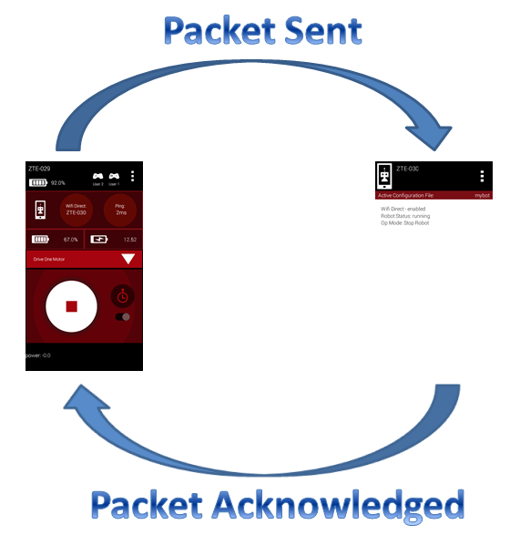
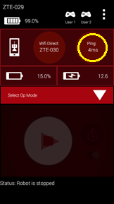
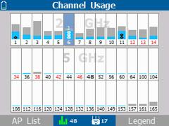
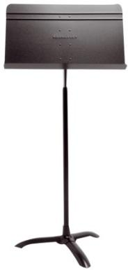

Troubleshooting Wireless Issues at an Event
============================================

If you are at an event and you suspect that wireless interference is causing
problems for a team, there are several things you can check to try and
diagnose the issue.

This section assumes you have a way to monitor the wireless spectrum at your
event — see
:doc:`/control_system_troubleshooting/monitoring_wireless_environment/monitoring-wireless-environment`
for available tools.

Ping Times
----------

If you are at a *FIRST* Tech Challenge event, you can use the ping time
feature of the FTC Driver Station app as an indicator of network quality.
When a Driver Station is connected to a Robot Controller, it periodically
sends a heartbeat packet to the Robot Controller. The Robot Controller is
supposed to respond to each ping and send an acknowledgement packet (an
"ACK") back to the Driver Station.

The Driver Station constantly measures how long it takes to send a heartbeat
packet to the Robot Controller and receive an acknowledgement packet back.
This amount of time is known as the ping time.

   Ping time represents the time it takes for a packet to be sent to and
   acknowledged by the Robot Controller.

Whenever a Driver Station is connected to a Robot Controller, the average
ping time is displayed in the upper right-hand corner of the FTC Driver
Station app, as shown below.

The average ping time can be used as an indicator of connection quality for
a Driver Station-Robot Controller pair. If the wireless connection between
the Driver Station and the Robot Controller doesn't have a lot of noise,
traffic, or interference, the average ping time is generally low. If the
noise, traffic, or interference increases, Wi-Fi devices on that channel
tend to resend packets more frequently, which causes the average ping time
to increase.

At an event, an FTA/CSA/WTA should have access to a pair of Android devices
(preferably ones that support Wi-Fi channel changing through the FTC Robot
Controller app) that can be used to monitor the wireless connection quality
on a Wi-Fi channel at the venue. If the ping time is low (5 msec or less),
the wireless connection quality is very good. If the observed ping time
hovers at a high value (250 msec or more), the wireless connection quality
is poor and the FTA/CSA/WTA should try to identify the cause.

The average ping time only measures quality for the channel currently in
use — it does not indicate quality for the entire set of channels. For
example, if a pair of devices is operating on channel 1, the ping times
observed for that pair are only useful for monitoring channel 1. To measure
the wireless quality of channel 6 or 11, you would have to change the
operating channel for those devices, reconnect them, and then look at the
newly selected channel's ping times.

If a team is having trouble communicating with their robot, check the ping
times on their Driver Station to determine if the Robot Controller has a
responsive connection (ping times less than 50 msec, preferably around
5 msec).

Using the average ping time is a convenient way to determine if a wireless
channel is clear and relatively noise-free. If the ping times are low, the
channel is most likely free of other Wi-Fi and non-Wi-Fi traffic.

.. important:: The observed ping time is also affected by whether the Robot
   Controller is available to respond to heartbeat messages from the Driver
   Station. If the Robot Controller is busy — for example, because it is
   blocked in a portion of an improperly written OpMode — and it can't
   respond to the Driver Station in a timely manner, the observed ping times
   will be higher even if the wireless connection itself is strong.

Is the Wi-Fi Channel Too Busy?
-------------------------------

In addition to ping times, an FTA/CSA/WTA can use other tools, such as an
Aircheck meter or the MetaGeek inSSIDer application, to get a more detailed
view of the wireless activity on a Wi-Fi channel. If you have access to a
device like the Aircheck meter, you can examine the activity level for each
wireless channel and determine if a channel is saturated.

   The Aircheck meter shows Wi-Fi (light blue) and non-Wi-Fi (gray)
   activity on each channel.

In the chart above, you can see the Wi-Fi (light blue) and non-Wi-Fi (gray)
activity on each Wi-Fi channel. In this example, channel 3 has a lot of
non-Wi-Fi (gray) activity and is very busy, while channel 7 has less
activity and is not very busy.

Adjacent Wi-Fi channels in the 2.4 GHz band overlap, so activity on one
channel might have a negative effect on a nearby channel as well.

If you notice high activity levels, try to find and disable the devices
causing the interference. You can also try moving the Driver Station-Robot
Controller pair to a different, less busy channel — see
:doc:`/control_system_troubleshooting/wifi_channel_planning/wifi-channel-planning`
for guidance on selecting and distributing channels.

Potential Sources of Wi-Fi Interference
-----------------------------------------

Potential sources of Wi-Fi interference include the following:

- Wireless access points that belong to the venue (such as an access point
  used to provide wireless access within a school).
- Unauthorized team or spectator access points.
- Mobile hotspots.
- Wi-Fi enabled cameras or other devices (such as handheld game consoles).

Potential Sources of Non-Wi-Fi Interference
----------------------------------------------

Potential sources of non-Wi-Fi interference include the following:

- Bluetooth devices (which also operate in the 2.4 GHz band of the
  spectrum).
- Wireless audio/visual systems (including wireless microphones and
  cameras).
- Cordless telephones and headsets.
- Remote control cars, helicopters, drones, and planes.
- Microwave ovens.

Are There Too Many Robots Operating on the Same Channel?
-----------------------------------------------------------

Related to a channel being too busy, if too many robots are operating on a
single channel, average wireless connection quality can suffer. *FIRST* has
stress tested a high number of Driver Station-Robot Controller pairs
operating reliably on a single Wi-Fi channel, reaching close to 50 pairs on
a single 2.4 GHz channel. In practice, the number of robots that can operate
reliably on a single channel varies with a number of factors — if there is
a lot of external wireless interference on a channel, fewer robots can
operate on it.

If you suspect too many robots are operating on a single channel, try to
distribute the robots evenly across the available, less busy channels. See
:doc:`/control_system_troubleshooting/wifi_channel_planning/wifi-channel-planning`
for how to plan channel spacing — ideally 2.4 GHz channels should be spaced
at least 5 channel-widths apart to avoid overlap, though robots can be moved
to overlapping channels if necessary.

Is there a Wi-Fi Suppressor Operating in the Vicinity?
----------------------------------------------------------

Many IT organizations use Wi-Fi suppressors to suppress unauthorized Wi-Fi
access points operating in a venue. These suppressors maintain a list of
authorized wireless networks for the venue; if a suppressor detects an
unauthorized wireless network, it sends out packets to disrupt that
network's operation. Many suppressor functions are now built directly into
modern wireless access points.

Each Driver Station-Robot Controller pair establishes its own Wi-Fi network.
If a Wi-Fi suppressor is operating in the vicinity, it will disrupt the
operation of any Driver Station-Robot Controller pair in the area.

.. important:: If you suspect a Wi-Fi suppressor is operating at a venue,
   work with the venue's IT staff **before the day of the event** to have
   the suppressor disabled for any scheduled *FIRST* Tech Challenge events.

.. note:: Even though Wi-Fi suppressor technology is gaining popularity,
   according to the FCC, federal law "prohibits the operation, marketing,
   or sale of any type of jamming equipment, including devices that
   interfere with cellular and Personal Communication Services (PCS),
   police radar, Global Positioning Systems (GPS), and wireless networking
   services (Wi-Fi)." There is an FCC Enforcement Advisory that warns that
   Wi-Fi blocking is prohibited.

Are the Wireless Radio Signals Being Blocked by Metal?
----------------------------------------------------------

If you suspect one or more robots are having wireless issues (higher ping
times, less responsive robots, etc.), make sure that radio signals from the
Driver Station and the Robot Controller are not being blocked or screened by
large sheets or pieces of metal.

For example, if the Robot Controller's Android device is mounted deep
within the robot's frame and there are pieces of sheet metal or aluminum
channel blocking or obscuring the device, the Robot Controller's radio
signal might be blocked and/or reflected. This can attenuate signals to and
from the Robot Controller. Similarly, if the Android device is mounted
directly onto a metal plate, the signal can also be blocked, reflected, or
attenuated — the antenna on many Android devices is located near the back
of the device.

The same is true for the Driver Station: if its Android device is placed on
something like a sheet metal plate, or enclosed in a metal housing, its
signals can also be blocked, reflected, or attenuated.

   *FIRST* used a metal music stand like this one as a Driver Station stand
   to test how much metal near a device affects wireless signal quality.

As an example, *FIRST* conducted an experiment using a metallic music stand
as a Driver Station stand for a phone. *FIRST* used Wireshark to monitor
activity with and without the music stand in place, and observed that the
wireless retry rate for the device sitting on the music stand was about
twice as high as the retry rate for the same device sitting on a wooden
table. Even though the human driver during the test didn't perceive any
difference in the robot's responsiveness, the Wireshark data showed that
the wireless connection quality was worse whenever the music stand was in
place — attributed to the metal stand attenuating and reflecting the radio
signals to and from the Driver Station.

Ideally, Robot Controller and Driver Station devices should be mounted in a
way that protects them without blocking the radio signals traveling to and
from them. In most cases the radios will work fine even if they are
partially (or almost fully) obscured by metal. However, whenever the radios
are obscured the signals are attenuated, and if the attenuation is high
enough, the devices might start to experience wireless connection problems.

Is There Malicious Activity Occurring?
------------------------------------------

Unfortunately, it is possible for a motivated individual to disrupt Wi-Fi
networks using tools and techniques described on the Internet. This
vulnerability applies to most Wi-Fi networks, including the ones established
by FTC Driver Station-Robot Controller pairs.

There is an amendment to the 802.11 standard (802.11w) that makes it more
difficult to conduct some of these attacks. The 802.11w standard is the
default setting for the REV Driver Hub and the REV Control Hub, but
unfortunately it is not yet available on Android smartphones — the Android
devices used at *FIRST* Tech Challenge events remain vulnerable to certain
wireless attacks.

Some tools can help detect when a wireless attack has occurred. For
example, see
:doc:`/control_system_troubleshooting/wireshark_packet_capture/wireshark-packet-capture`
for how to use Wireshark to look for clues that indicate certain wireless
issues are present. However, these tools are not always available at every
*FIRST* Tech Challenge event.

If you suspect malicious activity is occurring at an event, try to use any
available tool to identify the party conducting it. You can also rely on
good, old-fashioned "detective work" to look for suspicious activity in and
around the Competition Fields. If you believe malicious activity is
occurring, you can remind spectators and participants that this behavior is
ungracious and punishable by disqualification from the event, and possibly
the season.

Determining if Wi-Fi Interference Warrants a Match Replay
--------------------------------------------------------------

The most critical responsibility of a FIRST Technical Advisor (FTA), Control
System Advisor (CSA), or Wireless Technical Advisor (WTA) is deciding
whether wireless interference during a match was significant enough to
warrant a replay. This is a difficult and subjective decision. The
Competition Manual states that matches are replayed at the discretion of the
Head Referee only for a failure of an Arena Element or verified Wi-Fi
interference that was likely to have impacted which Alliance won the match.

To recommend a match replay to the Head Referee, the FTA (or CSA or WTA)
must have sufficient proof of such Wi-Fi interference.

Scenario 1: High ping times for a robot
^^^^^^^^^^^^^^^^^^^^^^^^^^^^^^^^^^^^^^^^^

Consider the following scenario: during a match, a team complains of an
unresponsive or sluggish robot. The team states that the ping times (as
displayed on the FTC Driver Station app) were high (over 200 msec) for most
of the match. Does this warrant a match replay?

Without additional information or evidence, an FTA would not have
sufficient proof to recommend a replay — high ping times for a robot can be
caused by numerous factors. For example, if the Robot Controller app is
running an improperly written OpMode that blocks the main program thread and
prevents other background tasks from running, the Robot Controller can
become unresponsive and the team will experience control issues. Or, if the
Robot Controller is physically mounted where its radio signals are blocked
by metal, the Driver Station might have a hard time "hearing" the Robot
Controller and the average ping time can increase noticeably.

For this scenario, the FTA needs additional proof before recommending a
replay:

- During the match, did the FTA have a Robot Controller-Driver Station pair
  monitoring the same channel as the team's robot? If so, what were the
  observed ping times for that pair, and did it also experience sustained,
  high ping times during the match?
- Did the FTA have a device such as an Aircheck monitor or a MetaGeek Wi-Spy
  device (with the inSSIDer software) monitoring the robot's channel during
  the match? If so, did it indicate the wireless channel was extremely
  busy, with noticeable Wi-Fi and/or non-Wi-Fi interference?
- Did other teams operating on the same wireless channel during the match
  also experience sustained high ping times and poor control of their
  robots?
- Did the FTA have a laptop running Wireshark in monitor mode to capture
  packets on the channel in question during the match? If so, what were the
  observed retry rates for the robot that experienced the unresponsiveness,
  and what were the retry rates for the other robots on that channel — was
  it only the one robot with a high retry rate, or did all the robots on the
  channel have high retry rates?

Scenario 2: Robot Controller unexpectedly disconnects from the Driver Station
^^^^^^^^^^^^^^^^^^^^^^^^^^^^^^^^^^^^^^^^^^^^^^^^^^^^^^^^^^^^^^^^^^^^^^^^^^^^^^^

During a match, a team's Robot Controller unexpectedly disconnects from the
Driver Station and the team loses the ability to communicate with and
control their robot. Does this warrant a match replay?

Unfortunately, unless the FTA has solid proof that wireless interference
caused the disconnect, it is difficult to recommend a replay for this
scenario. There are several reasons a Driver Station can lose wireless
connectivity to its Robot Controller, including (but not limited to) the
following:

- Low battery on the Robot Controller or Driver Station Android device.
- An improperly configured Robot Controller or Driver Station Android
  device — for example, the Robot Controller is also connected to another
  device and/or network during the match.
- Disruption due to an
  :doc:`electrostatic discharge (ESD) </hardware_and_software_configuration/configuring/managing_esd/managing-esd>`
  event or a physical impact to the robot.
- High current draw from motors or servos causing a "brown-out" that
  temporarily affects the Robot Controller's Wi-Fi antenna.
- A loose or disconnected wire supplying power to the REV Control Hub.
- A wire with damaged insulation contacting the robot's structure.

To recommend a match replay, the FTA would need reliable evidence that
Wi-Fi interference caused the observed disconnect, such as:

- A Wireshark capture from the match showing DEAUTH packets that appear to
  have been sent from the Robot Controller (that is, with the same MAC
  address/BSSID as the Robot Controller).
- An FTA/CSA/WTA observation of a very large spike in activity on the
  robot's channel during the match, using a tool like the MetaGeek Wi-Spy or
  the NetAlly AirCheck G3 Pro.

Additional Thoughts on Recommending a Match Replay
^^^^^^^^^^^^^^^^^^^^^^^^^^^^^^^^^^^^^^^^^^^^^^^^^^^^

To recommend that a match be replayed, the FTA must have reliable evidence
supporting that recommendation. For a high-profile event, it is important
for the FTA/CSA/WTA to take steps before the event and have tools available
during the event to help monitor the wireless environment.

If resources are limited, using a spare set of Robot Controller and Driver
Station devices to keep track of ping times is a relatively easy way to
monitor the wireless environment. For larger and higher profile events, the
event host and technical volunteers should consider using some of the more
sophisticated tools described in
:doc:`/control_system_troubleshooting/monitoring_wireless_environment/monitoring-wireless-environment`
to monitor the wireless spectrum at their event. These more sophisticated
tools can be expensive and require an investment of time to learn to use
effectively.
