Using Log Files to Troubleshoot Problems
=========================================

Introduction
------------

One of the most useful features in the troubleshooting process is the ability to retrieve and
review the log files on the Driver Station and Robot Controller devices. The system logs all
sorts of information in these files, and when an incident occurs it is often helpful to review
them to look for a pattern or clue that can help diagnose the problem. This page is the full
walkthrough referenced from :doc:`/control_system_troubleshooting/troubleshooting_common_issues/troubleshooting-common-issues`,
covering how to find, view, and search these log files in detail.

.. tip:: If you are on a Windows machine, the REV Hardware Client can be used to view and
   download log files from the Robot Controller Android device. See the
   `REV Hardware Client documentation <https://docs.revrobotics.com/rev-hardware-client/>`__
   for details.

Verify the Date and Time
-------------------------

One important and often overlooked step you can take to help with your troubleshooting is to
verify the date and time on your Android devices. Ideally, the dates and times on your devices
should match the local date and time. When the FIRST Tech Challenge apps record statements to
the log file, they include a timestamp that you can refer to when troubleshooting a specific
event.

When a problem with the robot occurs, you might not have the opportunity to view the log files
and troubleshoot the problem right away. If you note the date and time of the incident, then at
a later opportunity you can check the log files and read the timestamps to look for statements
that occurred around the time of your incident.

The FIRST Tech Challenge Log Files
------------------------------------

The logcat files are accessible on your phones. By default, the FTC Robot Controller and FTC
Driver Station apps store these files (as text files) in the top-level directory on your Android
device. For the FTC Robot Controller app, the path on the phone to the log file is:

.. code:: text

   /sdcard/ftcRobotControllerLog.txt

For the FTC Driver Station app, the path to the log file is:

.. code:: text

   /sdcard/ftcDriverStationLog.txt

.. note:: These file path names are different than in previous versions of the software. They
   used to be ``/sdcard/com.qualcomm.ftcrobotcontroller.logcat`` and
   ``/sdcard/com.qualcomm.ftcdriverstation.logcat`` respectively.

Viewing the FIRST Tech Challenge Robot Controller Log File
--------------------------------------------------------------

You can use the FTC Robot Controller app to browse log file information directly on the phone.
From the main FTC Robot Controller screen, click on the three dots to bring up the main menu:

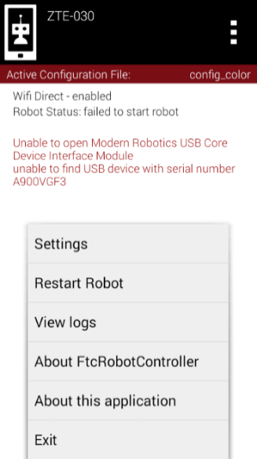

   Click on the three dots in the upper right hand portion of the screen then select View logs
   from the menu.

Select the View logs item from the menu to display the log file:

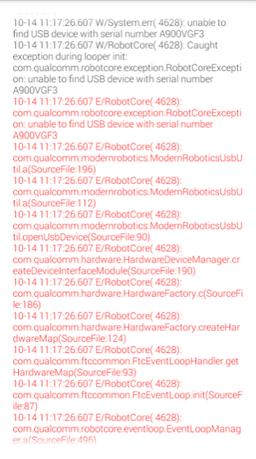

   You can scroll up and down to view the statements in the log file.

Scroll up and down to view the log statements. The oldest statements appear at the top and the
most recent statements appear at the bottom. Error messages are displayed in red.

.. note:: The View logs feature only shows an abbreviated version of the log file. While this is
   useful, it is sometimes more helpful to view the entire log file and search for older
   statements which might not be available through the View logs feature. The following sections
   describe how to pull the full log file from the phone onto a computer.

File Navigation
^^^^^^^^^^^^^^^^

Each FTC app stores log files at the top level of its Android device's storage system. Using the
device's file manager app (if any), look inside Main Storage. The FTC Robot Controller app
creates files named ``robotControllerLog.txt``, sometimes with a digit appended. Similarly, the
FTC Driver Station app creates files named ``driverStationLog.txt``.

Third-party file manager apps can also be found on the Google Play Store; many are free and
perform well.

For some FTC Android phones, the only pre-installed file navigation tool is found inside a menu
that is not displayed on the Apps screen. Open the phone's Settings, then select Storage. Scroll
to the bottom of the list and touch Explore. This opens a basic file navigation screen, typically
at the Main Storage level. Scroll down to see the FTC log files. Touch and hold a filename to
activate a file management menu at the top of the screen, or briefly touch a filename to open it
with a selected text viewing app, if any.

.. note:: Besides the standard full logs, the FTC Robot Controller app can also create shorter
   Match Logs. These are found in the FIRST folder, in the subfolder called ``matchlogs``. The
   FIRST folder also contains robot configuration (XML) files and other useful subfolders, beyond
   the scope of this troubleshooting guide.

The Android phone may have a pre-installed or third-party app for viewing text files in various
formats, but FTC log files are large, each text line is long, and the phone's screen is small. It
is usually easier to copy these files to your PC and use an application there to browse the
file.

Using Windows File Explorer to Locate the Log Files
^^^^^^^^^^^^^^^^^^^^^^^^^^^^^^^^^^^^^^^^^^^^^^^^^^^^^

If you are a Windows user, you can use Windows File Explorer to browse the contents of your
Android phone and find the log files. First, connect the phone via a USB cable to your Windows
machine.

Once the phone is connected, make sure it is in media device mode rather than charging-only mode.
For most FTC phones, swipe down from the top edge of the screen and select "use USB to transfer
files."

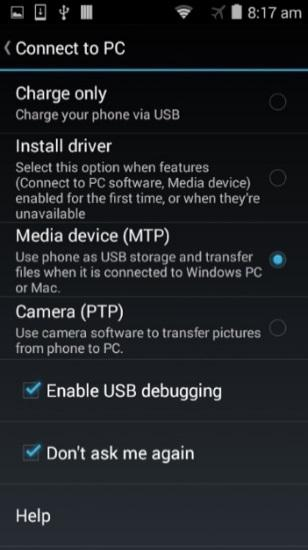

   Make sure your phone is in Media device mode.

If the phone is in Media device mode, you can launch Windows File Explorer to browse its
contents. The phone should appear as a media device (e.g., "Moto E (4)") connected to your PC:

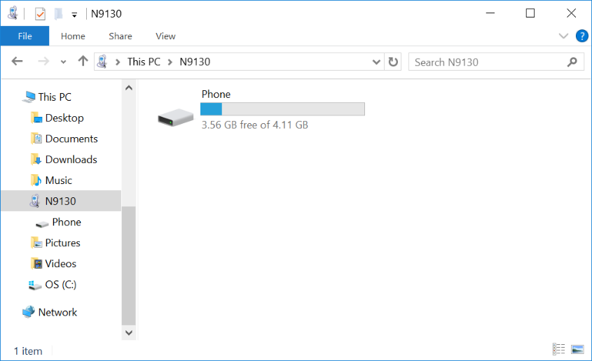

   The phone should appear as a media device connected to your PC.

You can double-click on the phone's hard drive to open and browse its main directory.

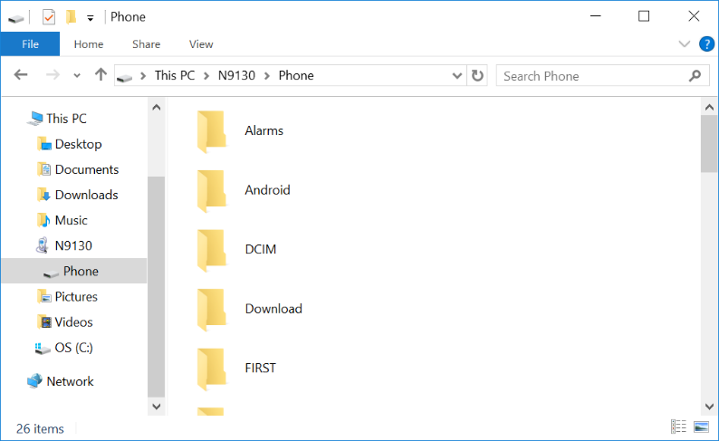

   You can browse the main directory of the phone.

When you open the phone's "hard drive," you are exploring the top level, or Main Storage,
directory of your Android device. You can see that there is a FIRST subdirectory in this main
directory. Scroll down to the bottom of the window to find the log files:

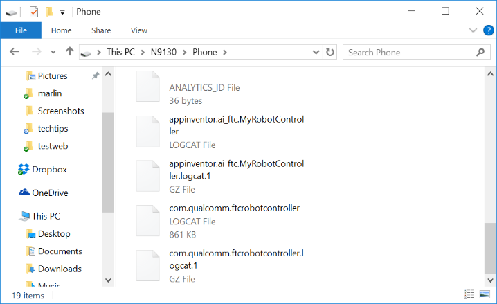

   The log files should be visible in this directory.

With Windows File Explorer you can copy one or more log files and then paste them onto your own
PC's hard drive. This allows you to create a local copy of the log file on your computer that you
can open with a text editor or word processor.

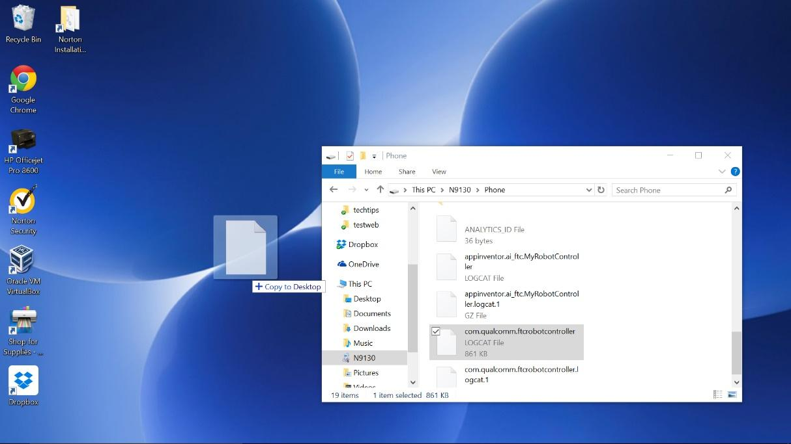

   You can make a copy of a log file by dragging and dropping the file to your personal computer.

Viewing the Contents of the Log File
^^^^^^^^^^^^^^^^^^^^^^^^^^^^^^^^^^^^^^

Once you have successfully copied the log file to your local computer, you can use an
application on your computer to open and read it. The log file is simply a text file, and you
might be tempted to open it using an application like Windows Notepad. If you do, you might find
that the formatting of the displayed text is not very useful:

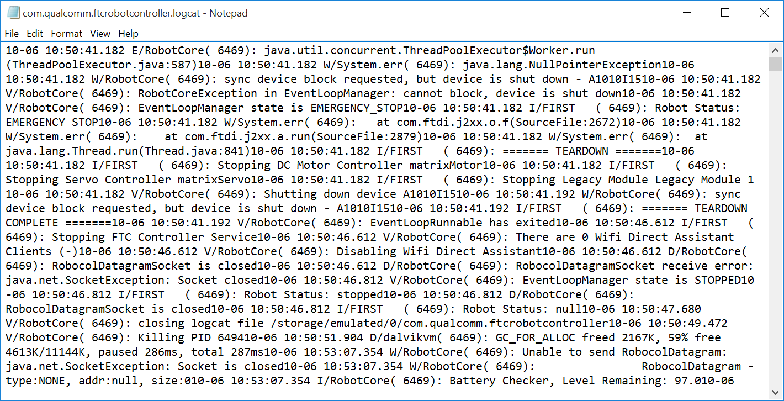

   Using Notepad might not be as useful to browse the log files.

If you are a Windows user, you can use Microsoft Word to open and view the file instead. When you
try to find the file, make sure that the file type filter in the Open file dialog box is set to
``All Files``.

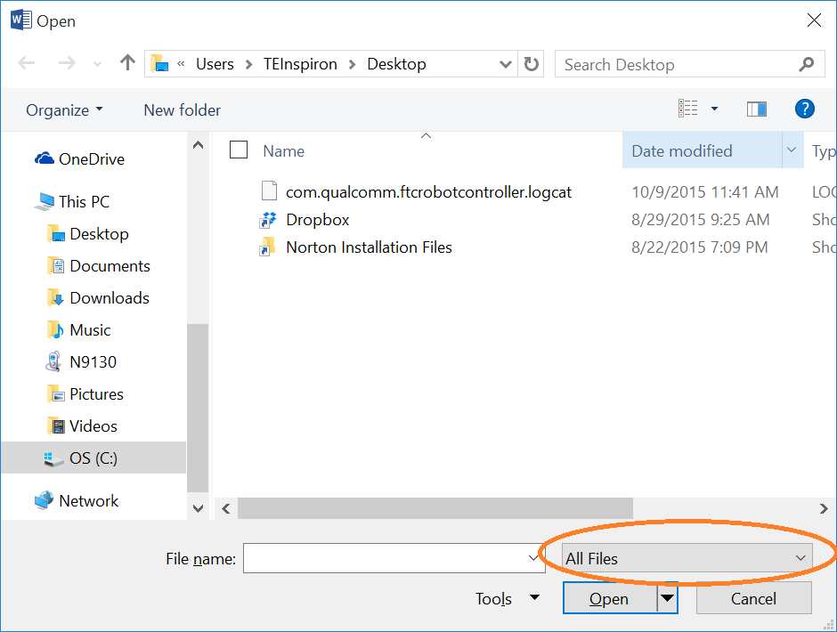

   Make sure the file filter is set to ``All Files`` when you browse to find your log file.

Using Microsoft Word to view the log file makes it easier to read and search for text. A useful
alternative is `Notepad++ <https://notepad-plus-plus.org/>`__.

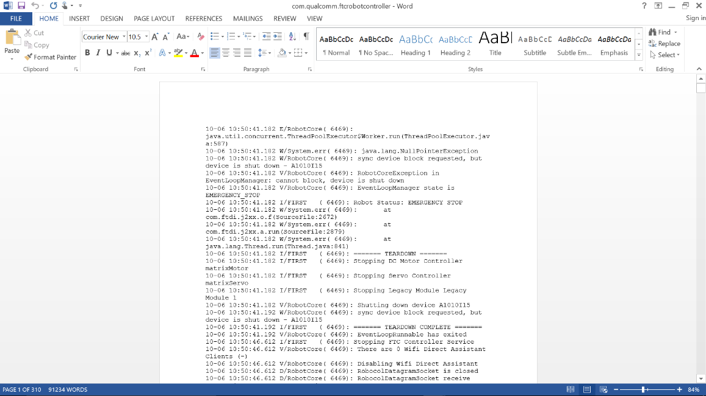

   Using Microsoft Word to view the log file makes it easier to read the contents and search for
   specific text strings.

Non-Windows Users
^^^^^^^^^^^^^^^^^^^

If you have a Mac or Linux computer, you do not have access to the File Explorer application to
copy and paste files from the phone. Mac users have the option of using the
`Android File Transfer <https://www.android.com/filetransfer/>`__ program to browse and copy
files from the phone.

Mac, Linux, and Windows users also have the option of using the Android Debug Bridge utility to
transfer files from the phone to their local computer. The next section covers the Android Debug
Bridge program in detail.

Using the REV Hardware Client Windows App to View Log Files
^^^^^^^^^^^^^^^^^^^^^^^^^^^^^^^^^^^^^^^^^^^^^^^^^^^^^^^^^^^^^^

A convenient and easy way to troubleshoot problems with the REV Control system is to view log
files using the REV Hardware Client for Windows computers. The REV Hardware Client log viewer has
filters, tags, and a search function that makes it easy to see what is happening on the Control
Hub or Driver Hub during an OpMode run. Instructions for using the REV Hardware Client are
available on the REV Robotics website:
`Using the Log Viewer <https://docs.revrobotics.com/rev-hardware-client/control-hub/using-the-log-viewer>`__.

Using the Android Debug Bridge for Troubleshooting
-----------------------------------------------------

The Android Debug Bridge (ADB) is a utility program included with the Android Software
Development Kit (SDK) platform-tools. ADB is invoked from a command line and is a very helpful
utility. To use ADB you will need the Android SDK platform-tools installed (preferably a recent
version of the Android SDK). Normally, when you install Android Studio, you also install the
Android SDK, including the platform-tools package.

The examples in this section were made with a Windows PC, but the process is similar for Mac and
Linux computers. If your computer does not recognize the ``adb`` command, check that the Android
SDK platform-tools are installed on your machine and that the path to the ``adb`` program is
included in your command line search path (refer to the appropriate Windows, Mac, or Linux
documentation for details on how to check this).

"Shelling" into an Android Device
^^^^^^^^^^^^^^^^^^^^^^^^^^^^^^^^^^^

You can use ADB to "shell" into an Android device. This means that you can use ADB to establish a
terminal session with an Android device. The ADB shell provides a command line interface that you
can use to type commands to interact with the phone.

To launch an ADB shell, first make sure that USB debugging is enabled on your Android phone and
that you have the appropriate driver installed on your computer. Connect the phone to the
computer with a USB cable. Open a command line window or terminal window and type the following
to list all Android devices currently connected to your computer:

.. code:: shell

   adb devices

   From a terminal or command line interface type ``adb devices`` to see a listing of attached
   Android devices.

If you want to establish a terminal or shell session with your Android phone, type the following
at the command prompt:

.. code:: shell

   adb shell

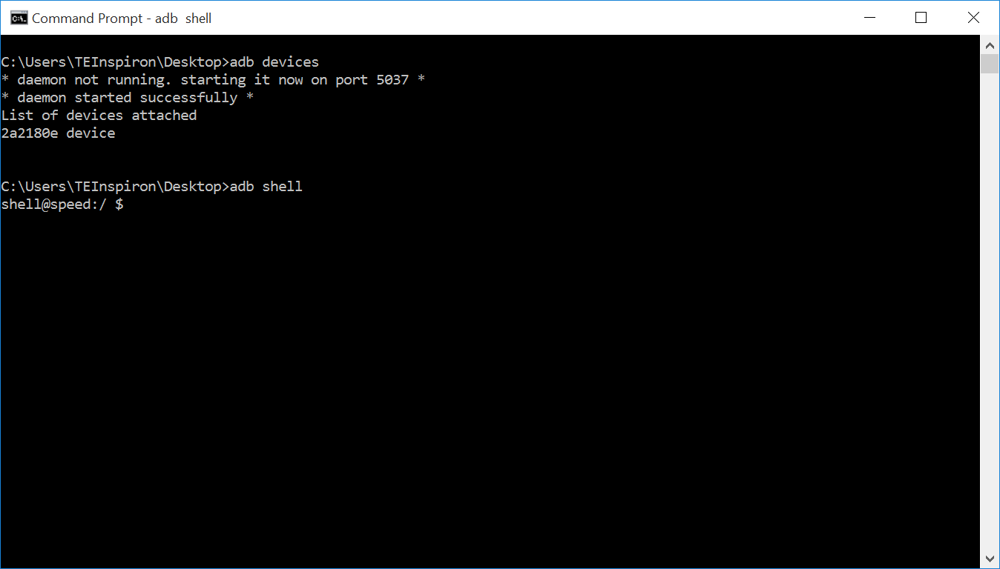

   Type in ``adb shell`` to create a terminal session with your Android device.

Notice that the command line prompt changes to ``shell@speed:/ $`` after ``adb shell`` is
entered. This new prompt indicates that you are now connected to the phone, and any commands you
enter will be processed by the phone. Note that Linux commands are case sensitive.

You can use standard Linux commands to navigate the environment. Typing ``pwd`` at the shell
prompt prints the current directory on the screen:

.. code:: shell

   pwd

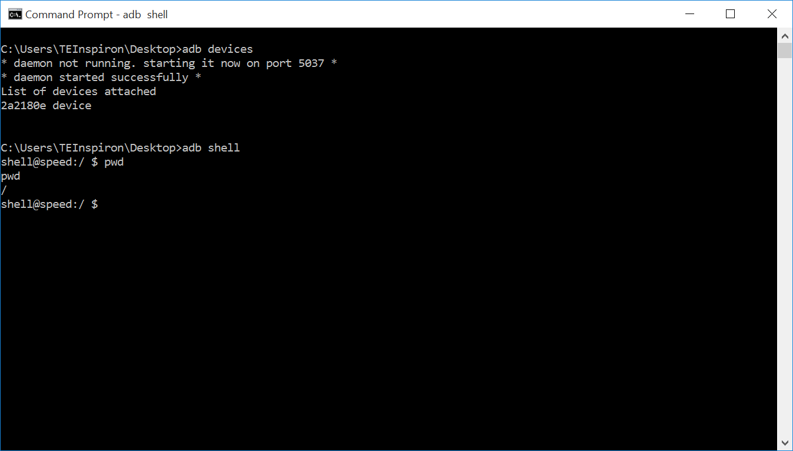

   The command ``pwd`` prints the current working directory.

Typing ``cd /sdcard`` changes the current directory to the ``/sdcard`` subdirectory on the
phone's file system. Typing ``pwd`` again afterward shows your new location within the file
system:

.. code:: shell

   cd /sdcard
   pwd

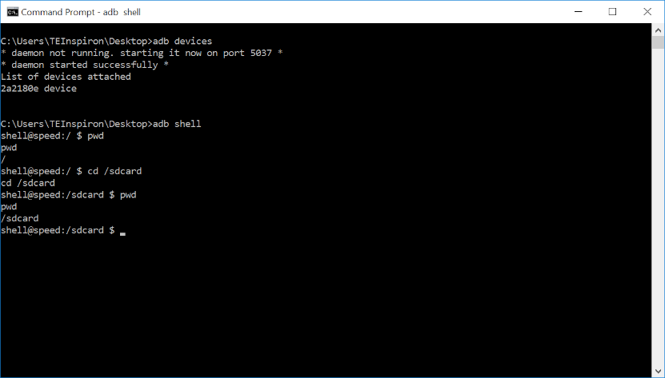

   Entering ``cd /sdcard`` changes the working directory; entering ``pwd`` prints the new working
   directory.

Typing ``ls`` at the command prompt lists the contents of the current directory. The directories
and files shown here match the folders and files you would see using the Android device's File
Manager app, or using Windows File Explorer:

.. code:: shell

   ls

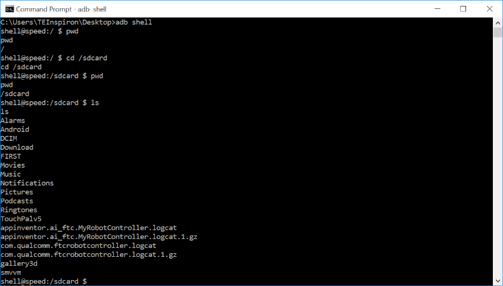

   The command ``ls`` lists the folders and files in the current directory.

To exit the ADB shell and return to your personal computer's command prompt, type the command
``exit``:

.. code:: shell

   exit

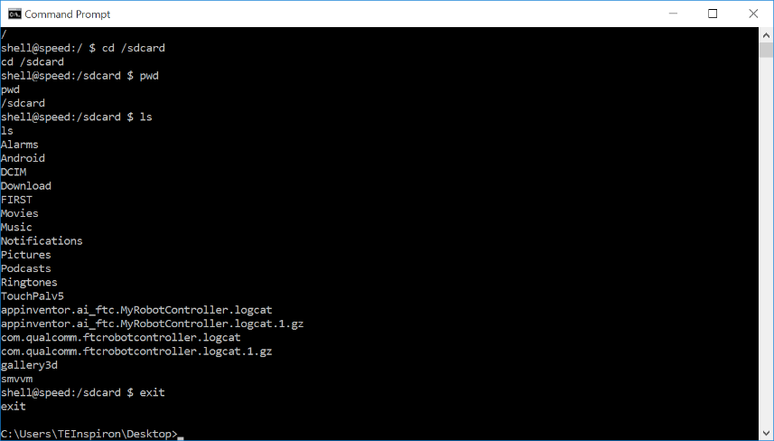

   The command ``exit`` exits the phone's shell and returns you to your computer's command line.

Pulling a File from the Android Device
^^^^^^^^^^^^^^^^^^^^^^^^^^^^^^^^^^^^^^^^

You can also use the ADB utility program to pull a file from the phone to the local file system
of your computer. The syntax is:

.. code:: shell

   adb pull <SOURCE PATH> <DESTINATION PATH>

where ``<SOURCE PATH>`` is the location of the original file on the phone and
``<DESTINATION PATH>`` is where on the computer you want to copy the file to.

For example, the following command,

.. code:: shell

   adb pull /sdcard/com.qualcomm.ftcRobotcontroller.logcat c:\users\TEInspiron\Desktop\rc_log.txt

copies the log file from the Android device to the local file system at
``c:\users\TEInspiron\Desktop\rc_log.txt``.

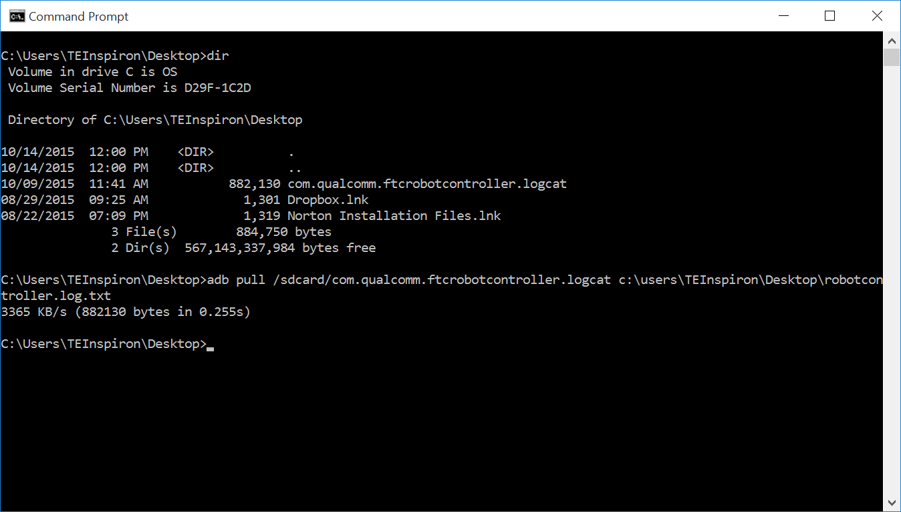

   You can use the ``adb pull`` command to copy a file from the phone onto your local hard drive.

Once you have copied the file to your local hard drive, you can use an appropriate application to
view the log file.

Using Android Studio to View Log Messages
---------------------------------------------

You can also use Android Studio to view log messages from your phone. If your phone is connected
either through a USB cable or via wireless ADB, you can view the log messages using the Android
Monitor window within Android Studio. Detailed instructions on how to access the Android Monitor
feature are available on the Android Developer website:
`Android Studio debugging documentation <https://developer.android.com/tools/debugging/debugging-studio.html>`__.

.. note:: The amount of log statements that appear in the window can be overwhelming. It is
   possible to create filters to show only a subset of data in the logcat window of Android
   Studio (refer to the Android Developer website for details on how to do this).

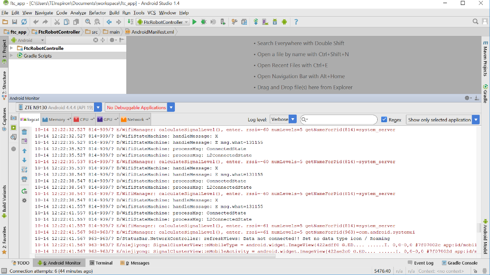

   You can view and filter logcat statements through Android Studio.

Creating Your Own Log Statements within an OpMode
^^^^^^^^^^^^^^^^^^^^^^^^^^^^^^^^^^^^^^^^^^^^^^^^^^^^

It is possible, and often helpful, to insert your own log statements within an OpMode for debug
purposes. The FIRST Tech Challenge SDK contains a class called ``DbgLog`` with two static methods
that can be used to log messages to the log file:

- ``DbgLog.err(String message)``
- ``DbgLog.msg(String message)``

These two methods can be used to create log statements in your log file. The ``err`` method
creates an error message (which has a different level of severity and can be used to filter
statements when viewing logcat output), and the ``msg`` method creates ordinary messages in the
log file.

You can embed these methods within your OpMode and use them to debug statements in real time
using the Android Monitor. You can also look for your statements in the log file.

.. important:: The ``DbgLog`` class was removed (not deprecated, but removed) in version 3.3 of
   the FTC software. Use the ``RobotLog`` class shown below instead.

Example OpMode
^^^^^^^^^^^^^^^

The following example OpMode shows how to use the ``RobotLog`` class to embed log statements
within your OpMode. The ``RobotLog.d()`` method prints equivalent debug messages to the log file
of the Robot Controller:

.. code:: java

   package org.firstinspires.ftc.teamcode;

   import com.qualcomm.robotcore.eventloop.opmode.Autonomous;
   import com.qualcomm.robotcore.eventloop.opmode.LinearOpMode;
   import com.qualcomm.robotcore.util.RobotLog;

   /**
    * Created by tom on 10/3/17.
    */

   @Autonomous
   public class MyLogDemo extends LinearOpMode {

       @Override
       public void runOpMode() throws InterruptedException {
           RobotLog.d("TIE - entered runOpMode()");

           double dStart = getRuntime();
           double dCurrent, dElapsed = 0;

           RobotLog.d(String.format("TIE - dStart = %.03f", dStart));
           RobotLog.d("TIE - about to wait for start...");

           waitForStart();

           while(opModeIsActive()) {
               dCurrent = getRuntime();
               dElapsed = dCurrent - dStart;
               telemetry.addData("1. elapse", String.format("%.03f",dElapsed));
               RobotLog.d(String.format("TIE - dElapsed = %.03f", dElapsed));
               this.sleep(250);
           }
       }
   }

This linear OpMode example shows how to use the ``RobotLog.d`` method to log information to the
log file. You can use the Android Monitor window of the Android Studio IDE to view these log
messages in real time. You can also create a filter so you only see a subset of log messages in
the window.

Creating a logcat Filter in Android Studio
^^^^^^^^^^^^^^^^^^^^^^^^^^^^^^^^^^^^^^^^^^^^^

It is often desirable to filter out unwanted logcat statements when you are debugging. In the
example OpMode above, the log statements include the expression ``TIE`` (the original author's
initials). You can create a filter that displays only log statements containing this string.

On the right-hand side of the Android Monitor window, use the drop-down selector to select Edit
Filter Configuration to create a new filter:

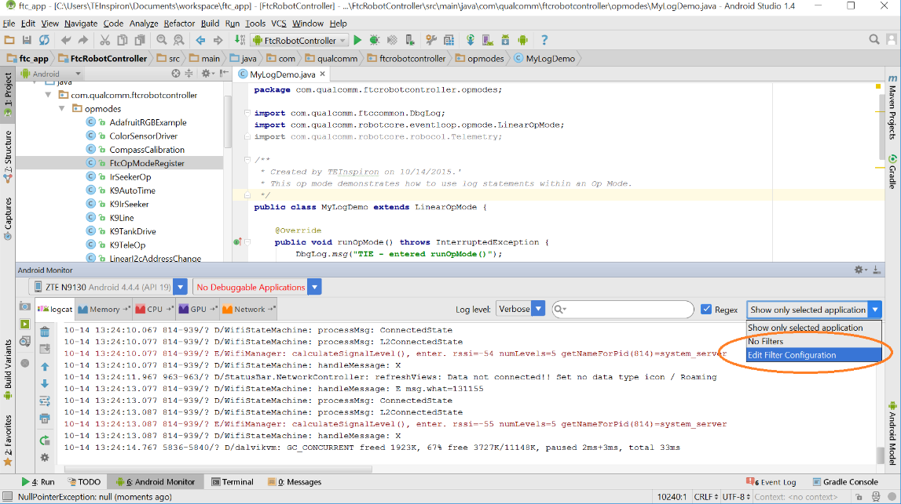

   Select Edit Filter Configuration to create a new filter.

The Create New Logcat Filter window then appears. Here you can specify a new name for your filter
(for example, ``TIE Filter``) along with a regular expression used to filter statements. In the
example below, the expression ``TIE`` is used as a filter for the log message, meaning the
Android Monitor window will only display log statements that include ``TIE`` in the body of the
message.

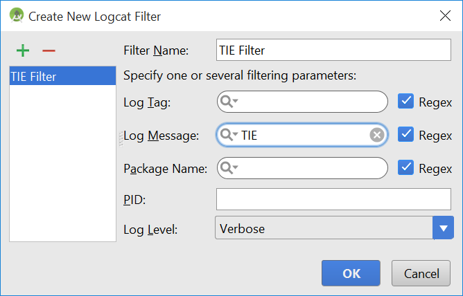

   Specify the filter name and a regular expression to use for your filter (in this case
   ``TIE``).

Once you have created your filter, the Android Monitor window automatically filters out messages
that do not match the search criteria. You should see the filtered statements in the window. If
your OpMode is currently running, you can see them appear in real time.

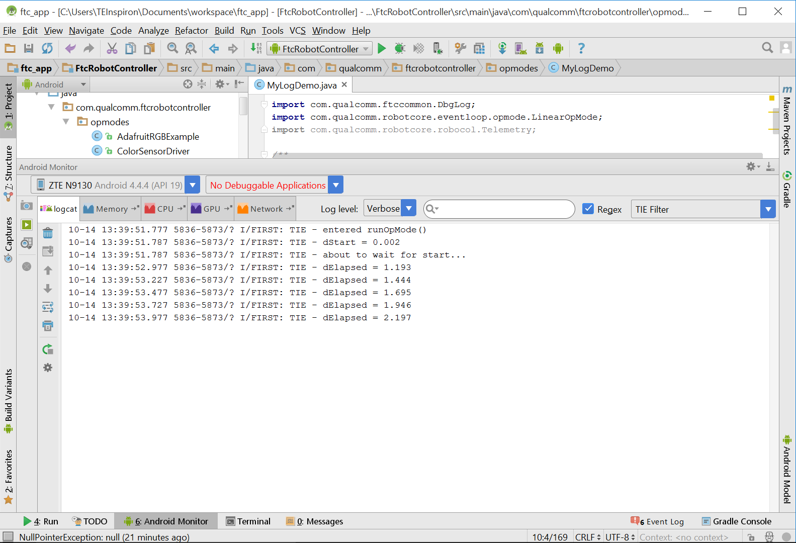

   If the OpMode is running, you can see your log statements in real time over a USB or wireless
   ADB connection.
