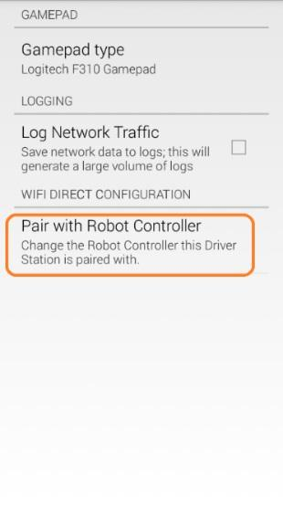
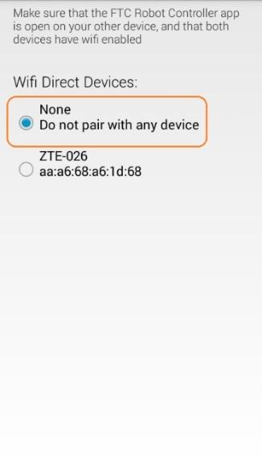
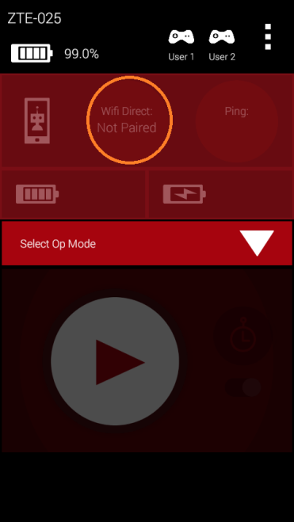
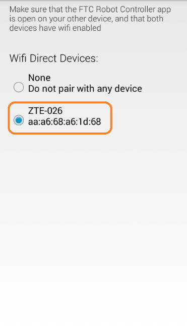
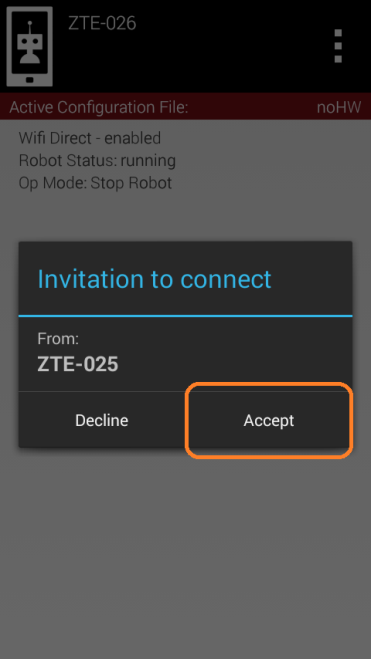
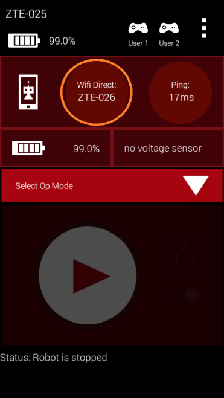
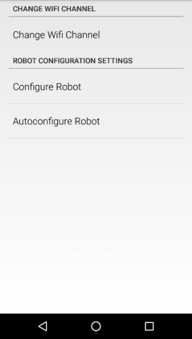
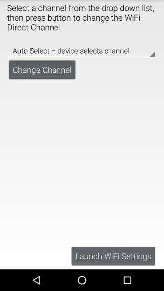
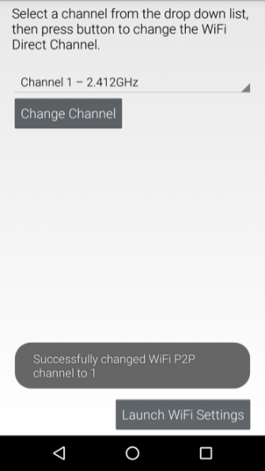

Planning Wi-Fi Channels for Large Events
=========================================

.. note:: If you suspect Wi-Fi interference is the underlying problem, first read
   :doc:`/control_system_troubleshooting/troubleshooting_wireless_at_events/troubleshooting-wireless-at-events`
   to diagnose the issue before redistributing channels.

Accommodating a Large Number of Robots at an Event
----------------------------------------------------

The wireless Control System is a point-to-point system. This means that each
Driver Station-robot pair establishes its own Wi-Fi network at an event. If
there are a large number of robots in a venue, then there will be a large
number of wireless networks operating in the venue. If there are a large
number of wireless networks operating in a small area, then there could be
interference between the networks.

At smaller events with lower numbers (fewer than 30 or 40) of robots, the
likelihood of significant interference caused by Robot-Driver Station
activity is small. If there is not any other source of interference (such as
Bluetooth devices operating on the field or wireless audio/video systems
broadcasting on the same frequency) the *FIRST* Tech Challenge Control
System should be able to operate properly.

At larger events (more than 30 or 40 robots) some steps might need to be
taken before the event and during the event to help keep things running
smoothly.

Wi-Fi Event Planning Guide
^^^^^^^^^^^^^^^^^^^^^^^^^^^

*FIRST* Tech Challenge has published a Wi-Fi Event Planning Guide that
contains detailed steps a technical volunteer can take to help keep the
wireless environment operating smoothly at larger events. Check the *FIRST*
Tech Challenge community and resource library for the current version of
this guide.

Distributing Robots Across Multiple Channels
----------------------------------------------

Wi-Fi Channel Overlap
^^^^^^^^^^^^^^^^^^^^^^

If an event will have a large number of robots (more than 40) in a small
area, you should consider distributing the robots across multiple channels.
Ideally, the lower the number of robots there are per channel, the less
traffic and interference there will be per channel. Note that 2.4 GHz Wi-Fi
channels that are less than 5 channel widths apart overlap.

Ideally, for 2.4 GHz Wi-Fi connections, you should distribute your robots on
channels that are at least 5 channel widths apart. For example, if you were
to configure one group of robots to channel 1 and a second group to channel
5, the two groups of robots would overlap slightly since the second channel
is only 4 channel widths away from the first channel. If the second group of
robots were moved from channel 5 to channel 6, then the two groups would no
longer overlap since they are 5 channel widths apart.

Sometimes it might not be possible to space your robots 5 channel widths or
greater apart. For example, one portion of the spectrum might be very noisy,
and the robots are unable to operate on channels in or near that portion of
the spectrum. In this case, it still might be beneficial to place the
robots in groups on separate, overlapping channels. Even though the
channels overlap slightly, placing the robots onto these channels might
produce lower ping times and more responsive robots when compared to
keeping all the robots on the same channel.

Factors to Consider when Selecting Wi-Fi Channels
^^^^^^^^^^^^^^^^^^^^^^^^^^^^^^^^^^^^^^^^^^^^^^^^^^^

If you would like to configure your robots to operate on more than one
channel, here are some factors to consider when doing your planning.

- **How many robots will be present?** The data rates for the control
  streams of the robot are low. If the wireless environment at your venue is
  clean, then a single channel should be able to support a pretty large
  number of robots. In testing, 46 pairs of Android devices ran reliably and
  responsively in a very tight area (approximately 14 feet by 14 feet).

  If your event will have a modest number of robots (less than 40), and if
  your wireless environment is clean, then you probably do not need to worry
  about moving robots around to different channels.

  If you do have a large group of robots, then you should consider dividing
  them up so you have a maximum of 35 to 40 robots per channel if possible.
  For example, if you have 70 robots, you can divide them into two groups of
  35. You can also break up a large number of robots into even smaller
  groups and then place them onto multiple, overlapping channels if needed.

- **Are the target channels clear?** Before you move your robots to a
  specific channel, you should do some tests on the channel to verify that
  it is clear.

  - *Use Wi-Fi Analyzer or a similar tool.* You can use a tool like Wi-Fi
    Analyzer to see how many access points are present on a channel.
    Remember, Wi-Fi Analyzer only shows you the visible (non-hidden)
    wireless networks. Also, Wi-Fi Analyzer does not show you how busy a
    channel is, it only shows you what visible Wi-Fi networks are on a
    channel.
  - *Use a pair of Android devices to monitor ping times.* If a target
    channel looks relatively clean, you should use a pair of Android
    devices running the FTC Driver Station and FTC Robot Controller apps to
    monitor the ping times on the target channel. You will need a pair of
    Android devices that support channel changing (such as approved FTC
    phones). Switch to the target channel and test to make sure you can
    select and run an OpMode (like the NullOp sample OpMode). If the average
    ping times for the test Android devices are low (less than 5 msec) then
    the channel is clear. If the average ping times are high (more than 50
    msec) then there might be some type of interference on the channel.
  - *If available, use a more sophisticated tool to monitor the target
    channels.* If you have access to a more sophisticated tool like an
    Aircheck meter, you can use it to sweep a target channel. Use the tool to
    check for visible and hidden Wi-Fi networks, and to check how much Wi-Fi
    and non-Wi-Fi traffic is present on the channel. If the activity level is
    low on a target channel, then it should be safe to place your robots on
    the channel.

- **What type of Android devices will the teams be using?** FTC-approved
  smartphones support channel changing using the FTC Robot Controller app.
  Approved Motorola smartphone models have included:

  - Motorola Moto G4 Play (4th Generation)
  - Motorola Moto G5
  - Motorola Moto G5 Plus
  - Motorola Moto E4 (USA versions only, includes SKUs XT1765, XT1765PP,
    XT1766, and XT1767)
  - Motorola Moto E5 (XT1920)
  - Motorola Moto E5 Play (XT1921)

.. important:: Approved hardware changes over time. For the current list of
   allowed phones and other hardware and software, teams should always refer
   to the current season's *FIRST* Tech Challenge Competition Manual and its
   updates, rather than relying on the list above.

UnPairing Then Re-Pairing the Driver Station to the Robot Controller
^^^^^^^^^^^^^^^^^^^^^^^^^^^^^^^^^^^^^^^^^^^^^^^^^^^^^^^^^^^^^^^^^^^^^^

After you have changed the channel on your Robot Controller Android device,
you might have to unpair your Driver Station from the Robot Controller, and
then re-pair the Driver Station back to the Robot Controller.

To unpair the Driver Station from the Robot Controller, launch the Settings
menu from the Driver Station app and select the Pair with Robot Controller
item.

   Select Pair with Robot Controller.

From the Pair with Controller screen, select None to unpair your phone.

   Select "None" to unpair the device, then use the back arrow to return to the main screen.

Use the back arrow to return to the main Driver Station screen. The screen
should now indicate that the Driver Station is not paired with any Wi-Fi
Direct device.

   The Driver Station is now unpaired from the Robot Controller.

To re-pair the two devices, launch the Settings menu from the Driver Station
app again and select Pair with Robot Controller again. Find the listing for
your Robot Controller Android device (in this example "ZTE-026") and select
this item.

   Select your target device (in this example ZTE-026), then use the back arrow to return to the main screen.

.. note:: Your Robot Controller smartphone Android device might prompt you
   to make sure you approve the connection request. On the Robot Controller
   device, tap the Accept button to approve the connection request.

   Tap Accept to approve the connection request.

Once you have accepted the connection request, the Driver Station screen
should display that it has successfully connected to the Robot Controller.

   Once the connection request is accepted, the Driver Station connects to the Robot Controller.

Changing the Channel Using an Approved Motorola Smartphone
^^^^^^^^^^^^^^^^^^^^^^^^^^^^^^^^^^^^^^^^^^^^^^^^^^^^^^^^^^^

If you are using an approved Motorola smartphone as your Robot Controller,
you can use the channel change function that is built into the FTC Robot
Controller app to change the Wi-Fi Direct operating channel. From the Robot
Controller app, launch the Settings menu and select the Change Wi-Fi Channel
option.

   The Robot Controller app's Settings menu, with the Change Wi-Fi Channel option.

In the Change Wi-Fi activity, select the target channel from the drop-down
list of available channels.

   The Change Wi-Fi Channel screen, with the channel drop-down list and Change Channel button.

Once you have selected the desired target channel, push the Change Channel
button to change the operating channel. If the operation is successful, you
should see a toast appear, indicating that the channel was successfully
changed.

   A toast appears indicating that the channel change was successful.

Once the channel change has completed, use the Android back arrow button to
return to the main screen. The Driver Station should be able to reconnect to
the Robot Controller using the new operating channel.
